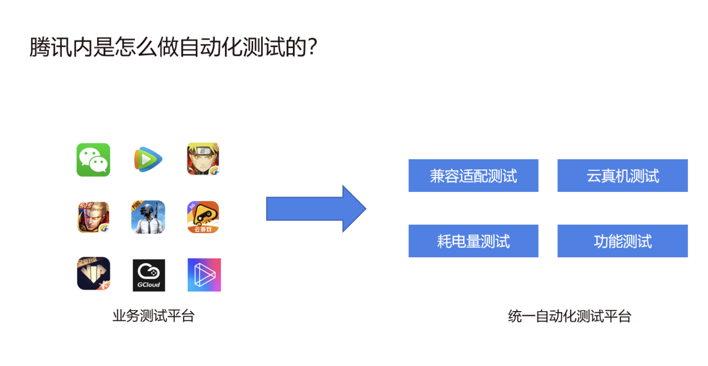

# App 自动化测试的价值与体系

## App 测试的时代背景

- **移动应用的兴起**：随着智能手机和移动应用的普及，移动应用成为人们日常生活和工作的重要组成部分。移动应用的数量和复杂性迅速增长，需要进行全面的测试以确保其质量和稳定性。

- **产品发布周期**：按月发布 -> 按周发布 -> 按小时发布。

    >**快速迭代和发布周期**：移动应用的开发和发布周期通常很短，需要快速迭代和持续交付。这要求测试团队能够及时进行测试，并提供及时的反馈和修复。自动化测试和持续集成成为应对快速迭代的关键。

- **多端发布**：Android、iOS、微信小程序、h5。

- **多机型发布**：众多设备型号、众多系统版本。
    >**多平台和多设备环境**：移动应用需要在多种操作系统（如iOS、Android）和多种设备（如手机、平板电脑）上运行。这增加了测试的复杂性，需要测试团队能够覆盖各种平台和设备组合进行全面测试。

- **多环境发布**：联调环境、测试环境、预发布环境、线上环境。

- **多版本共存**：用户群体中存在多个不同的版本。

- **历史回归测试任务**：成百上千条业务用例如何回归。

**用户体验的重要性**：移动应用的成功与用户体验密切相关。用户对应用的期望越来越高，对性能、响应速度、界面友好性等方面的要求也越来越高。因此，移动应用测试需要关注用户体验，确保应用在各种情况下都能提供良好的用户体验。

综上所述，移动应用的普及、多平台和多设备环境、用户体验的重要性、快速迭代和发布周期、跨功能和跨团队合作以及安全性和隐私保护等因素，共同推动了 App 测试的时代背景。测试团队需要适应这些变化，并采用适当的测试策略和工具来应对不断变化的测试需求。

## UI 自动化价值

以下是 UI 自动化测试价值 一些主要方面：

- **提高测试效率**：UI 自动化测试可以替代手动测试过程，大大提高测试效率。通过编写自动化测试脚本，可以自动执行大量的测试用例，覆盖广泛的功能和场景，快速发现潜在的问题。

- **提高测试覆盖率**：自动化测试可以更全面地覆盖应用的用户界面和交互操作。它可以模拟用户的真实操作，测试应用的各个功能和流程。这样可以发现更多的潜在问题，并确保应用在各种情况下的稳定性和一致性。

- **提高测试质量**：自动化测试可以减少人为的错误和遗漏，通过可重复执行的测试流程，保证了一致性和准确性。它可以捕捉到一些细微的问题和边界情况，从而提高应用的质量。比如：**兼容性测试**、**自动化探索测试**等等。

- **节省人力成本**：相对于手动测试，UI 自动化测试可以节省大量的人力资源。一旦编写了自动化测试脚本，就可以重复执行测试，不再需要人工逐个执行测试用例。这样，测试团队可以将更多的精力投入到其他更有价值的任务上。

- **提升开发效率**：UI 自动化测试可以与持续集成和持续交付流程集成，作为开发流程的一部分运行。它可以在每次代码提交后自动执行测试，及早发现问题，减少开发周期，提高开发效率。

- **多平台和多设备支持**：UI 自动化测试可以在不同的操作系统和设备上运行，确保应用在各种平台和设备上的一致性和兼容性。这对于移动应用开发和跨平台应用非常重要。

- **可视化反馈和报告**：UI 自动化测试通常提供可视化的测试结果和报告，可以清晰地展示测试覆盖率、通过的测试用例和失败的测试用例。这样可以更好地跟踪测试进度和问题，便于团队合作和决策。

## 自动化测试的意义

帮助业务以更好的品质更快的占位市场。

- 更高的测试覆盖率。

- 配合DevOps 持续集成，快速响应版本。

- 专项测试融合其中：适配、性能、弱网。

## 如何做自动化测试？

- 第一步，做业务测试平台；
  >比如：腾讯内部先做微信、王者荣耀、腾讯视频等等app产品的业务测试平台。

- 第二步，做统一自动化测试平台。
  >统一自动化测试平台有：兼容适配测试、云真机测试、耗电量测试、功能测试。

**一个好的自动化测试平台需要帮助业务解决哪些问题？**

1. **效率**：业务接入更加方便、快捷，支持多种接入方式。
2. **可用**：测试任务执行更加稳定，支持99.9%。
3. **效果**：问题分析定位方便，更容易回归。

# 参考链接
https://testerhome.com/topics/30789

