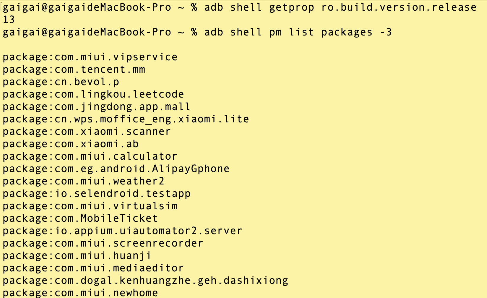
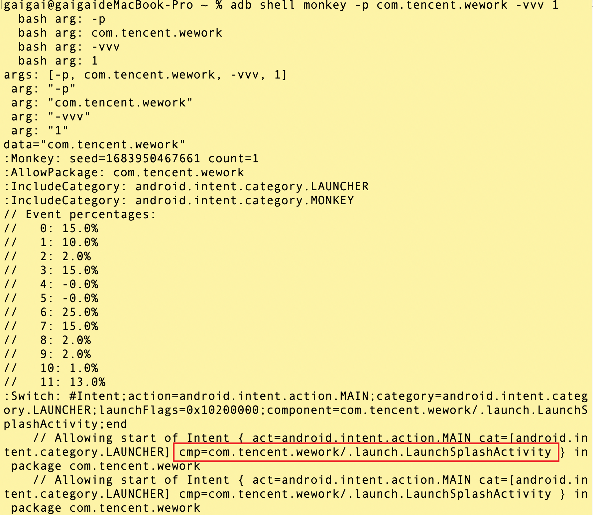
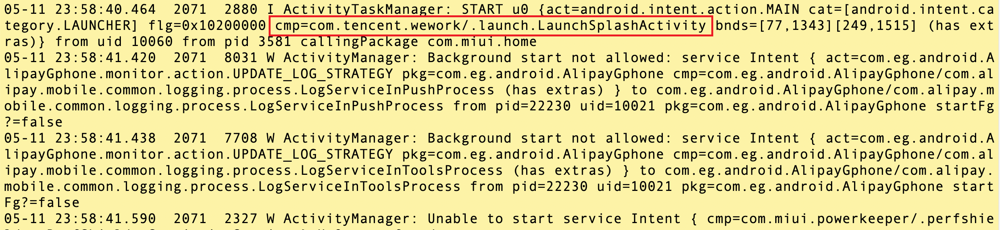
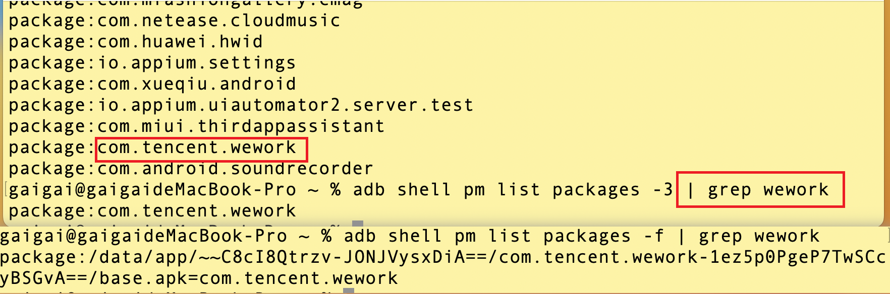
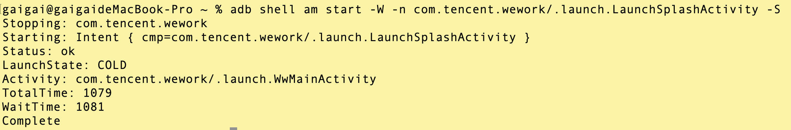

<style>
  strong {
    color: #ea6010;
    font-weight: bolder;
  }
  .reveal blockquote {
    font-style: unset;
  }
</style>


# 获取App启动参数 - Android


## 获取 App 信息

### App 入口

App 入口，三种方式获取：

#### 1. 通过 monkey 获取

```bash
# 设备的系统版本 安卓手机的系统版本，非小米、华为系统版本号 

adb shell getprop ro.build.version.release

#第三方app的包名   mm wework
adb shell pm list packages -3 

# 启动的app的页面
adb shell monkey -p com.tencent.wework -vvv 1

```





#### 2. 通过 logcat 日志获取

```bash
# Mac/Linux
adb logcat ActivityManager:I | grep "cmp"

# Windows 
adb logcat ActivityManager:I | findstr "cmp"
```



#### 3. 通过 aapt 获取

必须有手机root用户。

- **环境变量**：

```bash
export ANDROID_HOME=/Users/gaigai/sdk

export PATH=$PATH:${ANDROID_HOME}/emulator:${ANDROID_HOME}/platform-tools:${ANDROID_HOME}/tools:${ANDROID_HOME}/tools/bin:${ANDROID_HOME}/build-tools/31.0.0/
```

```bash
# 安装，配置环境变量{ANDROID_HOME}/build-tools/{version}/
sdkmanager build-tools

#获取第三方app的包名
adb shell pm list packages -3 

# 查看设备上安装的所有应用程序的包名及其对应的 APK 文件路径
adb shell pm list packages -f

```




```bash
# Mac/Linux 
aapt dump badging wework.apk | grep launchable-activity

# Windows 
aapt dump badging wework.apk | findstr launchable-activity
```

用于获取 Android 应用程序信息的命令，它可以解析 APK 文件并提取应用程序的各种信息。

在使用 aapt dump badging 命令时，需要提供要分析的 APK 文件的路径。


### 启动应用验证

```bash
adb shell am start -W -n <package-name>/<activity-name> -S
```

- **am**： Android 中的 Activity Manager（活动管理器）的缩写，启动一个应用程序的活动（Activity）。

- **-W**：在启动应用程序后，等待应用程序完全启动并返回启动信息。

- **-n \<package-name> \<activity-name>**：指定要启动的应用程序的包名和活动名。

- **-S**：输出启动的时间和状态信息。

执行该命令后，adb 将启动应用程序，并输出应用程序启动时间和状态信息。


```bash
adb shell am start -W -n com.tencent.wework/.launch.LaunchSplashActivity -S
```




# 获取App启动参数 - iOS


# 参考链接
https://testerhome.com/topics/30789