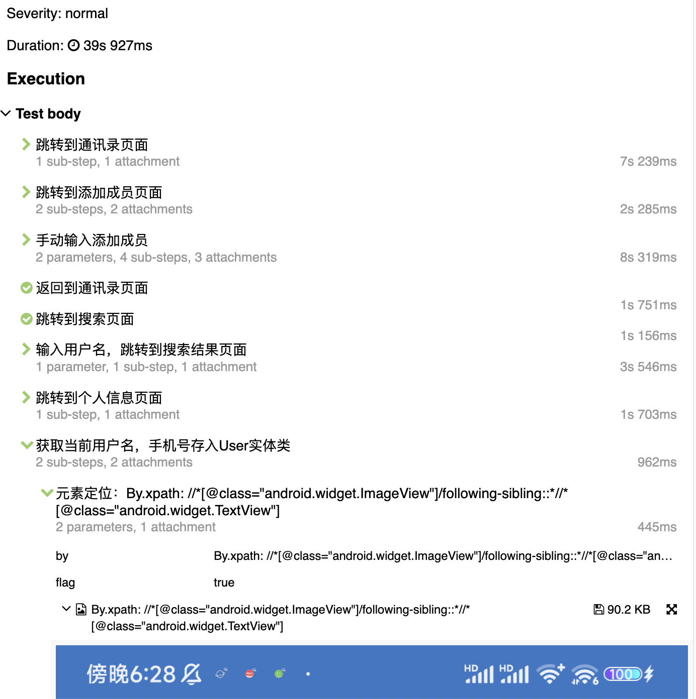
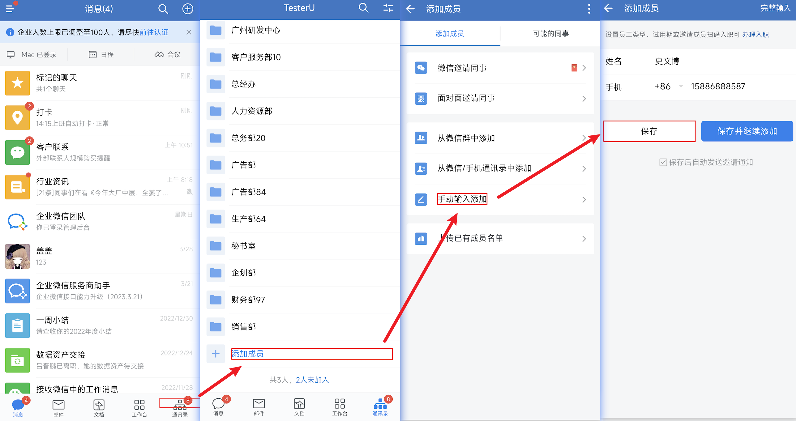
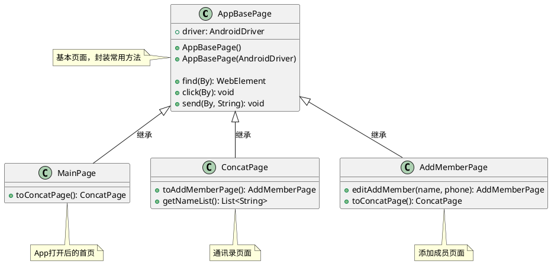
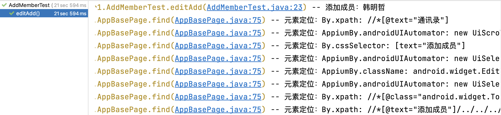
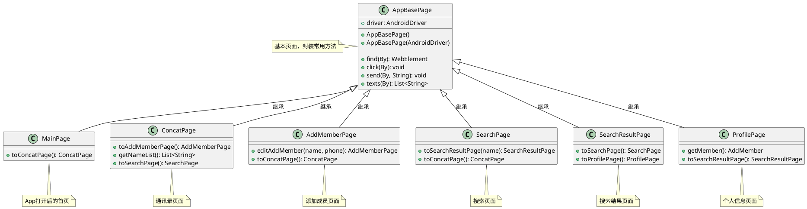
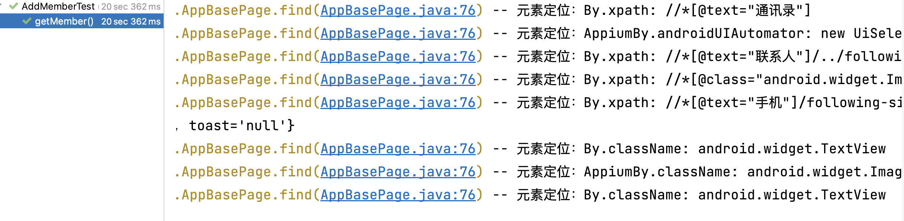

<style>
  strong {
    color: #ea6010;
    font-weight: bolder;
  }
  .reveal blockquote {
    font-style: unset;
  }
</style>

# 企业微信添加成员实战 - App端




## 案例需求

针对目前学到的Appium框架内容，完成一个Android端的UI自动化案例：**企业微信添加成员**！

企业微信主要功能如下：


1. **添加成员**：在通讯录功能下添加企业的成员，实现入职人员添加到企业的自动化流程。

1. **查看成员**：自动查看当前企业的所有成员信息。


1. **查看具体成员**：自动查看当前企业的某一具体成员信息。

1. **修改具体成员**：自动修改当前企业的某一具体成员信息。

1. **删除具体成员**：自动删除当前企业的某一具体成员信息。

1. **添加部门**：在通讯录功能下添加企业部门，实现企业组织架构调整时的自动化流程。


1. **查看部门**：自动查看当前企业的所有部门信息。

1. **修改具体部门**：自动修改当前企业的某一具体部门信息。

1. **删除具体部门**：自动删除当前企业的某一具体部门信息。

1. **上班打卡**：微信定位打卡。


PO实现

# 案例一：企业微信添加成员

## 步骤

1. 打开企业微信**首页**。

2. **首页**点击**通讯录Tab**，跳转到**通讯录**页面。
3. **通讯录页面**点击**添加成员**按钮，跳转到**添加成员**页面。
4. **添加成员页面**点击**手动输入添加**，跳转**添加成员**页面。
5. **添加成员页面**输入具体的**用户名**、**手机号**点击保存，跳转**添加成员**页面。
6. **添加成员页面**返回到**通讯录**页面。
7. **断言**：通讯录页面列表包含刚刚创建的姓名。





## 涉及知识点

|知识点|说明|
|---|---|
|driver声明|DesiredCapabilities配置|
|App启动|androidDriver启动App|
|隐式等待|等待声明|
|PO设计模式|Page创建|
|元素定位方法封装|find()|
|元素点击方法封装|click()|
|元素输入方法封装|send()|
|显示等待|等待声明及判断条件<br>只要页面跳转就有显示等待|
|Toast|Toast元素定位|


## 实现思路



## Toast 定位

appium 使用 uiautomator 底层的机制来分析抓取 Toast，并且把 Toast 放到控件树里面，但本身并不属于控件。

Toast 消息通常只在屏幕上短暂显示，因此你需要在Toast出现后尽快进行定位和获取文本内容的操作。

Toast通常是通过android.widget.Toast类来实现的。

automationName：uiautomator2，使用 Xpath 定位获取：

```bash
//*[@class="android.widget.Toast"]

//*[contains(@text, "Toast文本")]
```


## 实现代码



### 测试用例
```java
public class AddMemberTest {
    static final Logger logger = getLogger(lookup().lookupClass());

    @Test
    public void editAdd(){
        String name = FakerUtil.get_name();
        String zh_phone = FakerUtil.get_zh_phone();
        logger.info("添加成员：{}", name);
        List<String> nameList = new MainPage()//进入企业微信首页-消息页面
                                    .toConcatPage()//通讯录页面
                                    .toAddMemberPage()//跳转到添加成员页面
                                    .editAddMember(name, zh_phone)//手动输入添加成员
                                    .toConcatPage()//返回到通讯录页面
                                    .getNameList();
        assertThat("通讯录不包含 " + name + " 成员", nameList.contains(name));
    }

}
```
### AppBasePage
```java
package top.testeru.page1;

import io.appium.java_client.android.AndroidDriver;
import io.appium.java_client.android.options.app.SupportsAutoGrantPermissionsOption;
import io.appium.java_client.remote.AndroidMobileCapabilityType;
import io.appium.java_client.remote.MobileCapabilityType;
import io.qameta.allure.Step;
import org.openqa.selenium.*;
import org.openqa.selenium.remote.DesiredCapabilities;
import org.openqa.selenium.support.ui.WebDriverWait;
import org.slf4j.Logger;
import top.testeru.entity.AddMember;

import java.net.MalformedURLException;
import java.net.URL;
import java.time.Duration;
import java.util.ArrayList;
import java.util.List;

import static java.lang.invoke.MethodHandles.lookup;
import static org.slf4j.LoggerFactory.getLogger;

//关键字对应的page页面
public class AppBasePage {
    static final Logger logger = getLogger(lookup().lookupClass());

    AndroidDriver androidDriver;
    static AddMember user = new AddMember();

    public AppBasePage(AndroidDriver androidDriver) {
        this.androidDriver = androidDriver;
    }

    public AppBasePage() {
        //driver需要声明
        if (null == androidDriver){
            DesiredCapabilities desiredCapabilities = new DesiredCapabilities();
            //平台名称 安卓系统就是Android 苹果手机就是iOS platformName
            desiredCapabilities.setCapability(MobileCapabilityType.PLATFORM_NAME, "Android");
            //使用的driver uiautomator2 automationName
            desiredCapabilities.setCapability(MobileCapabilityType.AUTOMATION_NAME, "UiAutomator2");
            //设备的系统版本 安卓手机的系统版本，非小米、华为系统版本号  adb shell getprop ro.build.version.release
            desiredCapabilities.setCapability(MobileCapabilityType.PLATFORM_VERSION, "13.0.0");
            //启动的app的包名 第三方app：adb shell pm list packages -3    mm wework
            desiredCapabilities.setCapability(AndroidMobileCapabilityType.APP_PACKAGE, "com.tencent.wework");
            //启动的app的页面  adb shell monkey -p com.tencent.wework -vvv 1
            desiredCapabilities.setCapability(AndroidMobileCapabilityType.APP_ACTIVITY, ".launch.LaunchSplashActivity");
            //设备名称
            desiredCapabilities.setCapability(MobileCapabilityType.DEVICE_NAME, "8c5f5f92");
            //设备的UDID；adb devices -l 获取，多设备的时候要指定，若不指定默认选择列表的第一个设备
            desiredCapabilities.setCapability(MobileCapabilityType.UDID, "8c5f5f92");
            //app不重置
            desiredCapabilities.setCapability(MobileCapabilityType.NO_RESET, true);
            //运行失败的时候打印page source到appium-log   printPageSourceOnFindFailure
            desiredCapabilities.setCapability(MobileCapabilityType.PRINT_PAGE_SOURCE_ON_FIND_FAILURE, true);
            //在假设客户端退出并结束会话之前，Appium 将等待来自客户端的新命令多长时间（以秒为单位） http请求等待响应最长5分钟  newCommandTimeout
            desiredCapabilities.setCapability(MobileCapabilityType.NEW_COMMAND_TIMEOUT, 300000);
            //默认权限通过  autoGrantPermissions
            desiredCapabilities.setCapability(SupportsAutoGrantPermissionsOption.AUTO_GRANT_PERMISSIONS_OPTION, true);
            try {
                //1、打开app操作
                androidDriver = new AndroidDriver(new URL("http://0.0.0.0:4723/wd/hub"),desiredCapabilities);
                //隐式等待
                androidDriver.manage().timeouts().implicitlyWait(Duration.ofSeconds(20));
            } catch (MalformedURLException e) {
                throw new RuntimeException(e);
            }
        }
    }

   
    @Step("元素定位：{by}")
    public WebElement find(By by){
        WebElement element = androidDriver.findElement(by);
        logger.info("元素定位：{}",by);
        return element;
    }
    
    public List<WebElement> finds(By by){
        return androidDriver.findElements(by);
    }

    public void click(By by){
        find(by).click();
    }
    public void click(By by, int index){
        finds(by).get(index).click();
    }
    //输入操作
    public void send(By by, String str){
        WebElement webElement = find(by);
        webElement.clear();
        webElement.sendKeys(str);
    }
    public void send(By by, int index, String str){
        WebElement webElement = finds(by).get(index);
        webElement.clear();
        webElement.sendKeys(str);
    }
    public String text(By by){
        return find(by).getText();
    }

    public List<String> texts(By by){
        List<String> textList = new ArrayList<>();
        List<WebElement> findEles = finds(by);
        findEles.forEach(webElement -> {
            textList.add(webElement.getText());
        });
        return textList;
    }

    public WebDriverWait waitUtil(){
        WebDriverWait wait = new WebDriverWait(androidDriver,
                Duration.ofSeconds(20), //每隔多少秒去查找一次显示等待的条件
                Duration.ofSeconds(1));//总共查找等待条件的时间
        return wait;
    }
    public String page(){
        return androidDriver.getPageSource();
    }
}

```
### MainPage
```java
//企业微信首页
public class MainPage extends AppBasePage {
    public MainPage() {
    }

    //跳转到通讯录页面
    public ConcatPage toConcatPage(){
        click(AppiumBy.xpath("//*[@text=\"通讯录\"]"));
        //显示等待判断页面跳转成功
        waitUtil().until(webDriver -> webDriver.getPageSource().contains("添加客户"));

        return new ConcatPage(androidDriver);
    }
}
```
### ConcatPage
```java
//通讯录页面
public class ConcatPage extends AppBasePage {

    public ConcatPage(AndroidDriver androidDriver) {
        super(androidDriver);
    }

    //跳转到添加成员页面
    public AddMemberPage toAddMemberPage(){
        //点击添加成员
        find(AppiumBy.androidUIAutomator(
"new UiScrollable(new UiSelector().scrollable(true)).scrollIntoView(new UiSelector().text(\"添加成员\"))"));
        click(AppiumBy.cssSelector("[text=\"添加成员\"]"));

        waitUtil().until(webDriver -> webDriver.getPageSource().contains("手动输入添加"));

        return new AddMemberPage(androidDriver);
    }

    //

    public List<String> getNameList(){
        return texts(By.xpath("//*[@text=\"企业通讯录\"]/following-sibling::*//android.widget.TextView"));
    }

}

```
### AddMemberPage
```java
//添加成员页面
public class AddMemberPage extends AppBasePage {

    public AddMemberPage(AndroidDriver androidDriver) {
        super(androidDriver);
    }

    //手动输入添加成员
    public AddMemberPage editAddMember(String name, String phone){
        click(
                AppiumBy.androidUIAutomator(
                        "new UiSelector().text(\"手动输入添加\")"));
        send(AppiumBy.className("android.widget.EditText"),name);
        send(AppiumBy.className("android.widget.EditText"),1,phone);
        click(
                AppiumBy.androidUIAutomator(
                        "new UiSelector().text(\"保存\")"));


        //*[@class='android.widget.Toast']
        waitUtil().until(webDriver -> webDriver.getPageSource().contains("Toast"));
        //System.out.println(page());//输出打印当前页面
        String toastText = text(AppiumBy.xpath("//*[@class=\"android.widget.Toast\"]"));
        user.setToast(toastText);
        waitUtil().until(webDriver -> webDriver.getPageSource().contains("添加成员"));
        return this;
    }

    //返回到通讯录页面
    public ConcatPage toConcatPage(){
        ////*[@text="添加成员"]/../../../preceding-sibling::*
        click(By.xpath("//*[@text=\"添加成员\"]/../../../preceding-sibling::*"));
        //显示等待
        waitUtil().until(webDriver -> webDriver.getPageSource().contains("添加成员"));

        return new ConcatPage(androidDriver);
    }
}

```


# 案例二：搜索查看成员信息

## 步骤

1. **通讯录页面**点击搜索按钮，跳转到**搜索**页面。
2. **搜索页面**输入搜索内容，跳转到**搜索结果**页面。
3. **搜索结果页面**点击联系人下的第一个结果，跳转到**个人信息**页面。
4. **个人信息**页面获取个人信息。

## 涉及知识点


## 实现思路



## 实现代码



page2

# 优化

## 添加元素查找截图

### 实现思路

### 实现代码
```java
//截图
private void ElementScreenBase(WebElement element, String message) throws IOException {
    //Appium截图 不是与手机1:1截图
    File screenshot = ((TakesScreenshot) androidDriver).getScreenshotAs(OutputType.FILE);
    //元素定位标红
    Point elementLocation = element.getLocation();
    Dimension elementSize = element.getSize();
    int eleX = elementLocation.x;
    int eleY = elementLocation.y;
    int eleH = elementSize.height;
    int eleW = elementSize.width;
    logger.info("location=${} size=${} x=${} y=${} width=${} height=${}",
            elementLocation,elementSize,eleX,eleY,eleW,
            eleH);
    //读取截图文件
    BufferedImage img = ImageIO.read(screenshot);
    //创建一个 Graphics2D，可用于绘制到此 BufferedImage 中
    Graphics2D graph = img.createGraphics();
    //BasicStroke 指定线宽的实心  描边 Shape 的 Stroke 对象
    graph.setStroke(new BasicStroke(5));
    graph.setColor(Color.RED);//绘制形状的颜色
    graph.drawRect(eleX, eleY, eleW, eleH);//绘制指定矩形的轮廓
    graph.dispose();//处理此图形上下文并释放它正在使用的任何系统资源
    Path pngPath = getPngPath();
    //ImageIO.write 方法将图像写入文件时，不需要手动关闭流。
    // 根据官方文档，ImageIO.write 方法会自动将数据写入文件并关闭相关资源。
    ImageIO.write(img, "png", pngPath.toFile());
    Allure.addAttachment(message,"image/png",new FileInputStream(pngPath.toFile()),".png");
}

private Path getPngPath() {
    long l = System.currentTimeMillis();
    return Paths.get("png",l+".png");
}
```

## 报告内添加测试步骤

## 测试用例提取前、后置代码

## W3C手势滑动


