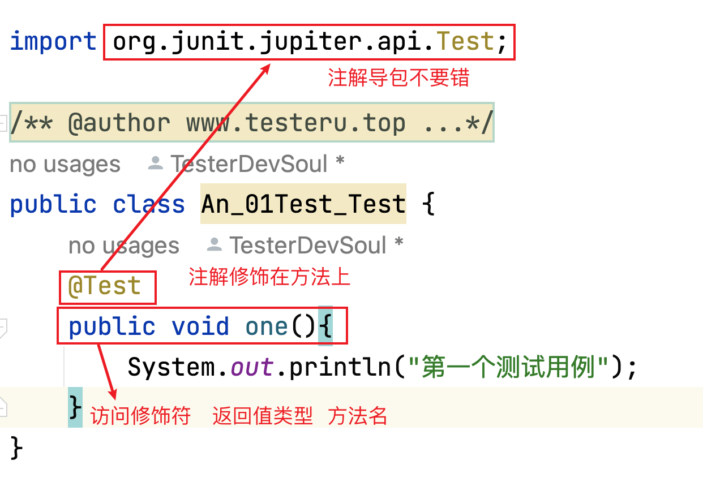
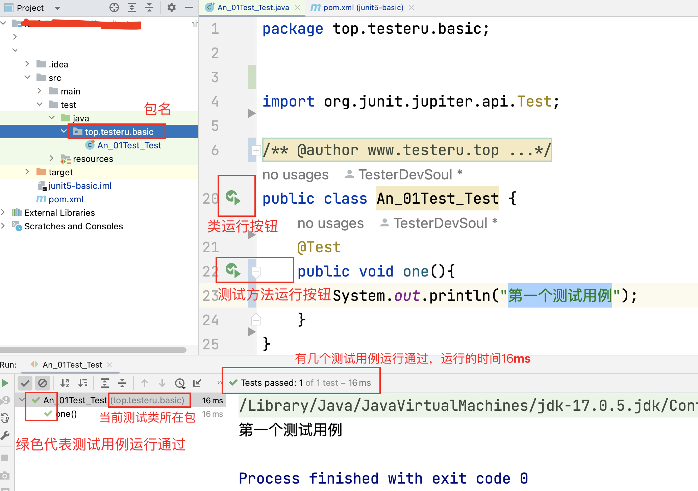
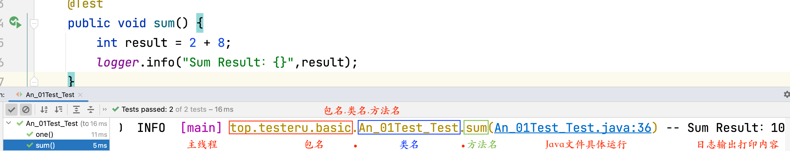
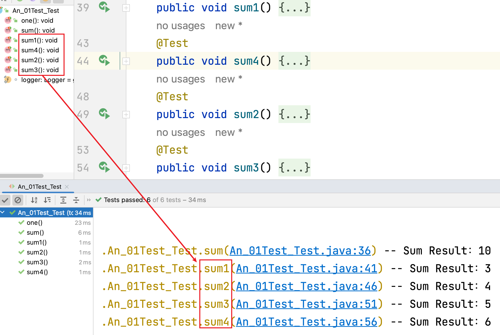

# JUnit5基本注解 - @Test注解
## 本章要点

1. @Test 运行原理
2. @Test 作用
3. @Test 声明规则
4. @Test 依赖导入
5. @Test 与 main() 区别

## 运行原理


@Test注解修饰的测试用例运行：通过JUnit5框架的junit-jupiter组件运行。

>@Test注解其实就是告诉 JUnit5 框架需要运行哪些测试方法。

## 作用

@Test注解修饰的方法相当于声明的**测试用例**。

## 声明规则

### 1. 注解位置

1. @Test注解是方法上的注解。
   
>@Test注解修饰方法时，放在方法上方。

### 2. 注解方法声明规则

#### 声明规范

1. 编写测试类名一般以Test开头或结尾。

1. 编写测试方法名遵循驼峰命名法，Test可带可不带。

1. @Test修饰的方法没有**返回值**，即返回值类型为void。

2. @Test修饰的方法为一般方法，即public void。

#### 注解导包

1. @Test注解导包为org.junit.jupiter.api.Test。

### 3. 注解运行规则

1. @Test注解修饰的方法可直接运行。

2. @Test注解修饰的方法有多个时，运行顺序为方法名的执行顺序。「注解修饰方法运行顺序」

### 4. 注解方法内容

1. @Test注解修饰的方法内编写的内容为：测试用例执行的具体内容及断言结果。「用例编写」

### 5. 注解个数

1. 一个测试类里可以有多个@Test注解修饰的方法。


## 依赖导入

```xml
<!--    版本配置-->
<properties>
    <maven.compiler.encoding>UTF-8</maven.compiler.encoding>
    <java.version>11</java.version>
    <junit.jupiter.version>5.9.2</junit.jupiter.version>
    <maven.compiler.version>3.11.0</maven.compiler.version>
    <maven-surefire-plugin.version>3.0.0</maven-surefire-plugin.version>
    <!-- log日志 -->
    <slf4j.version>2.0.7</slf4j.version>
    <logback.version>1.4.6</logback.version>
    <!-- hamcrest断言 -->
    <hamcrest.version>2.2</hamcrest.version>
    <!-- yaml对应解析 -->
    <jackson.version>2.14.2</jackson.version>
</properties>
<dependencyManagement>
    <!--        junit5 版本管理， 找到对应依赖关系的 pom 文件，为了解决依赖冲突问题-->
    <dependencies>
        <dependency>
            <groupId>org.junit</groupId>
            <artifactId>junit-bom</artifactId>
            <version>${junit.jupiter.version}</version>
            <type>pom</type>
            <scope>import</scope>
        </dependency>
    </dependencies>
</dependencyManagement>
<dependencies>
    <!-- junit 相关依赖下载-->
    <!-- junit5 -->
    <dependency>
        <!-- 组织的名称；仓库中唯一标识一个项目，确保项目的唯一性 -->
        <groupId>org.junit.jupiter</groupId>
        <!-- 项目的名称或模块的名称  -->
        <artifactId>junit-jupiter</artifactId>
        <!-- 依赖的作用范围 -->
        <scope>test</scope>
    </dependency>
    <!-- junit5-suite -->
    <dependency>
        <groupId>org.junit.platform</groupId>
        <artifactId>junit-platform-suite</artifactId>
        <scope>test</scope>
    </dependency>
    <!-- 用做兼容老版本 -->
    <dependency>
        <groupId>org.junit.vintage</groupId>
        <artifactId>junit-vintage-engine</artifactId>
        <scope>test</scope>
    </dependency>
    <!-- hamcrest断言 -->
    <dependency>
        <groupId>org.hamcrest</groupId>
        <artifactId>hamcrest</artifactId>
        <version>${hamcrest.version}</version>
        <scope>test</scope>
    </dependency>
    <!--        yaml文件解析-->
    <dependency>
        <groupId>com.fasterxml.jackson.core</groupId>
        <artifactId>jackson-databind</artifactId>
        <version>${jackson.version}</version>
    </dependency>
    <dependency>
        <groupId>com.fasterxml.jackson.dataformat</groupId>
        <artifactId>jackson-dataformat-yaml</artifactId>
        <version>${jackson.version}</version>
    </dependency>
    <!-- log日志 -->
    <dependency>
        <groupId>org.slf4j</groupId>
        <artifactId>slf4j-api</artifactId>
        <version>${slf4j.version}</version>
        <scope>compile</scope>
    </dependency>
    <dependency>
        <groupId>ch.qos.logback</groupId>
        <artifactId>logback-classic</artifactId>
        <version>${logback.version}</version>
        <scope>compile</scope>
    </dependency>

</dependencies>
<build>
    <plugins>
        <!-- maven 命令行执行插件-->
        <plugin>
            <groupId>org.apache.maven.plugins</groupId>
            <artifactId>maven-surefire-plugin</artifactId>
            <version>${maven-surefire-plugin.version}</version>
            <configuration>
                <includes>
                    <include>**/*Test</include>
                    <include>**/Test*</include>
                </includes>
            </configuration>
            <dependencies>
                <dependency>
                    <groupId>org.junit.jupiter</groupId>
                    <artifactId>junit-jupiter-engine</artifactId>
                    <version>${junit.jupiter.version}</version>
                </dependency>
                <dependency>
                    <groupId>org.junit.vintage</groupId>
                    <artifactId>junit-vintage-engine</artifactId>
                    <version>${junit.jupiter.version}</version>
                </dependency>
            </dependencies>
        </plugin>
        <!--maven 编译使用插件-->
        <plugin>
            <groupId>org.apache.maven.plugins</groupId>
            <artifactId>maven-compiler-plugin</artifactId>
            <version>${maven.compiler.version}</version>
            <configuration>
                <parameters>true</parameters>
                <source>${java.version}</source>
                <target>${java.version}</target>
                <encoding>${maven.compiler.encoding}</encoding>
            </configuration>
        </plugin>
    </plugins>
</build>
```


### Hello @Test


```java
import org.junit.jupiter.api.Test;

public class An_01Test_Test {
    @Test
    public void one(){
        System.out.println("第一个测试用例");
    }
}
``` 


注意⚠️：
1. 导包不要导错，不要导其他框架的Test包，如：TestNG，Junit4。

### IDEA运行

由于目前测试类下只有一个测试用例，则可以直接点**类左侧的运行**按钮，同样，也可以直接点击@Test注解修饰的方法的左侧的运行按钮。




## @Test与main()区别

### Class类中方法个数不同

1. Java中的main()方法在一个Class类中只能有**一**个。

1. @Test注解修饰的方法在一个Class类中可以有**多**个。

### Class类中运行方式不同

1. main()方法运行相当于直接运行类。

1. 可以单独的运行每一个@Test注解修饰的方法，互不影响。

### 示例代码

```java
public class An_01Test_Test {
    static final Logger logger = getLogger(lookup().lookupClass());
    
    @Test
    public void sum() {
        int result = 2 + 8;
        logger.info("Sum Result：{}",result);
    }
}
``` 

点击测试方法左侧运行按钮，只运行当前测试方法，输出结果如下：



### 多个测试方法

可以创建多个测试方法sum，分别为:sum1()、sum2()、sum3()、sum4()。<br>
运行顺序为：sum1()、sum2()、sum3()、sum4()；与方法所在前后位置无关。

```java
@Test
public void sum1() {
    int result = 2 + 1;
    logger.info("Sum Result：{}",result);
}
@Test
public void sum2() {
    int result = 2 + 2;
    logger.info("Sum Result：{}",result);
}
@Test
public void sum3() {
    int result = 2 + 3;
    logger.info("Sum Result：{}",result);
}
@Test
public void sum4 () {
    int result = 2 + 4;
    logger.info("Sum Result：{}",result);
}
```





## 总结

@Test注解使用：

   1. 注解声明导包不要导错误：`org.junit.jupiter.api.Test`

   1. @Test注解是方法上的，所以，@Test注解修饰的方法可直接运行。
   
   1. @Test注解修饰的方法没有返回值，即方法声明时为void。
   
   1. @Test注解里面编写的内容是测试用例执行的具体内容及断言结果。

   1. 一个测试类里可以有多个@Test注解修饰的方法。

   1. @Test注解作用类似Java代码中的main()方法入口，但是还是有区别。

[项目演示地址](https://github.com/TesterDevSoul/SynologyDrive/tree/master/测试框架/code/junit5-example/src/test/java/top/testeru/basic/An_01Test_Test.java)


