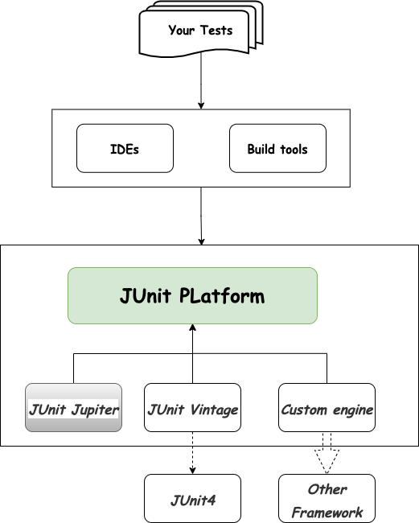
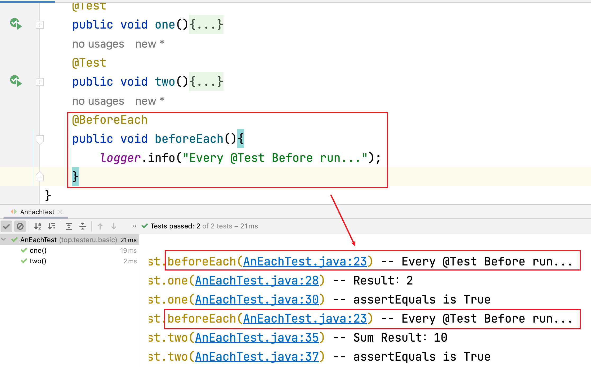
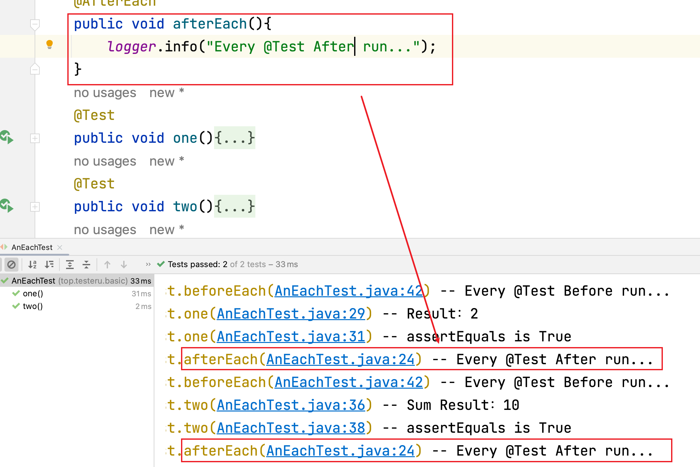
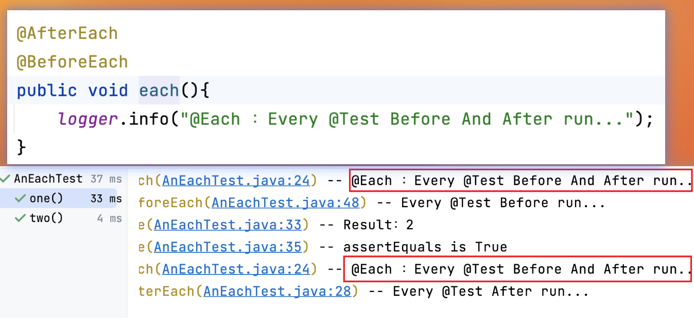

# JUnit5基本注解-Each相关

## 本章要点
1. Each 运行原理
2. @BeforeEach 使用
3. @AfterEach 使用
4. Each 注意


## 运行原理



代码运行工具「IDE」运行Each注解修饰的方法时通过JUnit5框架的junit-jupiter组件运行。

@BeforeEach注解其实就是告诉 JUnit5 框架需要在每个@Test注解方法**前**需要运行哪些代码。

@AfterEach注解其实就是告诉 JUnit5 框架需要在每个@Test注解方法**后**需要运行哪些代码。

## @BeforeEach 注解

@BeforeEach注解修饰的方法相当于**每个测试方法的前置条件**。

表示该注释的方法应该被执行之前的每个 @Test，@RepeatedTest，@ParameterizedTest，或@TestFactory方法在当前类。

### 作用

测试用例中，**测试方法**需要**初始化**的内容及属性：

1. UI自动化{app/web端}中需要进入固定页面，回退到固定页面；

2. App自动化中的每个阶段用例需要重启app；

3. 自动化测试中需要提前删除由于测试产生的测试数据。


### 声明规则

#### 1. 注解位置

1. @BeforeEach注解是方法上的注解。

>@BeforeEach注解只可修饰方法，放在方法上方。@BeforeEach注解不可修饰类。

#### 2. 注解方法声明规则

##### 声明规范

1. @BeforeEach修饰的方法没有**返回值**，即返回值类型为void。

1. @BeforeEach修饰的方法为一般方法，即public void。

1. @BeforeEach注解修饰的方法可以被继承。

##### 注解导包

1. @BeforeEach注解导包为import org.junit.jupiter.api.BeforeEach。

#### 3. 注解运行规则

1. @BeforeEach注解修饰的方法不可直接运行。

1. @BeforeEach修饰的方法是在每一个@Test注解修饰方法之**前**运行，与其在代码中的前后顺序无关。「注解修饰方法运行顺序」

#### 4. 注解方法内容

1. @BeforeEach注解修饰的方法内编写的内容为：每一个测试方法前需要运行的前置条件。「用例前置条件编写」

>在每一个@Test注解修饰的方法之前运行一次；所以，当前测试类有多少个@Test注解，@BeforeEach注解修饰的方法就运行多少次。

#### 5. 注解个数

1. 一个测试类里可以有多个@BeforeEach注解修饰的方法，方法名声明不同即可，但是不建议使用。「注解个数」


### 安装

与@Test注解使用的是同一个依赖，不需要重新导入。

### Hello @BeforeEach
```java
package top.testeru.basic;

import org.junit.jupiter.api.BeforeEach;
import org.junit.jupiter.api.Test;
import org.slf4j.Logger;

import static java.lang.invoke.MethodHandles.lookup;
import static org.junit.jupiter.api.Assertions.assertEquals;
import static org.slf4j.LoggerFactory.getLogger;


public class AnEachTest {
    static final Logger logger = getLogger(lookup().lookupClass());

    @Test
    public void one(){
        int result = 8 / 4;
        logger.info("Result：{}",result);
        assertEquals(2,result);
        logger.info("assertEquals is True");
    }

    @Test
    public void two(){
        int result = 2 + 8;
        logger.info("Sum Result：{}",result);
        assertEquals(10,result);
        logger.info("assertEquals is True");
    }

    @BeforeEach
    public void beforeEach(){
        logger.info("Every @Test Before run...");
    }
}
```


注意⚠️：

1. @BeforeEach注解修饰的方法在代码的最后，但是每个测试方法前都输出打印了对应内容。


## @AfterEach 注解

@AfterEach注解修饰的方法相当于**每个测试方法的后置条件**。

表示被注解的方法应该在当前类中的每个每个 @Test，@RepeatedTest，@ParameterizedTest，或@TestFactory方法之后执行;

### 作用

测试用例中，**测试方法**需要**销毁**的内容及属性：

1. UI自动化中需要返回首页，返回固定页面；

1. App自动化中的每个阶段用例需要退出app；

1. 删除/销毁产生的测试数据。


### 声明规则

#### 1. 注解位置

1. @AfterEach注解是方法上的注解。

>@AfterEach注解修饰方法时，放在方法上方。@AfterEach注解不可修饰类。

#### 2. 注解方法声明规则

##### 声明规范

1. @AfterEach修饰的方法没有**返回值**，即返回值类型为void。

1. @AfterEach修饰的方法为一般方法，即public void。

1. @AfterEach注解修饰的方法可以被继承。


##### 注解导包

1. @AfterEach注解导包为import org.junit.jupiter.api.AfterEach。


#### 3. 注解运行规则

1. @AfterEach注解修饰的方法不可直接运行。

1. @AfterEach修饰的方法是在每一个@Test注解修饰方法之**后**运行，与其在代码中的前后顺序无关。「注解修饰方法运行顺序」

1. 无论@Test注解修饰的测试方法是否断言成功，@AfterEach注解修饰的方法都会运行。

>@Test注解修饰方法哪怕断言失败，@AfterEach的内容也会运行。

#### 4. 注解方法内容

1. @AfterEach注解修饰的方法内编写的内容为：每一个测试方法后需要运行的后置条件。「用例后置条件编写」

>在每一个@Test注解修饰的方法之后运行一次；所以，当前测试类有多少个@Test注解，@AfterEach注解修饰的方法就运行多少次


#### 5. 注解个数

1. 一个测试类里可以有多个@AfterEach注解修饰的方法，方法名声明不同即可，但是不建议使用。「注解个数」

### 安装

与@Test注解使用的是同一个依赖，不需要重新导入。

### Hello @AfterEach

```java
public class AnEachTest {
    static final Logger logger = getLogger(lookup().lookupClass());

    @AfterEach
    public void afterEach(){
        logger.info("Every @Test After run...");
    }
    @Test
    public void one(){
        int result = 8 / 4;
        logger.info("Result：{}",result);
        assertEquals(2,result);
        logger.info("assertEquals is True");
    }
    @Test
    public void two(){
        int result = 2 + 8;
        logger.info("Sum Result：{}",result);
        assertEquals(10,result);
        logger.info("assertEquals is True");
    }
    @BeforeEach
    public void beforeEach(){
        logger.info("Every @Test Before run...");
    }
}
```



注意⚠️：

1. @AfterEach注解修饰的方法在代码的最前，但是每个测试方法后都输出打印了对应内容。


## 注意

@BeforeEach + @AfterEach可以同时修饰一个方法。



```java
@AfterEach
@BeforeEach
public void each(){
    logger.info("@Each ：Every @Test Before And After run...");
}
```

## 总结

Each注解使用：

1. @BeforeEach、@AfterEach注解修饰的方法不可直接运行。

2. @BeforeEach、@AfterEach注解可同时修饰一个方法。

3. @BeforeEach、@AfterEach注解修饰的方法没有返回值，即方法声明时为void。

4.  @BeforeEach、@AfterEach注解都可被继承。

5. @BeforeEach注解在每个@Test之**前**都运行一次；@AfterEach注解在每个@Test之**后**都运行一次，**无论断言是否失败@AfterEach都会运行**；

[项目演示地址](../../code/junit5-example/src/test/java/top/testeru/basic/AnEachTest.java)