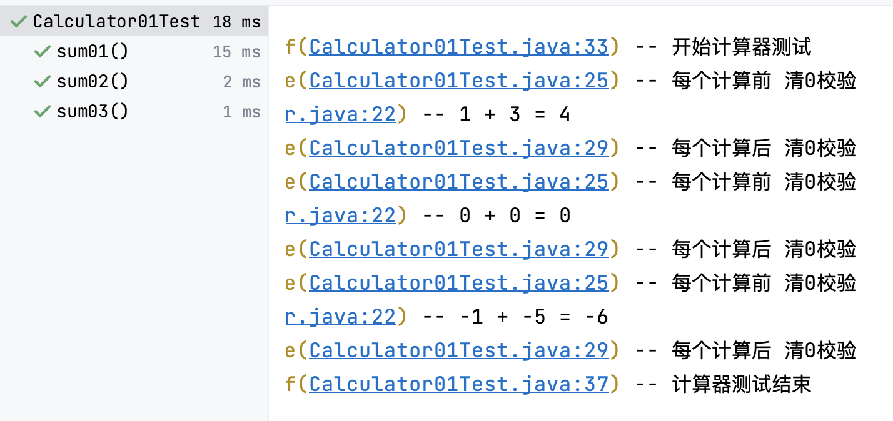
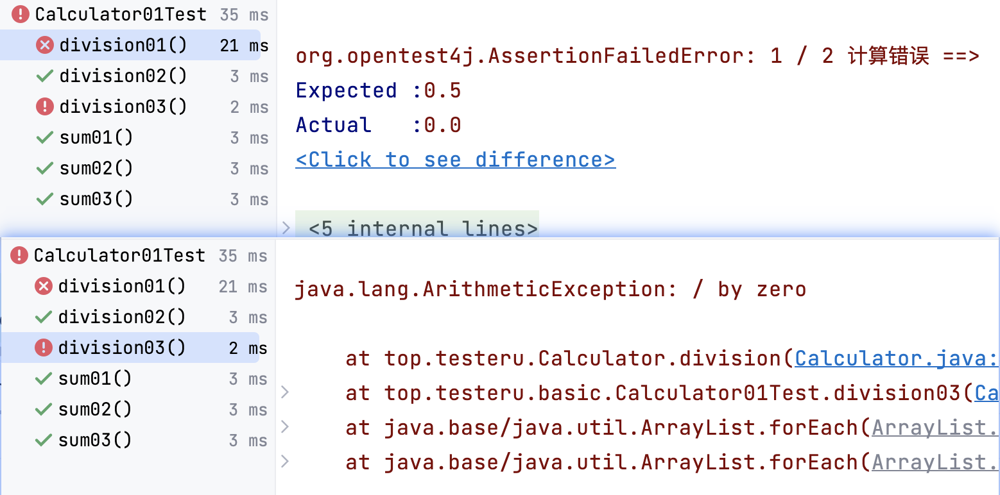
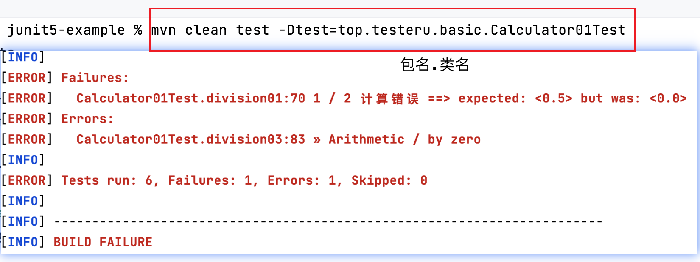

# 计算器加法测试用例基本实现


## 被测产品说明

针对目前我们的所学内容，完成一个测试用例：**计算器加法测试用例**！

计算器主要功能如下：

1. **加法**：2个整数相加，最后返回整数。

1. **减法**：2个整数相减，最后返回整数。

1. **乘法**：2个整数相乘，最后返回整数。

1. **除法**：2个整数相除，最后返回浮点数。

## 测试需求说明

对计算器的加法、除法功能进行测试，验证功能的正确性。

## 测试用例设计

|模块|用例标题|优先级|测试步骤|预期结果|
|---|---|---|---|---|
加法|2个大于0整数相加，结果计算正确|P0|1. 第一个数输入：1<br>2. 第二个数输入：3|计算结果：4|
加法|2个等于0整数相加，结果计算正确|P0|1. 第一个数输入：0<br>2. 第二个数输入：0|计算结果：0|
加法|2个小于0整数相加，结果计算正确|P0|1. 第一个数输入：-1<br>2. 第二个数输入：-5|计算结果：-6|
除法|2个非0整数相除，结果计算正确|P0|1. 第一个数输入：1<br>2. 第二个数输入：2|计算结果：0.5|
除法|被除数为0，除数为整数，结果计算正确|P0|1. 第一个数输入：0<br>2. 第二个数输入：5|计算结果：0|
除法|被除数为整数，除数为0，结果计算报错|P0|1. 第一个数输入：8<br>2. 第二个数输入：0|计算结果：错误异常|

## 用例脚本实现

### 涉及知识点

|知识点|备注|
|:-:| --- |
|@Test注解| 1. @Test注解是方法上的注解。<br>2. 一个测试类中可以有多个测试方法，即多个@Test注解修饰的方法。<br>3. @Test注解修饰的方法返回值类型是void。<br>4. @Test注解修饰的方法的内容是测试用例执行的具体内容及断言结果。|
|assertEquals|1. assertEquals()可以有2个参数，也可以有3个参数。<br>2.参数分别为：<br>&nbsp;&nbsp;&nbsp;&nbsp;expected「期望值」;<br>&nbsp;&nbsp;&nbsp;&nbsp;actual「实际值」;<br>&nbsp;&nbsp;&nbsp;&nbsp;message「断言失败提示语」。|
|@BeforeEach| 1. @BeforeEach注解修饰的方法不可直接运行。<br>2. @BeforeEach注解修饰的方法没有返回值。<br>3. @BeforeEach注解在每个@Test之**前**都运行一次。|
|@BeforeAll| 1. @BeforeAll注解修饰的方法为static方法且不可直接运行。<br>2. @BeforeAll注解修饰的方法没有返回值。<br>3. @BeforeAll注解在所有方法之**前**运行一次。|
|@AfterEach| 1. @AfterEach注解修饰的方法不可直接运行。<br>2. @AfterEach注解修饰的方法没有返回值。<br>3. @AfterEach注解在每个@Test之**后**都运行一次。|
|@AfterAll| 1. @AfterAll注解修饰的方法为static方法且不可直接运行。<br>2. @AfterAll注解修饰的方法没有返回值。<br>3. @AfterAll注解在所有方法之**后**运行一次。 |


### 环境准备

#### pom配置文件

```xml
<!--    版本配置-->
<properties>
    <maven.compiler.encoding>UTF-8</maven.compiler.encoding>
    <java.version>11</java.version>
    <junit.jupiter.version>5.9.2</junit.jupiter.version>
    <maven.compiler.version>3.11.0</maven.compiler.version>
    <maven-surefire-plugin.version>3.0.0</maven-surefire-plugin.version>
    <!-- log日志 -->
    <slf4j.version>2.0.7</slf4j.version>
    <logback.version>1.4.6</logback.version>
    <!-- hamcrest断言 -->
    <hamcrest.version>2.2</hamcrest.version>
    <!-- yaml对应解析 -->
    <jackson.version>2.14.2</jackson.version>
</properties>
<dependencyManagement>
    <!--        junit5 版本管理， 找到对应依赖关系的 pom 文件，为了解决依赖冲突问题-->
    <dependencies>
        <dependency>
            <groupId>org.junit</groupId>
            <artifactId>junit-bom</artifactId>
            <version>${junit.jupiter.version}</version>
            <type>pom</type>
            <scope>import</scope>
        </dependency>
    </dependencies>
</dependencyManagement>
<dependencies>
    <!-- junit 相关依赖下载-->
    <!-- junit5 -->
    <dependency>
        <!-- 组织的名称；仓库中唯一标识一个项目，确保项目的唯一性 -->
        <groupId>org.junit.jupiter</groupId>
        <!-- 项目的名称或模块的名称  -->
        <artifactId>junit-jupiter</artifactId>
        <!-- 依赖的作用范围 -->
        <scope>test</scope>
    </dependency>
    <!-- junit5-suite -->
    <dependency>
        <groupId>org.junit.platform</groupId>
        <artifactId>junit-platform-suite</artifactId>
        <scope>test</scope>
    </dependency>
    <!-- 用做兼容老版本 -->
    <dependency>
        <groupId>org.junit.vintage</groupId>
        <artifactId>junit-vintage-engine</artifactId>
        <scope>test</scope>
    </dependency>
    <!-- hamcrest断言 -->
    <dependency>
        <groupId>org.hamcrest</groupId>
        <artifactId>hamcrest</artifactId>
        <version>${hamcrest.version}</version>
        <scope>test</scope>
    </dependency>
    <!--        yaml文件解析-->
    <dependency>
        <groupId>com.fasterxml.jackson.core</groupId>
        <artifactId>jackson-databind</artifactId>
        <version>${jackson.version}</version>
    </dependency>
    <dependency>
        <groupId>com.fasterxml.jackson.dataformat</groupId>
        <artifactId>jackson-dataformat-yaml</artifactId>
        <version>${jackson.version}</version>
    </dependency>
    <!-- log日志 -->
    <dependency>
        <groupId>org.slf4j</groupId>
        <artifactId>slf4j-api</artifactId>
        <version>${slf4j.version}</version>
        <scope>compile</scope>
    </dependency>
    <dependency>
        <groupId>ch.qos.logback</groupId>
        <artifactId>logback-classic</artifactId>
        <version>${logback.version}</version>
        <scope>compile</scope>
    </dependency>

</dependencies>
<build>
    <plugins>
        <!-- maven 命令行执行插件-->
        <plugin>
            <groupId>org.apache.maven.plugins</groupId>
            <artifactId>maven-surefire-plugin</artifactId>
            <version>${maven-surefire-plugin.version}</version>
            <configuration>
                <includes>
                    <include>**/*Test</include>
                    <include>**/Test*</include>
                </includes>
            </configuration>
            <dependencies>
                <dependency>
                    <groupId>org.junit.jupiter</groupId>
                    <artifactId>junit-jupiter-engine</artifactId>
                    <version>${junit.jupiter.version}</version>
                </dependency>
                <dependency>
                    <groupId>org.junit.vintage</groupId>
                    <artifactId>junit-vintage-engine</artifactId>
                    <version>${junit.jupiter.version}</version>
                </dependency>
            </dependencies>
        </plugin>
        <!--maven 编译使用插件-->
        <plugin>
            <groupId>org.apache.maven.plugins</groupId>
            <artifactId>maven-compiler-plugin</artifactId>
            <version>${maven.compiler.version}</version>
            <configuration>
                <parameters>true</parameters>
                <source>${java.version}</source>
                <target>${java.version}</target>
                <encoding>${maven.compiler.encoding}</encoding>
            </configuration>
        </plugin>
    </plugins>
</build>
```

#### 被测系统代码

```java
package top.testeru;

import org.slf4j.Logger;

import static java.lang.invoke.MethodHandles.lookup;
import static org.slf4j.LoggerFactory.getLogger;

/**
 * @author testeru.top
 * @version 1.0.0
 * @Prpject junit5-example
 * @Description 计算器
 * @createTime 2023年04月20日 11:05:00
 */
public class Calculator {
    //获得具有所需名称的记录器
    static final Logger logger = getLogger(lookup().lookupClass());

    //加法
    public int sum(int a, int b){
        int result = a + b;
        logger.info("{} + {} = {}", a, b, result);
        return result;
    }

    //除法
    public double division(int a, int b){
        double result = a / b;
        logger.info("{} / {} = {}", a, b, result);
        return result;
    }
}
```


#### 日志配置文件

- logback.xml。

```xml
<?xml version="1.0" encoding="UTF-8"?>
<configuration>
    <!-- name指定<appender>的名称    class指定<appender>的全限定名  ConsoleAppender的作用是将日志输出到控制台-->
    <appender name="STDOUT" class="ch.qos.logback.core.ConsoleAppender">
        <encoder>
            <!--输出时间格式 %-5level：级别从左显示5个字符宽度-->
            <pattern>%d{yyyy-MM-dd HH:mm:ss}  %highlight%-5level %magenta([%thread]) %yellow(%logger{40}.%M\(%class{0}.java:%line\)) -- %msg%throwable%n</pattern>
        </encoder>
    </appender>
    <!-- 通过 "byModel" 将时间格式化成 "yyyyMMdd" 的形式插入到 logger 的上下文中这个值对后续的配置也适用-->
    <timestamp key="byModel" datePattern="yyyyMMdd" />

    <appender name="FILE"  class="ch.qos.logback.core.rolling.RollingFileAppender">

        <file>${byModel}.log</file>

        <!-- 配置日志所生成的目录以及生成文件名的规则-->
        <rollingPolicy class="ch.qos.logback.core.rolling.TimeBasedRollingPolicy">
            <!--日志文件输出的文件名-->
            <FileNamePattern>${log.zip.path}/%d{yyyy-MM-dd}.%i.log.zip</FileNamePattern>
            <!-- 日志总保存量为1GB -->
            <totalSizeCap>1024MB</totalSizeCap>
            <!-- 如果按天来回滚，则最大保存时间为365天，365天之前的都将被清理掉 -->
            <maxHistory>30</maxHistory>
            <timeBasedFileNamingAndTriggeringPolicy
                    class="ch.qos.logback.core.rolling.SizeAndTimeBasedFNATP">
                <!--文件达到 最大128MB时会被压缩和切割 -->
                <maxFileSize>128MB</maxFileSize>
            </timeBasedFileNamingAndTriggeringPolicy>
        </rollingPolicy>

        <encoder>
            <pattern>%d{yyyy-MM-dd HH:mm:ss} %-5level [%thread] %logger{40}.%M\(%class{0}.java:%line\) -- %msg%n</pattern>

        </encoder>

    </appender>

    <logger name="top.testeru" level="INFO" />
    <logger name="ch.qos.logback" level="INFO" />
    <logger name="org" level="WARN" />

    <root level="INFO">
        <appender-ref ref="STDOUT" />
        <appender-ref ref="FILE" />
    </root>
</configuration>
```


### 加法P0测试用例




|模块|用例标题|优先级|测试步骤|预期结果|
|---|---|---|---|---|
加法|2个大于0整数相加，结果计算正确|P0|1. 第一个数输入：1<br>2. 第二个数输入：3|计算结果：4|
加法|2个等于0整数相加，结果计算正确|P0|1. 第一个数输入：0<br>2. 第二个数输入：0|计算结果：0|
加法|2个小于0整数相加，结果计算正确|P0|1. 第一个数输入：-1<br>2. 第二个数输入：-5|计算结果：-6|

#### 步骤

1. 创建计算器测试类。

2. 编写加法的测试用例。
   
   1. 业务逻辑调用，获取结果值result。
   
   2. 断言。

3. 编写在测试方法前后执行的业务逻辑。


#### 注意

assertEquals导包问题。

```java
//错误的导包，该包下的AssertEquals不是一个public的class
//import static org.junit.jupiter.api.AssertEquals.assertEquals;
import static org.junit.jupiter.api.Assertions.assertEquals;
```

#### 示例代码

```java
package top.testeru.basic;

import org.junit.jupiter.api.*;
import org.slf4j.Logger;
import top.testeru.Calculator;

import static java.lang.invoke.MethodHandles.lookup;
import static org.junit.jupiter.api.Assertions.assertEquals;
import static org.slf4j.LoggerFactory.getLogger;


public class Calculator01Test {
    static final Logger logger = getLogger(lookup().lookupClass());
    @BeforeEach
    public void be(){
        logger.info("每个计算前 清0校验");
    }
    @AfterEach
    public void ae(){
        logger.info("每个计算后 清0校验");
    }
    @BeforeAll
    public static void bf(){
        logger.info("开始计算器测试");
    }
    @AfterAll
    public static void af(){
        logger.info("计算器测试结束");
    }
    @Test
    public void sum01(){
        Calculator calculator = new Calculator();
        int result = calculator.sum(1, 3);
        //assertEquals(expected, actual,String message)
        //expected:期望值,  actual:运算的实际值,  message:断言失败的提示信息
        assertEquals(4, result, "1 + 3 计算错误");
    }
    @Test
    public void sum02(){
        Calculator calculator = new Calculator();
        int result = calculator.sum(0, 0);
        //assertEquals(expected, actual,String message)
        //expected:期望值,  actual:运算的实际值,  message:断言失败的提示信息
        assertEquals(0, result, "0 + 0 计算错误");
    }
    @Test
    public void sum03(){
        Calculator calculator = new Calculator();
        int result = calculator.sum(-1, -5);
        //assertEquals(expected, actual,String message)
        //expected:期望值,  actual:运算的实际值,  message:断言失败的提示信息
        assertEquals(-6, result, "-1 + -5 计算错误");
    }
}
```

### 除法P0测试用例




|模块|用例标题|优先级|测试步骤|预期结果|
|---|---|---|---|---|
除法|2个非0整数相除，结果计算正确|P0|1. 第一个数输入：1<br>2. 第二个数输入：2|计算结果：0.5|
除法|被除数为0，除数为整数，结果计算正确|P0|1. 第一个数输入：0<br>2. 第二个数输入：5|计算结果：0|
除法|被除数为整数，除数为0，结果计算报错|P0|1. 第一个数输入：8<br>2. 第二个数输入：0|计算结果：错误异常|

#### 示例代码

```java
@Test
public void division01(){
    Calculator calculator = new Calculator();
    double result = calculator.division(1, 2);
    //assertEquals(expected, actual,String message)
    //expected:期望值,  actual:运算的实际值,  message:断言失败的提示信息
    assertEquals(0.5 , result, "1 / 2 计算错误");
}
@Test
public void division02(){
    Calculator calculator = new Calculator();
    double result = calculator.division(0, 5);
    //assertEquals(expected, actual,String message)
    //expected:期望值,  actual:运算的实际值,  message:断言失败的提示信息
    assertEquals(0 , result, "0 / 5 计算错误");
}
@Test
public void division03(){
    Calculator calculator = new Calculator();
    double result = calculator.division(8, 0);
    //assertEquals(expected, actual,String message)
    //expected:期望值,  actual:运算的实际值,  message:断言失败的提示信息
    assertEquals(0 , result, "8 / 0 计算错误");
}
```


## 命令行实现

### 指定测试类运行

```bash
mvn clean test -Dtest=包名.Test类名1
```



```bash
mvn clean test -Dtest=top.testeru.basic.Calculator01Test
```

### 指定方法运行

```bash
mvn clean test -Dtest=包名.Test类名1#方法名1,包名.Test类名2#方法名2
```


```bash
mvn clean test -Dtest=top.testeru.basic.Calculator01Test#sum01,top.testeru.basic.Calculator01Test#sum03
```
