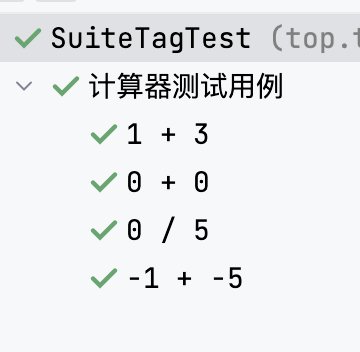
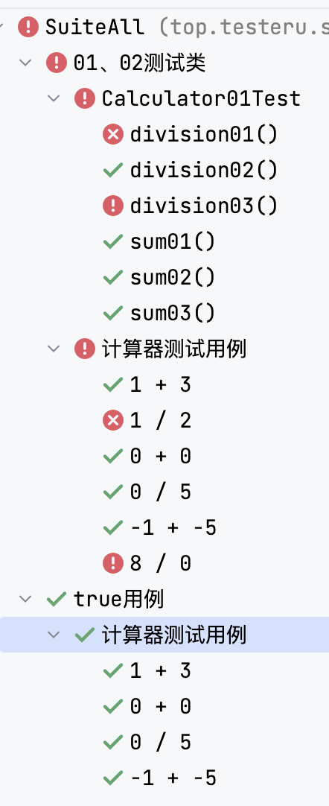

# 计算器数据驱动

## 只运行01Test、02Test


```java
@Suite
@SelectClasses({
        Calculator01Test.class,
        Calculator02Test.class
})
@SuiteDisplayName("01、02测试类")
public class SuiteClassTest {
}
```

## 只运行Tag标签是true



```java
@Suite
@SelectPackages("top.testeru.cal")
@IncludeTags({"true"})
@SuiteDisplayName("true用例")
public class SuiteTagTest {
}

```

## 显示suite自定义名称



```java
@Suite
@SelectClasses({
        SuiteClassTest.class,
        SuiteTagTest.class
})
public class SuiteAll {
}
```