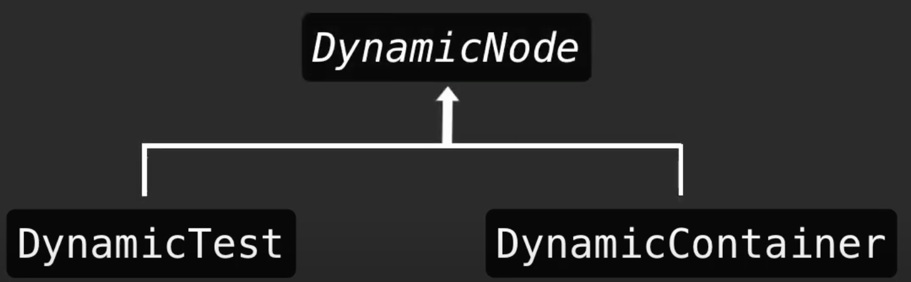

# 动态测试介绍

JUnit5 DynamicTest

## 概念

动态测试是 JUnit 5 中引入的一种新的编程模型，具体的是JUnit Jupiter引入的一种全新的测试编程模型。这种新的测试就是动态测试，它是由@TestFactory注解的工厂方法在运行时生成的。

我们已经知道在测试用例相关的方法上直接添加@Test注解就可以运行该方法。

- 那动态测试和它又有什么不同点呢？
- 为什么会有动态测试呢？
- 直接用Test注解不就可以了吗？

下面我们带着这些疑问🤔️去学习动态测试。

### 什么是动态测试

动态测试是指在运行时动态生成测试用例的测试方法。

它与传统的**静态测试**不同，传统的**静态**测试需要在**编写测试代码时将测试用例全部写好**，而**动态**测试则可以**在运行时根据需要动态生成测试用例**。

动态测试通常使用参数化测试、测试工厂和测试模板等技术实现。动态测试的**优点**是可以**减少测试代码的编写量**，同时可以测试更多的测试用例，增加测试覆盖率。


>动态测试：就是DynamicTest在运行的时候动态的生成测试用例。由@TestFactory注解声明的方法。

>静态测试：@Test注解的测试用例，因为该用例在编译时已经完全指定好的。


## 与静态测试区别

动态测试和静态测试的主要区别在于测试用例的 **生成方式** 和 **时机** 不同。

### 生成方式不同

静态测试是在编写测试代码时将测试用例全部写好，测试用例的数量和内容都是固定的，无法动态调整。静态测试可以使用@Test注解进行编写和执行。

动态测试是在运行时动态生成测试用例的测试方法。测试用例的数量和内容是在运行时根据需要动态生成的。动态测试通常使用参数化测试、测试工厂和测试模板等技术实现。动态测试可以使用JUnit5的动态测试功能@TestFactory进行编写和执行。

因为动态测试可以动态生成测试用例，因此可以测试更多的测试用例，增加测试覆盖率。同时，动态测试还可以减少测试代码的编写量，提高测试效率。

动态测试的方法本身不是测试用例，而**是测试用例的工厂**。所以得到结论：动态测试是工厂的产物。

### 时机不同

**动态测试「DynamicTest」不支持生命周期回调**。即：动态测试「DynamicTest」不会执行 @BeforAll 、@BeforeEach @AfterEach 、@AfterAll 方法的回调。

动态测试的执行生命周期与标准的@Test情况完全不同。

具体而言，个别动态测试没有生命周期回调。这意味着@BeforeEach和@AfterEach方法及其相应的扩展回调函数是为@TestFactory方法执行，而不是对每个动态测试执行。

换句话说，如果从一个lambda表达式的测试实例中访问动态测试的字段，这些字段将不会由同一个@TestFactory方法生成的各个动态测试之间的回调方法或扩展重置。


## 返回值类型

@TestFactory注解用于支持动态测试，而返回值类型是用于确定测试工厂方法返回的动态节点类型的。

@TestFactory注解必须返回一个 **DynamicTest**、**Collection\<DynamicTest\>**、**Stream**、**Iterable**、**Iterator** 或 **DynamicNode**对象。

这些返回类型的含义如下：

1. **Stream、Iterable**：这两个类型都表示一组动态测试节点的集合。
    >测试方法可以返回一个Stream或Iterable对象，其中每个元素都是一个动态节点。<br>这些节点可以是DynamicTest、DynamicContainer或自定义的DynamicNode对象。

1. **Iterator**：Iterator类型与Stream和Iterable类似，但是返回的是一个迭代器对象。
    >测试方法可以返回一个迭代器，迭代器中的每个元素都是一个动态节点。

1. **Collection**：Collection\<DynamicTest\> 

1. **DynamicNode**接口：表示可动态创建测试节点的接口。
   >动态测试方法可以返回一个DynamicNode对象，它可以是DynamicTest、DynamicContainer或自定义的DynamicNode对象。


如果不返回以上类型会发生什么？

>返回其它类型报错：**JUnitException**。因为编译时无法检测到有效的返回类型。


#### DynamicNode介绍



DynamicNode的可实例化的子类是 **DynamicContainer** 和 **DynamicTest** 。

DynamicContainer实例由一个**显示名称**和一个**动态子节点列表**「Iterable或DynamicNode流」组成，可以创建任意嵌套的动态节点层次结构，在运行时生成的容器。

DynamicTest实例将被延迟执行，从而实现测试用例依据非确定性的动态生成。

DynamicNode接口提供了许多方法，用于**设置节点名称**、**描述**、**标记**、**嵌套**等信息。

### 实例


```java
DynamicTest dynamicTest() {
    return DynamicTest.dynamicTest(displayName, executable);
}
```

displayName：动态测试显示名称。

executable：动态测试的业务逻辑。


#### 


用例标题|优先级|测试步骤|预期结果|
|---|---|---|---|
单个动态测试|P0|3+2|5|


```java
//方法返回实例为DynamicTest
@TestFactory
@DisplayName("返回类型为DynamicTest实例")
DynamicTest dynamicTest() {
    return DynamicTest.dynamicTest("单个动态测试",
            () -> assertEquals(5, 3+2));
}
```

### 集合


### 容器
### 流
### 迭代器


