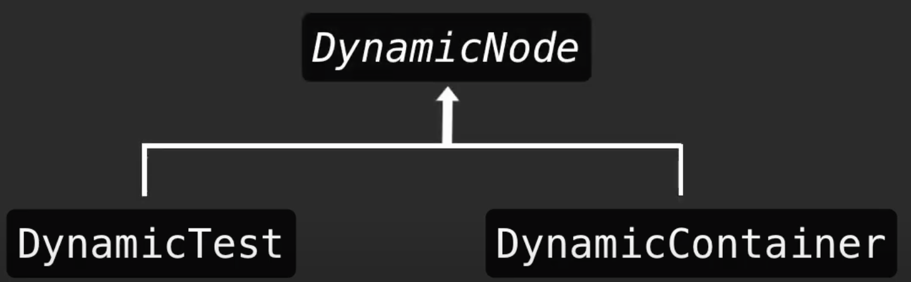
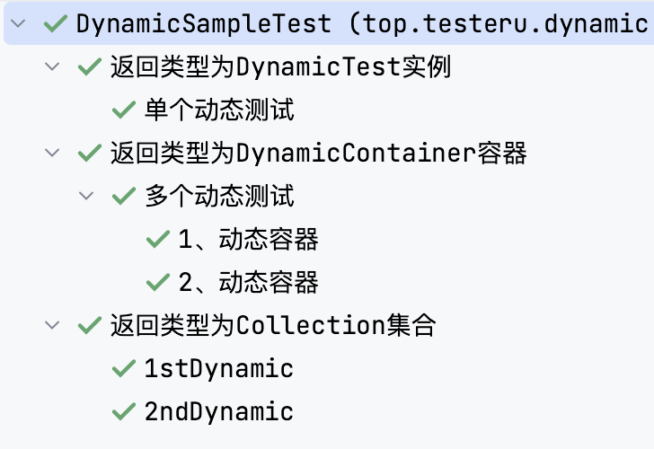
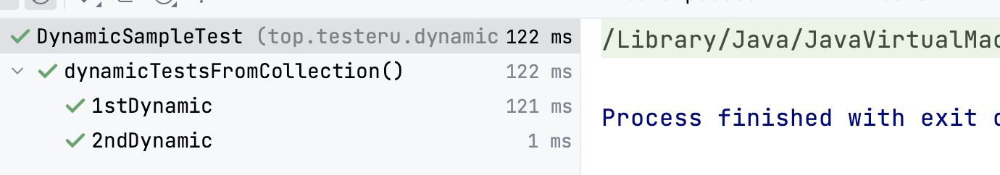
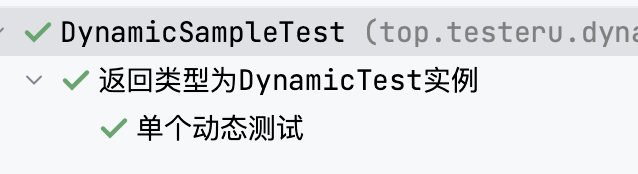
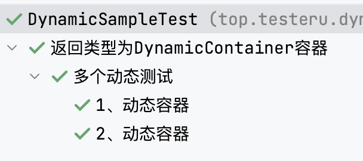
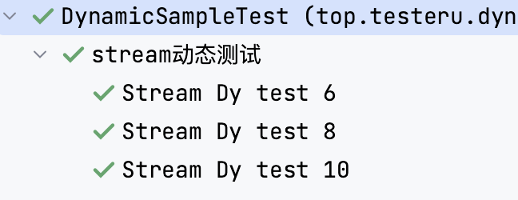
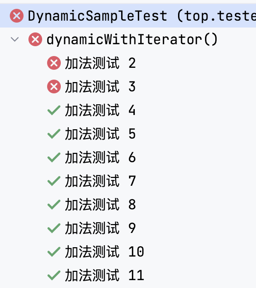
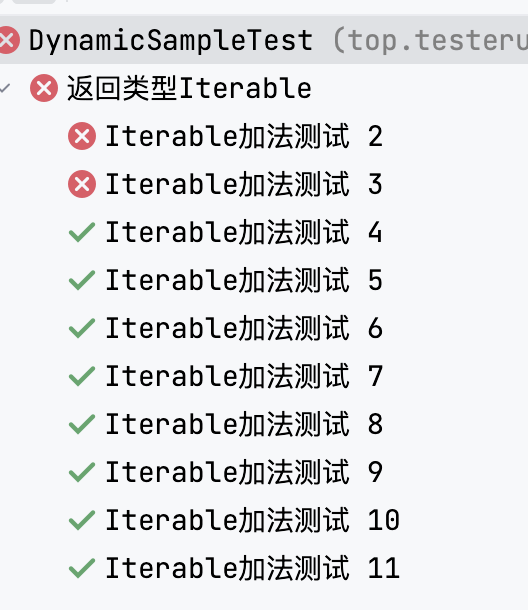
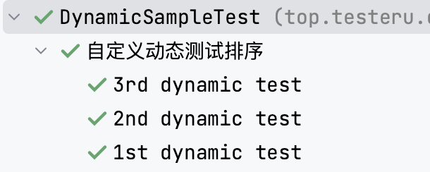

# 动态测试

JUnit5 DynamicTest

## 概念

动态测试是 JUnit 5 中引入的一种新的编程模型，具体的是JUnit Jupiter引入的一种全新的测试编程模型。这种新的测试就是动态测试，它是由@TestFactory注解的工厂方法在运行时生成的。

本篇文章，将了解动态测试到底是什么以及如何创建。

我们已经知道在测试用例相关的方法上直接添加@Test注解就可以运行该方法。

- 那动态测试和它又有什么不同点呢？
- 为什么会有动态测试呢？
- 直接用Test注解不就可以了吗？

下面我们带着这些疑问🤔️去学习动态测试。

## 什么是动态测试

动态测试是指在运行时动态生成测试用例的测试方法。

它与传统的**静态测试**不同，传统的**静态**测试需要在**编写测试代码时将测试用例全部写好**，而**动态**测试则可以**在运行时根据需要动态生成测试用例**。

动态测试通常使用参数化测试、测试工厂和测试模板等技术实现。动态测试的**优点**是可以**减少测试代码的编写量**，同时可以测试更多的测试用例，增加测试覆盖率。


>动态测试：就是DynamicTest在运行的时候动态的生成测试用例。由@TestFactory注解声明的方法。

>静态测试：@Test注解的测试用例，因为该用例在编译时已经完全指定好的。


## 动态测试与静态测试区别

动态测试和静态测试的主要区别在于测试用例的 **生成方式** 和 **时机** 不同。

静态测试是在编写测试代码时将测试用例全部写好，测试用例的数量和内容都是固定的，无法动态调整。静态测试可以使用@Test注解进行编写和执行。

动态测试是在运行时动态生成测试用例的测试方法。测试用例的数量和内容是在运行时根据需要动态生成的。动态测试通常使用参数化测试、测试工厂和测试模板等技术实现。动态测试可以使用JUnit5的动态测试功能@TestFactory进行编写和执行。

因为动态测试可以动态生成测试用例，因此可以测试更多的测试用例，增加测试覆盖率。同时，动态测试还可以减少测试代码的编写量，提高测试效率。

动态测试的方法本身不是测试用例，而**是测试用例的工厂**。所以得到结论：动态测试是工厂的产物。

### 时机不同

**动态测试「DynamicTest」不支持生命周期回调**。即：动态测试「DynamicTest」不会执行 @BeforAll 、@BeforeEach @AfterEach 、@AfterAll 方法的回调。

动态测试的执行生命周期与标准的@Test情况完全不同。

具体而言，个别动态测试没有生命周期回调。这意味着@BeforeEach和@AfterEach方法及其相应的扩展回调函数是为@TestFactory方法执行，而不是对每个动态测试执行。

换句话说，如果从一个lambda表达式的测试实例中访问动态测试的字段，这些字段将不会由同一个@TestFactory方法生成的各个动态测试之间的回调方法或扩展重置。

## 声明

1. 动态测试的方法上声明必须有 @TestFactory 注解。

2. dynamicTest()方法由 **显示名称**「DisplayName」和 **动态测试的实现**「Executable」 组成。（Executable是@FunctionalInterface）

## 返回值类型

@TestFactory注解用于支持动态测试，而返回值类型是用于确定测试工厂方法返回的动态节点类型的。

@TestFactory注解必须返回一个 **Stream**、**Iterable**、**Iterator** 或 **DynamicNode**对象。

这些返回类型的含义如下：

### Stream、Iterable

这两个类型都表示一组动态测试节点的集合。

测试方法可以返回一个Stream或Iterable对象，其中每个元素都是一个动态节点。这些节点可以是DynamicTest、DynamicContainer或自定义的DynamicNode对象。

### Iterator

Iterator类型与Stream和Iterable类似，但是返回的是一个迭代器对象。

测试方法可以返回一个迭代器，迭代器中的每个元素都是一个动态节点。

### DynamicNode




DynamicNode接口是表示可动态创建测试节点的接口。动态测试方法可以返回一个DynamicNode对象，它可以是DynamicTest、DynamicContainer或自定义的DynamicNode对象。

DynamicNode的可实例化的子类是 **DynamicContainer** 和 **DynamicTest** 。

DynamicContainer实例由一个**显示名称**和一个**动态子节点列表**「Iterable或DynamicNode流」组成，可以创建任意嵌套的动态节点层次结构，在运行时生成的容器。

DynamicTest实例将被延迟执行，从而实现测试用例依据非确定性的动态生成。

DynamicNode接口提供了许多方法，用于**设置节点名称**、**描述**、**标记**、**嵌套**等信息。


如果不返回以上类型会发生什么？

>返回其它类型报错：JUnitException。因为编译时无法检测到有效的返回类型。


## 注意⚠️

1. 动态测试本质是 @TestFactory 工厂方法生成的测试用例。

2. 与@Test方法一样，@TestFactory方法不能是private或static。

3. 动态测试可以选择声明参数，通过 **ParameterResolvers** 解析。

4. 动态测试的实现通过 **lambda表达式** 或 **方法引用** 来实现。


### 创建动态测试的规则

1. @TestFactory方法不能是 private ,static。

2. @TestFactory方法返回类型必须为： Stream、Collection、Iterable、或Iterator。

3. @TestFactory方法返回实例必须为：DynamicNode、DynamicContainer 和DynamicTest。

>DynamicNode是DynamicContainer和DynamicTest的父类。


## 动态测试用例创建

由静态测试用例修改为动态测试用例。




用例标题|优先级|测试步骤|预期结果|
|---|---|---|---|
1stDynamic|P0|3+2|5|
2ndDynamic|P0|125/5|5|


动态测试是在运行时通过工厂方法「@TestFactory注解」生成的测试。

>标记为@TestFactory 的方法不是测试用例，而是测试用例的工厂。

#### 返回类型：集合



```java
public class DynamicSampleTest {
    // 创建动态测试用例
    @TestFactory
    @DisplayName("返回类型为Collection集合")
    Collection<DynamicTest> dynamicTestsFromCollection() {
        return Arrays.asList(
                DynamicTest.dynamicTest("1stDynamic", () -> assertEquals(5, 3+2)),
                DynamicTest.dynamicTest("2ndDynamic", () -> assertEquals(5, 25/5))
        );
    }
}
```

#### 返回类型：实例




```java
//方法返回实例为DynamicTest
@TestFactory
@DisplayName("返回类型为DynamicTest实例")
DynamicTest dynamicTest() {
    return DynamicTest.dynamicTest("单个动态测试",
            () -> assertEquals(5, 3+2));
}
```

#### 返回类型：DynamicContainer容器



```java
@TestFactory
@DisplayName("返回类型为DynamicContainer容器")
DynamicContainer dynamicTestsFromDynamicContainer() {
    return DynamicContainer.dynamicContainer("多个动态测试",

            Stream.of(
                    DynamicTest.dynamicTest("1、动态容器",
                            () -> assertEquals(5, 3+2)),
                    DynamicTest.dynamicTest("2、动态容器",
                            () -> assertEquals(5,25/5))
            ));
}
```


#### 返回类型：Stream流



```java
@TestFactory
@DisplayName("返回类型为Stream流")
Stream<DynamicTest> dynamicTestsFromStream() {
    return Stream.of(6, 8, 10)
            .map(arg -> DynamicTest.dynamicTest("Stream Dy test " + arg, () -> {
                System.out.println(arg);//6, 8, 10
                assertThat(arg, greaterThan(2));
            }));
}
```


#### 返回类型：Iterator迭代器



```java
@TestFactory
@DisplayName("返回类型为Iterator迭代器")
Iterator<DynamicTest> dynamicTestsFromIterator(){
    Collection<DynamicTest> dynamicTestIterator = new ArrayList<>();
    //创建了一个包含10个整数的迭代器，这10个整数从2开始，每个整数都比前一个整数大1
    //iterate()方法可以用于生成一个无限流，它从一个初始值开始，然后重复应用一个函数来生成后续的值。
    //limit()方法可以用于截断无限流，使其变为有限流。这里使用limit(10)方法将无限流截断为包含10个元素的有限流。
    PrimitiveIterator.OfInt iterator = IntStream.iterate(2, n -> n + 1).limit(10).iterator();

    while (iterator.hasNext()){
        Integer next = iterator.next();
        String displayName = "加法测试 " + next;
        dynamicTestIterator.add(
                DynamicTest.dynamicTest(displayName, () -> {
                                                    assertThat(next,greaterThan( 3));
                                                    })
        );
    }
    return dynamicTestIterator.iterator();
}
```


Iterator可以返回具有迭代状态的对象，有 hasNext()/next()。

Iterable是一系列可以迭代的元素。

> Java中集合使用.iterator() 返回可迭代的对象


#### 返回类型：Iterable迭代器



```java
@TestFactory
@DisplayName("返回类型Iterable")
Iterable<DynamicTest> dynamicTestsFromIterable(){
	Collection<DynamicTest> dynamicTestIterator = new ArrayList<>();
	PrimitiveIterator.OfInt iterator = IntStream.iterate(2, n -> n + 1).limit(10).iterator();

	while (iterator.hasNext()){
		Integer next = iterator.next();
		String displayName = "Iterable加法测试 " + next;

		dynamicTestIterator.add(
				DynamicTest.dynamicTest(displayName,  () -> {
					System.out.println("n:" + next);
					assertThat(next,greaterThan( 3));
				}));
	}
	return dynamicTestIterator;
}

```

## 动态测试中的执行顺序

动态测试节点的执行顺序是由JUnit 5的执行引擎控制的，并且不保证按照添加的顺序执行。具体来说，动态测试节点可能会在任何时间点被执行，并且它们的执行顺序可能会因为多线程执行或者测试引擎的内部机制而发生变化。

为了使测试结果更加稳定和可预测，我们可以通过将动态测试节点的输入参数按照特定的顺序排列来控制测试的执行顺序。

例如，我们可以使用Java的**Comparator**接口来对输入参数进行排序，然后将排序后的参数列表作为**DynamicTest**对象的输入参数。这样，我们就可以确保测试用例按照特定的顺序执行。


1. 动态测试的方法顺序不依赖于在顶级测试类上声明的@TestMethodOrder。
1. 为了控制动态测试的顺序，我们可以使用自定义排序。


### 单个

>单个动态测试时，直接控制传入的参数顺序即可。

**需求**：单个dynamicTest，自定义动态测试的执行顺序，按传入参数降序执行。

```java
@TestFactory
@DisplayName("降序执行")
public Stream<DynamicTest> dynamicTestOrder() {
	Integer[] numbers = {3, 1, 4, 1, 5, 9, 2, 6, 5, 3, 5};
	Arrays.sort(numbers, Comparator.reverseOrder()); // 逆序排序

	return Arrays.stream(numbers)
			.map(number -> DynamicTest.dynamicTest("Test " + number, () -> {
				// 测试逻辑
				assertTrue(number > 0 && number < 10);
			}));
}

```

### 多个

>多个动态测试时，根据DisplayName控制顺序。可以拿到DisplayName字段，切割获取中间节点或整个字段进行排序对比。

**需求**：多个dynamicTest，自定义动态测试的执行顺序，按测试的显示名称的降序控制执行顺序。



```java
@TestFactory
@DisplayName("自定义动态测试排序")
Collection<DynamicTest> dynamicTestsOrder() {

	List<DynamicTest> dynamicTests = Arrays.asList(
			DynamicTest.dynamicTest("1st dynamic test", () -> {
				System.out.println("=> 1st dynamic test");
			}),
			DynamicTest.dynamicTest("2nd dynamic test", () -> {
				System.out.println("=> 2nd dynamic test");
			}),
			DynamicTest.dynamicTest("3rd dynamic test", () -> {
				System.out.println("=> 3rd dynamic test");
			})
	);

	sortDynamicTests(dynamicTests);
	return dynamicTests;
}

static void sortDynamicTests(List<DynamicTest> dynamicTests) {
	//根据displayName对比来定义执行顺序
	dynamicTests.sort((DynamicTest d1, DynamicTest d2) ->
			d2.getDisplayName().compareTo(d1.getDisplayName()));
}

```


## 动态测试参数化

- 在前面返回值类型为stream的方法就是使用的参数化
>本次使用Collection演示

- 有多个IP参数，两个测试用例
  - 第一个测试用例打印：1、集合参数化：ip地址
  - 第二个测试用例打印：2、ip参数化：--ip地址

java
public class DynamicParamsTest {
	@TestFactory
	Collection<DynamicTest> dynamicTestsFromStreamInJava8() {
		Collection<DynamicTest> dynamicTests = new ArrayList<>();
		Arrays.asList("154.174.10.56", "211.152.104.132", "178.144.120.156")
				.forEach(s -> {
					//每一个参数进行动态测试用例
					DynamicTest dynamicTest = DynamicTest.dynamicTest("1、集合参数化", () -> {
						System.out.println("1、集合参数化：" + s);
					});

					DynamicTest dynamicTest1 = DynamicTest.dynamicTest("2、集合参数化", () -> {
						System.out.println("2、ip参数化：--" + s);
					});
					dynamicTests.add(dynamicTest);
					dynamicTests.add(dynamicTest1);
				});

		return dynamicTests;
	}
}


- 优化：可以直接套用在一起，如下：

java
public class DynamicParamsTest {
    @TestFactory
    Collection<DynamicTest> dyTestCollection(){
        List<DynamicTest> dynamicTests = new ArrayList<DynamicTest>();
        Arrays.asList(6, 8, 10)
                .forEach(arg ->{

                            dynamicTests.add(
                                    dynamicTest("test" + arg,
                                            () -> {
                                                System.out.println("m:"+m);//8  14  22
                                                m +=arg;
                                                System.out.println("m+arg:"+m);//8  14  22
                                                assertThat(arg, is(greaterThan(2)));
                                            }
                                    ));
                            dynamicTests.add(
                                    dynamicTest("test-" + arg,
                                            () ->{
                                                System.out.println("m-:"+m);//8  14  22
                                                m -=arg;
                                                System.out.println("m-arg:"+m);//8  14  22
                                                assertThat(arg, is(greaterThan(2)));
                                            }
                                    ));
                            });

        return dynamicTests;
    }
}


## 动态测试并发
- 要在 Junit 中启用并行测试，在src/test/resources下创建junit-platform.properties：
properties
junit.jupiter.execution.parallel.enabled=true
junit.jupiter.execution.parallel.config.strategy=dynamic

### 指定动态测试方法执行并发

java
public class DynamicParallelTest {
	//动态测试方法指定多线程执行
	@Execution(ExecutionMode.CONCURRENT)
	@TestFactory
	Collection<DynamicTest> parallelTest() {
		return Arrays.asList(
				dynamicTest("1st dynamic test", () -> {
					System.out.println(Thread.currentThread().getName()+" => 1st dynamic test");
				}),
				dynamicTest("2nd dynamic test", () -> {
					System.out.println(Thread.currentThread().getName()+" => 2nd dynamic test");
				}),
				dynamicTest("3rd dynamic test", () -> {
					System.out.println(Thread.currentThread().getName()+" => 3rd dynamic test");
				})
		);
	}
}


### 指定动态测试类执行并发

java
package top.testeru.dynamic.test;

import org.junit.jupiter.api.DynamicTest;
import org.junit.jupiter.api.TestFactory;
import org.junit.jupiter.api.parallel.Execution;
import org.junit.jupiter.api.parallel.ExecutionMode;

import java.util.Arrays;
import java.util.Collection;

import static org.junit.jupiter.api.DynamicTest.dynamicTest;

/**
 * @Classname: DynamicParallelTest
 * @Description: 动态测试的并发测试
 * @Date: 2022/6/8 21:44
 * @Created by top.testeru
 */
@Execution(ExecutionMode.CONCURRENT)
public class DynamicParallelClassTest {
    //动态测试方法指定多线程执行
//    @Execution(ExecutionMode.CONCURRENT)
    @TestFactory
    Collection<DynamicTest> parallelTest() {
        return Arrays.asList(
                dynamicTest("1st dynamic test", () -> {
                    System.out.println(Thread.currentThread().getName()+" => 1st dynamic test");
                }),
                dynamicTest("2nd dynamic test", () -> {
                    System.out.println(Thread.currentThread().getName()+" => 2nd dynamic test");
                }),
                dynamicTest("3rd dynamic test", () -> {
                    System.out.println(Thread.currentThread().getName()+" => 3rd dynamic test");
                })
        );
    }
    //动态测试方法指定主线程执行
    @Execution(ExecutionMode.SAME_THREAD)
    @TestFactory
    Collection<DynamicTest> mainTest() {
        return Arrays.asList(
                dynamicTest("1st", () -> {
                    System.out.println(Thread.currentThread().getName()+" => 1st");
                }),
                dynamicTest("2nd", () -> {
                    System.out.println(Thread.currentThread().getName()+" => 2nd");
                }),
                dynamicTest("3rd", () -> {
                    System.out.println(Thread.currentThread().getName()+" => 3rd");
                })
        );
    }

}


## 方法
|方法名|说明|
|---|---|
|dynamicTest(String displayName,  Executable executable)|为工厂提供显示名称、执行代码块创建新的动态测试工厂|


#### dynamicTest()
- dynamicTest(String displayName, Executable executable)
	- displayName
		- 测试用例的名称
	- executable
		- 测试代码块
		- 不可为空

- dynamicTest(String displayName, URI testSourceUri, Executable executable)
	- testSourceUri
		- 动态测试的自定义测试源 URI；
		- 如果框架应该基于 @TestFactory 方法生成测试源，则可能为 null


## 4.层次或嵌套动态测试示例


DynamicTest由两部分组成，测试名称或显示名称，以及一个Executable


@TestFactory方法告诉JUnit这是一个用于创建动态测试的工厂。 如我们所见，我们仅返回DynamicTest的集合。 每个DynamicTest都由两部分组成，即测试名称或显示名称以及一个Executable。


@TestFactory返回Stream，则在执行所有测试后它将自动关闭。


https://www.youtube.com/watch?v=NElF6tsLxRE&list=PLq5LPoVktQ4IG1iUPoo234tvE8yN9xIG6&index=32


## 动态测试的生命周期方法

在动态测试中，@BeforeEach 和 @AfterEach 生命周期方法会针对每个 @TestFactory 方法执行，但不会针对每个动态测试执行。


DynamicTest 是在运行时生成的测试用例。
它由显示名称和可执行文件组成。
DynamicTest 的实例必须由带有@TestFactory 注解的工厂方法生成。
请注意，动态测试与标准 @Test 用例完全不同，因为动态测试不会执行诸如 @BeforeEach 和 @AfterEach 方法之类的回调。


-  DynamicNode 支持的子类包括 DynamicContainer 和 DynamicTest。动态测试将延迟执行，支持动态甚至非确定性的测试用例生成。
@TestFactory 返回的任何 Stream 都将通过调用 stream.close() 正确关闭，从而可以安全地使用 Files.lines() 等资源作为流的初始源。
@TestFactory 方法可以选择声明要由 ParameterResolvers 解析的参数。
测试执行顺序
默认情况下，将使用确定性但故意不明显的算法对测试方法进行排序。这确保了测试套件的后续运行以相同的顺序执行测试方法，从而允许可重复的构建。在此上下文中，测试方法是使用@Test、@RepeatedTest、@ParameterizedTest、@TestFactory 或@TestTemplate 直接注释或元注释的任何实例方法。
尽管真正的单元测试通常不应依赖于它们的执行顺序，但有时需要强制执行特定的测试方法执行顺序 - 例如，在编写集成测试或功能测试时，测试的顺序是重要，尤其是与 @TestInstance(Lifecycle.PER_CLASS) 结合使用。
