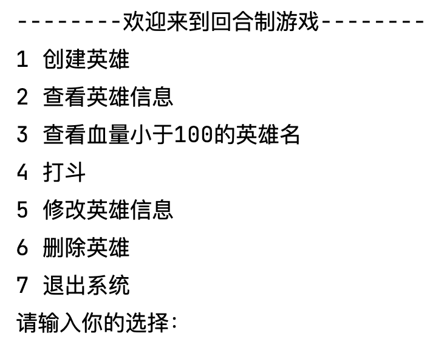
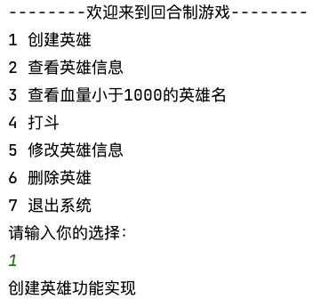
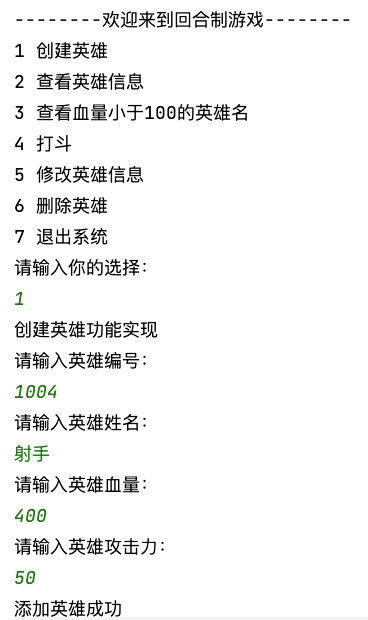
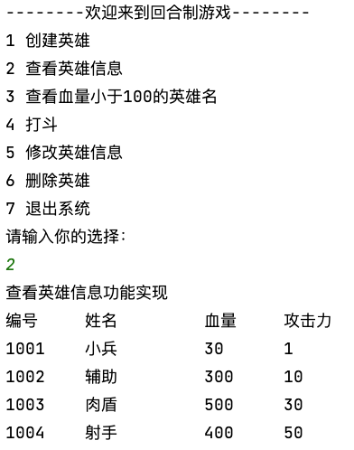
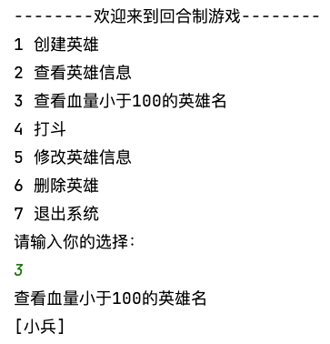
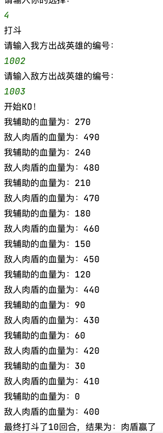
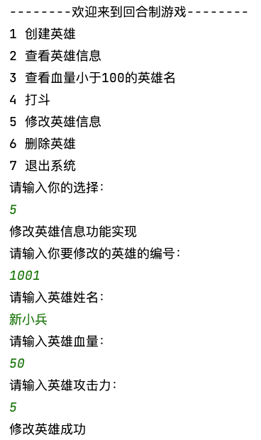
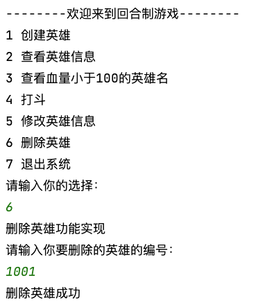
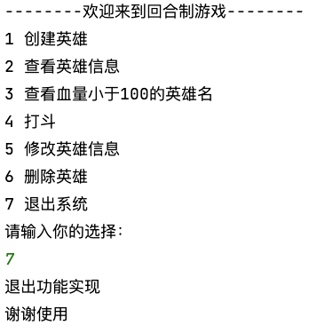

# 回合制游戏



## 案例需求

针对目前我们的所学内容，完成一个游戏案例：**回合制游戏**！

该系统主要功能如下：

    
1. **创建英雄**：当前游戏中，创建英雄角色，定义好对应英雄的血量及其攻击力。

2. **查看英雄信息**：查看当前游戏中所有的英雄信息。
    >查看英雄：将集合中的英雄对象信息进行展示。

3. **英雄姓名查看**：查看攻击力小于100的英雄姓名。
   
4. **修改英雄信息**：姓名或攻击力信息的变更。
    >修改英雄：通过键盘录入要修改英雄的编号，将该英雄对象其他信息进行修改。

5. **删除英雄**：英雄太弱，不需要，删除掉。
    >删除英雄：通过键盘录入要删除英雄的编号，将该英雄对象从集合中删除。

6. **退出系统**：结束程序。


## 实现步骤

### 1. 英雄实体类创建

定义**英雄实体类**，包含以下**成员变量**：

```java
//英雄编号
private String id;
//英雄姓名
private String name;
//血量
private int hp;
//攻击力
private int power;
//getter、setter、toString、constructor
```

### 2. 回合制游戏主界面搭建

#### 2.1 编写主界面


用输出语句完成主界面的编写。
>System.out.println();

```java
//用输出语句完成主界面的编写
System.out.println("--------欢迎来到回合制游戏--------");
System.out.println("1 创建英雄");
System.out.println("2 查看英雄信息");
System.out.println("3 查看血量小于1000的英雄名");
System.out.println("4 打斗");
System.out.println("5 修改英雄信息");
System.out.println("6 删除英雄");
System.out.println("7 退出系统");
System.out.println("请输入你的选择：");
```

#### 2.2 实现键盘输入



用Scanner实现键盘输入。

```java
//用Scanner实现键盘录入数据
Scanner sc = new Scanner(System.in);
String line = sc.nextLine();
```

#### 2.3 选择的功能实现

输入编号，则实现对应功能。


用switch语句完成选择的功能。

```java
//用switch语句完成操作的选择
switch (line) {
    case "1":
        System.out.println("创建英雄功能实现");
        break;
    case "2":
        System.out.println("查看英雄信息功能实现");
        break;
    case "3":
        System.out.println("查看血量小于1000的英雄名");
        break;
    case "4":
        System.out.println("打斗");
        break;
    case "5":
        System.out.println("修改英雄信息功能实现");
        break;
    case "6":
        System.out.println("删除英雄功能实现");
        break;
    case "7":
        System.out.println("退出功能实现");
        break;
}
```

#### 2.4 循环主界面功能

循环完成功能结束后再次回到主界面。

>此时，系统有一个缺点，就是只能做一次选择，如果想要在添加后再进行查看英雄信息，是无法实现。所以，为了可以多次选择并正确展示功能，使用循环。


```java
//用循环完成再次回到主界面
while (true) {
    //用输出语句完成主界面的编写
    System.out.println("--------欢迎来到回合制游戏--------");
    System.out.println("1 创建英雄");
    System.out.println("2 查看英雄信息");
    System.out.println("3 查看血量小于1000的英雄名");
    System.out.println("4 打斗");
    System.out.println("5 修改英雄信息");
    System.out.println("6 删除英雄");
    System.out.println("7 退出系统");
    System.out.println("请输入你的选择：");

    //用Scanner实现键盘录入数据
    Scanner sc = new Scanner(System.in);
    String line = sc.nextLine();

    //用switch语句完成操作的选择
    switch (line) {
        case "1":
            System.out.println("创建英雄功能实现");
            break;
        case "2":
            System.out.println("查看英雄信息功能实现");
            break;
        case "3":
            System.out.println("查看血量小于1000的英雄名");
            break;
        case "4":
            System.out.println("打斗");
            break;
        case "5":
            System.out.println("修改英雄信息功能实现");
            break;
        case "6":
            System.out.println("删除英雄功能实现");
            break;
        case "7":
            System.out.println("退出功能实现");
            break;
    }
}
```

### 3. 英雄功能实现

由于所有的英雄功能都要共同使用一个英雄集合，所以在While循环之前创建一个List集合。

```java
//多态  创建集合对象，用于保存英雄数据信息
List<Hero> heros = new ArrayList<>();
// 初始化英雄列表
heros.add(new Hero("1001","小兵",30,1));
heros.add(new Hero("1002","辅助",300,10));
heros.add(new Hero("1003","肉盾",500,30));
```

#### 1 英雄信息添加



1. `addHero(List<Hero> heros)`：定义一个添加的方法 addHero()，接收英雄的List集合。

2. 方法内完成添加英雄的功能：
   
   1. 键盘录入英雄信息。
   
   2. 根据录入的信息创建英雄对象。
   
   3. 将英雄对象添加到集合中。 
   
   4. 提示添加成功信息。 

3. 在switch()添加学生的选项内调用 addHero()。

```java
public static void addHero(List<Hero> heros){
    //键盘录入学生对象所需要的数据,显示提示信息，提示要输入何种信息
    Scanner sc = new Scanner(System.in);
    String id;
    while (true) {
        System.out.println("请输入英雄编号：");
        id = sc.nextLine();
        boolean flag = isUsed(heros, id);
        if (flag) {
            System.out.println("你输入的编号已经被占用，请重新输入");
        } else {
            break;
        }
    }
    System.out.println("请输入英雄姓名：");
    String name = sc.nextLine();
    System.out.println("请输入英雄血量：");
    int hp = sc.nextInt();
    System.out.println("请输入英雄攻击力：");
    int power = sc.nextInt();

    //创建英雄对象，把键盘录入的数据赋值给英雄对象的成员变量
    // Hero h = new Hero();
    // h.setId(id);
    // h.setName(name);
    // h.setHp(hp);
    // h.setPower(power);
    Hero h = new Hero(id,name,hp,power);

    //将英雄对象添加到集合中
    heros.add(h);
    //给出添加成功提示
    System.out.println("添加英雄成功");
}

//定义一个方法，判断学号是否被使用
private static boolean isUsed(List<Hero> array, String id) {
    //如果与集合中的某一个英雄编号相同，返回true;如果都不相同，返回false
    boolean flag = false;
    for (int i = 0; i < array.size(); i++) {
        Hero h = array.get(i);
        if (h.getId().equals(id)) {
            flag = true;
            break;
        }
    }
    return flag;
}
```


#### 2 英雄信息查看



英雄管理系统的查看英雄功能实现步骤：

1. `findAllHero(List<Student> heros)`：定义一个查看所有英雄的方法findAllHero()，接收英雄的List集合。

2. 方法内遍历集合，将英雄信息进行输出。

3. 在switch()查看英雄信息的选项内调用 findAllHero()。

```java
//定义一个方法，用于查看英雄信息
public static void findAllHero(List<Hero> heros) {
    //显示表头信息
    // \t其实是一个tab键的位置
    System.out.println("编号\t\t姓名\t\t\t血量\t\t攻击力");
    for (int i = 0; i < heros.size(); i++) {
        Hero h = heros.get(i);
        String name = h.getName();
        int nameLengh = name.length();
        if(nameLengh < 5){
            for (int j = 1; j < 5-nameLengh; j++) {
                name += " ";
            }

        }
        System.out.println(h.getId() + "\t" + name + "\t\t" + h.getHp() + "\t\t" + h.getPower());
    }

}
```

#### 3 查看血量小于100的英雄名



1. `findHpLessthan100(List<Student> heros)`：定义一个查看血量小于100的方法findHpLessthan100()，接收英雄的List集合。

2. 方法内遍历集合，将英雄的血量与100进行比较，如果小于则存入数组中。

3. 在switch()查看血量小于100的英雄名的选项内调用findHpLessthan100()。


```java
private static void findHpLessthan100(List<Hero> heros) {
    List<String> heroName = new ArrayList<>();
    for (int i = 0; i < heros.size(); i++) {
        Hero h = heros.get(i);
        int hp = h.getHp();
        if(hp < 100){
            heroName.add(h.getName());
        }
    }
    System.out.println(heroName);
}
```

#### 4 打斗



1. `findHpLessthan100(List<Student> heros)`：定义一个查看血量小于100的方法findHpLessthan100()，接收英雄的List集合。


2. 方法内完成添加英雄的功能：
   
   1. 键盘录入出战英雄的编号。
   
   2. 根据录入的信息创建英雄对象。
   
   3. 双方英雄对象开始打斗。 
   
   >英雄打斗后自己的血量 = 自己的血量 - 敌人的攻击力。<br>
   >敌人打斗后的血量 = 敌人的血量 - 自己的攻击力。<br>
   >最后谁的血量多谁就赢，如果血量相同则平局。<br>
   >双方中任意一方的血量低于或等于0时，打斗结束。

   4. 提示打斗信息。 
    >最终打斗了多少回合，结果为：那个英雄赢了。

```java
//打斗方法
public static String fight(List<Hero> heroes){
    Scanner sc = new Scanner(System.in);
    System.out.println("请输入我方出战英雄的编号：");
    String mId = sc.nextLine();

    System.out.println("请输入敌方出战英雄的编号：");
    String enemyId = sc.nextLine();

    //根据ID获取我方英雄对象
    Hero myHero = new Hero();
    for (int i = 0; i < heroes.size(); i++) {
        Hero h = heroes.get(i);
        if (h.getId().equals(mId)) {
            myHero = h;
            break;
        }
    }

    //根据ID获取敌方英雄对象
    Hero enemyHero = new Hero();
    for (int i = 0; i < heroes.size(); i++) {
        Hero h = heroes.get(i);
        if (h.getId().equals(enemyId)) {
            enemyHero = h;
            break;
        }
    }


    System.out.println("开始KO！");

    String result = "";
    //打斗了多少回合
    int i = 0;
    //打斗不是一次结束，是来回打好几轮 while循环
    while(true){
        i++;
        //英雄打斗后自己的血量 = 自己的血量 - 敌人的攻击力
        int myHp = myHero.getHp() - enemyHero.getPower();
        myHero.setHp(myHp);
        //敌人打斗后的血量 = 敌人的血量 - 自己的攻击力
        int enemyFinalHp = enemyHero.getHp() - myHero.getPower();
        enemyHero.setHp(enemyFinalHp);

        System.out.println("我" + myHero.getName() + "的血量为：" + myHero.getHp());
        System.out.println("敌人" + enemyHero.getName() + "的血量为：" + enemyHero.getHp());

        if(myHero.getHp() > enemyHero.getHp()){
            //我的血量多
            result = myHero.getName().concat( "赢了");
        } else if (myHero.getHp() < enemyHero.getHp()) {
            //我的血量少
            result = enemyHero.getName().concat( "赢了");
        } else {
            result = myHero.getName() + "与" + enemyHero.getName() + "平局";
        }
        //什么时候比赛结束？英雄、敌人双方血量谁先为0谁就输
        if(enemyHero.getHp() <= 0 | myHero.getHp() <= 0){
            break;
        }
    }
    System.out.println("最终打斗了" + i + "回合，结果为：" + result);
    return result;
}
```

#### 5 英雄信息修改



1. `updateHero(List<Hero> heros) `：定义一个英雄信息修改的方法updateHero()，接收英雄的List集合。

2. 方法中接收要修改英雄的编号。

3. 通过键盘录入英雄对象所需的信息，并创建Hero对象。

4. 遍历集合，获取每一个英雄对象，和录入的修改英雄编号进行比较。
    >如果相同，则使用新英雄对象替换当前英雄对象。

5. 在switch()英雄信息修改的选项内调用 updateHero()。

```java
//定义一个方法，用于修改英雄信息
public static void updateHero(List<Hero> heros) {
    //键盘录入要修改的英雄编号，显示提示信息
    Scanner sc = new Scanner(System.in);
    System.out.println("请输入你要修改的英雄的编号：");
    String id = sc.nextLine();
    //键盘录入要修改的英雄信息
    System.out.println("请输入英雄姓名：");
    String name = sc.nextLine();
    System.out.println("请输入英雄血量：");
    int hp = sc.nextInt();
    System.out.println("请输入英雄攻击力：");
    int power = sc.nextInt();
    //创建英雄对象
    Hero h = new Hero();
    h.setId(id);
    h.setName(name);
    h.setHp(hp);
    h.setPower(power);

    //遍历集合修改对应的学生信息
    for (int i = 0; i < heros.size(); i++) {
        Hero hero = heros.get(i);
        if (hero.getId().equals(id)) {
            heros.set(i, h);
        }
    }
    //给出修改成功提示
    System.out.println("修改英雄成功");
}
```

#### 6 英雄信息删除



1. `deleteHero(List<Hero> heros)`：定义一个英雄信息删除的方法deleteHero()，接收英雄的List集合。

2. 方法中接收要删除英雄的编号。
   
3. 遍历集合，获取每个英雄对象。

4. 使用英雄对象的编号和录入的要删除的编号进行比较。
   >如果相同，则将当前英雄对象从集合中删除。

5. 在switch()英雄信息删除的选项内调用 deleteHero()。

```java
//定义一个方法，用于删除英雄信息
public static void deleteHero(List<Hero> heros) {
    //键盘录入要删除的英雄编号,显示提示信息
    Scanner sc = new Scanner(System.in);
    System.out.println("请输入你要删除的英雄的编号：");
    String id = sc.nextLine();
    //在删除/修改英雄操作前，对学号是否存在进行判断
    //如果不存在，显示提示信息
    //如果存在，执行删除/修改操作
    int index = -1;
    for (int i = 0; i < heros.size(); i++) {
        Hero h = heros.get(i);
        if (h.getId().equals(id)) {
            index = i;
            break;
        }
    }
    if (index == -1) {
        System.out.println("该信息不存在，请重新输入");
    } else {
        heros.remove(index);
        //给出删除成功提示
        System.out.println("删除英雄成功");
    }
}
```

#### 7 退出系统



使用`System.exit(0);`退出JVM。

```java
System.out.println("谢谢使用");
System.exit(0); //JVM退出
```

## 实现代码

```java
public class HeroManager {
    public static void main(String[] args) {
        //创建集合对象，用于保存英雄数据信息
        //List<Hero> heros = new ArrayList<Hero>();
        // 初始化英雄列表
        //heros.add(new Hero("1001","辅助",300,10));
        //heros.add(new Hero("1002","肉盾",500,30));

        List<Hero> heros = new ArrayList<>(){{
            add(new Hero("1001","小兵",30,1));
            add(new Hero("1002","辅助",300,10));
            add(new Hero("1003","肉盾",500,30));
        }};

        //用循环完成再次回到主界面
        while (true) {
            //用输出语句完成主界面的编写
            System.out.println("--------欢迎来到回合制游戏--------");
            System.out.println("1 创建英雄");
            System.out.println("2 查看英雄信息");
            System.out.println("3 查看血量小于100的英雄名");
            System.out.println("4 打斗");
            System.out.println("5 修改英雄信息");
            System.out.println("6 删除英雄");
            System.out.println("7 退出系统");
            System.out.println("请输入你的选择：");

            //用Scanner实现键盘录入数据
            Scanner sc = new Scanner(System.in);
            String line = sc.nextLine();

            //用switch语句完成操作的选择
            switch (line) {
                case "1":
                    System.out.println("创建英雄功能实现");
                    addHero(heros);
                    break;
                case "2":
                    System.out.println("查看英雄信息功能实现");
                    findAllHero(heros);
                    break;
                case "3":
                    System.out.println("查看血量小于100的英雄名");
                    findHpLessthan100(heros);
                    break;
                case "4":
                    System.out.println("打斗");
                    fight(heros);
                    break;
                case "5":
                    System.out.println("修改英雄信息功能实现");
                    updateHero(heros);
                    break;
                case "6":
                    System.out.println("删除英雄功能实现");
                    deleteHero(heros);
                    break;
                case "7":
                    System.out.println("退出功能实现");
                    System.out.println("谢谢使用");
                    System.exit(0); //JVM退出
                    break;
            }
        }

    }
    private static void findHpLessthan100(List<Hero> heros) {
        List<String> heroName = new ArrayList<>();
        for (int i = 0; i < heros.size(); i++) {
            Hero h = heros.get(i);
            int hp = h.getHp();
            if(hp < 100){
                heroName.add(h.getName());
            }
        }
        System.out.println(heroName);
    }
    //打斗方法
    public static String fight(List<Hero> heroes){
        Scanner sc = new Scanner(System.in);
        System.out.println("请输入我方出战英雄的编号：");
        String mId = sc.nextLine();

        System.out.println("请输入敌方出战英雄的编号：");
        String enemyId = sc.nextLine();

        //根据ID获取我方英雄对象
        Hero myHero = new Hero();
        for (int i = 0; i < heroes.size(); i++) {
            Hero h = heroes.get(i);
            if (h.getId().equals(mId)) {
                myHero = h;
                break;
            }
        }

        //根据ID获取敌方英雄对象
        Hero enemyHero = new Hero();
        for (int i = 0; i < heroes.size(); i++) {
            Hero h = heroes.get(i);
            if (h.getId().equals(enemyId)) {
                enemyHero = h;
                break;
            }
        }


        System.out.println("开始KO！");

        String result = "";
        //打斗了多少回合
        int i = 0;
        //打斗不是一次结束，是来回打好几轮 while循环
        while(true){
            i++;
            //英雄打斗后自己的血量 = 自己的血量 - 敌人的攻击力
            int myHp = myHero.getHp() - enemyHero.getPower();
            myHero.setHp(myHp);
            //敌人打斗后的血量 = 敌人的血量 - 自己的攻击力
            int enemyFinalHp = enemyHero.getHp() - myHero.getPower();
            enemyHero.setHp(enemyFinalHp);

            System.out.println("我" + myHero.getName() + "的血量为：" + myHero.getHp());
            System.out.println("敌人" + enemyHero.getName() + "的血量为：" + enemyHero.getHp());

            if(myHero.getHp() > enemyHero.getHp()){
                //我的血量多
                result = myHero.getName().concat( "赢了");
            } else if (myHero.getHp() < enemyHero.getHp()) {
                //我的血量少
                result = enemyHero.getName().concat( "赢了");
            } else {
                result = myHero.getName() + "与" + enemyHero.getName() + "平局";
            }
            //什么时候比赛结束？英雄、敌人双方血量谁先为0谁就输
            if(enemyHero.getHp() <= 0 | myHero.getHp() <= 0){
                break;
            }
        }
        System.out.println("最终打斗了" + i + "回合，结果为：" + result);
        return result;
    }
    public static void addHero(List<Hero> heros){
        //键盘录入学生对象所需要的数据,显示提示信息，提示要输入何种信息
        Scanner sc = new Scanner(System.in);
        String id;
        while (true) {
            System.out.println("请输入英雄编号：");
            id = sc.nextLine();
            boolean flag = isUsed(heros, id);
            if (flag) {
                System.out.println("你输入的编号已经被占用，请重新输入");
            } else {
                break;
            }
        }
        System.out.println("请输入英雄姓名：");
        String name = sc.nextLine();
        System.out.println("请输入英雄血量：");
        int hp = sc.nextInt();
        System.out.println("请输入英雄攻击力：");
        int power = sc.nextInt();

        //创建英雄对象，把键盘录入的数据赋值给英雄对象的成员变量
        Hero h = new Hero();
        h.setId(id);
        h.setName(name);
        h.setHp(hp);
        h.setPower(power);

        System.out.println(heros);
        System.out.println(h);

        //将英雄对象添加到集合中
        heros.add(h);
        //给出添加成功提示
        System.out.println("添加英雄成功");

    }
    //定义一个方法，判断学号是否被使用
    private static boolean isUsed(List<Hero> array, String id) {
        //如果与集合中的某一个英雄编号相同，返回true;如果都不相同，返回false
        boolean flag = false;
        for (int i = 0; i < array.size(); i++) {
            Hero h = array.get(i);
            if (h.getId().equals(id)) {
                flag = true;
                break;
            }
        }
        return flag;
    }
    //定义一个方法，用于查看英雄信息
    public static void findAllHero(List<Hero> heros) {
        //显示表头信息
        // \t其实是一个tab键的位置
        System.out.println("编号\t\t姓名\t\t\t血量\t\t攻击力");
        for (int i = 0; i < heros.size(); i++) {
            Hero h = heros.get(i);
            String name = h.getName();
            int nameLengh = name.length();
            if(nameLengh < 5){
                for (int j = 1; j < 5-nameLengh; j++) {
                    name += " ";
                }

            }
            System.out.println(h.getId() + "\t" + name + "\t\t" + h.getHp() + "\t\t" + h.getPower());
        }

    }
    //定义一个方法，用于修改英雄信息
    public static void updateHero(List<Hero> heros) {
        //键盘录入要修改的英雄编号，显示提示信息
        Scanner sc = new Scanner(System.in);
        System.out.println("请输入你要修改的英雄的编号：");
        String id = sc.nextLine();
        //键盘录入要修改的英雄信息
        System.out.println("请输入英雄姓名：");
        String name = sc.nextLine();
        System.out.println("请输入英雄血量：");
        int hp = sc.nextInt();
        System.out.println("请输入英雄攻击力：");
        int power = sc.nextInt();
        //创建英雄对象
        Hero h = new Hero();
        h.setId(id);
        h.setName(name);
        h.setHp(hp);
        h.setPower(power);

        //遍历集合修改对应的学生信息
        for (int i = 0; i < heros.size(); i++) {
            Hero hero = heros.get(i);
            if (hero.getId().equals(id)) {
                heros.set(i, h);
            }
        }
        //给出修改成功提示
        System.out.println("修改英雄成功");
    }
    //定义一个方法，用于删除英雄信息
    public static void deleteHero(List<Hero> heros) {
        //键盘录入要删除的英雄编号,显示提示信息
        Scanner sc = new Scanner(System.in);
        System.out.println("请输入你要删除的英雄的编号：");
        String id = sc.nextLine();
        //在删除/修改英雄操作前，对学号是否存在进行判断
        //如果不存在，显示提示信息
        //如果存在，执行删除/修改操作
        int index = -1;
        for (int i = 0; i < heros.size(); i++) {
            Hero h = heros.get(i);
            if (h.getId().equals(id)) {
                index = i;
                break;
            }
        }
        if (index == -1) {
            System.out.println("该信息不存在，请重新输入");
        } else {
            heros.remove(index);
            //给出删除成功提示
            System.out.println("删除英雄成功");
        }
    }
}
```

[整体实现业务逻辑代码](code/javase11/src/top/testeru/system/HeroManager.java)

## 涉及到知识点

|知识点|说明|
|---|---|
|while循环|避免死循环|
|switch..case|case要有break|
|break关键字|跳出关键字|
|for循环|确定好循环次数|
|Scanner键盘录入|注意输入类型|
|List集合|get()、set()、remove()、size()|
|String|创建、拼接、比较|

## 优化

### Stream流

#### 添加英雄

添加英雄 - 判断编号是否被使用替换。

```java
private static boolean isUsed(List<Hero> array, String id) {
    //如果与集合中的某一个英雄编号相同，返回true;如果都不相同，返回false
    boolean flag = array
            .stream() // 创建 Stream
            .map(Hero::getId) // 提取英雄id
            .anyMatch(id::equals);
    return flag;
}
```

#### 查看英雄信息

- String.format()：格式化字符串。

```java
String formattedString = String.format(format, args);
```

>format是格式化字符串，用于描述字符串的格式；<br>args是格式化参数，用于替换格式化字符串中的占位符。<br>格式化字符串中的占位符以%符号开始，其后紧跟格式化说明符，用于指定要输出的类型和格式。

常用的格式化说明符：

- %s：字符串类型。
- %d：整数类型。
- %f：浮点数类型。
- %b：布尔类型。
- %c：字符类型。
- %t：日期/时间类型。


```java
//定义一个方法，用于查看英雄信息
public static void findAllHero(List<Hero> heros) {
    //显示表头信息
    // \t其实是一个tab键的位置
    System.out.println("编号\t\t姓名\t\t血量\t\t攻击力");
    heros.stream().forEach(
            hero ->
                    System.out.println(
                            String.format(
                                    "%s\t%s\t\t%s\t\t%s",
                                    hero.getId(),
                                    hero.getName(),
                                    hero.getHp(),
                                    hero.getPower()
                            )
                    )
    );
}
```

#### 查看血量小于100的英雄名

```java
// 使用 Stream 进行英雄数据处理
List<String> names = heros
                    .stream() // 创建 Stream
                    .filter(hero -> hero.getHp() < 100) // 过滤血量小于100 的英雄
                    .sorted((h1, h2) -> Integer.compare(h2.getPower(), h1.getPower())) // 按攻击力降序排序
                    .map(Hero::getName) // 提取英雄姓名
                    .collect(Collectors.toList());// 转换为 List
System.out.println(names);
```

##### filter()
Stream 类中的 .filter() 方法用于对流中的元素进行筛选，返回满足条件的元素组成的新流。

该方法接受一个 `Predicate<T>` 参数，其中 T 表示流中元素的类型，用于定义筛选条件。

##### sorted()
Stream 类中的 sorted() 方法用于对流中的元素进行排序。该方法有两种重载形式：

`.sorted()`: 该形式使用自然排序（natural ordering），即对流中的元素进行升序排序。要求流中的元素类型实现了 Comparable 接口，或者是基本数据类型（例如 int、double 等）。

`.sorted(Comparator<T> comparator)`: 该形式接受一个自定义的比较器（Comparator）作为参数，用于对流中的元素进行排序。通过自定义比较器，可以实现按照不同的属性或规则对元素进行排序。

#### 打斗

```java
//打斗方法
public static String fight(List<Hero> heroes){
    Scanner sc = new Scanner(System.in);
    System.out.println("请输入我方出战英雄的编号：");
    String mId = sc.nextLine();

    System.out.println("请输入敌方出战英雄的编号：");
    String enemyId = sc.nextLine();

    //根据ID获取我方英雄对象
    Hero myHero = heroes
            .stream() // 创建 Stream
            .filter(hero -> hero.getId().equals(mId))
            .findFirst()
            .get();
    //根据ID获取敌方英雄对象
    Hero enemyHero = heroes
            .stream() // 创建 Stream
            .filter(hero -> hero.getId().equals(enemyId))
            .findFirst()
            .get();

    System.out.println("开始KO！");

    String result = "";
    //打斗了多少回合
    int i = 0;
    //打斗不是一次结束，是来回打好几轮 while循环
    while(true){
        i++;
        //英雄打斗后自己的血量 = 自己的血量 - 敌人的攻击力
        int myHp = myHero.getHp() - enemyHero.getPower();
        myHero.setHp(myHp);
        //敌人打斗后的血量 = 敌人的血量 - 自己的攻击力
        int enemyFinalHp = enemyHero.getHp() - myHero.getPower();
        enemyHero.setHp(enemyFinalHp);

        System.out.println("我" + myHero.getName() + "的血量为：" + myHero.getHp());
        System.out.println("敌人" + enemyHero.getName() + "的血量为：" + enemyHero.getHp());


        //什么时候比赛结束？英雄、敌人双方血量谁先为0谁就输
        if(enemyHero.getHp() <= 0 | myHero.getHp() <= 0){
            break;
        }
    }
    if(myHero.getHp() > enemyHero.getHp()){
        //我的血量多
        result = myHero.getName().concat( "赢了");
    } else if (myHero.getHp() < enemyHero.getHp()) {
        //我的血量少
        result = enemyHero.getName().concat( "赢了");
    } else {
        result = myHero.getName() + "与" + enemyHero.getName() + "平局";
    }
    System.out.println("最终打斗了" + i + "回合，结果为：" + result);
    return result;
}

```


#### 英雄信息修改

```java
//定义一个方法，用于修改英雄信息
public static void updateHero(List<Hero> heros) {
    //键盘录入要修改的英雄编号，显示提示信息
    Scanner sc = new Scanner(System.in);
    System.out.println("请输入你要修改的英雄的编号：");
    String id = sc.nextLine();
    //键盘录入要修改的英雄信息
    System.out.println("请输入英雄姓名：");
    String name = sc.nextLine();
    System.out.println("请输入英雄血量：");
    int hp = sc.nextInt();
    System.out.println("请输入英雄攻击力：");
    int power = sc.nextInt();

    heros
        .stream()
        .forEach(hero -> {
            if(hero.getId().equals(id)){
                hero.setId(id);
                hero.setName(name);
                hero.setHp(hp);
                hero.setPower(power);
            }
        });
    //给出修改成功提示
    System.out.println("修改英雄成功");
}
```

#### 英雄信息写入文件
```java
public static void findAllHero(List<Hero> heros) {
    String fileName = "hero.txt";
    File file = new File(fileName);
    if (file.exists()) {
        if (file.delete()) {
            System.out.println("文件删除成功.");
        } else {
            System.out.println("文件删除失败.");
        }
    } else {
        System.out.println("文件不存在.");
    }


    //显示表头信息
    // \t其实是一个tab键的位置
    String tab = "编号\t\t姓名\t\t\t血量\t\t攻击力\n";
    try {
        FileWriter fileWriter = new FileWriter(fileName);
        BufferedWriter bufferedWriter = new BufferedWriter(fileWriter);
        System.out.println(tab);
        bufferedWriter.write(tab);
        heros
            .stream()
            .forEach(
                hero ->{
                    String format = String.format(
                            "%s\t%s\t\t\t%s\t\t%s\n",
                            hero.getId(),
                            hero.getName(),
                            hero.getHp(),
                            hero.getPower()
                    );
                    try {
                        bufferedWriter.write(format);
                    } catch (IOException e) {
                        throw new RuntimeException(e);
                    }
                    System.out.print(format);
                }
            );
        bufferedWriter.close();

        System.out.println("写入文件.");
    } catch (IOException e) {
        e.printStackTrace();
    }
}
```


