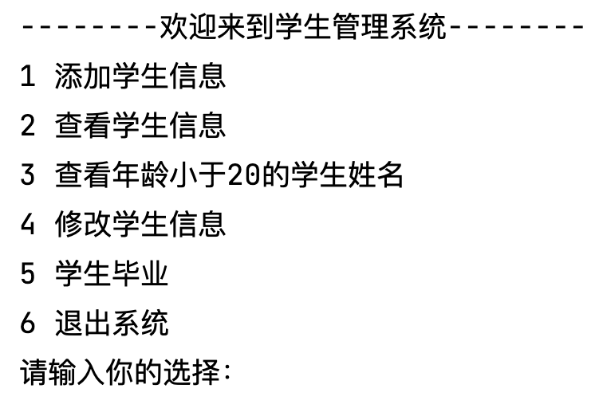
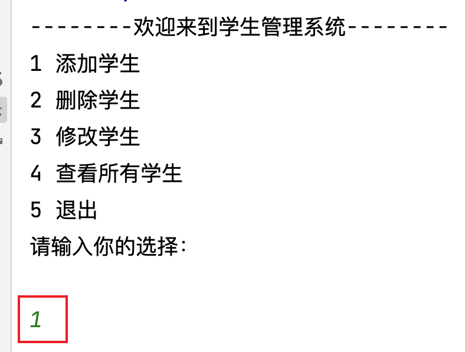
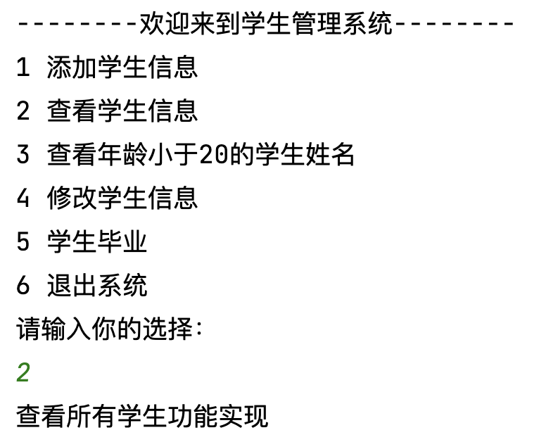
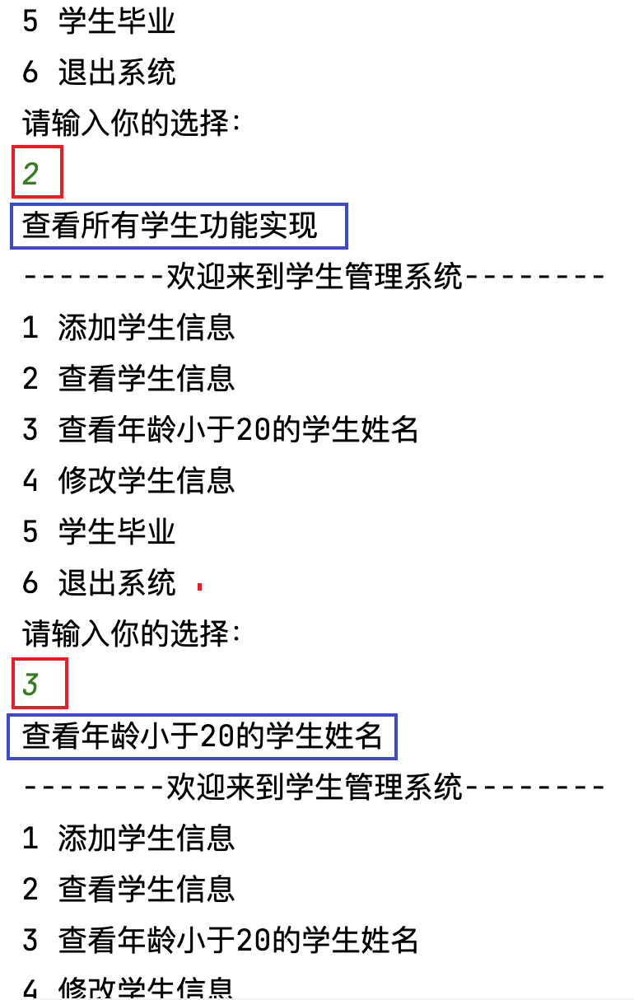
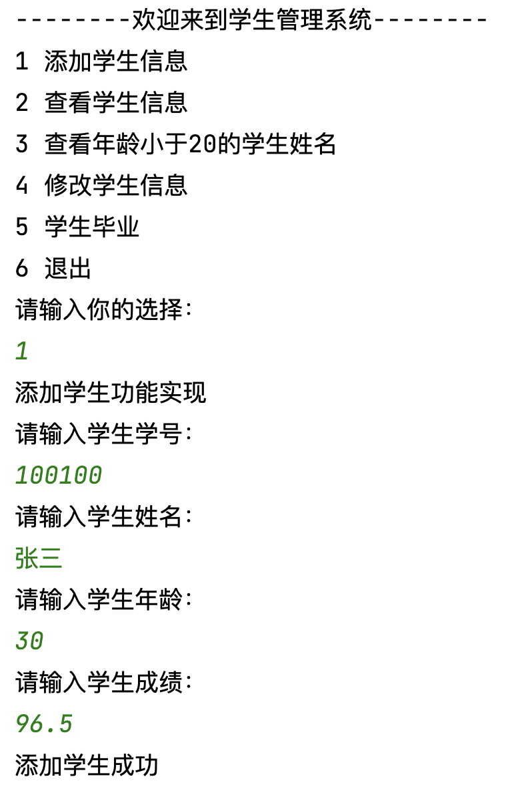
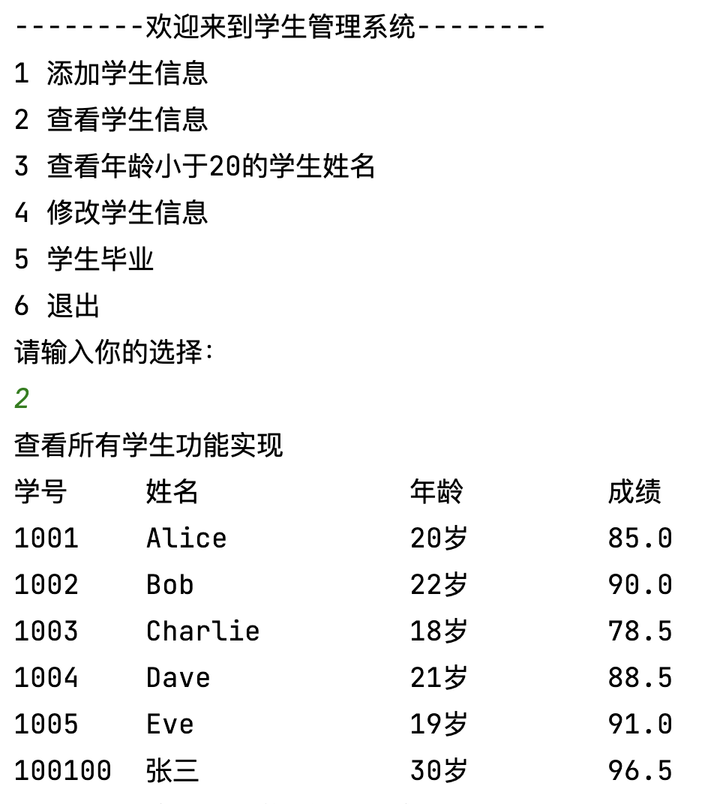
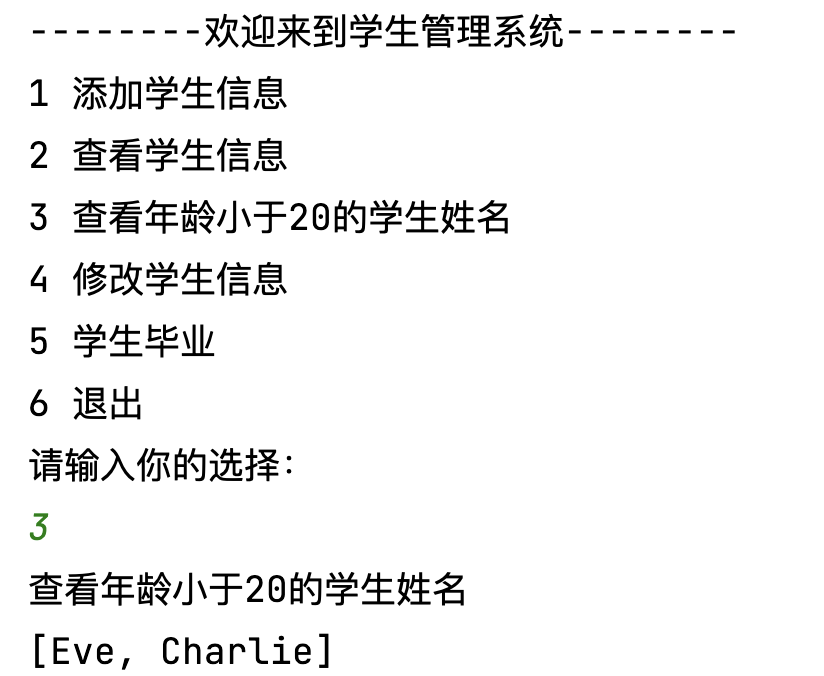
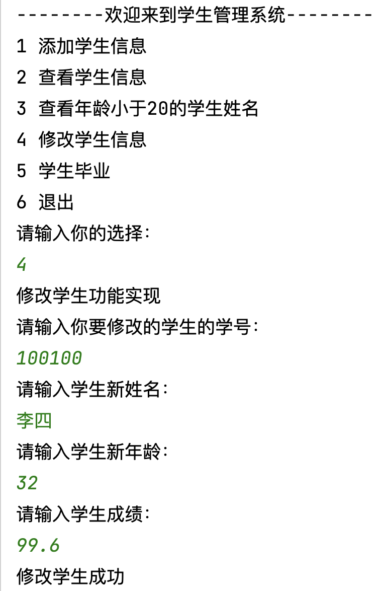
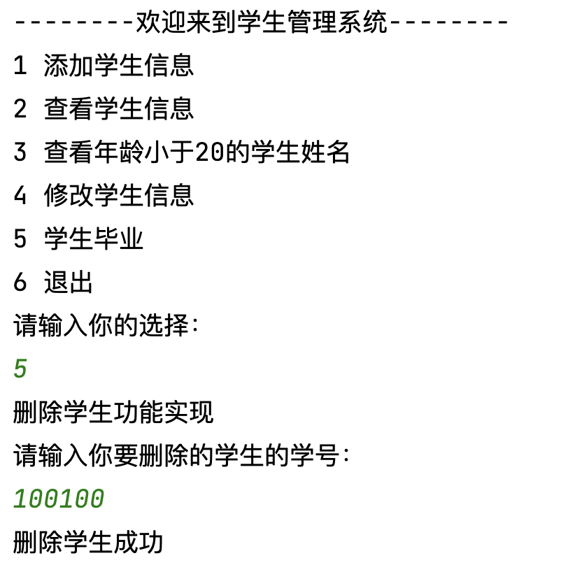

# 学生管理系统

## 案例需求

针对目前我们的所学内容，完成一个综合案例：**学生管理系统**！

该系统主要功能如下：




1. **添加学生信息**：当有新同学入学时，系统可以录入学生信息。
    
    >添加学生：通过键盘录入学生信息「比如：姓名、性别、出生日期、联系电话、地址信息等等」，添加到集合中。

1. **查看学生信息**：查看当前所有的学生信息。
    >查看学生：将集合中的学生对象信息进行展示。

1. **学生姓名查看**：查看年龄小于20的学生姓名。
   
1. **修改学生信息**：联系电话或地址信息的变更。
    >修改学生：通过键盘录入要修改学生的学号，将该学生对象其他信息进行修改。

1. **学生毕业**：最后学生通过结课考试顺利毕业。
    >删除学生：通过键盘录入要删除学生的学号，将该学生对象从集合中删除。

1. **退出系统**：结束程序。


## 实现步骤

### 1. 学生实体类创建

定义**学生类**，包含以下**成员变量**：

```java
// 学生id
private String sid;
// 学生姓名
private String name;
// 学生年龄
private int age;
// 学生成绩
private double score;

//getter、setter、toString、constructor
```

### 2. 学生管理系统主界面搭建

#### 2.1 编写主界面


用输出语句完成主界面的编写。
>System.out.println();

```java
//用输出语句完成主界面的编写
System.out.println("--------欢迎来到学生管理系统--------");
System.out.println("1 添加学生信息");
System.out.println("2 查看学生信息");
System.out.println("3 查看年龄小于20的学生姓名");
System.out.println("4 修改学生信息");
System.out.println("5 学生毕业");
System.out.println("6 退出系统");
System.out.println("请输入你的选择：");
```

#### 2.2 实现键盘输入



用Scanner实现键盘输入。

```java
//用Scanner实现键盘录入数据
Scanner sc = new Scanner(System.in);
String line = sc.nextLine();
```

#### 2.3 选择的功能实现

输入编号，则实现对应功能。比如：选择1，则实现添加学生功能。



用switch语句完成选择的功能。

```java
//用switch语句完成操作的选择
switch (line) {
    case "1":
        System.out.println("添加学生功能实现");
        break;
    case "2":
        System.out.println("查看所有学生功能实现");
        break;
    case "3":
        System.out.println("查看年龄小于20的学生姓名");
        break;
    case "4":
        System.out.println("修改学生功能实现");
        break;
    case "5":
        System.out.println("删除学生功能实现");
        break;
    case "6":
        System.out.println("退出功能实现");
        break;
}
```

#### 2.4 循环主界面功能

循环完成功能结束后再次回到主界面。

>此时，系统有一个缺点，就是只能做一次选择，如果想要在添加后再进行查看学生信息，是无法实现。所以，为了可以多次选择并正确展示功能，使用循环。





```java
//用循环完成再次回到主界面
while (true) {
    //用输出语句完成主界面的编写
    System.out.println("--------欢迎来到学生管理系统--------");
    System.out.println("1 添加学生信息");
    System.out.println("2 查看学生信息");
    System.out.println("3 查看年龄小于20的学生姓名");
    System.out.println("4 修改学生信息");
    System.out.println("5 学生毕业");
    System.out.println("6 退出系统");
    System.out.println("请输入你的选择：");
    //用Scanner实现键盘录入数据
    Scanner sc = new Scanner(System.in);
    String line = sc.nextLine();
    //用switch语句完成操作的选择
    switch (line) {
        case "1":
            System.out.println("添加学生功能实现");
            break;
        case "2":
            System.out.println("查看所有学生功能实现");
            break;
        case "3":
            System.out.println("查看年龄小于20的学生姓名");
            break;
        case "4":
            System.out.println("修改学生功能实现");
            break;
        case "5":
            System.out.println("删除学生功能实现");
            break;
        case "6":
            System.out.println("退出功能实现");
            break;
    }
}
```


### 3. 学生功能实现

由于所有的学生功能都要共同使用一个学生集合，所以在While循环之前创建一个List集合。

```java
//创建集合对象，用于保存学生数据信息
List<Student> students = new ArrayList<Student>();
// 初始化学生列表
students.add(new Student("1001","Alice", 20, 85.0));
students.add(new Student("1002","Bob", 22, 90.0));
students.add(new Student("1003","Charlie", 18, 78.5));
students.add(new Student("1004","Dave", 21, 88.5));
students.add(new Student("1005","Eve", 19, 91.0));
```

#### 1 学生信息添加



1. `addStudent(List<Student> array)`：定义一个添加的方法addStudent()，接收学生的List集合。

2. 方法内完成添加学生的功能：
   
   1. 键盘录入学生信息。
   
   2. 根据录入的信息创建学生对象。
   
   3. 将学生对象添加到集合中。 
   
   4. 提示添加成功信息。 

3. 在switch()添加学生的选项内调用addStudent()。

```java
//定义一个方法，用于添加学生信息
public static void addStudent(List<Student> array) {
    //键盘录入学生对象所需要的数据,显示提示信息，提示要输入何种信息
    Scanner sc = new Scanner(System.in);
    String sid;
    while (true) {
        System.out.println("请输入学生学号：");
        sid = sc.nextLine();
        boolean flag = isUsed(array, sid);
        if (flag) {
            System.out.println("你输入的学号已经被占用，请重新输入");
        } else {
            break;
        }
    }
    System.out.println("请输入学生姓名：");
    String name = sc.nextLine();
    System.out.println("请输入学生年龄：");
    int age = sc.nextInt();
    System.out.println("请输入学生成绩：");
    double score = sc.nextDouble();

    //创建学生对象，把键盘录入的数据赋值给学生对象的成员变量
    Student s = new Student();
    s.setSid(sid);
    s.setName(name);
    s.setAge(age);
    s.setScore(score);
    //将学生对象添加到集合中
    array.add(s);
    //给出添加成功提示
    System.out.println("添加学生成功");
    }

//定义一个方法，判断学号是否被使用
private static boolean isUsed(List<Student> array, String sid) {
    //如果与集合中的某一个学生学号相同，返回true;如果都不相同，返回false
        boolean flag = false;
    for (int i = 0; i < array.size(); i++) {
        Student s = array.get(i);
        if (s.getSid().equals(sid)) {
            flag = true;
            break;
        }
    }
    return flag;
}

```


#### 2 学生信息查看



学生管理系统的查看学生功能实现步骤：

1. `findAllStudent(List<Student> array)`：定义一个查看所有学生的方法findAllStudent()，接收学生的List集合。

2. 方法内遍历集合，将学生信息进行输出。

3. 在switch()查看所有学生的选项内调用findAllStudent()。

```java
//定义一个方法，用于查看学生信息
public static void findAllStudent(List<Student> array) {
    //显示表头信息
    // \t其实是一个tab键的位置
    System.out.println("学号\t\t姓名\t\t\t\t年龄\t\t\t成绩");
    //将集合中数据取出按照对应格式显示学生信息，年龄显示补充“岁”
    for (int i = 0; i < array.size(); i++) {
        Student s = array.get(i);
        String name = s.getName();
        int nameLengh = name.length();
        if(nameLengh < 10){
            for (int j = 1; j < 10-nameLengh; j++) {
                name += " ";
            }

        }
        System.out.println(s.getSid() + "\t" + name + "\t\t" + s.getAge() + "岁\t\t" + s.getScore());
    }
}
```


#### 3 查看年龄小于20的学生姓名



```java
// 使用 Stream 进行学生数据处理
List<String> names = students
    .stream() // 创建 Stream
    .filter(s -> s.getAge() < 20) // 过滤年龄小于 20 的学生
    .sorted((s1, s2) -> Double.compare(s2.getScore(), s1.getScore())) // 按分数降序排序
    //"map"是其中一种操作，它接受一个函数作为参数，并将该函数应用于流中的每个元素，返回一个新的流，其中每个元素都是原始流元素应用函数后的结果。
    .map(Student::getName) // 提取学生姓名
    // 调用collect方法后，新的流将被转换为一个字符串列表。
    .collect(Collectors.toList()); // 转换为 List
    
System.out.println(names);
```

##### filter()
Stream 类中的 .filter() 方法用于对流中的元素进行筛选，返回满足条件的元素组成的新流。

该方法接受一个 `Predicate<T>` 参数，其中 T 表示流中元素的类型，用于定义筛选条件。

##### sorted()
Stream 类中的 sorted() 方法用于对流中的元素进行排序。该方法有两种重载形式：

`.sorted()`: 该形式使用自然排序（natural ordering），即对流中的元素进行升序排序。要求流中的元素类型实现了 Comparable 接口，或者是基本数据类型（例如 int、double 等）。

`.sorted(Comparator<T> comparator)`: 该形式接受一个自定义的比较器（Comparator）作为参数，用于对流中的元素进行排序。通过自定义比较器，可以实现按照不同的属性或规则对元素进行排序。

#### 学生信息修改



1. `updateStudent(List<Student> array)`：定义一个学生信息修改的方法updateStudent()，接收学生的List集合。

2. 方法中接收要修改学生的学号。

3. 通过键盘录入学生对象所需的信息，并创建Student对象。

4. 遍历集合，获取每一个学生对象，和录入的修改学生学号进行比较。
    >如果相同，则使用新学生对象替换当前学生对象。

5. 在switch()学生信息修改的选项内调用updateStudent()。

```java
//定义一个方法，用于修改学生信息
public static void updateStudent(List<Student> array) {
    //键盘录入要修改的学生学号，显示提示信息
    Scanner sc = new Scanner(System.in);
    System.out.println("请输入你要修改的学生的学号：");
    String sid = sc.nextLine();
    //键盘录入要修改的学生信息
    System.out.println("请输入学生新姓名：");
    String name = sc.nextLine();
    System.out.println("请输入学生新年龄：");
    int age = sc.nextInt();
    System.out.println("请输入学生成绩：");
    double score = sc.nextDouble();
    //创建学生对象
    Student s = new Student();
    s.setSid(sid);
    s.setName(name);
    s.setAge(age);
    s.setScore(score);
    //遍历集合修改对应的学生信息
    for (int i = 0; i < array.size(); i++) {
        Student student = array.get(i);
        if (student.getSid().equals(sid)) {
            array.set(i, s);
        }
    }
    //给出修改成功提示
    System.out.println("修改学生成功");
}
```

#### 学生信息删除



1. `deleteStudent(List<Student> array)`：定义一个学生信息删除的方法deleteStudent()，接收学生的List集合。

2. 方法中接收要删除学生的学号。
   
3. 遍历集合，获取每个学生对象。

4. 使用学生对象的学号和录入的要删除的学号进行比较。
   >如果相同，则将当前学生对象从集合中删除。

5. 在switch()学生信息删除的选项内调用deleteStudent()。

```java
//定义一个方法，用于删除学生信息
public static void deleteStudent(List<Student> array) {
    //键盘录入要删除的学生学号,显示提示信息
    Scanner sc = new Scanner(System.in);
    System.out.println("请输入你要删除的学生的学号：");
    String sid = sc.nextLine();
    //在删除/修改学生操作前，对学号是否存在进行判断
    //如果不存在，显示提示信息
    //如果存在，执行删除/修改操作
    int index = -1;
    for (int i = 0; i < array.size(); i++) {
        Student s = array.get(i);
        if (s.getSid().equals(sid)) {
            index = i;
            break;
        }
    }
    if (index == -1) {
        System.out.println("该信息不存在，请重新输入");
    } else {
        array.remove(index);
        //给出删除成功提示
        System.out.println("删除学生成功");
    }
}
``` 

#### 退出系统

使用System.exit(0);
退出JVM。

```java
System.out.println("谢谢使用");
System.exit(0); //JVM退出
```

## 实现代码

[整体实现业务逻辑代码](code/javase11/src/top/testeru/system/StudentManager.java)


## 涉及到知识点

|知识点|说明|
|---|---|
|while循环|避免死循环|
|switch..case|case要有break|
|break关键字|跳出关键字|
|for循环|确定好循环次数|
|Scanner键盘录入|注意输入类型|
|List集合|get()、set()、remove()、size()|
|String|创建、拼接、比较|