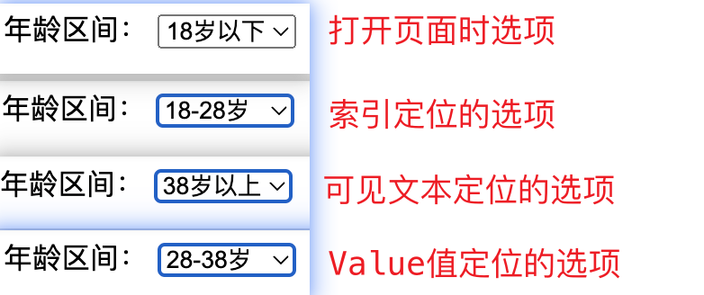

# 高级控件交互方法

Selenium是一款自动化测试工具，它可以模拟用户在浏览器上的行为，例如点击、输入、选择等。在Selenium中，有许多高级控件，如**下拉菜单**、**弹出框**、**日期选择器**等，这些控件的交互方法与普通控件略有不同。

## 下拉列表-Select

下拉列表是Web应用程序中常见的控件之一。在Selenium中，Select类用于与下拉列表交互。下拉列表（也称为选择框）是一种常见的HTML控件，通常用于**从一组选项中选择一个选项**。


导包：org.openqa.selenium.support.ui.Select。


### 常用方法

|方法|说明|
|---|---|
|selectByIndex(int index)|选择指定索引的选项，下标从0开始|
|selectByVisibleText(String text)|通过可见文本选择选项|
|selectByValue(String value)|通过值选择选项|
|deselectByIndex(int index)|取消选择指定索引的选项|
|deselectByVisibleText(String text)|取消选择指定可见文本的选项|
|deselectByValue(String value)|取消选择指定值的选项|
|deselectAll()|取消选择所有选项|

只有当下拉列表允许多个选项选择时，取消的方法才能生效使用。

### 选中选项



步骤：

1. 创建WebDriver实例。
   
2. 导航到具体页面。

3. 定位页面下拉列表元素。

4. 创建Select对象。

5. 通过 **索引**、**可见文本**、**Value值** 选择选项。

6. 进行后续操作。

7. 退出浏览器。


#### 单选项的页面准备

给定一个html页面，在页面内有对应的一个年龄区间的选择，选择的标签是select标签。

```html
<!DOCTYPE html>
<html lang="en">
<head>
    <meta charset="UTF-8">
    <title>Select</title>
</head>
<body>
    <form>
        年龄区间：
        <select name="selectList">
            <option value="underage">18岁以下</option>
            <option value="teens">18-28岁</option>
            <option value="youth">28-38岁</option>
            <option value="more">38岁以上</option>
        </select>
    </form>
</body>
</html>
```

#### 索引选择

```java
WebElement seleEle = webDriver.findElement(By.name("selectList"));
//必须是select标签
Select select = new Select(seleEle);
//索引定位
select.selectByIndex(1);
```


#### 可见文本

```java
WebElement seleEle = webDriver.findElement(By.name("selectList"));
//必须是select标签
Select select = new Select(seleEle);
//可见文本
select.selectByVisibleText("38岁以上");
```

#### Value值

```java
WebElement seleEle = webDriver.findElement(By.name("selectList"));
//必须是select标签
Select select = new Select(seleEle);
//Value值
select.selectByValue("youth");
```

### 取消选中选项

注意⚠️：

取消选中的选项的前提是当前Select标签可以多选，如果只是可以单选，则无法进行取消操作。

演示的结果如图：


步骤：

1. 创建WebDriver实例。
   
2. 导航到具体页面。

3. 定位页面下拉列表元素。

4. 创建Select对象。

5. 通过 **索引**、**可见文本**、**Value值** 选择多个选项。

6. 通过 **索引**、**可见文本**、**Value值** 取消选择的选项。

7. 进行后续操作。

8. 退出浏览器。


#### 多选项的页面准备

select标签上添加 multiple="multiple" 表示可以选择多个选项。

```html
<!DOCTYPE html>
<html lang="en">
<head>
    <meta charset="UTF-8">
    <title>Select</title>
</head>
<body>
    <form>
        年龄区间：
        <select name="selectList" multiple="multiple">
            <option value="underage">18岁以下</option>
            <option value="teens">18-28岁</option>
            <option value="youth">28-38岁</option>
            <option value="more">38岁以上</option>
        </select>
    </form>
</body>
</html>
```

#### 索引取消

```java
WebElement seleEle = webDriver.findElement(By.name("selectList"));
//必须是select标签
Select select = new Select(seleEle);
//索引定位
select.selectByIndex(1);
select.selectByIndex(3);
sleep(3000);

select.deselectByIndex(1);
sleep(3000);
```


#### 可见文本取消

哪怕已经被选中的选项，在使用可见文本选中不会取消。

```java
WebElement seleEle = webDriver.findElement(By.name("selectList"));
//必须是select标签
Select select = new Select(seleEle);
//可见文本
select.selectByVisibleText("18岁以下");
select.selectByVisibleText("38岁以上");
sleep(3000);
//取消
select.deselectByVisibleText("38岁以上");
sleep(3000);
```

#### Value值

```java
WebElement seleEle = webDriver.findElement(By.name("selectList"));
//必须是select标签
Select select = new Select(seleEle);
//Value值
select.selectByValue("youth");
select.selectByValue("teens");
sleep(3000);

select.deselectByValue("youth");
sleep(3000);
```

#### 全部取消

把当前选中的所有选项都取消掉。

```java
select.deselectAll();
```
### 实战练习

网址：https://sahitest.com/demo/selectTest.htm

```java

```