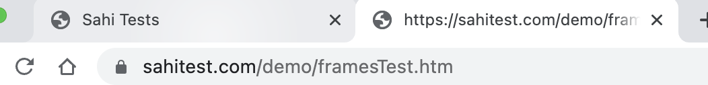
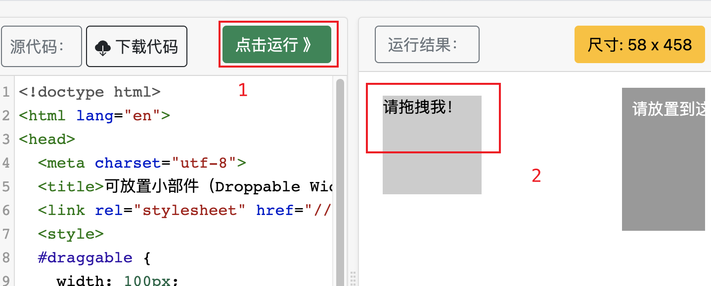

# 多窗口多frame处理

## 场景

多窗口多 frame 的 UI 自动化测试场景很多，下面是一些常见的场景：

### 多窗口的登录流程

登录页面在一个窗口，登录成功后，跳转到新窗口，需要在新窗口中继续测试流程。

### 多 frame 的表单填写

表单中包含多个 frame，需要在不同的 frame 中填写不同的信息。

### 多窗口的广告测试

广告在一个窗口，需要在新窗口中测试广告链接。

### 多 frame 的数据展示

数据展示在多个 frame 中，需要在不同的 frame 中获取数据进行比较。

以上场景只是其中的一部分，实际应用中还有很多其他场景。无论是多窗口还是多 frame，都需要了解如何处理多个窗口或 frame，以及如何在不同的窗口或 frame 中查找元素。同时，需要注意在切换窗口或 frame 时，页面元素的定位可能会发生变化，需要重新查找元素。


## 多窗口切换

### 1. 获取当前窗口句柄

使用 driver.getWindowHandle() 方法获取当前窗口句柄，保存到变量中备用。

```java
//获取当前窗口句柄
String originalWindow = webDriver.getWindowHandle();
```

### 2. 进行业务操作打开新的窗口

### 3. 获取所有窗口句柄

使用 driver.getWindowHandles() 方法获取所有窗口句柄，保存到 Set 集合中备用。

```java
//获取所有窗口句柄
Set<String> allWindows = webDriver.getWindowHandles();
```

### 4. 切换到新窗口

遍历所有窗口句柄，判断是否为当前窗口句柄，如果不是，则切换到该窗口。

```java
// 切换到新窗口
for (String windowHandle : allWindows) {
    if (!windowHandle.equals(originalWindow)) {
        webDriver.switchTo().window(windowHandle);
        break;
    }
}
```

### 5. 切换回主窗口

关闭新窗口并切换回主窗口。

```java
// 切换回默认内容
webDriver.switchTo().window(originalWindow);
```

### 实战案例


测试页面：https://www.baidu.com




```java
@Test
public void moreHandle() throws InterruptedException {
    List<Executable> executableList = new ArrayList<>();

    String url = "https://sahitest.com/demo/";
    webDriver.get(url);
    sleep(3000);
    //获取当前窗口句柄
    String originalWindow = webDriver.getWindowHandle();
    sleep(3000);
    webDriver.findElement(By.linkText("Window Open Test")).click();
    //获取所有窗口句柄
    Set<String> allWindows = webDriver.getWindowHandles();
    sleep(3000);
    System.out.println("标题1:"+webDriver.getTitle());

    // 切换到新窗口
    for (String windowHandle : allWindows) {
        if (!windowHandle.equals(originalWindow)) {
            webDriver.switchTo().window(windowHandle);
            break;
        }
    }

    String title = webDriver.getTitle();
    System.out.println("标题2:" + title);
    executableList.add(() -> assertThat(
            title,
            containsString("")));
    // 切换回默认内容
    webDriver.switchTo().window(originalWindow);
    sleep(3000);
    String title1 = webDriver.getTitle();
    executableList.add(() -> assertThat(
            title1,
            equalTo("Sahi Tests")));
    assertAll(executableList);
}
```


## 多frame切换

### 什么是frame

在 Web 开发中，Frame 是一种将一个 HTML 文档分成多个独立部分的技术。每个 Frame 都可以显示一个单独的 HTML 文档，且相互之间互不影响。

Frame 技术最早出现在 HTML 4 中，被用于将一个页面划分为多个区域，每个区域都可以显示不同的内容，而且每个区域都可以独立滚动。Frame 技术被广泛用于构建复杂的 Web 应用程序，如管理系统、数据报表等。

Frame 通过在一个 HTML 文档中嵌入另一个 HTML 文档来实现。这个嵌入的文档被称为子文档，而包含子文档的文档被称为父文档。父文档中的 Frame 标签可以指定子文档的 URL、位置、大小等信息。子文档的内容可以通过 JavaScript 等技术来与父文档进行交互。

在 UI 自动化测试中，Frame 技术也经常用到，测试人员需要切换到不同的 Frame，以便进行元素定位和操作。同时，由于 Frame 中的元素是相互独立的，因此也需要掌握在多个 Frame 中进行操作的技巧。

- frame是html中的框架，在html中，所谓的框架就是可以在同一个浏览器中显示不止一个页面。


### Frame标签分类

在 HTML 中，有三个与 Frame 相关的标签，分别是：

#### `<frame>` 标签

用于在一个 HTML 文档中创建一个框架(Frame)。`<frame>` 标签必须嵌套在 `<frameset>` 标签内，它定义了 Frame 的位置、大小、链接等属性。

#### `<frameset>` 标签

用于在一个 HTML 文档中创建一个 Frameset。`<frameset>` 标签定义了 Frame 的排列方式、大小等属性，可以包含多个 `<frame>` 标签，每个 `<frame>` 标签代表一个 Frame。

#### `<iframe>` 标签

用于在一个 HTML 文档中创建一个内联框架(Inline Frame)。`<iframe>` 标签可以将另一个 HTML 文档嵌入到当前文档中，并且可以指定该文档的大小、位置、链接等属性。与 `<frame>` 标签不同的是，`<iframe>` 标签不需要嵌套在 `<frameset>` 标签内。

这些标签可以用来实现 Frame 技术，将一个 HTML 文档划分成多个独立部分，并且可以在每个部分中显示不同的内容。在 UI 自动化测试中，我们需要掌握这些标签的用法，以便进行 Frame 的定位和操作。


- frame标签包含frameset、frame、iframe三种。
- frameset和普通的标签一样，不会影响正常的定位，可以使用index、id、name、webelement任意种方式定位frame。
- 而frame与iframe对selenium定位而言是一样的。selenium有一组方法对frame进行操作。


### 常用方法

>在web自动化中，如果一个元素定位不到，那么很大可能是在iframe中。


在 Selenium 中，切换到 IFrame 可以使用以下方法：


#### driver.switchTo().frame(int)

使用索引来切换到指定的 IFrame，其中 int 是 IFrame 在页面中的索引，从 0 开始计数。

#### driver.switchTo().frame(String)

使用 IFrame 的 name 或 id 属性值来切换到指定的 IFrame，其中 String 是 IFrame 的 name 或 id 属性值。

#### driver.switchTo().frame(WebElement)

使用 IFrame 的 WebElement 对象来切换到指定的 IFrame，其中 WebElement 是 IFrame 元素的 WebElement 对象。

#### driver.switchTo().defaultContent()

切换回默认的顶层窗口，退出当前的 IFrame。


这些方法可以用来切换 IFrame，并且在 IFrame 中进行操作。

>如果要在一个 IFrame 中输入文本，可以先使用 driver.switchTo().frame() 方法切换到该 IFrame，然后再使用 WebElement 对象来定位输入框并输入文本。在完成操作后，可以使用 driver.switchTo().defaultContent() 方法切换回顶层窗口。


#### 实战


测试页面：https://www.runoob.com/try/try.php?filename=jqueryui-api-droppable





步骤：

1. 打开页面：https://www.runoob.com/try/try.php?filename=jqueryui-api-droppable

2. 元素定位获取 **请拖拽我** 的文本。

3. 元素定位获取 **点击运行** 的文本。


```java
@Test
public void switchFrame() throws InterruptedException {
    List<Executable> executableList = new ArrayList<>();

    String url = "https://www.runoob.com/try/try.php?filename=jqueryui-api-droppable";
    webDriver.get(url);

    webDriver.switchTo().frame("iframeResult");
    String draggable = webDriver.findElement(By.id("draggable")).getText();
    System.out.println(draggable);
    executableList.add(() -> assertThat(
            draggable,
            equalTo("请拖拽我！")));
    webDriver.switchTo().parentFrame();
    webDriver.switchTo().parentFrame();

    webDriver.findElement(By.id("submitBTN")).click();
    String submitBTN = webDriver.findElement(By.id("submitBTN")).getText();
    System.out.println(submitBTN);
    
    executableList.add(() -> assertThat(
            submitBTN,
            equalTo("点击运行 》")));
    sleep(2000);
    assertAll(executableList);
}
```


### 实战案例
```java
@Test
public void moreHandle() throws InterruptedException {
    List<Executable> executableList = new ArrayList<>();

    String url = "https://vip.ceshiren.com/#/ui_study/frame";
    webDriver.get(url);
    sleep(3000);
    //获取当前窗口句柄
    String originalWindow = webDriver.getWindowHandle();
    sleep(3000);
    webDriver.findElement(By.xpath("//*[@slot=\"title\"]")).click();
    //获取所有窗口句柄
    Set<String> allWindows = webDriver.getWindowHandles();
    sleep(3000);
    System.out.println("标题1:"+webDriver.getTitle());

    // 切换到新窗口
    for (String windowHandle : allWindows) {
        if (!windowHandle.equals(originalWindow)) {
            webDriver.switchTo().window(windowHandle);
            break;
        }
    }

    String title = webDriver.getTitle();
    System.out.println("标题2:" + title);
    executableList.add(() -> assertThat(
            title,
            containsString("测试人社区")));
    // 切换回默认内容
    webDriver.switchTo().window(originalWindow);
    sleep(3000);
    String title1 = webDriver.getTitle();
    executableList.add(() -> assertThat(
            title1,
            equalTo("霍格沃兹测试开发")));
    assertAll(executableList);
}
```

