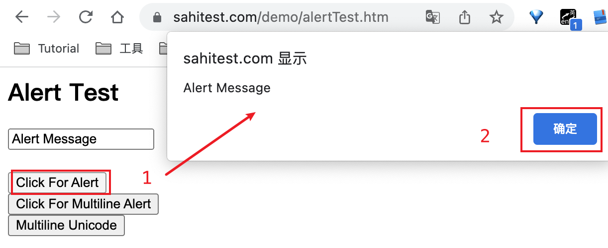

# alert 弹窗


在 Web 应用程序中，弹出窗口（也称为警报框）是常见的交互元素之一。Selenium 可以处理这些弹出窗口，对弹出窗口的处理需要使用 Alert 类的方法。

alert 弹窗是指浏览器中出现的一种弹窗，通常用于显示一些提示信息或警告信息。在 Selenium 中，可以使用 Alert 类来处理 alert 弹窗。

当 alert 弹窗出现时，Selenium 会抛出 **NoAlertPresentException** 异常。

## 处理步骤

为了处理 alert 弹窗，可以先使用 driver.switchTo().alert() 方法切换到 alert 弹窗所在的窗口，并使用 Alert 类的方法来处理弹窗中的信息或操作。

1. 首先点击元素等待弹窗出现并切换到弹窗窗口。

1. 切换到 alert 弹窗所在的窗口。

1. 处理弹窗中的信息或操作。


### 常用方法

accept(): 点击弹窗中的确认按钮。

dismiss(): 点击弹窗中的取消按钮。

text(): 获取弹窗中的文本内容。

send_keys(text): 在弹窗中输入文本内容。

## 实战案例 

测试页面：https://sahitest.com/demo/alertTest.htm




```java
@Test
public void alterTest() throws InterruptedException {
    List<Executable> executableList = new ArrayList<>();

    String url = "https://sahitest.com/demo/alertTest.htm";
    webDriver.get(url);
    //sleep(3000);

    webDriver.findElement(By.xpath("//*[@value=\"Click For Alert\"]")).click();
    //获取弹窗Alert对象
    Alert alert = webDriver.switchTo().alert();
    String text = alert.getText();
    System.out.println(text);
    alert.accept();
    //sleep(3000);

    executableList.add(() -> assertThat(
            text,
            equalTo("Alert Message")));
    assertAll(executableList);
}
```


