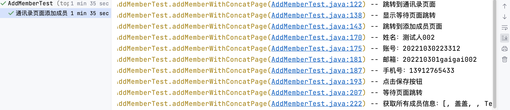
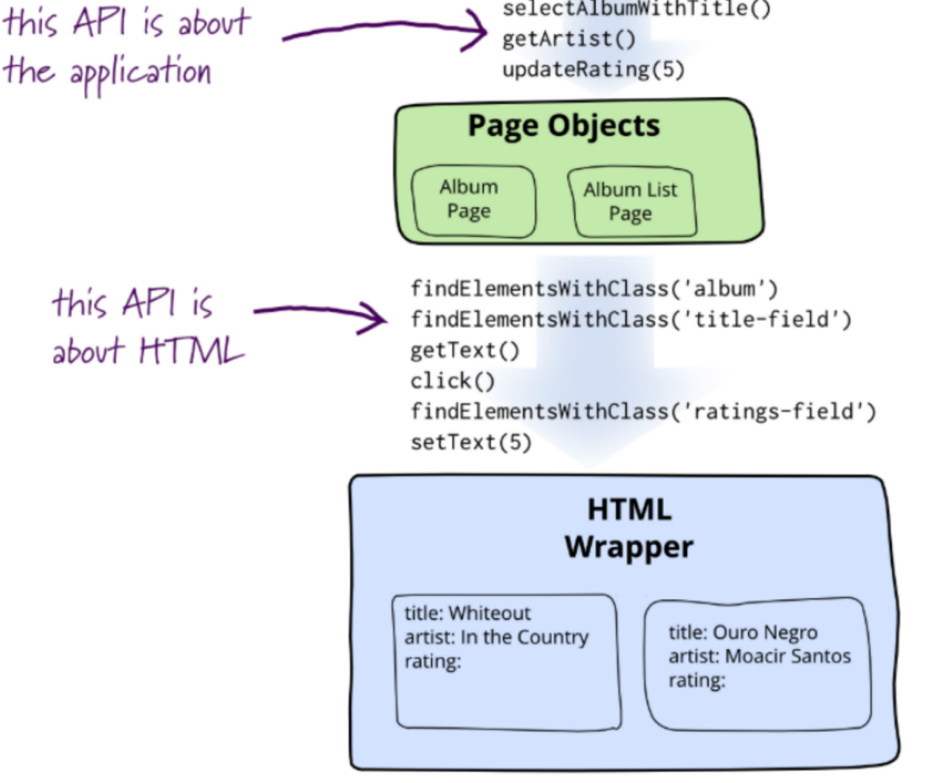
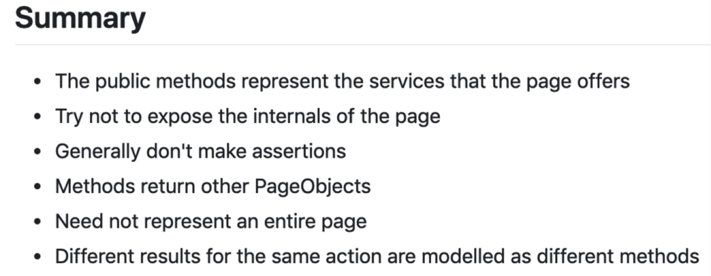

# 企业微信Web自动化


## 案例需求

针对目前学到的Selenium框架内容，完成一个Web端应用的UI自动化案例：**企业微信**！

企业微信主要功能如下：

1. **添加成员**：在通讯录功能下添加企业的成员，实现入职人员添加到企业的自动化流程。

1. **查看成员**：自动查看当前企业的所有成员信息。


1. **查看具体成员**：自动查看当前企业的某一具体成员信息。

1. **修改具体成员**：自动修改当前企业的某一具体成员信息。

1. **删除具体成员**：自动删除当前企业的某一具体成员信息。

1. **添加部门**：在通讯录功能下添加企业部门，实现企业组织架构调整时的自动化流程。


1. **查看部门**：自动查看当前企业的所有部门信息。

1. **修改具体部门**：自动修改当前企业的某一具体部门信息。

1. **删除具体部门**：自动删除当前企业的某一具体部门信息。

1. **退出系统**：结束程序。


# 1. 企业微信自动扫码登录


分为2步骤：

- [ ] 第一步  **扫码登录获取cookie**；
- [ ] 第二步  **企业微信放入cookie自动登录**。


## 第一步：扫码登录获取cookie


### 涉及知识点

|知识点|说明|
|---|---|
|driver声明|WebDriverManager创建driver<br>WebDriverManager.chromedriver().create()|
|driver进行网页跳转|driver.get(url地址)|
|显示等待|等待声明及判断条件|
|cookie获取|webDriver.manage().getCookies()|
|yaml文件保存|mapper.writeValue(文件, 写入内容);|

### 步骤

getCookieToYaml()

1. 打开企业微信[登录页面](https://work.weixin.qq.com/wework_admin/loginpage_wx)。

2. 扫码登录企业微信，等待页面加载到登录成功页。
    
    >等待可以有2种：强制等待、显示等待。

3. 获取登录的cookie信息。

4. cookie保存到cookie.yaml文件中。

5. 断言cookie是否获取成功。


注意⚠️：cookie信息一般有时效性，根据企业微信API接口推测为7200。


#### 1.1 打开登录页面

```java
// 1. driver的创建
//WebDriverManager去创建driver打开浏览器：打开浏览器为空白页面
WebDriver webDriver = WebDriverManager.chromedriver().create();

//2.跳转到企业微信登录地址
webDriver.get("https://work.weixin.qq.com/wework_admin/loginpage_wx");
//webDriver.navigate().to("https://work.weixin.qq.com/wework_admin/loginpage_wx");
```

##### WebDriverManager

**WebDriverManager** 是一个用于管理浏览器驱动程序的 Java 库。它可以自动下载所需版本的浏览器驱动程序，然后将其添加到系统路径中，从而避免手动下载和安装驱动程序的麻烦。也可以使用其他浏览器的驱动程序，只需要将 chromedriver() 替换为相应的驱动程序即可，例如 geckodriver()（Firefox）、edgedriver()（Edge）等。


```java
WebDriver webDriver = WebDriverManager.chromedriver().create();
```

##### 打开网页

WebDriver 接口提供了两种**打开网页**的方法：**get()** 和 **navigate().to()**。它们的**作用及实现上都相同**，都是用于打开指定的网页。

```java
webDriver.get(url);
webDriver.navigate().to(url);
```

在实际使用中，一般**推荐**使用 **get()** 方法进行页面跳转，因为它更简单、更直观。
**navigate().to()** 最底层也是调用的 **get()**方法。


**navigate()** 提供了更多的导航控制选项，比如：

- back()：页面返回上一页。
- forward()：页面跳转到下一页。
- refresh()：页面重新刷新。

```java
// 先打开百度首页，再页面跳转到百度地图页
//页面返回上一页   百度首页
webDriver.navigate().back();
//页面跳转到下一页  百度地图
webDriver.navigate().forward();
//页面重新刷新
webDriver.navigate().refresh();
```


#### 1.2 扫码登录企业微信

打开手机端企业微信，对浏览器端的二维码进行扫码登录。此时，需要driver进行等待，有2种方式：

##### 方式一：强制等待

直接使用**强制等待15秒**，让手动扫码过程完成。

```java
// 方式一：强制等待15s sleep
try {
    sleep(15000);
} catch (InterruptedException e) {
    throw new RuntimeException(e);
}
```
##### 方式二：显示等待

使用显示等待，与隐式等待和强制等待不同，显示等待需要指定等待条件和最长等待时间，因此更加灵活、精确。

**显示等待声明，最长等待15秒，每隔2s查询一次显示等待的条件是否满足；显示等待的条件为当前页面的URL是否包含wework_admin/frame**。显示等待的判断条件可以使用String字符串直接判断是否包含，也可以使用org.apache.commons包「WebDriverManager依赖下包含该依赖」下的StringUtils类来进行判断。


```java
//方式二：显示等待 显示等待条件；时间灵活
//显示等待声明
WebDriverWait wait = new WebDriverWait(webDriver,Duration.ofSeconds(15),Duration.ofSeconds(2));
wait.until(
    //webDriver1 -> webDriver1.getCurrentUrl().contains("wework_admin/frame")
    webDriver1 ->StringUtils.contains(webDriver1.getCurrentUrl(),"wework_admin/frame")
);
```

无论是那种等待方式，都是为了预留出足够的时间来进行扫码登录这个行为的完成。只不过强制等待就必须等待15s，哪怕是在15s之内完成了扫码登录也要继续等。而显示等待则不需要，显示等待具体的等待时间是根据显示等待的判断条件来决定的，如果判断条件一直不满足，则在超过最大的等待时间之后，直接报错，代码报错提示信息会比强等的代码报错提示信息更有借鉴意义。


#### 1.3 获取页面cookie

获取登录成功页面存储的cookie信息，返回值类型为Set集合。说明当前cookie信息没有重复的元素。

```java
//获取登录成功的cookie，存入yaml文件
Set<Cookie> cookies = webDriver.manage().getCookies();
```

##### manage()

在 Selenium 中，manage() 方法是 WebDriver 接口的一部分，用于管理浏览器的各种设置和属性。通过调用 manage() 方法可以获取到一个 Options 对象，进而可以进行各种浏览器管理操作。


#### 1.4 yaml 文件保存

**cookie保存到cookie.yaml文件中**。

##### 方式一：写入File文件

```java
//yaml文件保存
ObjectMapper mapper = new ObjectMapper(new YAMLFactory());
String path = "cookie.yaml";
//new File(路径)     -------->     Paths.get(路径).toFile()
// mapper.writeValue(new File(path), cookies);
mapper.writeValue(Paths.get(path).toFile(), cookies);
```


##### 方式二：写入输出流

我们使用FileWriter创建了一个输出流，并将其传递给ObjectMapper.writeValue方法。在try块中，我们序列化了一个Java对象，并将其写入输出流中。在finally块中，我们关闭了输出流，以确保资源被正确释放。

```java
//yaml文件保存
ObjectMapper mapper = new ObjectMapper(new YAMLFactory());
String path = "cookie.yaml";
// 如果传入的是流 Writer/OutputStream 需要关闭流，避免造成内存泄漏
FileWriter fileWriter = null;
try {
   fileWriter = new FileWriter(path);
   mapper.writeValue(fileWriter, cookies);
} catch (IOException e) {
   e.printStackTrace();
} finally {
   if (fileWriter != null) {
       try {
           fileWriter.close();
       } catch (IOException e) {
           e.printStackTrace();
       }
   }
}
```

### 示例代码

```java
@Test
@DisplayName("扫码登录获取cookie")
public void getCookieToYaml() throws IOException {
    //WebDriverManager去创建driver打开浏览器：打开浏览器为空白页面
    WebDriver webDriver = WebDriverManager.chromedriver().create();

    //企业微信登录地址
    webDriver.get("https://work.weixin.qq.com/wework_admin/loginpage_wx");
    //webDriver.navigate().to("https://work.weixin.qq.com/wework_admin/loginpage_wx");

    //扫码登录cookie获取

    //方式一：强制等待 sleep
    //try {
    //    sleep(15000);
    //} catch (InterruptedException e) {
    //    throw new RuntimeException(e);
    //}

    //方式二：显示等待 显示等待条件；时间灵活
    WebDriverWait wait = new WebDriverWait(
                                            webDriver,
                                            Duration.ofSeconds(15),
                                            Duration.ofSeconds(2));
    wait.until(
            //webDriver1 -> webDriver1.getCurrentUrl().contains("wework_admin/frame")
            webDriver1 ->
                    StringUtils.contains(webDriver1.getCurrentUrl(),"wework_admin/frame")
    );


    //获取登录成功的cookie，存入yaml文件
    Set<Cookie> cookies = webDriver.manage().getCookies();

    //yaml文件保存
    ObjectMapper mapper = new ObjectMapper(new YAMLFactory());
    String path = "cookie.yaml";
    //直接传入文件，不需要关闭流 没有显式地打开文件流，内部自动打开并关闭文件流，因此不需要手动关闭流
    //new File(路径)     -------->     Paths.get(路径).toFile()
    //mapper.writeValue(new File("cookie.yaml"), cookies);
    mapper.writeValue(Paths.get(path).toFile(), cookies);

    //如果传入的是流 Writer/OutputStream 需要关闭流，避免造成内存泄漏
    //FileWriter fileWriter = null;
    //try {
    //    fileWriter = new FileWriter(path);
    //    mapper.writeValue(fileWriter, cookies);
    //} catch (IOException e) {
    //    e.printStackTrace();
    //} finally {
    //    if (fileWriter != null) {
    //        try {
    //            fileWriter.close();
    //        } catch (IOException e) {
    //            e.printStackTrace();
    //        }
    //    }
    //}

    assertThat("cookie对象为空", !cookies.isEmpty());
}
```


## 第二步：企业微信放入cookie自动登录


### 涉及知识点

|知识点|说明|
|---|---|
|driver声明|WebDriverManager创建driver<br>WebDriverManager.chromedriver().create()|
|driver进行网页跳转|driver.get(url地址)|
|yaml文件读取|mapper.readValue(文件, 解析对象);|
|遍历获取cookie|stream流的foreach遍历|
|Cookie对象声明|Cookie(String name, String value, String path,)|
|cookie添加|webDriver.manage().addCookie()|
|网页刷新|refresh()()|


### 步骤

1. 打开企业微信[登录页面](https://work.weixin.qq.com/wework_admin/loginpage_wx)。

1. cookie.yaml文件解析。

1. 浏览器添加cookie。

1. 浏览器刷新。

注意⚠️：cookie信息一般有时效性，根据企业微信API接口推测为7200。

#### 1.1 打开登录页面


```java
// 1. driver的创建
//WebDriverManager去创建driver打开浏览器：打开浏览器为空白页面
WebDriver webDriver = WebDriverManager.chromedriver().create();

//2.跳转到企业微信登录地址
webDriver.get("https://work.weixin.qq.com/wework_admin/loginpage_wx");
//webDriver.navigate().to("https://work.weixin.qq.com/wework_admin/loginpage_wx");
```

#### 1.2 cookie.yaml文件解析


```java
//cookie.yaml文件对象声明
List<HashMap<String,Object>> cookies = null;

// fasterxml.jackson解析yaml文件
ObjectMapper mapper = new ObjectMapper(new YAMLFactory());
TypeReference<List<HashMap<String,Object>>> typeReference = new TypeReference<List<HashMap<String,Object>>>(){};

cookies = mapper.readValue(Paths.get("cookie.yaml").toFile(), typeReference);
```


#### 1.3 浏览器添加cookie

1. 使用stream流。

1. 过滤企业微信的cookie「避免文件中其他网站的cookie」。

1. foreach遍历：

   1. 每个值放入webdriver的Cookie对象中。
     
     >Cookie对象使用Cookie的有参构造方法实现。
   
   2. 把Cookie对象添加到webdriver浏览器中。
     
     >使用 webdriver 的 addCookie()方法 添加 Cookie对象到浏览器中。


```java
cookies
    .stream()
    .filter(cookie ->
            StringUtils
                    .contains(
                            cookie.get("domain").toString(),
                            ".work.weixin.qq.com"))

    //只要是".work.weixin.qq.com" 说明是企业微信的cookie
    .forEach(cookie -> {
            //cookie放入浏览器操作
        System.out.println("cookie: " + cookie);
        /**
         *   name: "wwrtx.c_gdpr"
         *   value: "0"
         *   path: "/"
         *   domain: ".work.weixin.qq.com"
         *   expiry: 1698653535000
         *   sameSite: null
         *   httpOnly: false
         *   secure: false
         * ........
         * public Cookie(String name, String value, String path, Date expiry) {
         */
        Cookie cookie1 = new Cookie(
                cookie.get("name").toString(),
                cookie.get("value").toString(),
                cookie.get("path").toString()
//              Date.valueOf(cookie.get("expiry").toString())
        );
        webDriver.manage().addCookie(cookie1);
    });
```

#### 1.4 浏览器刷新

为了保证浏览器存入的cookie生效，对当前浏览器进行刷新操作。

```java
//刷新浏览器
webDriver.navigate().refresh();
```

### 示例代码

```java
@Test
@DisplayName("企业微信自动登录")
public void cookieLogin() throws IOException {
    //WebDriverManager去创建driver打开浏览器：打开浏览器为空白页面
    WebDriver webDriver = WebDriverManager.chromedriver().create();
    //企业微信登录地址
    webDriver.get("https://work.weixin.qq.com/wework_admin/loginpage_wx");
    
    //yaml文件解析对象
    List<HashMap<String,Object>> cookies = null;
    ObjectMapper mapper = new ObjectMapper(new YAMLFactory());
    TypeReference<List<HashMap<String,Object>>> typeReference = new TypeReference<List<HashMap<String,Object>>>(){};
    cookies = mapper.readValue(Paths.get("cookie.yaml").toFile(), typeReference);
    
    //cookie放入浏览器
    cookies.stream()
            .filter(cookie ->
                    StringUtils
                            .contains(
                                    cookie.get("domain").toString(),
                                    ".work.weixin.qq.com"))
            //只要是".work.weixin.qq.com" 说明是企业微信的cookie
            .forEach(cookie -> {
                    //cookie放入浏览器操作
                System.out.println("cookie: " + cookie);
                /**
                 *   name: "wwrtx.c_gdpr"
                 *   value: "0"
                 *   path: "/"
                 *   domain: ".work.weixin.qq.com"
                 *   expiry: 1698653535000
                 *   sameSite: null
                 *   httpOnly: false
                 *   secure: false
                 * ........
                 * public Cookie(String name, String value, String path, Date expiry) {
                 */
                Cookie cookie1 = new Cookie(
                                        cookie.get("name").toString(),
                                        cookie.get("value").toString(),
                                        cookie.get("path").toString()
                                        //Date.valueOf(cookie.get("expiry").toString())
                                        );
                webDriver.manage().addCookie(cookie1);
            });
    //刷新浏览器
    webDriver.navigate().refresh();

    String url = webDriver.getCurrentUrl();
    //断言  如果失败提示：登录失败   JUnit5 Hamcrest均可
    assertThat("登录失败", url, is(containsString("wework_admin/frame")));
}
```


# 2. 企业微信添加成员

分为2步骤：

- [ ] 第一步  **企业微信自动登录**；
- [ ] 第二步  **通讯录成员添加**。


## 第一步：企业微信自动登录


需要把第一个需求的内容封装为一个方法进行判断。


1. cookie文件是否删除。


判断cookie.yaml文件是否存在，如果存在则读取，查看文件中expiry参数的值，与当前时间戳做对比，小于7200s则不删除直接使用。如果大于7200s则直接删除cookie.yaml文件。


使用cookie的yaml文件进行企业微信的登录。

1. 提取到@BeforeAll注解中。

2. driver声明添加浏览器路径判断。

3. 判断当前电脑是否有Chrome浏览器。

4. 如果当前项目下cookie文件不存在，扫码登录。

5. cookie文件读取登录。

### 示例代码

```java
public static WebDriver webDriver;
public static WebDriverWait wait;
static List<HashMap<String,Object>> cookies = null;

@BeforeAll
public static void bf(){
    //判断当前电脑是否有Chrome浏览器
    Optional<Path> chromeBrowserPath = WebDriverManager.chromedriver().getBrowserPath();

    if(chromeBrowserPath.isPresent()){
        //WebDriverManager去创建driver打开浏览器：打开浏览器为空白页面
        webDriver = WebDriverManager.chromedriver().create();
        //webDriver = new ChromeDriver();
    }

    wait = new WebDriverWait(webDriver, Duration.ofSeconds(15), Duration.ofSeconds(2));
    //企业微信扫码登录
    cookieLogin();
}

private static void cookieLogin() {
    webDriver.get("https://work.weixin.qq.com/wework_admin/loginpage_wx");


    if(!Paths.get("cookie.yaml").toFile().exists()){//如果当前项目下cookie文件不存在----扫码登录
        //cookie文件写入
        wait.until(webDriver1 -> StringUtils.contains(webDriver1.getCurrentUrl(),"wework_admin/frame"));
        //获取登录成功的cookie，存入yaml文件
        Set<Cookie> cookies = webDriver.manage().getCookies();

        //yaml文件保存
        ObjectMapper mapper = new ObjectMapper(new YAMLFactory());
        //new File(路径)     -------->     Paths.get(路径).toFile()
//        mapper.writeValue(new File("cookie.yaml"), cookies);
        try {
            mapper.writeValue(Paths.get("cookie.yaml").toFile(), cookies);
        } catch (IOException e) {
            throw new RuntimeException(e);
        }
    }


    //cookie文件读取

    ObjectMapper mapper = new ObjectMapper(new YAMLFactory());
    TypeReference<List<HashMap<String,Object>>> typeReference = new TypeReference<List<HashMap<String,Object>>>(){};

    try {
        cookies = mapper.readValue(Paths.get("cookie.yaml").toFile(), typeReference);
    } catch (IOException e) {
        throw new RuntimeException(e);
    }
    cookies.stream()
            .filter(cookie ->
                    StringUtils.contains(cookie.get("domain").toString(),
                            ".work.weixin.qq.com"))

            //只要是".work.weixin.qq.com" 说明是企业微信的cookie
            .forEach(cookie -> {
                //cookie放入浏览器操作
                Cookie cookie1 = new Cookie(
                        cookie.get("name").toString(),
                        cookie.get("value").toString(),
                        cookie.get("path").toString()
                );
                webDriver.manage().addCookie(cookie1);
            });
    //刷新浏览器   --- 跳转到首页
    webDriver.navigate().refresh();
}
```

## 第二步：通讯录成员添加



### 删除成员问题


删除成员，不只在通讯录页面删除，还需要去[邮箱回收站](https://work.weixin.qq.com/wework_admin/frame#apps/qykit/proxy/exmail)中 **全选**，点击 **彻底删除** 即可解决。

### 涉及知识点

|知识点|说明|
|---|---|
|元素定位|css xpath id|


### 步骤

#### 1.1 跳转到通讯录页面

点击菜单栏的通讯录按钮跳转到通讯录页面。


1. 元素定位：八大元素定位中的id定位，通过id定位到元素。

2. 查找元素：通过findElement返回元素对象。

3. 元素操作：点击元素，元素对象调用click()方法。

```java
//1. 点击通讯录 id="menu_contacts"
//01- 元素定位「8大元素定位中的id定位」
By menuContacts = By.id("menu_contacts");
//02- 查找元素 返回元素对象
WebElement menuContactsEle = webDriver.findElement(menuContacts);
//03- 元素操作 点击
menuContactsEle.click();
```

#### 1.2 等待页面跳转

使用显示等待当前页面的跳转，因为有可能当前机器性能不好或网络原因，导致页面未加载出来。

判断条件：浏览器页面包含 **搜索成员、部门、标签**。

```java
wait.until(webDriver1 -> webDriver1.getPageSource().contains("搜索成员、部门、标签"));
```

#### 1.3 跳转到添加成员页面

点击 添加成员按钮 跳转到添加成员页面。

|css|说明|
|---|---|
|.|表示class选择器|
|空格|表示后代选择器|


1. 元素定位：八大元素定位中的css定位，通过css定位到元素。

2. 查找元素：通过findElement返回元素列表的第一个对象。

3. 元素操作：点击元素，元素对象调用click()方法。

>有时点击页面没有反应，为了正常点击跳转，使用for循环判断页面是否跳转成功。最多点击3次。


```java
//01- 元素定位「8大元素定位中的css定位」 查找到2个元素
By addMember = By.cssSelector(".js_has_member .js_add_member");
// 02- 查找元素 返回元素对象 list集合里面的下标为0的元素
WebElement addMemberEle = webDriver.findElement(addMember);
//添加全局隐式等待，为了页面加载时常问题
//有时点击页面没有反应，为了正常点击跳转，最多点击3次
for (int i = 0; i < 3; i++) {
    if(!webDriver.getPageSource().contains("username")){
        //03- 元素操作 点击
        addMemberEle.click();
        try {
            sleep(1000);
        } catch (InterruptedException e) {
            throw new RuntimeException(e);
        }
    }else {
        break;
    }
}
```


#### 1.4 填写成员信息


 为了不一个个元素定位，先把页面的所有定位都找出来，再编写业务逻辑。


|元素|定位|
|---|---|
|姓名|id="username"|
|账号|id="memberAdd_acctid"|
|邮箱|name="biz_mail"|
|手机号|name="mobile"|


1. 元素定位：八大元素定位。

2. 查找元素：通过findElement返回元素对象。

3. 元素操作：元素清空，元素输入内容。

```java
//    姓名：    id="username"
WebElement unameEle = webDriver.findElement(By.id("username"));
unameEle.clear();
unameEle.sendKeys("测试人002");

//    账号：    id="memberAdd_acctid"
WebElement acctidEle = webDriver.findElement(By.id("memberAdd_acctid"));
acctidEle.clear();
acctidEle.sendKeys("20221030223312");

//    邮箱：    name="biz_mail"
WebElement bizMailEle = webDriver.findElement(By.name("biz_mail"));
bizMailEle.clear();
bizMailEle.sendKeys("202210301gaigai002");

//    手机号：    name="mobile"
WebElement mobileEle = webDriver.findElement(By.xpath("//*[@name=\"mobile\"]"));
mobileEle.clear();
mobileEle.sendKeys("13912765433");
```

#### 1.5 点击保存按钮


1. 元素定位：八大元素定位中的linkText定位，通过linkText定位到元素。

2. 查找元素：通过findElement返回元素对象。

3. 元素操作：点击元素，元素对象调用click()方法。


```java
// a标签   保存
webDriver.findElement(By.linkText("保存")).click();
```


#### 1.6 等待页面跳转

使用显示等待当前页面的跳转，因为有可能当前机器性能不好或网络原因，导致页面未加载出来。

判断条件：页面不包含 **企业邮箱：** 。

```java
wait.until(webDriver -> !webDriver.getPageSource().contains("企业邮箱："));
```

### 示例代码

```java
@Test
@DisplayName("通讯录页面添加成员")
public void addMemberWithConcatPage(){
    //元素定位
//1. 跳转到通讯录页面
    //01- 元素定位「8大元素定位中的id定位」点击通讯录 id="menu_contacts"
    By menuContacts = By.id("menu_contacts");
    //02- 查找元素 返回元素对象
    WebElement menuContactsEle = webDriver.findElement(menuContacts);
    //03- 元素操作 点击
    menuContactsEle.click();

    //强制等待
    //try {
    //    sleep(15000);
    //} catch (InterruptedException e) {
    //    throw new RuntimeException(e);
    //}

//2. 显示等待页面跳转
    wait.until(webDriver1 -> webDriver1.getPageSource().contains("搜索成员、部门、标签"));

    WebElement jsMemberCount = webDriver.findElement(By.className("js_member_count"));
    String beforeAdd = jsMemberCount.getText();
//3. 跳转到添加成员页面
    //01- 元素定位「8大元素定位中的css定位」 查找到2个元素
    By addMember = By.cssSelector(".js_has_member .js_add_member");
    // 02- 查找元素 返回元素对象 list集合里面的下标为0的元素
    WebElement addMemberEle = webDriver.findElement(addMember);
    //添加全局隐式等待，为了页面加载时常问题
    //有时点击页面没有反应，为了正常点击跳转，最多点击3次
    for (int i = 0; i < 3; i++) {
        if(!webDriver.getPageSource().contains("username")){
            //03- 元素操作 点击
            addMemberEle.click();
            try {
                sleep(1000);
            } catch (InterruptedException e) {
                throw new RuntimeException(e);
            }
        }else {
            break;
        }
    }

//4. 填写成员信息

    //    姓名：    id="username"
    WebElement unameEle = webDriver.findElement(By.id("username"));
    unameEle.clear();
    unameEle.sendKeys("测试人002");
    //    账号：    id="memberAdd_acctid"
    WebElement acctidEle = webDriver.findElement(By.id("memberAdd_acctid"));
    acctidEle.clear();
    acctidEle.sendKeys("20221030223312");
    //    邮箱：    name="biz_mail"
    WebElement bizMailEle = webDriver.findElement(By.name("biz_mail1"));
    bizMailEle.clear();
    bizMailEle.sendKeys("202210301gaigai002");
    //    手机号：    name="mobile"
    WebElement mobileEle = webDriver.findElement(By.xpath("//*[@name=\"mobile\"]"));
    mobileEle.clear();
    mobileEle.sendKeys("13912765433");

//5. 点击保存按钮
    // a标签   保存
    webDriver.findElement(By.linkText("保存")).click();

    //强制等待
    //try {
    //    sleep(10000);
    //} catch (InterruptedException e) {
    //    throw new RuntimeException(e);
    //}
//6. 等待页面跳转
    /**
     * 显示等待
     * class="js_member_count"
     * ..........
     */
    String afterAdd = jsMemberCount.getText();

    wait.until(webDriver1 -> !afterAdd.equals(beforeAdd));

    //断言
    //member_colRight_memberTable_td   27
    List<WebElement> tdEleList = webDriver.findElements(By.className("member_colRight_memberTable_td"));
    List<String> tdTitleList = new ArrayList<>();
    tdEleList.forEach(
            td -> {
                String title = td.getAttribute("title");
                System.out.println("title：" + title);
                tdTitleList.add(title);

            }
    );

    System.out.println(tdTitleList);
    assertThat("成员添加失败",tdTitleList.contains("测试人002"));
}
```


# PageObject 原理以及六大原则

- [selenium 官方网站](https://www.selenium.dev/documentation/en/guidelines_and_recommendations/page_object_models/)
- [马丁福勒个人博客](https://martinfowler.com/bliki/PageObject.html)


## PO 设计思想

- 抽象：业务模型
- 实现：自动化操作与机器人模拟




## PO 六大原则




## 示例代码

```bash
mvn clean test -Dtest=top.testeru.AddMemberPOTest allure:serve
```


### BasePage

```java
package top.testeru.base;

import com.fasterxml.jackson.core.type.TypeReference;
import com.fasterxml.jackson.databind.ObjectMapper;
import com.fasterxml.jackson.dataformat.yaml.YAMLFactory;
import io.github.bonigarcia.wdm.WebDriverManager;
import io.qameta.allure.Allure;
import io.qameta.allure.Step;
import org.apache.commons.io.FileUtils;
import org.apache.commons.lang3.StringUtils;
import org.openqa.selenium.*;
import org.openqa.selenium.support.PageFactory;
import org.openqa.selenium.support.ui.WebDriverWait;
import org.slf4j.Logger;

import java.io.File;
import java.io.IOException;
import java.nio.file.Files;
import java.nio.file.Path;
import java.nio.file.Paths;
import java.time.Duration;
import java.util.ArrayList;
import java.util.HashMap;
import java.util.List;
import java.util.Set;

import static java.lang.invoke.MethodHandles.lookup;
import static org.slf4j.LoggerFactory.getLogger;

/**
 * @author testeru.top
 * @version 1.0.0
 * @Prpject wechat-combat
 * @Description 基本页面工厂
 * @createTime 2023年05月06日 19:22:00
 */
public class BasePage {
    public static final Logger logger = getLogger(lookup().lookupClass());

    public WebDriver driver;
    static List<HashMap<String,Object>> cookies = null;
    public static WebDriverWait wait;

    public BasePage(WebDriver driver) {
        this.driver = driver;
    }
    public BasePage() {
        if(null == driver){
            //cookie文件是否删除的判断
            //如果cookie文件存在
            //cookieFileisDelete();
            //driver = new ChromeDriver();
            driver = WebDriverManager.chromedriver().create();//调用Chrome浏览器
            //隐式等待
            driver.manage().timeouts().implicitlyWait(Duration.ofSeconds(10));
            //显示等待声明
            wait = new WebDriverWait(driver, Duration.ofSeconds(15), Duration.ofSeconds(2));

            //cookie登录
            cookieFileisDelete();
            cookieLogin();
        }
        //窗口最大化
        driver.manage().window().maximize();
    }

    private static void cookieFileisDelete() {
        File cookieFile = Paths.get("cookie.yaml").toFile();
        if(cookieFile.exists()){
            ObjectMapper mapper = new ObjectMapper(new YAMLFactory());
            TypeReference<List<HashMap<String,Object>>> typeReference = new TypeReference<List<HashMap<String,Object>>>(){};

            try {
                cookies = mapper.readValue(cookieFile, typeReference);
            } catch (IOException e) {
                throw new RuntimeException(e);
            }
            //读取出来的cookie对象获取 expiry 不为空的list集合
            List<Long> expiryList = new ArrayList<>();

            cookies.forEach(
                    cookie -> {

                        if(null != cookie.get("expiry")){
                            expiryList.add(Long.parseLong(cookie.get("expiry").toString()));
                        }
                    }
            );
            logger.info("expiryList:" + expiryList);//[1699260234000,1670316244000]
            //Long getCookieTime = expiryList.get(0) - 一年的毫秒级的数值;31536000000
            Long getCookieTime = expiryList.get(0) - 31536000000L;
            //     7200s
            long now = System.currentTimeMillis();//当前的毫秒级别
            if( (now - getCookieTime)/1000  > 7200){
                //cookie文件删除操作
                if(cookieFile.delete()){
                    logger.info("文件删除成功");
                }else{
                    logger.info("文件删除失败");
                }
            }
        }
    }

    private void cookieLogin() {
        driver.get("https://work.weixin.qq.com/wework_admin/loginpage_wx");


        if(!Paths.get("cookie.yaml").toFile().exists()){//如果当前项目下cookie文件不存在----扫码登录
            //cookie文件写入
            wait.until(webDriver1 -> StringUtils.contains(webDriver1.getCurrentUrl(),"wework_admin/frame"));
            //获取登录成功的cookie，存入yaml文件
            Set<Cookie> cookies = driver.manage().getCookies();

            //yaml文件保存
            ObjectMapper mapper = new ObjectMapper(new YAMLFactory());
            //new File(路径)     -------->     Paths.get(路径).toFile()
//        mapper.writeValue(new File("cookie.yaml"), cookies);
            try {
                mapper.writeValue(Paths.get("cookie.yaml").toFile(), cookies);
            } catch (IOException e) {
                throw new RuntimeException(e);
            }
        }


        //cookie文件读取

        ObjectMapper mapper = new ObjectMapper(new YAMLFactory());
        TypeReference<List<HashMap<String,Object>>> typeReference = new TypeReference<List<HashMap<String,Object>>>(){};

        try {
            cookies = mapper.readValue(Paths.get("cookie.yaml").toFile(), typeReference);
        } catch (IOException e) {
            throw new RuntimeException(e);
        }
        cookies.stream()
                .filter(cookie ->
                        StringUtils.contains(cookie.get("domain").toString(),
                                ".work.weixin.qq.com"))

                //只要是".work.weixin.qq.com" 说明是企业微信的cookie
                .forEach(cookie -> {
                    //cookie放入浏览器操作
                    Cookie cookie1 = new Cookie(
                            cookie.get("name").toString(),
                            cookie.get("value").toString(),
                            cookie.get("path").toString()
                    );
                    driver.manage().addCookie(cookie1);
                });
        //刷新浏览器   --- 跳转到首页
        driver.navigate().refresh();
        //PageFactory.initElements(driver, this);

    }

    @Step("元素查找:{by}")
    public WebElement find(By by){
        WebElement element = driver.findElement(by);
        HighElement(element);
        //截图
        screen();
        //元素高亮去除
        UnHighElement(element);
        return element;
    }
    public void quite(){
        driver.quit();//浏览器退出操作
    }
    //click
    public void click(By by){
        find(by).click();
    }
    //send  --- clear、sendKeys
    public void send(By by, String text){
        WebElement element = find(by);
        element.clear();
        element.sendKeys(text);
    }

    //getText -- element.getText()
    public String getText(By by){
        WebElement element = find(by);
        return element.getText();
    }
    //finds  -- List<Elements>
    @Step("元素查找:{by}")
    public List<WebElement> finds(By by){
        List<WebElement> elements = driver.findElements(by);

        elements.forEach(webElement -> {
            HighElement(webElement);
        });
        //截图
        screen();

        elements.forEach(webElement -> {
            //元素高亮去除
            UnHighElement(webElement);
        });

        return elements;
    }

    public List<String> getTexts(By by){
        List<String> texts = new ArrayList<>();
        finds(by).forEach(ele -> {
            texts.add(ele.getText());
        });
        return texts;
    }
    public List<String> getAttributes(By by, String attribute){
        List<String> texts = new ArrayList<>();
        finds(by).forEach(ele -> {
            texts.add(ele.getAttribute(attribute));
        });
        return texts;
    }

    public String page() {
        return driver.getPageSource();
    }

    //截图
    private void screen(){
        long now = System.currentTimeMillis();
        File screenshotAs = ((TakesScreenshot) driver).getScreenshotAs(OutputType.FILE);
        Path jpg = Paths.get("jpg", now + ".jpg");
        File screenJpg = jpg.toFile();
        try {
            FileUtils.copyFile(screenshotAs, screenJpg);
            //allure报告添加截图  --  allure添加附件
            Allure.addAttachment(jpg.toString(),
                    "image/jpg",
                    Files.newInputStream(jpg),
                    "jpg");
        } catch (IOException e) {
            throw new RuntimeException(e);
        }
    }
    //js 元素高亮
    private WebDriver HighElement(WebElement webElement){
        if(driver instanceof JavascriptExecutor)
            ((JavascriptExecutor)driver).executeScript("arguments[0].style.border='3px solid red'",webElement);
        return driver;
    }

    private WebDriver UnHighElement(WebElement webElement){
        if(driver instanceof JavascriptExecutor)
            ((JavascriptExecutor)driver).executeScript("arguments[0].style.border=''",webElement);
        return driver;
    }

    //显示等待


}

```

### MainPage

```java
package top.testeru;

import org.openqa.selenium.By;
import org.openqa.selenium.WebElement;
import org.openqa.selenium.support.FindBy;
import top.testeru.base.BasePage;
import top.testeru.member.MemberPage;

//企业微信登录成功后的首页
public class MainPage extends BasePage {

    /**
     * 无参数构造进行driver 数据声明
     * 有参构造进行driver传递
     */
    public MainPage() {
    }

    //成员变量

    private By menuContacts = By.id("menu_contacts");
    private By searchConcat = By.id("memberSearchInput");


    //点击通讯录的tab,跳转到通讯录
    public ConcatPage toConcatPage(){
        System.out.println("跳转到通讯录页面");
         click(menuContacts);
        //跳转到通讯录页面成功的显示等待条件为搜索输入框 id="memberSearchInput"
        wait.until(
                webDriver -> webDriver.getPageSource().contains("搜索成员、部门、标签"));
        return new ConcatPage(driver);
    }

    //首页直接点击添加成员按钮跳转到添加成员页面
    public MemberPage toMemberPage(){
        System.out.println("跳转到添加成员页面");
        return new MemberPage(driver);
    }
}
```


### ConcatPage

```java
package top.testeru;

import org.openqa.selenium.By;
import org.openqa.selenium.WebDriver;
import org.openqa.selenium.WebElement;
import org.openqa.selenium.support.FindBy;
import org.openqa.selenium.support.ui.WebDriverWait;
import top.testeru.base.BasePage;
import top.testeru.member.MemberPage;

import java.time.Duration;
import java.util.ArrayList;
import java.util.List;

import static java.lang.Thread.sleep;

//通讯录页面
public class ConcatPage extends BasePage {
    public ConcatPage(WebDriver driver) {
        super(driver);
    }
    //查找到2个元素
    private By addMember = By.cssSelector(".js_has_member .js_add_member");
    private By memberTd = By.className("member_colRight_memberTable_td");

    //点击添加成员按钮，跳转到添加成员页面
    public MemberPage clickAddMember(){
        logger.info("进入了通讯录页面，在通讯录页面进行点击添加成员操作，页面跳转");
        //2. 点击添加成员按钮
        //list集合里面的下标为0的元素
        for (int i = 0; i < 3; i++) {
            if(!page().contains("username")){
                click(addMember);
                try {
                    sleep(1000);
                } catch (InterruptedException e) {
                    throw new RuntimeException(e);
                }
            }else {
                break;
            }
        }
        wait.until(webDriver -> webDriver.getPageSource().contains("企业邮箱："));
        return new MemberPage(driver);
    }


    //获取当前通讯录的成员文本的列表
    public List<String> getMemberListText(){
        //member_colRight_memberTable_td   27
        //List<WebElement> tdEleList = driver.findElements(By.className("member_colRight_memberTable_td"));
        //List<String> tdTitleList = new ArrayList<>();
        //tdEleList.forEach(
        //        td -> {
        //            String title = td.getAttribute("title");
        //            System.out.println("title：" + title);
        //            tdTitleList.add(title);
        //
        //        }
        //);
        //
        List<String> titles = getAttributes(memberTd, "title");
        logger.info("成员页面：{}", titles);
        return titles;
    }

}
```


### User

```java
package top.testeru.entity;

import lombok.Data;
import lombok.Getter;
import lombok.Setter;
import lombok.ToString;
import org.checkerframework.checker.units.qual.C;

/**
 * @author testeru.top
 * @version 1.0.0
 * @Prpject wechat-combat
 * @Description
 * @createTime 2023年05月06日 19:48:00
 */
@Getter
@Setter
@ToString
public class User {

    private String uname;
    private String acctid;
    private String mail;
    private String mobile;

    public User(String uname, String acctid, String mail, String mobile) {
        this.uname = uname;
        this.acctid = acctid;
        this.mail = mail;
        this.mobile = mobile;
    }
}
```
### MemberPage

```java
package top.testeru.member;

import org.openqa.selenium.By;
import org.openqa.selenium.WebDriver;
import org.openqa.selenium.WebElement;
import org.openqa.selenium.support.FindBy;
import org.openqa.selenium.support.PageFactory;
import org.openqa.selenium.support.ui.WebDriverWait;
import top.testeru.ConcatPage;
import top.testeru.base.BasePage;
import top.testeru.entity.User;

import java.time.Duration;

//成员相关页面
//添加成员
//编辑成员
//查看成员
public class MemberPage extends BasePage {

    public MemberPage(WebDriver driver) {
        super(driver);
    }

    private By uname = By.id("username");//姓名
    private By acctid = By.id("memberAdd_acctid");//账号
    private By bizMail = By.name("biz_mail");//邮箱
    private By mail3 = By.name("biz_mail1");//邮箱

    private By mobile = By.xpath("//*[@name=\"mobile\"]");//手机号
    private By save = By.linkText("保存");//保存按钮


    //元素定位私有化
//    private By nameEle = By.id();
    //addMember 添加成员
    //第一种：首页点击跳转到添加成员方法
    //第二种：从通讯录页面点击跳转到添加成员方法
    //正确的添加成员
    public ConcatPage addMemberTrue(User user){
        System.out.println("添加成员，成员的正确添加");
        addMemberStep(user);

        //页面跳转，显示等待跳转条件

        WebDriverWait wait = new WebDriverWait(driver, Duration.ofSeconds(15), Duration.ofSeconds(2));
        wait.until(webDriver -> !webDriver.getPageSource().contains("企业邮箱："));
        return new ConcatPage(driver);
    }
    //错误的添加成员 返回值为String，收集的错误信息
    public String addMemberFalse(){
//        addMemberStep();
        return "error";
    }
    private void addMemberStep(User user) {

        //    姓名：    id="username"
        send(uname, user.getUname());
        //    账号：    id="memberAdd_acctid"
        send(acctid, user.getAcctid());
        //    邮箱：    name="biz_mail"
        send(bizMail, user.getMail());
        //    手机号：    name="mobile"
        send(mobile, user.getMobile());
        //4. 点击添加
        // a标签   保存
        click(save);
    }

}
```


### AddMemberPOTest

```java
package top.testeru;

import org.junit.jupiter.api.DisplayName;
import org.junit.jupiter.api.Test;
import top.testeru.entity.User;
import top.testeru.util.FakerUtil;

import java.util.List;

import static org.hamcrest.MatcherAssert.assertThat;

/**
 * @author testeru.top
 * @version 1.0.0
 * @Prpject wechat-combat
 * @Description
 * @createTime 2023年05月06日 19:57:00
 */
@DisplayName("成员添加测试用例")
public class AddMemberPOTest {
    static ConcatPage concatPage;
    static MainPage mainPage;
    @Test
    @DisplayName("添加成员")
    public void addMemberTrue() {
        User user = new User(FakerUtil.getName(),FakerUtil.getAccount(),FakerUtil.getAccount(),FakerUtil.getPhone());
        mainPage = new MainPage();
        concatPage = mainPage//首页
                            .toConcatPage() //方法 //跳转到通讯录页面
                            .clickAddMember()//点击添加成员方法  //跳转到 添加成员页面
                            .addMemberTrue(user);
        List<String> memberTextList = concatPage//正确的添加成员方法  //返回到通讯录页面
                                        .getMemberListText();//获取当前成员列表文本方法;

        //断言
        assertThat("成员添加失败",memberTextList.contains(user.getUname()));
    }
}
```