# day2
全链路压测

全链路线上压测

# 搭建服务端性能监控系统

Prometheus到现在应该已经火了四年以上了，
现在已经比较成熟的，

Prometheus是一款开源的监控和警报系统，主要用于收集和存储时间序列数据。

我们为什么会选择Prometheus来进行性能监控的搭建呢？现在大部分公司性能监控平台都用Prometheus来搭建，而且它不是凭空出现的，应该到现在为止至少已经火了三四年了，是一个比较成熟的监控系统。

它具有高度的可扩展性和灵活性，支持多种数据源，包括应用程序、容器、主机、网络设备等。

Prometheus可以对收集的数据进行查询、聚合和可视化，为用户提供**实时**的监控和警报功能，帮助用户及时发现和解决问题。

Prometheus提供了丰富的**图形化界面**，可以帮助用户更直观地了解监控数据。其中，Prometheus自带的Web UI提供了基本的**监控面板**，包括**图表**、**表格**、**警报规则**等。

用户也可以使用Grafana等**第三方工具**来可视化Prometheus数据，Grafana提供了更丰富和灵活的可视化功能，包括更多种类的图表、更多样的样式和主题、更多数据源和插件等。

通过图形化界面，用户可以方便地了解监控数据的趋势、变化和异常，发现问题并迅速解决。同时，图形化界面也可以帮助用户更好地了解**应用程序的性能**和**资源利用情况**，提高应用程序的可靠性和性能。

# Docker

服务的部署：

1. 直接在服务器centos系统上使用Linux命令直接部署；

1. 用 Docker 的方式进行安装部署。「建议使用」

>因为现在整个互联网，为了更快的 DevOps /更好的运维，已经大部分的公司往容器化部署方向改进，能使用容器部署的都会使用容器部署服务。包括很多公司**测试环境**都在用 Docker 的方式来去实现。


#### DevOps

DevOps（Development and Operations）是一种**软件开发和运维的方法论**，旨在通过协作、自动化和迭代来提高软件开发和运维的效率、质量和可靠性。DevOps的**核心思想**是 **将软件开发和运维团队紧密协作，建立自动化的工具链和流程，促进快速开发、持续交付和快速反馈** 。

DevOps方法论的实践需要借助一系列工具和技术，包括源代码管理、持续集成、持续交付、配置管理、**容器化**、自动化测试、监控和日志分析等。这些工具和技术帮助开发和运维团队更高效地协作，更快速地交付软件，并且在软件运行期间提供实时的性能监控和故障排查。

DevOps的实践对于现代软件开发和运维至关重要，可以提高软件开发的质量和效率，缩短软件交付周期，减少故障率和修复时间，降低成本，提升客户满意度。


## Docker 介绍

**Docker是什么？？**

Docker是一个开源的容器化平台，用于构建、打包、发布和运行应用程序。它可以让开发人员将应用程序及其依赖项打包成一个轻量级、可移植的容器，并在不同的环境中运行，保证应用程序在不同环境中的一致性和可重复性。

Docker基于Linux容器技术，但是提供了更高级别的抽象和工具，使得容器化应用程序变得更加简单和易于使用。

使用Docker，开发人员可以快速创建和部署应用程序，并且可以在不同的计算机、云平台和数据中心中移植应用程序。Docker已经成为现代应用程序开发和部署的重要组成部分，被广泛使用在开发、测试、生产等各个环节中。


## 基本概念

Docker 包括三个基本概念:

### 镜像（Image）

Docker 镜像（Image），就相当于是一个 root 文件系统。比如官方镜像 ubuntu:16.04 就包含了完整的一套 Ubuntu16.04 最小系统的 root 文件系统。

### 容器（Container）

镜像（Image）和容器（Container）的关系，就像是 **面向对象程序设计中的类和实例一样** ，镜像是静态的定义，容器是镜像运行时的实体。容器可以被创建、启动、停止、删除、暂停等。

### 仓库（Repository）

仓库可看着一个代码控制中心，用来保存镜像。

Docker 使用客户端-服务器 (C/S) 架构模式，使用远程API来管理和创建Docker容器。

Docker 容器通过 Docker 镜像来创建。

容器与镜像的关系类似于面向对象编程中的对象与类。


## Docker 架构

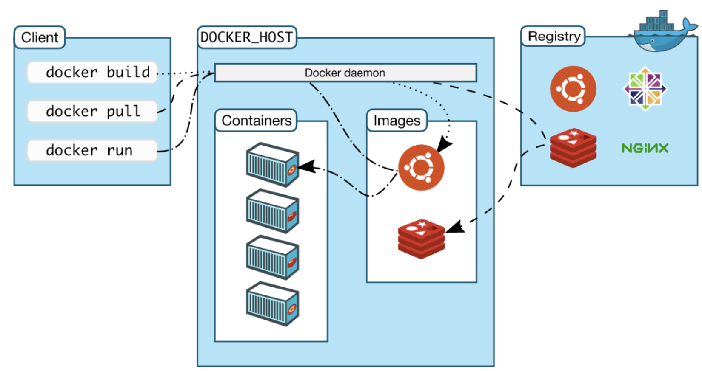

如上图所示，Docker使用CS体系结构，Client通过和Docker的Daemon来完成Docker容器的构建、发布、运行工作，Client和Daemon可以在同一台主机，也可以在不同主机上(通过网络进行交互）。

### Docker Daemon

Docker Daemon(dockerd)监听 通过 Docker API 过来的请求，并管理 Docker 对象，如图像、容器、网络和卷。 守护进程还可以与其他守护进程通信，用来管理 Docker 服务。

### Docker Client

Docker Client(Docker命令)是许多 Docker 用户与 Docker 交互的主要方式。 当使用诸如 docker run 之类的命令时，客户机将这些命令发送给 dockerd，然后又dockerd执行这些命令。 Docker 命令使用 Docker API和dockerd进行通信。 Docker 客户机可以与多个守护进程通信。

### Docker Registries
Docker Registries 用来存储Docker Image， Docker Hub是一个公共Docker Regstires, 类似于公用的maven仓库，是Docker默认配置的。 你也可以注册自己的私有Regsitries

当您使用 docker pull 或 docker 运行命令时，所需的映像将从您配置的Regsitries中提取出来。 当您使用 docker push 命令时，您的映像将被推送到您配置的Regsitries中。


## Docker 安装

云服务上安装Docker服务，使用 yum命令安装Docker。

```bash
# 直接安装最新版本的docker
yum install -y docker
```
**-y**：所有选择 Y/N 的地方都默认为 Y。

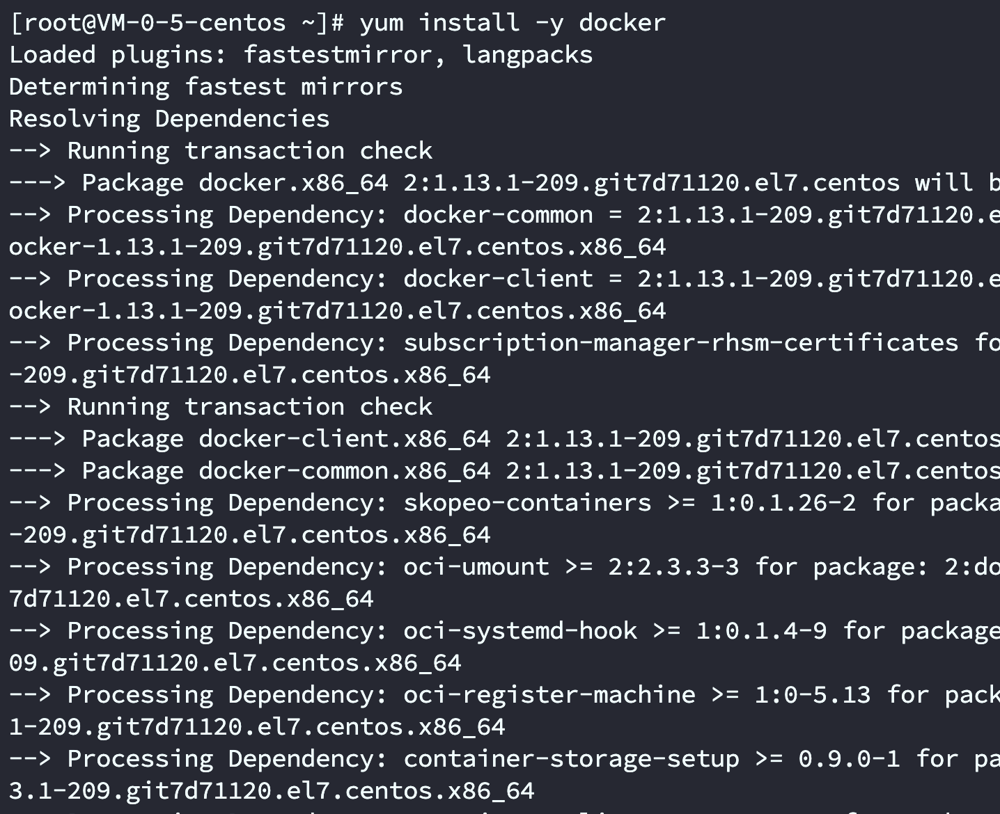

最后结果为：Complete!说明安装成功。

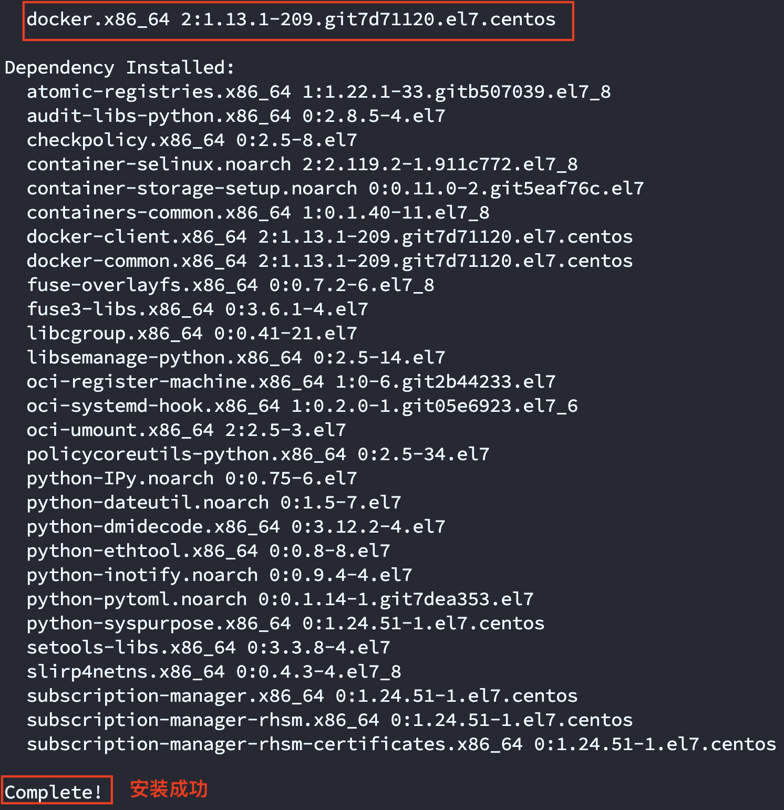


如果是mac电脑可以直接使用brew命令行安装docker，但是不建议大家在window系统或者mac系统上使用docker。

```bash
brew install docker
```

### Docker服务启动

如果不启动Docker服务直接运行docker命令，会在命令行终端提示当前 docker 进程是否正在运行？如下：


```bash
Cannot connect to the Docker daemon at unix:///var/run/docker.sock. Is the docker daemon running?
```
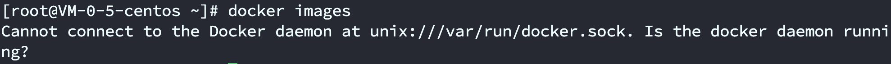


```bash
# 启动docker服务
systemctl start docker
```

>docker安装就相当于我们在电脑端安装了qq音乐的软件，但是这个时候qq音乐就能使用了吗？并不是的，我们需要打开qq音乐软件才能进入软件里面。这就是为什么docker需要分为2个步骤。

### 更新docker版本

#### 1. 卸载旧版本

卸载旧版本的 Docker，可以使用以下命令卸载：

```bash
sudo yum remove docker docker-client docker-client-latest docker-common docker-latest docker-latest-logrotate docker-logrotate docker-engine
```


#### 2. 更新 yum 软件包

更新 yum 软件包列表：


```bash
sudo yum update -y 
```

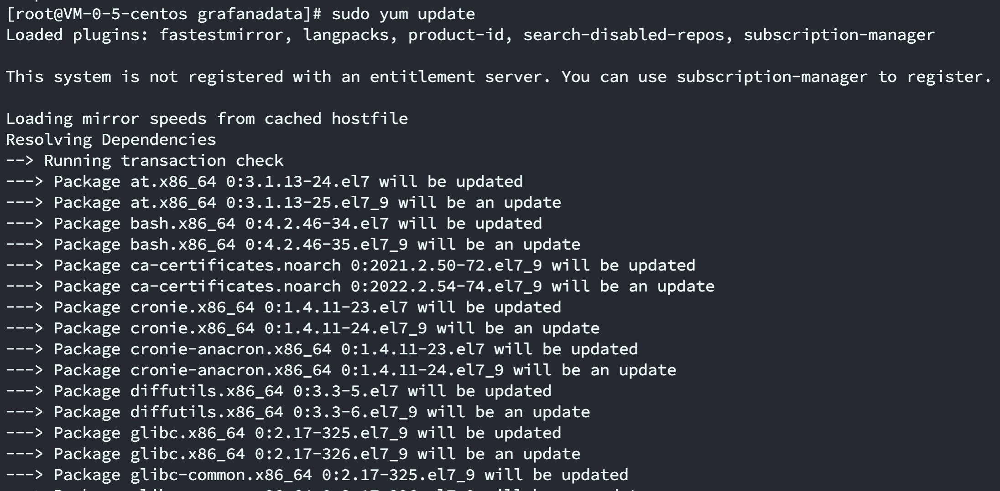

#### 3. 安装 Docker 的依赖包


```bash
sudo yum install -y yum-utils device-mapper-persistent-data lvm2
```

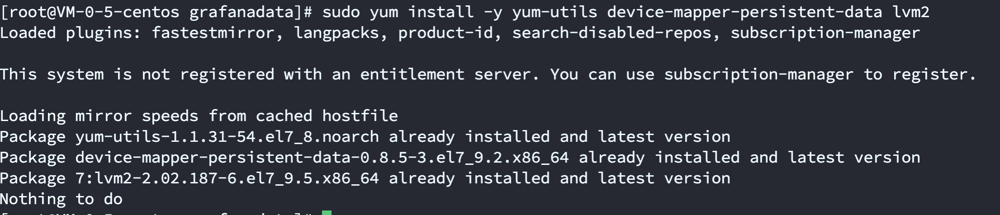

#### 4. 添加 Docker 的 YUM 软件源

```bash
sudo yum-config-manager --add-repo http://mirrors.aliyun.com/docker-ce/linux/centos/docker-ce.repo

```
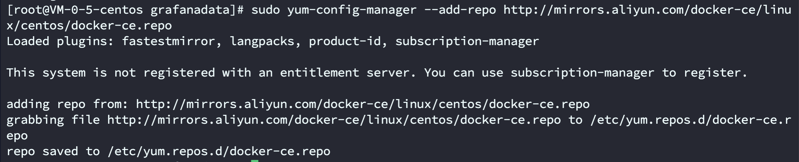


#### 5. 安装最新版的 Docker

```bash
sudo yum install -y docker-ce docker-ce-cli containerd.io
```
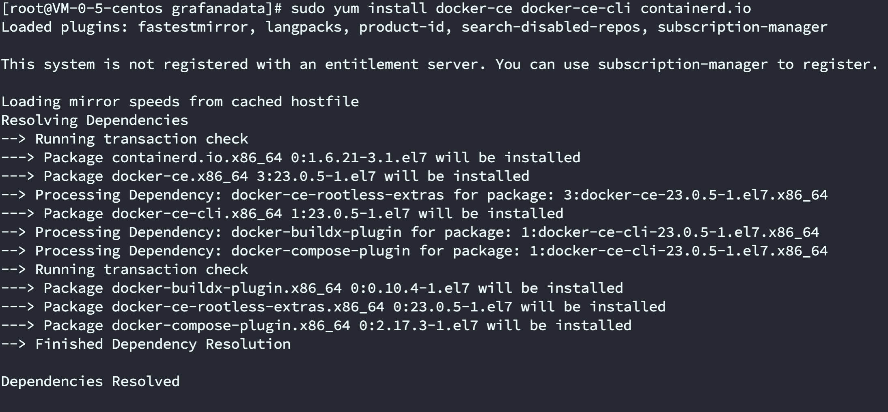


#### 6. 启动 Docker 服务


```bash
sudo systemctl start docker

#设置开机启动
systemctl enable docker
```

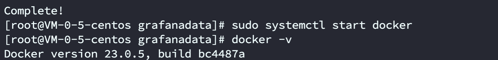


### 总安装命令

```bash
sudo yum update -y 
sudo yum install -y yum-utils device-mapper-persistent-data lvm2
sudo yum-config-manager --add-repo http://mirrors.aliyun.com/docker-ce/linux/centos/docker-ce.repo
sudo yum install -y docker-ce docker-ce-cli containerd.io
sudo systemctl start docker

```

## 为什么Docker能比较方便/比较简单的装系统呢？

Docker不像我们Mac电脑或者Window系统的电脑上安装的时候有很多软件或者工具都需要我们自己手动去装。

Docker 维护一个 **镜像** 的概念。这个镜像实际上它包含了一是**操作系统**，二是在**操作系统中已经内置好的一些应用或者软件**，都可以帮我们去提前安装完成。


然后在每次运行的时候，我们只需要去做 **两**件事情：

1. **找到镜像**。比如从 **远端** 或者从**本地制作镜像**找需要的镜像；

2. **启动镜像**。就像我们在启动一个系统一样，然后在本地通过 **docker file** 或者**docker run命令行**的方式，把它启动起来


这样我们就能使用 **Docker** ，即使不通过很多的配置，就可以快速去启动一个基本的 我们需要的服务。
>无论是 **Prometheus**「普罗米修斯」、 **JMeter** ，还是**JVM服务**，都可以用这种方式启动。

## Docker 常用命令

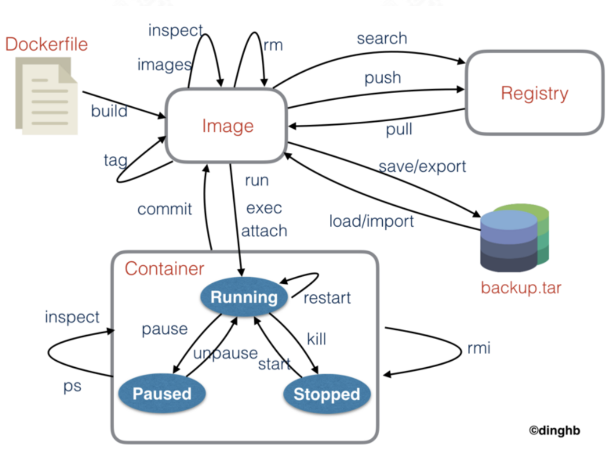

下面来介绍一下docker的常见命令。

### 版本查看

无需启动docker服务就可以验证版本号。

```bash
docker -v

docker version
```

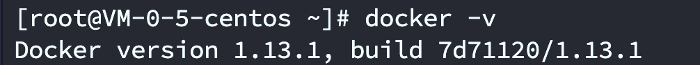

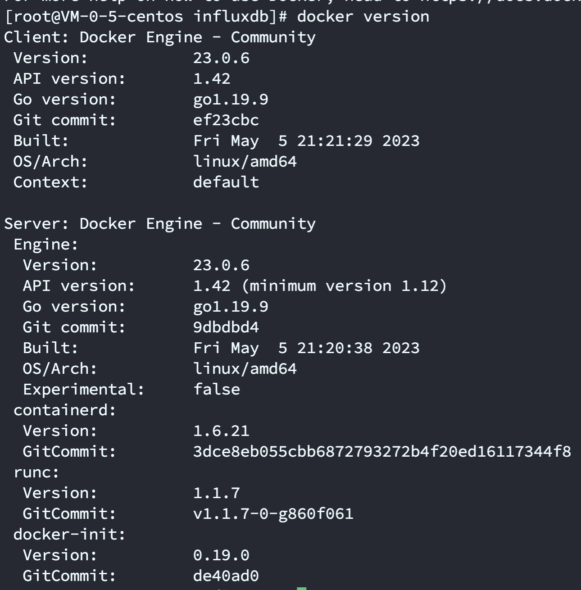


### 镜像相关命令

#### 本地镜像查看

Docker镜像是一个轻量级、可移植的容器化软件打包格式，包含了应用程序及其所有的依赖项和配置信息。Docker镜像可以被部署到任何支持Docker的平台上，如Docker引擎、Kubernetes等，从而实现快速、可重复、可移植的应用程序部署和运行。

Docker镜像是通过Dockerfile定义的，Dockerfile是一种文本文件，其中包含了应用程序的构建、配置和部署指令。Dockerfile可以使用一系列基础镜像和构建步骤来构建应用程序的镜像。基础镜像是指Docker镜像的基础，它包含了一些常用的操作系统、应用程序、工具和库等。构建步骤是指Dockerfile中的每个指令，如COPY、RUN、EXPOSE等，用于构建和配置应用程序的镜像。

Docker镜像的优势在于它可以实现轻量级、快速、可重复的应用程序部署和运行。通过Docker镜像，应用程序的所有依赖项和配置信息都被打包到镜像中，从而避免了应用程序在不同环境中的依赖冲突和配置问题。另外，Docker镜像的构建和部署过程都可以通过自动化脚本和工具来实现，提高了软件开发和运维的效率和可靠性。

>所有docker的一个描述都是以 **docker file** 来去描述和形容的，每次 docker file 通过docker build的命令，能生成一个镜像。

```bash
docker images
```

**Docker images命令只能列出本地计算机上的Docker镜像列表**。

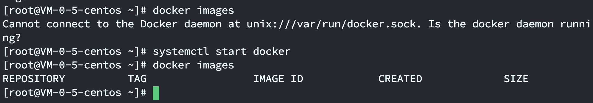

启动 Docker 服务后，再次查看镜像为空，不报错。

由于我们刚刚安装好docker并没有在docker内下载、安装其他的软件，所以，当前docker的镜像里面是空的。

##### 输出

```
REPOSITORY     TAG          IMAGE ID       CREATED       SIZE
nginx          latest     9d8f398e63ed    2 weeks ago    133MB
redis          latest     fdd3c10f3f68    3 weeks ago    105MB
mysql          latest     4a4f4c72f741    4 weeks ago    556MB
```


**REPOSITORY**：Docker镜像的仓库名称，格式为 **<仓库名称>** 。仓库名称可以是Docker Hub上的公共仓库名称或私有仓库名称，标签一般为Docker镜像的版本号或标识符。

**TAG**：标记 Docker 镜像的标签。同一个仓库可以有多个标签，每个标签对应一个不同的镜像版本。

>例如，nginx:latest表示Docker Hub上的公共nginx仓库中的最新版本镜像。

**IMAGE ID**：每个 Docker 镜像都有一个唯一的 ID 标识符，它由一串长字符串表示，用于标识该镜像的唯一性。

**CREATED**：Docker镜像的创建时间。

**SIZE**：Docker 镜像的大小，以**字节**为单位显示。该值指 Docker 镜像在本地计算机上占用的磁盘空间大小，包括镜像的各个层和元数据信息。


#### 远端镜像查看

需要注意的是，Docker images命令只能列出本地计算机上的Docker镜像列表，如果需要**查看远程Docker仓库**中的镜像列表，可以使用**Docker search**命令。

在 Docker Hub 上搜索公共镜像，并且可以根据不同的搜索条件进行过滤，从而找到需要的镜像。


```bash
docker search --limit 10 nginx
```

>该命令将返回 Docker Hub 上名称包含 nginx 的前 10 个镜像的相关信息。


```bash
docker search influxdb
```

>该命令将返回 Docker Hub 上名称包含 influxdb 的镜像的相关信息。

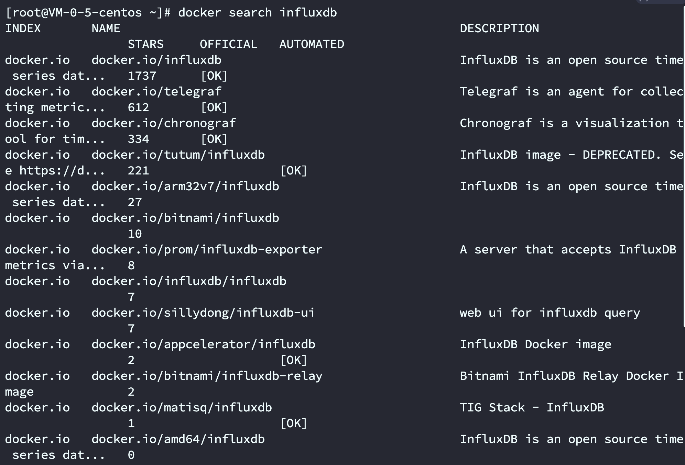

#### 远端镜像下载

```bash
docker pull influxdb
```

>下载完成后，使用本地镜像查看命令验证。


docker pull就把查找到的远端镜像下载到本地，如果没有加上具体的版本号的话默认下载最新版本的镜像。

>如果说我们自己的服务开发了一个新的镜像，可以用 Docker push 的方式，把它上传到远端，这样在日后其他的机器上也可以让需要的人使用到。

### 容器相关命令

看一下常用命令这张图，对应下面的一层是docker容器的命令。

#### 启动容器

docker run 会基于一个已有的镜像启动一个container容器。


```bash
docker run [OPTIONS] IMAGE [COMMAND] [ARG...]
```

Docker 中用于创建和运行容器的命令。它会根据指定的镜像创建一个新的容器，并在容器内运行指定的命令或应用程序。

具体如何启动在后面给大家说，因为启动的参数太多。


容器有三种状态：**运行中、被终止、被停止**。

**运行中（Running）**：指容器正在运行中，正在执行相应的命令或应用程序。可以通过 **docker ps** 命令查看所有正在运行的容器。

**停止（Stopped）**：指容器已经停止运行，但是仍然存在于 Docker 容器环境中。可以通过 **docker ps -a** 命令查看所有的容器，包括停止的容器。


#### 查看所有容器

```bash
# 所有正在运行的容器
docker ps

# 查看所有的容器，包括停止的容器
docker ps -a
```


# InfluxDB 

InfluxDB时序性数据库。
## 介绍
InfluxDB是一个开源的时间序列数据库，特别适合用于存储和查询大量时间序列数据，例如监控数据、传感器数据、日志数据等。它使用Go语言编写，具有高性能、水平可扩展、易于使用等特点。InfluxDB的主要特点包括：

时间序列数据库：InfluxDB是专门为时间序列数据设计的数据库，可以高效地存储和查询大量时间序列数据。

高性能：InfluxDB使用自己开发的TSDB（Time Series Database）引擎，可以高效地处理时间序列数据。

水平可扩展：InfluxDB可以通过集群方式进行水平扩展，以支持大规模的数据存储和查询。

易于使用：InfluxDB提供了简单易用的API和查询语言，可以方便地进行数据的存储、查询和可视化。

插件化架构：InfluxDB采用插件化架构，可以方便地扩展功能，例如添加新的数据源、数据输出等。

InfluxDB广泛应用于监控、物联网、日志分析等领域，例如Prometheus、Grafana等开源项目都可以与InfluxDB进行集成，提供完整的监控和可视化解决方案。

## 部署


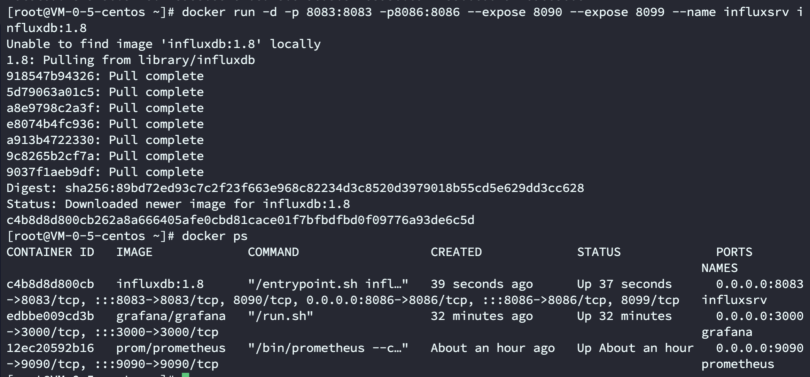


```bash
# 必须指定版本
docker run -d -p 8083:8083 -p8086:8086 --name influxdb influxdb:1.8


```

在 Docker 中启动 InfluxDB 容器。下面是各个参数的含义：

**-d**：以后台模式启动容器。
**-p 8083:8083**：将本地机器的 8083 端口映射到容器内的 8083 端口，用于 InfluxDB 的 **Web 管理界面**。
**-p 8086:8086**：将本地机器的 8086 端口映射到容器内的 8086 端口，用于 InfluxDB 的 **HTTP API**。

**--expose 8086**：向 Docker 网络暴露容器的 8090 端口。
**--name influxsrv**：给容器指定一个名称。
**influxdb:1.8**：要启动的 InfluxDB 镜像。最新版本可能数据兼容上有问题。没有界面化，无法通过界面化访问。


#### 1. 进入容器内部

```bash
docker exec -it influxdb bash
```


#### 2. 创建jmeter数据库


在容器内部创建jmeter数据库，用于收集JMeter发送的压测数据：

```bash
# 执行 influx命令进入命令台
influx
# 查看当前所有数据库
show databases;
# 执行类sql语句 创建jmeter数据库：
create database jmeter;
# 创建完jmeter数据库之后执行如下命令验证数据库已经创建成功: 
show databases;
```
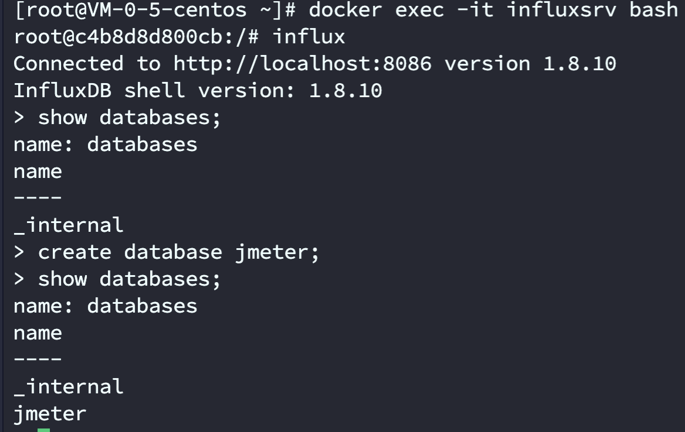

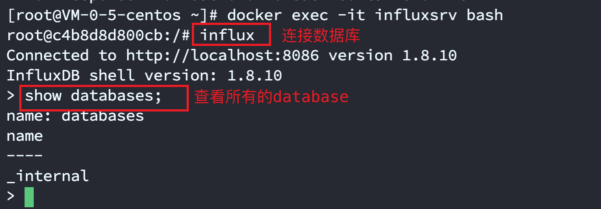


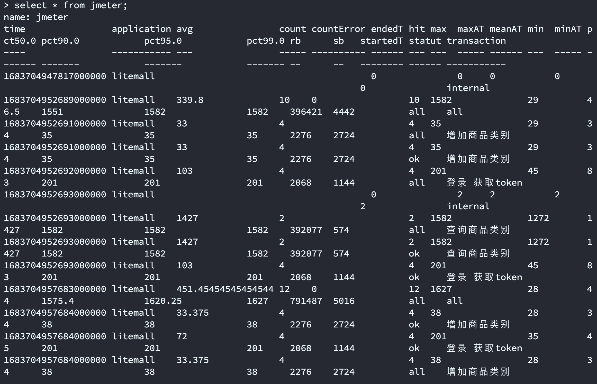


## docker还原 InfluxDB 数据


要在 Docker 中还原 InfluxDB 数据，你需要使用 influxd 命令行工具的还原功能。以下是一个示例命令行序列，用于在 Docker 中还原 InfluxDB 数据：


1. 将包含要还原的数据的备份文件复制到 InfluxDB 容器中：


```bash
docker cp /path/to/backup <container_id_or_name>:/backup
```

```bash
docker cp /root/influxdb influxdb:/backup
```

将 /path/to/backup 替换为包含要还原的数据的备份文件路径。将 <container_id_or_name> 替换为 InfluxDB 容器的 ID 或名称。这将从主机复制备份文件到容器内的 /backup 目录。

2. 在容器内执行还原命令：
```bash
docker exec -it <container_id_or_name> influxd restore -portable -db <database_name> /backup
```
将 `<container_id_or_name>` 替换为 InfluxDB 容器的 ID 或名称。将 <database_name> 替换为要还原数据的目标数据库名称。此命令将在容器内执行还原操作，并将备份文件中的数据还原到指定的数据库中。

```bash
docker exec -it influxdb influxd restore -portable -db jmeter /backup
```

进入容器验证是否有jmeter数据库以及是否有数据。


请确保备份文件的格式与 InfluxDB 版本兼容，并且在还原之前已经在容器内复制了正确的备份文件。在执行还原操作之前，你可以使用 docker exec 命令进入 InfluxDB 容器，检查 /backup 目录中是否存在正确的备份文件。

请注意，上述示例中使用的是 InfluxDB 1.x 版本的还原命令。如果你使用的是 InfluxDB 2.x 版本，还原过程会有所不同。在 InfluxDB 2.x 中，你可以使用 influxd restore 命令行工具来还原数据。请参考 InfluxDB 官方文档以获取适用于你的版本的详细信息和示例。


## Docker 中导出 InfluxDB 数据

要在 Docker 中导出 InfluxDB 数据，你可以使用 influxd 命令行工具的备份和还原功能。以下是一个示例命令行序列，用于在 Docker 中导出 InfluxDB 数据：

1. 获取正在运行 InfluxDB 容器的 ID 或名称：
```bash
docker ps
```
从输出中找到 InfluxDB 容器的 ID 或名称。

2. 在容器内执行备份命令：

```bash
docker exec -it <container_id_or_name> influxd backup -portable /backup
```


```bash
docker exec -it influxdb influxd backup -portable /backup
```

将 `<container_id_or_name>` 替换为 InfluxDB 容器的 ID 或名称。此命令将在容器内执行 InfluxDB 备份，并将备份文件保存在容器内部的 /backup 目录中。

3. 将备份文件从容器复制到主机：

```bash
docker cp <container_id_or_name>:/backup /path/on/host
```

```bash
docker cp influxdb:/backup /root/influxdb
```

将 `<container_id_or_name>` 替换为 InfluxDB 容器的 ID 或名称，并将 /path/on/host 替换为主机上用于保存备份文件的目录路径。这将从容器中复制备份文件到主机。

现在，你可以在主机上的指定目录中找到 InfluxDB 的备份文件。这个备份文件可以用于还原或迁移 InfluxDB 数据。

请注意，上述示例中使用的是 InfluxDB 1.x 版本的备份命令。如果你使用的是 InfluxDB 2.x 版本，备份和还原过程会有所不同。在 InfluxDB 2.x 中，你可以使用 influxd backup 和 influxd restore 命令行工具来备份和还原数据。请参考 InfluxDB 官方文档以获取适用于你的版本的详细信息和示例。


# 搭建数据分析展示系统 Grafana

Prometheus普罗米修斯搭建成功后，它有一个缺点，就是数据展示不是很好看，所以我们去搭建一个数据分析展示的系统，也就是Grafana。

Grafana现在已经是非常常用 并且 非常成熟的一个可视化工具。不止运维在用，很多QA和研发自己来用这个Grafana。

它最大的优点就是支持各种各样的数据源，比如Prometheus、InfluxDB、MySQL 等。通过数据源，Grafana 可以获取并展示来自这些数据系统的数据，用于创建各种类型的仪表盘和图表。

>Grafana 支持多种类型的数据源，每种数据源都有不同的配置参数和使用方法。例如，对于 Prometheus 数据源，需要配置 Prometheus 服务的 URL 地址和查询语言；对于 InfluxDB 数据源，需要配置 InfluxDB 的 URL 地址、用户名和密码等。

在 Grafana 中添加数据源时，需要指定**数据源类型**、**名称**、**地址**和**授权信息**等参数。

一旦数据源配置完成，就可以在 Grafana 中创建仪表盘和图表，并通过查询语句从数据源中获取数据。通过 Grafana 的数据源功能，可以方便地将多个数据系统和存储集成到一个统一的监控和数据分析平台中，为用户提供全面的数据可视化和分析功能。


## 介绍

Grafana是一个跨平台的开源的度量分析和可视化工具，可以通过将采集的数据查询然后可视化的展示，并及时通知。它主要有以下特点：

1、展示方式：快速灵活的客户端图表，面板插件有许多不同方式的可视化指标和日志，官方库中具有丰富的仪表盘插件，比如热图、折线图、图表等多种展示方式；

2、数据源：Graphite，InfluxDB，OpenTSDB，Prometheus，Elasticsearch，CloudWatch和KairosDB等；

3、通知提醒：以可视方式定义最重要指标的警报规则，Grafana将不断计算并发送通知，在数据达到阈值时通过Slack、PagerDuty等获得通知；

4、混合展示：在同一图表中混合使用不同的数据源，可以基于每个查询指定数据源，甚至自定义数据源；

https://github.com/grafana/grafana


## 部署

### 优先级：命令行安装

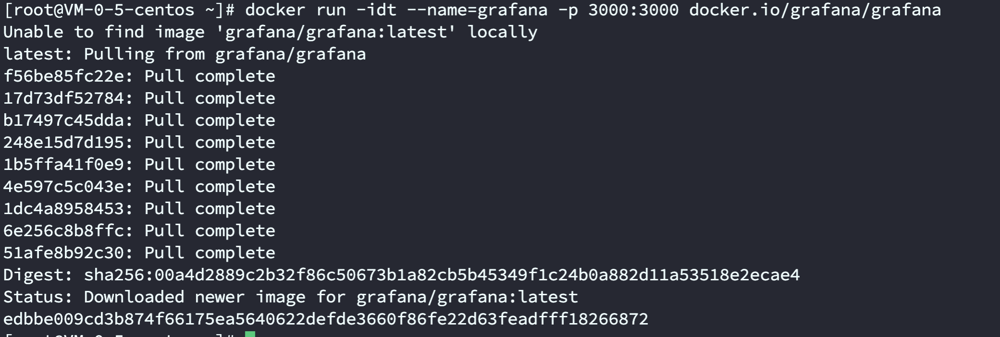

```bash
docker run -idt --name=grafana -p 3000:3000 docker.io/grafana/grafana

# docker run -d --name=<容器名称> -p 3000:3000 grafana/grafana

# docker run -d --name=grafana -p 3000:3000 grafana/grafana
```

**docker run**: 这是 Docker 命令，用于创建并运行一个新的容器。

**-idt**: 这些是 docker run 命令的选项。它们的含义如下：

**-i**：保持标准输入 (STDIN) 打开，使容器的标准输入保持可用。

**-d**：将容器运行在后台（分离模式）。

**-t**：在容器中分配一个伪终端 (pseudo-TTY)，以便可以与容器进行交互。

**--name=grafana**: 使用 grafana 作为容器的名称。

**-p 3000:3000**: 将主机的 3000 端口映射到容器的 3000 端口。这样可以通过主机的 3000 端口访问容器内运行的 Grafana 服务。

**docker.io/grafana/grafana**: 容器的镜像名称。在这种情况下，使用的是 Docker Hub 上的 grafana/grafana 镜像。


# Docker Compose安装

使用 Docker Compose 启动 Grafana 容器并将数据保存到本地目录

### 1. 创建存储数据目录

1. 在主机上创建用于存储 Grafana 数据的目录：

```bash
cd /root

mkdir grafanadata
```

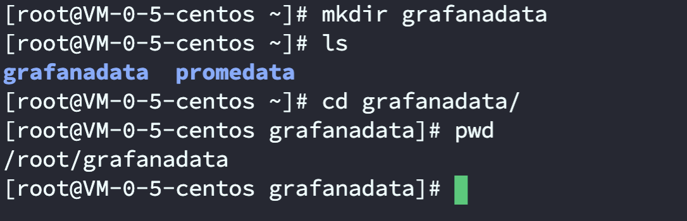

### 2. 创建docker-compose.yml

1. 在root下创建 docker-compose.yml 文件，内容如下：

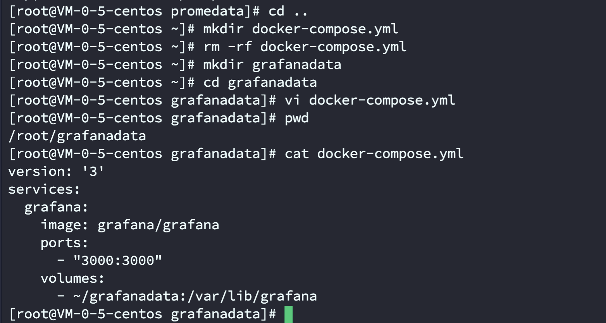

```yaml
version: '3'
services:
  grafana:
    image: grafana/grafana
    ports:
      - "3000:3000"
```

使用官方 Grafana 镜像，将容器内部的端口 3000 映射到主机的端口 3000。


>不实现：将主机上的 ~/grafanadata 目录挂载到容器内部的 /var/lib/grafana 目录中。

### 3. 启动 Grafana 容器

```bash

cd /root

docker-compose up -d
```

-d 参数表示在**后台运行容器**。

启动后，Grafana 容器中的数据将保存在本地目录 ~/grafanadata 中，重启容器时不会丢失数据。如果需要备份数据，可以将 ~/grafanadata 目录复制到其他位置即可。

#### 报错解决1

```bash
-bash: docker-compose: command not found
```
如果在执行 docker-compose 命令时出现 -bash: docker-compose: command not found 的错误，可能是因为您没有安装 Docker Compose 或者没有将其添加到 PATH 环境变量中。

##### 安装docker-compose

1. 安装

```bash
# sudo curl -L "https://github.com/docker/compose/releases/download/{version}/docker-compose-$(uname -s)-$(uname -m)" -o /usr/local/bin/docker-compose
```


2. 设置权限，添加可执行权限：

```bash
# 给 docker-compose 授权
sudo chmod +x /usr/bin/docker-compose
```

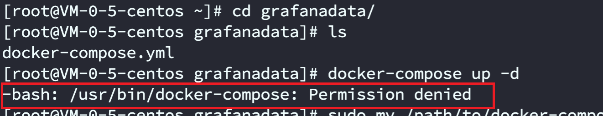

3. 检查是否安装成功
```bash
# 查看docker-compose版本
docker-compose -v
```

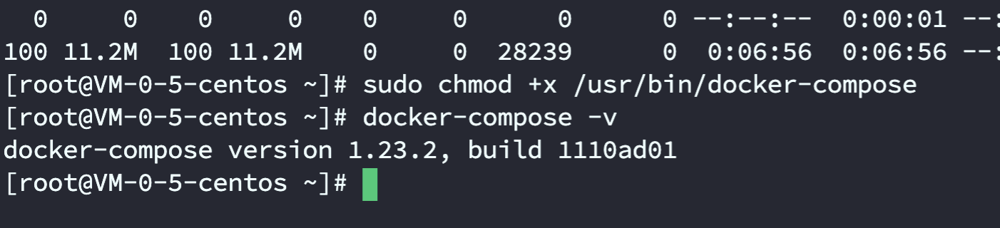

安装成功后后再运行启动Grafana容器。


## 验证

### 命令行验证

```bash
docker ps
```

查看到已经启动了。

#### 启动不成功

```bash
GF_PATHS_DATA='/var/lib/grafana' is not writable.
You may have issues with file permissions, more information here: http://docs.grafana.org/installation/docker/#migrate-to-v51-or-later
mkdir: can't create directory '/var/lib/grafana/plugins': Permission denied
```
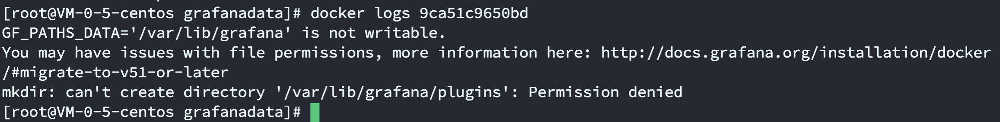


这个问题通常是由于 GF_PATHS_DATA 指定的目录没有写权限引起的。可以尝试以下步骤解决该问题：

1. 确认 /var/lib/grafana 目录存在。如果不存在，请先创建该目录：

```bash
sudo mkdir -p /var/lib/grafana
```

2. 确认该目录的权限设置正确。可以使用以下命令将该目录的所有者设置为当前用户，并赋予读写执行权限：

```bash
sudo chown -R $root:$root /var/lib/grafana
sudo chmod -R 775 /var/lib/grafana
```
3. 重新启动 Grafana 容器。如果容器已经在运行，请先停止容器，然后重新启动：


### 界面验证


访问验证 `http://<外网ip>:3000`。

[界面验证](http://81.70.96.121:3000/)。输入账号密码为：admin/admin。第一次启动比较慢，需要等待。


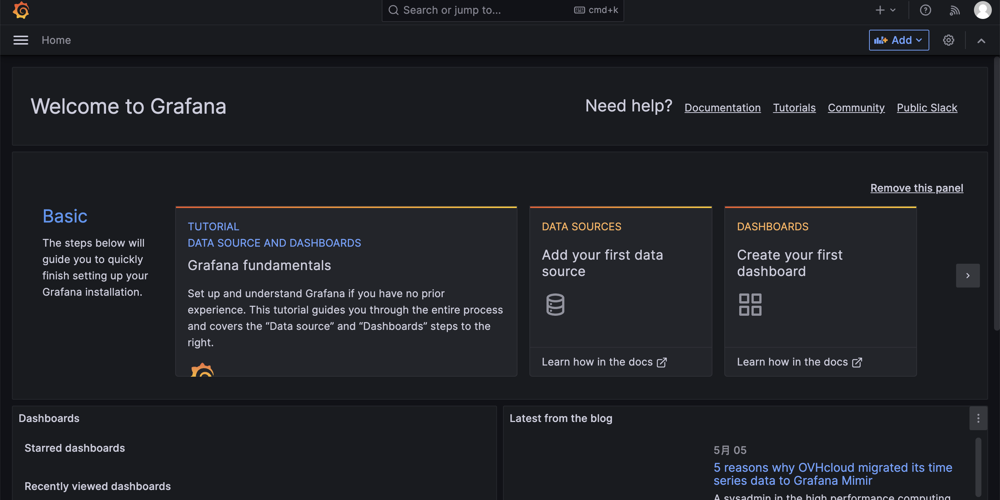

## Influxdb 数据源配置

[Influxdb](https://grafana.com/docs/grafana/latest/datasources/influxdb/)

1. 打开Grafana仪表板，并登录到您的账户。


2. 在Grafana界面的左侧导航栏中，Home --> Administration --> Data sources --> Add data source。

    
    

3. 在 "Data Sources" 页面上，点击 "Add data source"（添加数据源）按钮。

    

4. 在 "Add data source" 页面上，您需要填写以下信息：
   

   

   - Name（名称）：输入您要为数据源指定的名称，例如 "InfluxDB"。
   - URL：输入InfluxDB的URL地址，例如 http://localhost:8086。
   - Database（数据库）：输入要连接的InfluxDB数据库的名称。

5. 在填写完所有必要信息后，点击页面底部的 "Save & Test"（保存并测试）按钮。

6. Grafana将尝试连接到InfluxDB，并验证提供的信息。如果一切设置正确，您将看到一个成功的测试消息。
   
   

7. 点击 "Back"（返回数据源）链接，返回到 "Data Sources" 页面。

8. 在 "Data Sources" 页面上，您应该能够看到刚刚添加的InfluxDB数据源。

完成上述步骤后，您就成功地将InfluxDB配置为Grafana的数据源。您可以在创建仪表板时使用该数据源来查询和可视化InfluxDB中的数据。

## 创建JMeter仪表板

这个时候回到首页，没有显示出来刚刚配置的数据源的内容，也就是我们需要创建一个仪表板来显示数据。

要在Grafana中创建JMeter仪表板来监控和可视化JMeter测试结果，您可以按照以下步骤进行操作：


1. 首先，确保您已经安装并配置了Grafana和InfluxDB，并且已经运行了JMeter测试并将结果保存到InfluxDB中。

2. 打开Grafana仪表板，并登录到您的账户。

3. 在Grafana界面的导航栏中，找到并点击 "直接添加仪表板"选项。

   


4. 在 "New Dashboard" 页面上，您可以选择从头开始创建仪表板，或者使用现有的模板。
   

### 使用已有的仪表板

1. 进入仪表板界面，并点击右上角导入仪表板。

   

2. 输入已有的仪表板的ID:[4026](https://grafana.com/grafana/dashboards/4026)，配置grafana已有的数据源。
   
   


3. 点击导入后页面跳转到刚刚创建的仪表盘。
   


### 从头开始创建仪表板

1. 选择 "Blank"（空白）选项，以从头开始创建仪表板。


在 "New Dashboard" 页面上，您将进入仪表板编辑模式。您可以使用左上角的 "Add panel"（添加面板）按钮来添加图表和面板来显示JMeter测试结果。

在添加面板之前，您需要配置面板的数据源。点击面板上的 "Panel title"（面板标题）旁边的下拉箭头，然后选择 "Edit"（编辑）选项。

在面板编辑模式中，找到 "Query"（查询）选项卡，并点击 "Data Source"（数据源）下拉菜单。

从下拉菜单中选择您之前配置的InfluxDB数据源。


## Prometheus数据源配置

1. Home --> Administration --> Data sources --> Add data source

    
    


2. 配置Prometheus数据源


    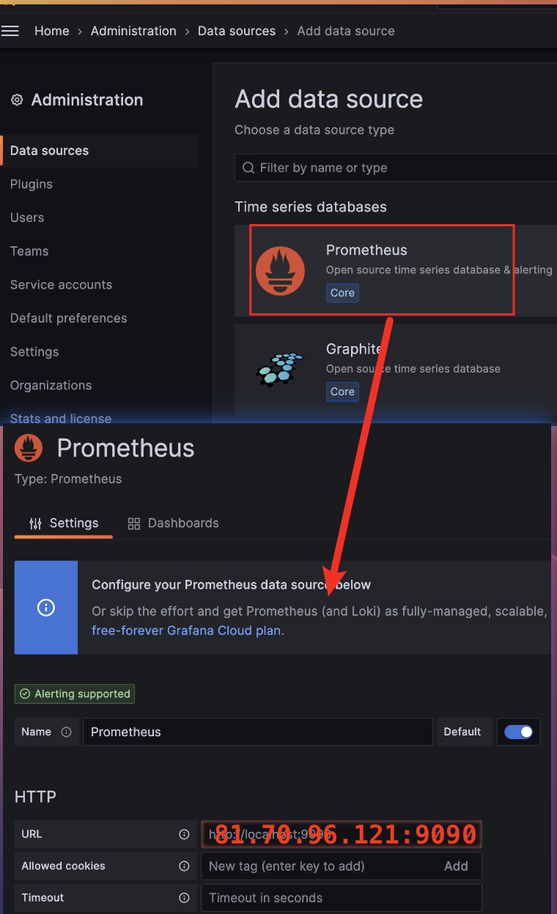


    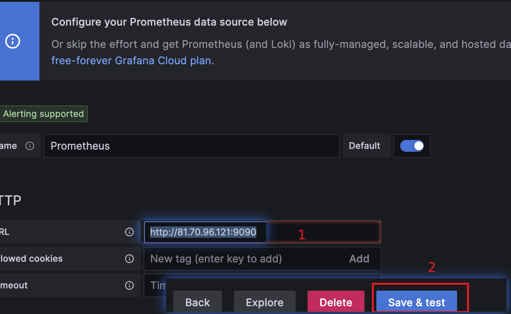


4. 返回查看验证。

    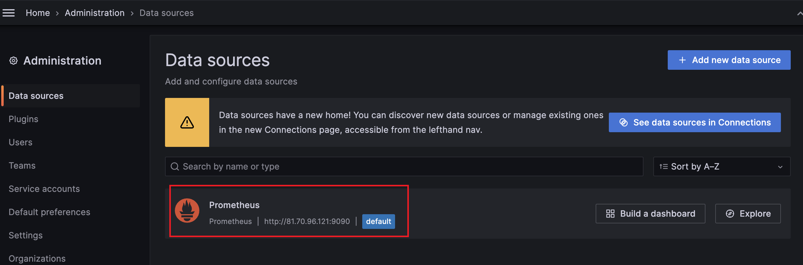


## 面板查看

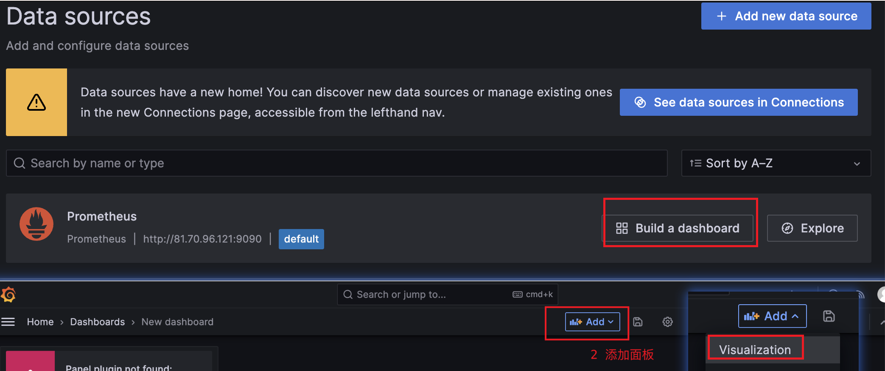

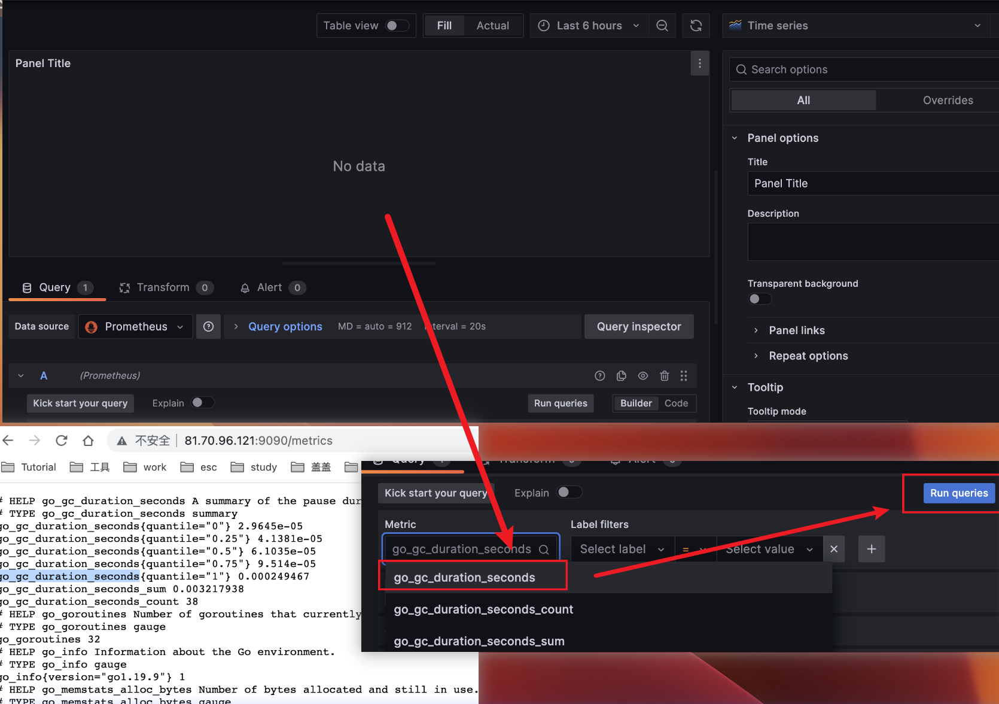

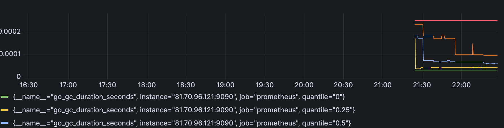


这就是最简单的一个Prometheus的配置页面。

这个主要就是做UI的展示，和性能指标的可视化。不再做过多介绍，就相当于写了一个前段页面。


# 搭建服务端监控系统 Prometheus

## 介绍

Prometheus是一种由go语言(golang)开发的开源监控、报警系统


Prometheus 是一款开源的系统和服务监控工具，由 SoundCloud 开源社区于 2012 年发起，目前已成为 Cloud Native Computing Foundation（CNCF）的一部分。Prometheus 主要用于监控分布式系统中的各种指标和时间序列数据，例如 CPU 使用率、内存使用率、网络流量等等，可以帮助开发人员和运维人员及时发现系统中的问题，并提供实时的性能分析和优化建议。


#### 主要特点

Prometheus 具有以下主要特点：

**多维度数据模型**：Prometheus 使用一种灵活的多维数据模型来存储和查询时间序列数据。用户可以通过标签（Label）来对数据进行分组和分类，并可以根据不同的维度进行查询和聚合，从而实现高效的数据管理和分析。

**灵活的查询语言**：PromQL 是 Prometheus 的查询语言，支持对时间序列数据进行查询、计算、聚合和图表展示。PromQL 具有类似 SQL 的语法结构，可以支持复杂的查询操作，并提供了丰富的内置函数和操作符，方便用户进行数据分析和挖掘。

**自动发现机制**：Prometheus 支持多种自动发现机制，例如 Consul、Zookeeper、Kubernetes 等等。这些机制可以自动发现并注册目标服务，并根据标签（Label）信息将其与特定的监控任务（Job）关联起来，从而实现高效的监控管理和维护。

**可扩展的架构**：Prometheus 的架构设计非常灵活和可扩展，支持多种存储后端（例如本地存储、远程存储、云存储等等），同时还可以通过中间件（例如 Grafana、Alertmanager 等等）实现多种数据展示和告警处理方式，方便用户根据自己的需求进行配置和扩展。

总之，Prometheus 是一款功能强大、易于使用和扩展的开源监控工具，已经被广泛应用于云原生、容器化等各种分布式系统的监控和管理中。

## 部署

- 部署方法： Docker 部署。


步骤：
1. 准备 Prometheus配置文件：**prometheus.yml**

2. 拉取 Prometheus镜像： **docker pull prom/prometheus**

3. 启动 Prometheus容器：`docker run -d --name prometheus -p 9090:9090 -v <local folder>:/etc/prometheus prom/prometheu`


### 准备 Prometheus配置文件

Prometheus 的配置文件是一个 YAML 格式的文本文件，包含了 **Prometheus 的配置信息** 和 **监控目标的定义**。在服务器端 **/root/promedata** 下创建一个 **prometheus.yml** 的配置文件。

```bash
# 进入到根用户下
cd /root
# 创建promedata文件夹
mkdir promedata
# 创建yaml文件
vi prometheus.yml
# 查看创建的yaml文件内容
cat prometheus.yml 
```


#### 配置文件

```yml
global:
  # 抓取指标的间隔,默认1m
  scrape_interval: 10s
  # 指定Prometheus评估规则的频率[记录规则(record)和告警规则(alert)],默认1m.
  # 可以理解为执行规则的时间间隔
  evaluation_interval: 10s

scrape_configs:
  - job_name: 'prometheus'
    static_configs:
      - targets: ['localhost:9090']
  - job_name: 'node-exporter'
    static_configs:
      - targets: ['localhost:9100']
```

该配置文件包含了两个部分：**global** 和 **scrape_configs**。

#### global

**global** 部分**定义了全局的配置信息**，例如**采集间隔**和**评估间隔**等。

#### scrape_configs

**scrape_configs** 部分则 **定义了监控任务**（Job）和**监控目标**（Target）。

上述配置文件中定义了两个监控任务，分别是 **prometheus** 和 **node-exporter**。

每个任务都包含了一个或多个监控目标（target），用于指定需要监控的服务或主机。

>在本例中，**prometheus** 任务的目标是本地的 **9090** 端口，而 **node-exporter** 任务的目标是本地的 **9100** 端口。


Prometheus 的配置文件还支持其他的配置项和参数，例如告警规则（rule_files）、存储配置（storage）、远程写入配置（remote_write）等等。用户可以根据自己的需求进行配置和调整，以实现更加精细和高效的监控管理。

### 拉取 Prometheus镜像

```bash
docker pull prom/prometheus
```

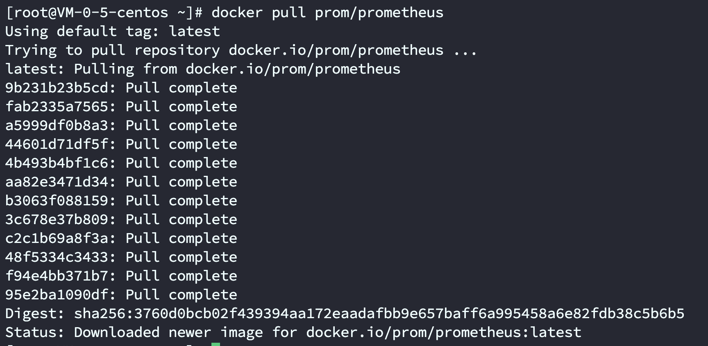

从 Docker Hub 上拉取 prom/prometheus 镜像到本地。

prom/prometheus 是一个官方维护的 Prometheus 镜像，包含了最新版本的 Prometheus 服务和相关的组件，可以用于快速部署和测试 Prometheus 监控系统。

#### 步骤

1. 打开终端或命令行界面。

1. **拉取镜像**：输入 docker pull prom/prometheus 命令，并按下回车键。

1. **等待镜像拉取完成**：等待 Docker 客户端从 Docker Hub 上拉取镜像到本地，该过程可能需要几分钟的时间，取决于网络速度和镜像大小。

1. **验证结果**：拉取完成后，可以使用 **docker images** 命令查看本地镜像列表，确认是否成功拉取了 prom/prometheus 镜像。

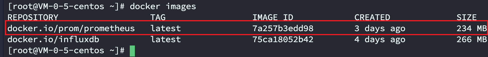


需要注意的是，拉取镜像前需要确保已经安装并配置好了 Docker 环境，并具有拉取镜像的权限和网络连接。

### 启动 Prometheus容器

在 Docker 中启动一个 Prometheus 容器，并将其映射到主机的 9090 端口。

```bash
# docker run -d --name prometheus -p 9090:9090 -v <local folder>:/etc/prometheus prom/prometheu

docker run -d --name prometheus -p 9090:9090 -v /root/promedata:/etc/prometheus docker.io/prom/prometheus
```

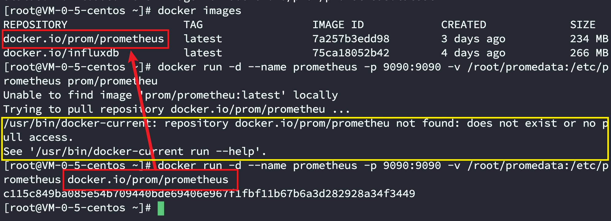

#### 参数

1. **-d**：表示在后台运行容器。

1. **--name prometheus**：指定容器的名称为 **prometheus**。

1. **-p 9090:9090**：将容器的 9090 端口映射到主机的 9090 端口上，允许主机通过浏览器访问 Prometheus 的 Web 界面。

1. **-v /root/promedata:/etc/prometheus**：将主机上的 /root/promedata 目录挂载到容器的 /etc/prometheus 目录上，用于持久化 Prometheus 的配置文件和数据。

>在主机上创建的配置文件映射到prometheus容器中，好处是在外面直接修改配置文件，容器中的配置跟着变化。

1. **docker.io/prom/prometheus**：指定要启动的 Prometheus 镜像，该镜像将从 Docker Hub 上下载并启动。

>该命令执行后，Docker 会根据提供的参数，在主机上启动一个新的 Prometheus 容器，并将容器的 9090 端口映射到主机的 9090 端口上。在容器启动后，用户可以通过浏览器访问 http://localhost:9090，查看 Prometheus 的 Web 界面并进行监控管理。同时，Prometheus 容器会自动加载配置文件和监控目标，开始对指定的服务或主机进行监控采集。


## 验证

### 命令行验证

```bash
docker ps
```

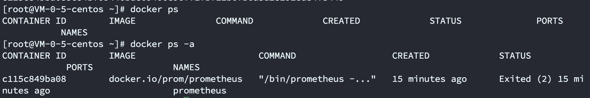

#### 重新启动已经停止的容器

可以使用 **docker start** 命令重新启动已经停止的容器，具体步骤如下：

1. 打开终端或命令行界面。

1. 使用 docker ps -a 命令查看所有容器的状态，确认需要启动的**容器的名称** 或 **ID**。

1. 使用 `docker start [容器名称或 ID]` 命令启动容器，其中 [容器名称或 ID] 为实际容器的名称或 ID，可以从 docker ps -a 命令的输出结果中获取。

1. 启动后，可以使用 docker ps 命令查看当前正在运行的容器列表，确认容器已经重新启动并正在运行。

需要注意的是，使用 docker start 命令启动已经停止的容器时，**容器的状态和数据将恢复到停止之前的状态**，因此可以继续使用容器提供的服务和功能。

如果需要对容器进行更新或配置修改，可以使用 **docker stop** 命令停止容器后再重新启动。

#### prometheus 启动不成功


如果在 Docker 中启动 Prometheus 容器时遇到问题，可以按照以下步骤进行排查：

1. 确认 Docker 已经正确安装，并已经启动 Docker 服务。

1. 检查 Docker 容器是否存在，可以使用 docker ps -a 命令查看所有容器的状态。

1. 如果之前已经启动过同名的 Prometheus 容器，可以先停止并删除该容器，然后再重新启动新的容器。可以使用 docker stop [容器名称或 ID] 命令停止容器，使用 docker rm [容器名称或 ID] 命令删除容器。

1. 检查启动容器的命令是否正确，特别是参数和文件路径是否正确。可以参考官方文档或其他教程检查命令是否有误。

1. 如果是通过 Docker Compose 启动容器，在编写 Compose 文件时需要确认容器的配置是否正确，特别是映射的端口和文件路径是否正确。

1. 检查 Docker 容器日志，可以使用 **docker logs [容器名称或 ID]** 命令查看容器的日志输出，确认容器启动过程中是否出现错误或异常信息。

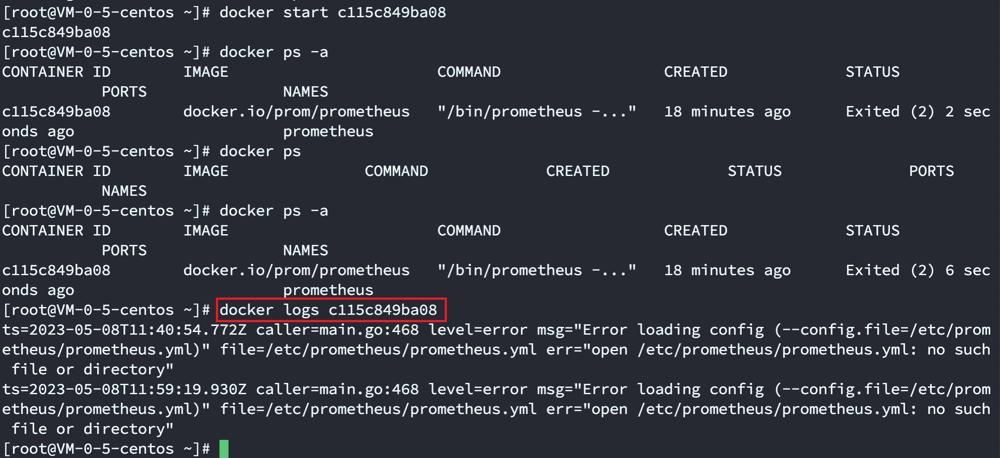

```bash
# 获取容器ID
docker ps -a
# 查看容器启动的日志
docker logs c115c849ba08
```

#### 错误日志排查

```log
ts=2023-05-08T11:40:54.772Z caller=main.go:468 level=error msg="Error loading config (--config.file=/etc/prometheus/prometheus.yml)" file=/etc/prometheus/prometheus.yml err="open /etc/prometheus/prometheus.yml: no such file or directory"
ts=2023-05-08T11:59:19.930Z caller=main.go:468 level=error msg="Error loading config (--config.file=/etc/prometheus/prometheus.yml)" file=/etc/prometheus/prometheus.yml err="open /etc/prometheus/prometheus.yml: no such file or directory"
```

这个错误提示通常是由于 Prometheus 容器在启动时无法找到配置文件导致的。

根据命令 docker run -d --name prometheus -p 9090:9090 -v /root/promedata:/etc/prometheus docker.io/prom/prometheus，将本地目录 /root/promedata 映射到了 Prometheus 容器内部的配置文件目录 /etc/prometheus，这个操作的目的是为了将本地的配置文件映射到容器内部，使得 Prometheus 能够读取到该配置文件。

因此，要解决这个错误，您需要检查以下几点：

1. 检查您本地的 /root/promedata 目录中是否有一个名为 prometheus.yml 的文件，如果没有，您需要创建一个该文件，并在其中配置 Prometheus 的相关参数。

1. 确保您在本地的 /root/promedata 目录中，已经将 Prometheus 的配置文件命名为 prometheus.yml，并且该文件的权限设置正确，可读可写。

1. 确保您在启动 Prometheus 容器时，使用的配置文件路径是正确的，即 --config.file=/etc/prometheus/prometheus.yml。这个路径指的是容器内部的配置文件路径，您需要将本地的 prometheus.yml 文件映射到该路径上。

```bash
mv prometheus.yml promedata
```
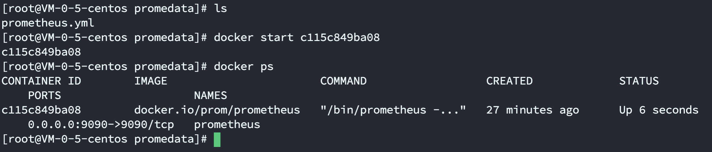


如果您已经确认以上几点都正确无误，但仍然无法启动 Prometheus 容器，那么可能是其他原因导致的，可以检查容器的日志输出或者其他相关信息，以便进一步排查问题。

### 界面验证


target是现在所有配置在 Prometheus普罗米修斯的一些指标上报的服务的状态。


访问验证 `http://<外网ip>:9090/targets`。


[界面验证](http://81.70.96.121:9090/targets)。

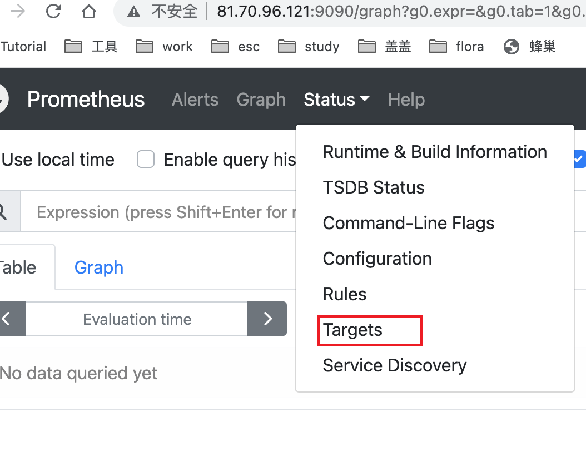

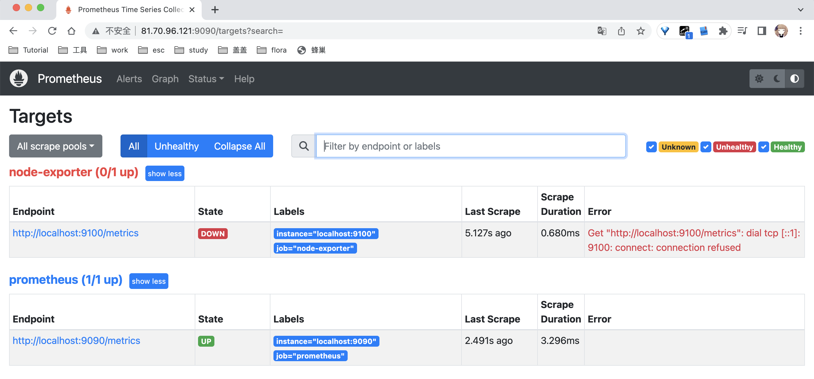


#### 报错解决

发现页面虽然能访问，但是对应9100链接报错标红，是因为配置文件中使用的ip不是外网的IP是localhost。

解决步骤：

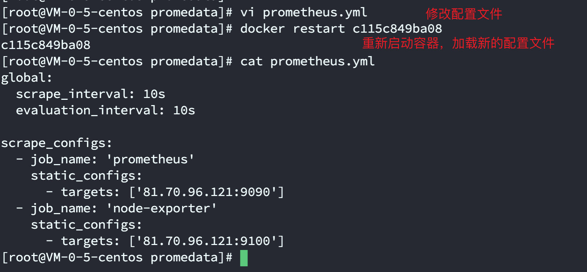

```bash
# 进入到配置文件目录
cd /root/promedata
# 修改配置文件中localhost为外网IP
vi prometheus.yml
# 查看是否修改成功
cat prometheus.yml
# 重启容器，重新加载新的配置文件
docker restart c115c849ba08 
```

页面刷新验证：

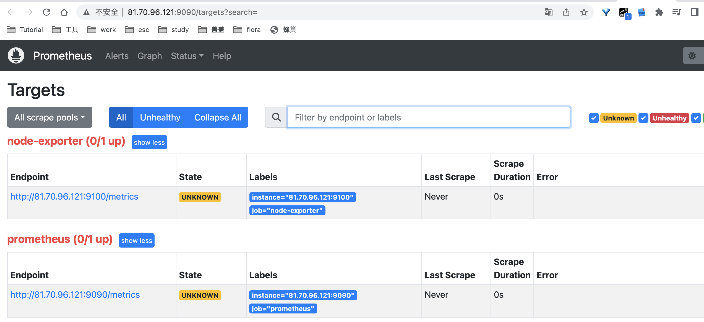

但是点进去无法访问，因为我们只是把对应监控位置预留出来，并不是真正的有监控的配置，所以点击进入无法正常访问。

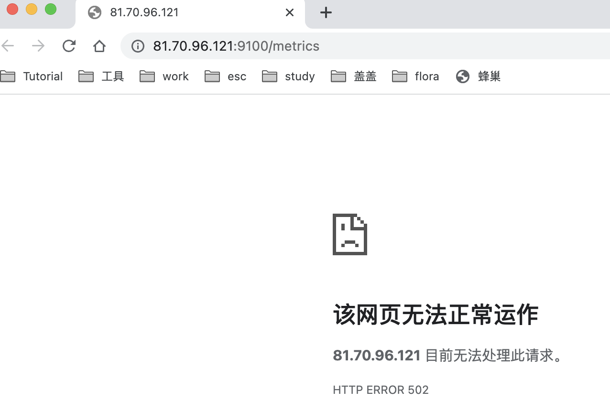

我们已经启动了Prometheus自己的监控，所以点击进入可以查看到Prometheus自己收集到的一些自己的日志信息。

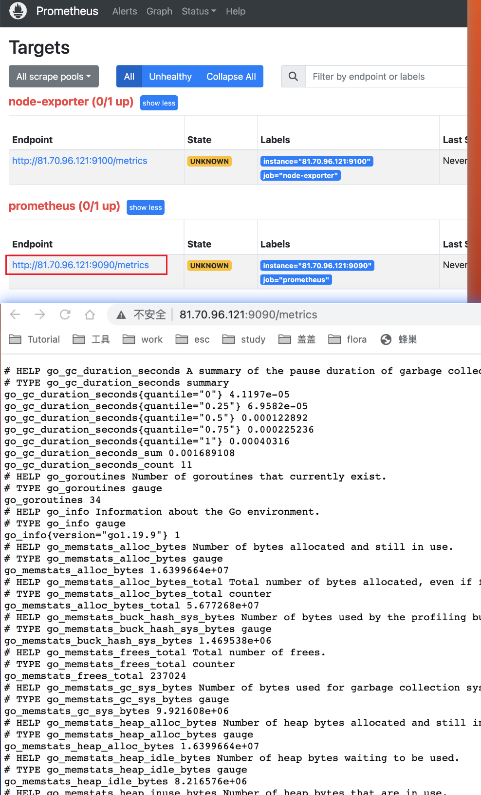


