# 引子
声音可以听到吗？请大家帮忙确认下

大家好，很高兴能同学们来参加咱们霍格沃兹测试开发学社的的训练营。

提醒大家关注视频号

# 搭建数据分析展示系统 Grafana


## Influxdb 数据源配置

[Influxdb](https://grafana.com/docs/grafana/latest/datasources/influxdb/)

1. 打开Grafana仪表板，并登录到您的账户。


2. 在Grafana界面的左侧导航栏中，Home --> Administration --> Data sources --> Add data source。

    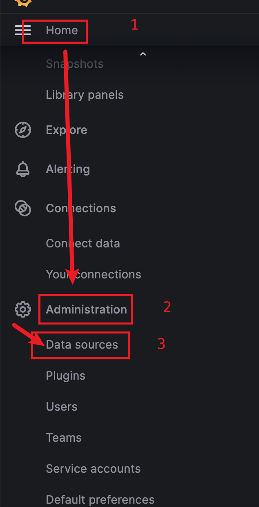
    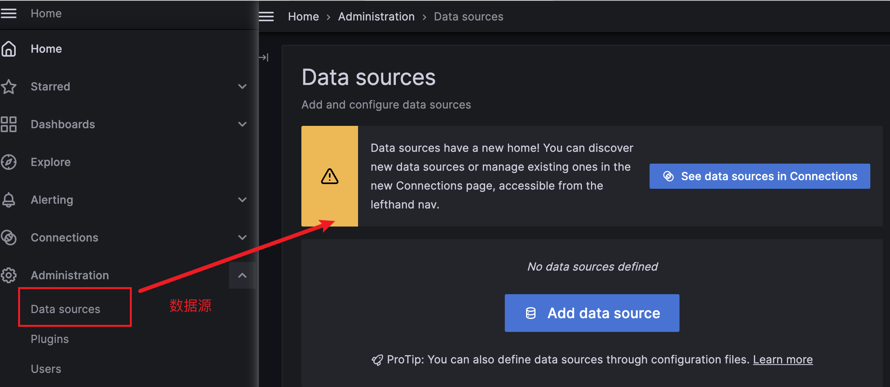

3. 在 "Data Sources" 页面上，点击 "Add data source"（添加数据源）按钮。

    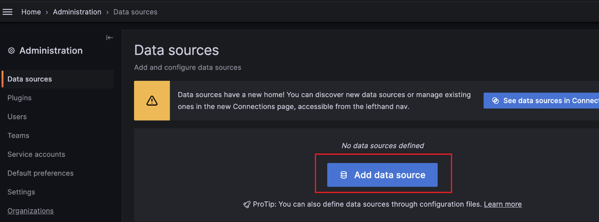

4. 在 "Add data source" 页面上，您需要填写以下信息：
   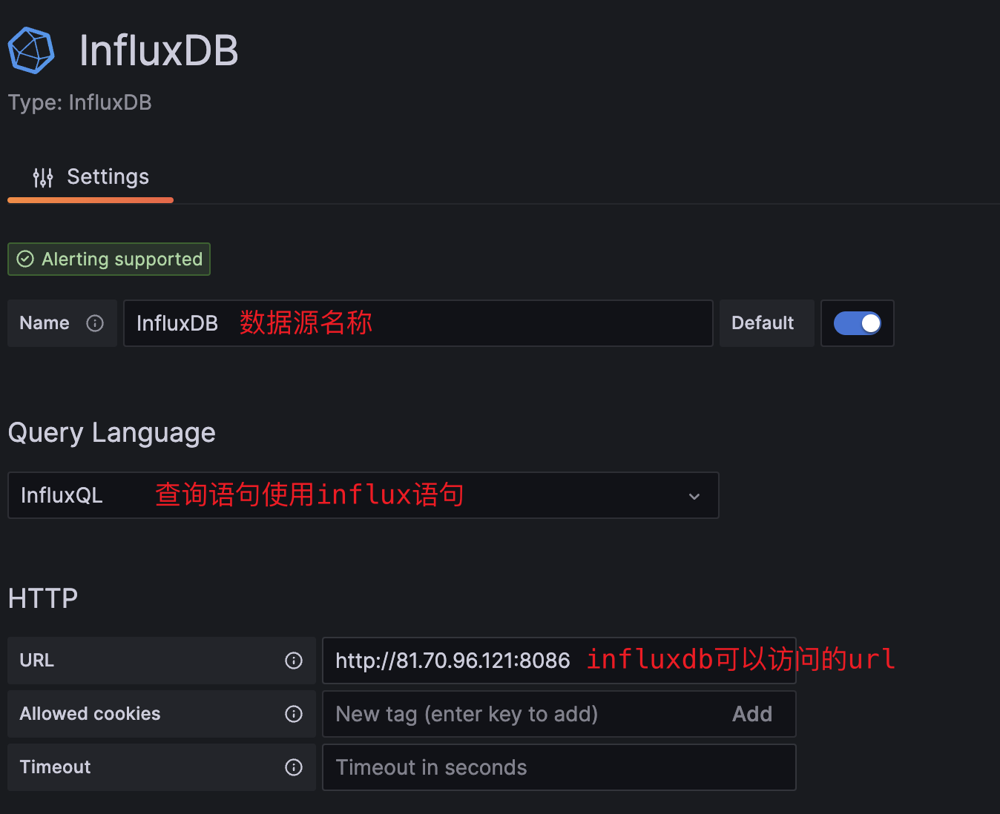

   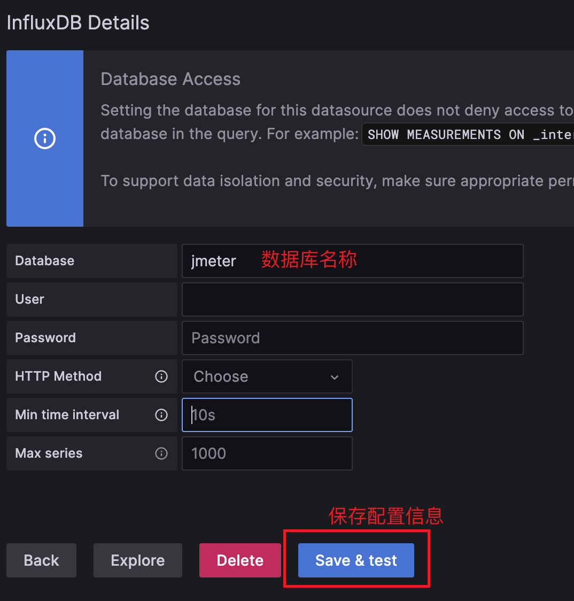

   - Name（名称）：输入您要为数据源指定的名称，例如 "InfluxDB"。
   - URL：输入InfluxDB的URL地址，例如 http://localhost:8086。
   - Database（数据库）：输入要连接的InfluxDB数据库的名称。

5. 在填写完所有必要信息后，点击页面底部的 "Save & Test"（保存并测试）按钮。

6. Grafana将尝试连接到InfluxDB，并验证提供的信息。如果一切设置正确，您将看到一个成功的测试消息。
   
   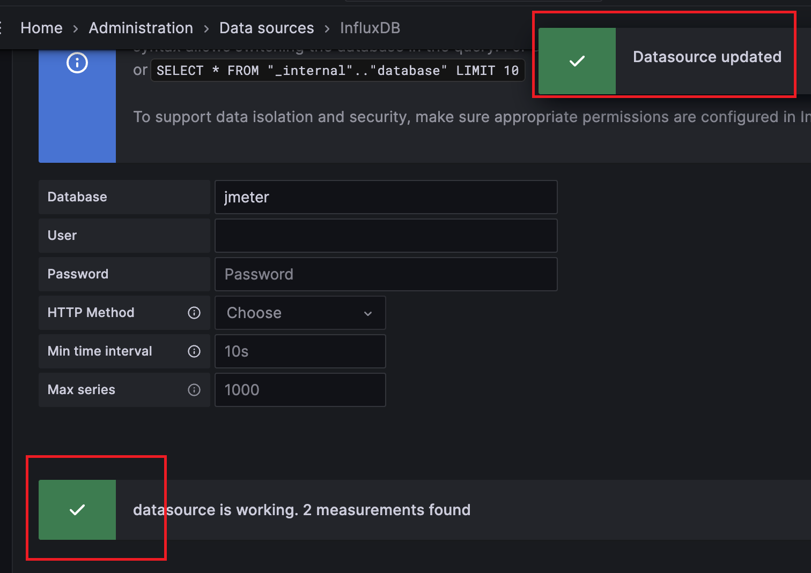

7. 点击 "Back"（返回数据源）链接，返回到 "Data Sources" 页面。

8. 在 "Data Sources" 页面上，您应该能够看到刚刚添加的InfluxDB数据源。

完成上述步骤后，您就成功地将InfluxDB配置为Grafana的数据源。您可以在创建仪表板时使用该数据源来查询和可视化InfluxDB中的数据。

## 创建JMeter仪表板

这个时候回到首页，没有显示出来刚刚配置的数据源的内容，也就是我们需要创建一个仪表板来显示数据。

要在Grafana中创建JMeter仪表板来监控和可视化JMeter测试结果，您可以按照以下步骤进行操作：


1. 首先，确保您已经安装并配置了Grafana和InfluxDB，并且已经运行了JMeter测试并将结果保存到InfluxDB中。

2. 打开Grafana仪表板，并登录到您的账户。

3. 在Grafana界面的导航栏中，找到并点击 "直接添加仪表板"选项。

   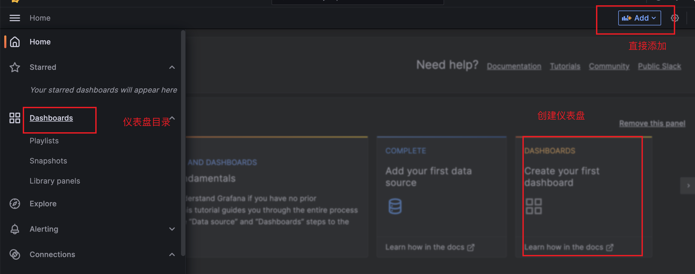


4. 在 "New Dashboard" 页面上，您可以选择从头开始创建仪表板，或者使用现有的模板。
   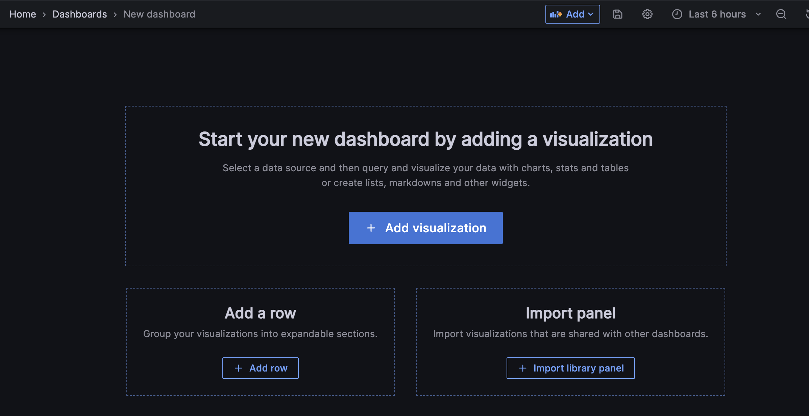

### 使用已有的仪表板

1. 进入仪表板界面，并点击右上角导入仪表板。

   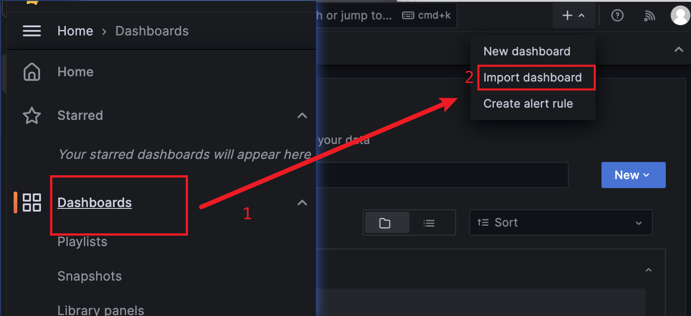

2. 输入已有的仪表板的ID:[4026](https://grafana.com/grafana/dashboards/4026)，配置grafana已有的数据源。
   
   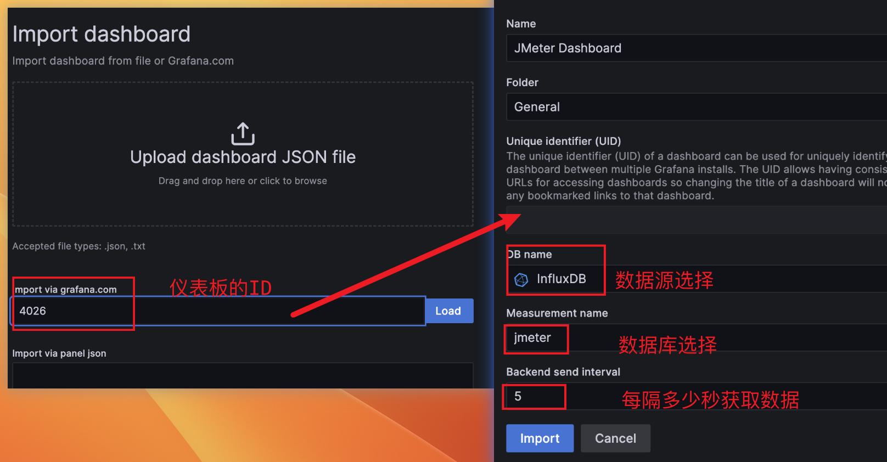


3. 点击导入后页面跳转到刚刚创建的仪表盘。
   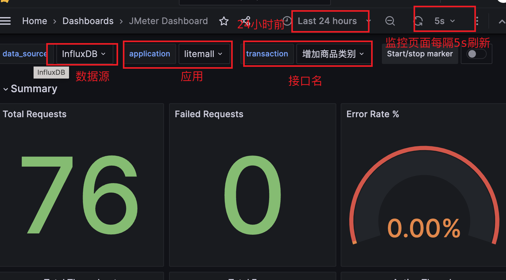


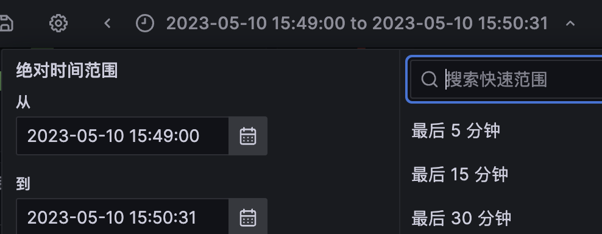

### 从头开始创建仪表板

# JMeter 配置

JMeter使用后端监听器组件，把压测结果实时异步的同步给influxdb


## Backend Listener

Backend Listener（后端监听器）是JMeter提供的一个组件，用于**收集和记录性能测试期间生成的数据**。它可以将测试结果发送到不同的目标，如控制台、文件、数据库或其他远程系统，以便进行进一步的分析和监控。


# Implementatin

可以看到，Jmeter默认选中的Implementatin是 GraphiteBackendListenerClient ，它是Jmeter 2.13就开始提供了；在Jmeter 3.2时又加多了一个 InfluxDBBackendListenerClient  ，哎~这两者有什么区别呢

不建议Jmeter使用 GraphiteBackendListenerClient 来采集数据的，因为请求多起来的时候会有非常多的表，维护成本也会增加；介绍如何通过 InfluxDBBackendListenerClient  来采集数据


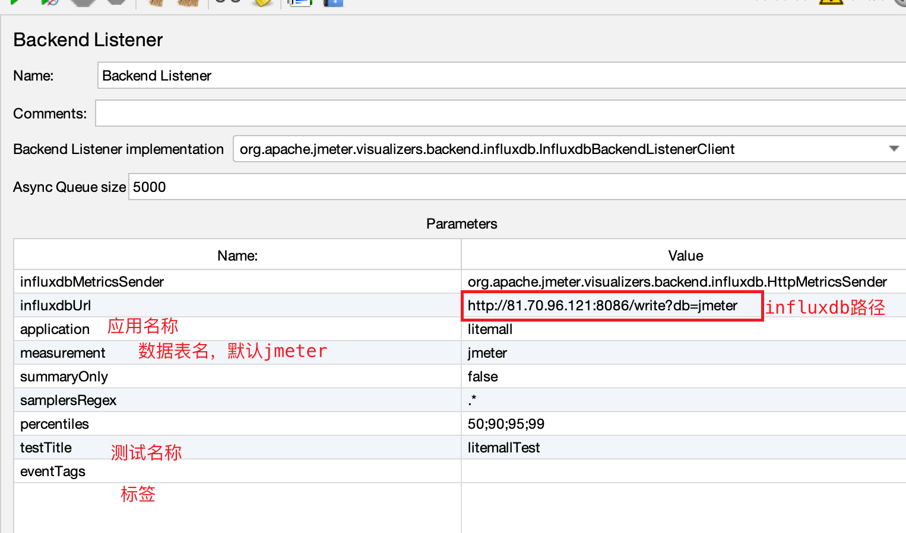

首先来看看每个配置项的含义

- influxdbUrl：安装influxdb的路径；主要格式：http://主机地址:8086/write?db=数据库名

- application：应用名称；在 events 表中对应的字段是 application 

- measurement：表名；数据存储到哪个表，默认是jmeter，不用改即可

- summaryOnly：当你线程组有多个请求又想知道每个请求的结果数据时，最好填false，因为true只会返回所有请求的集合数据报告，不会输出每条请求的数据报告


- samplersRegex：取样器列表；想收集哪些请求就填哪些，最好用正则去匹配，减轻工作量

- percentiles：百分比；即类似聚合报告里90% Line，95% Line，99% Line的数据；倘若想要99.9时，需要写成【99_9】，用下划线代替点


- testTitle：测试名称；在 events 表中对应的字段是 text ，JMeter在测试的开始和结束时自动生成注释，该注释的值以'start'和'end'结尾
- eventTags：Grafana允许为每个注释显示标签；在 events 表中对应的字段是 tags 

不懂application和testTitle的小伙伴可以看看下面的图，可以看到同一个testTitle的两条记录的时间差就是执行测试计划的总时长

 
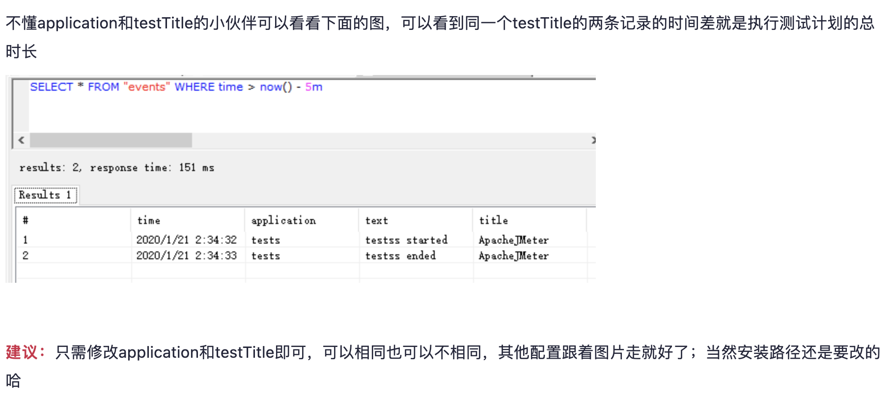


graphiteHost：InfluxDB安装的服务器的ip

graphitePort：端口；默认就是2003，除非你自己安装InfluxDB时设置了其他端口是哦（可见上面安装InfluxDB后关于graphite的配置）

rootMetricsPrefix：指标的根前缀；将测试结果存入数据库时，不同指标会生成不同表，但这些表都最好要有一个共同的前缀，这个就是了；后面会讲到不同的指标的含义（重点哦）

summaryOnly：当你线程组有多个请求又想知道每个请求的结果数据时，最好填false，因为true只会返回所有请求的集合数据报告，不会输出每条请求的数据报告

samplersList：取样器列表；想收集哪些请求就填哪些，最好用正则去匹配，减轻工作量

useRegexpForSamplersList：是否使用正则；如果true则使用，samplersList里可以匹配正则表达式

percentiles：百分比；即类似聚合报告里90% Line，95% Line，99% Line的数据；倘若想要99.9时，需要写成【99_9】，用下划线代替点


## 查看InfluxDB
使用InfluxDBBackendListenerClient好处就是，再多的请求也只会生成两张表：


**events** ：主要拿存事件的

**jmeter** ：存测试结果数据的，Grafana也是从这个表获取数据再展示

 
## 数据分析

在InfluxDB数据库中，表被称为"measurement"（测量）。您可以使用InfluxDB的查询语言（InfluxQL）来查看数据库中的所有表。

```
SHOW MEASUREMENTS
```
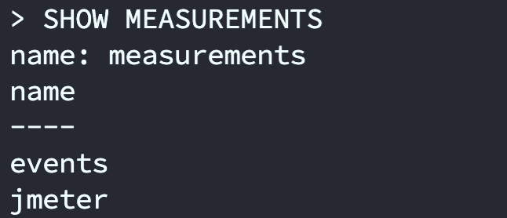


### 字段含义

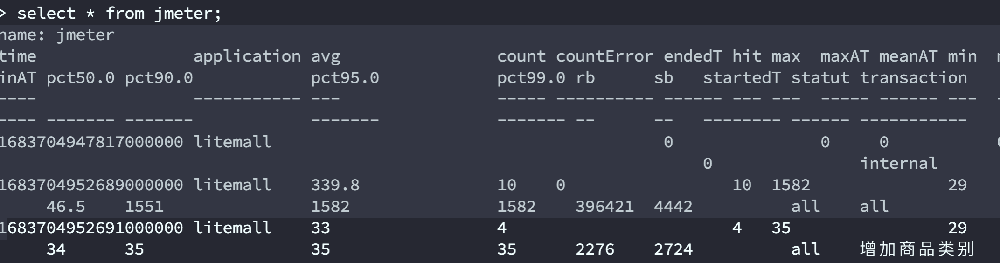


- time: 时间戳，表示测量数据的时间。
- application: 应用程序名称或标识符。
- avg: 平均值，可能是请求的平均响应时间或其他指标的平均值。
- count: 计数，可能是请求的数量或事件的数量。
- countError: 错误计数，表示请求中出现错误的数量。
- endedT: 结束时间，表示请求或事件的结束时间。
- hit: 命中次数，表示缓存或其他机制的命中次数。
- max: 最大值，可能是请求的最大响应时间或其他指标的最大值。
- maxAT: 最大活动线程数，表示同时处理请求的最大线程数。
- meanAT: 平均活动线程数，表示在一段时间内的平均活动线程数。
- min: 最小值，可能是请求的最小响应时间或其他指标的最小值。
- minAT: 最小活动线程数，表示同时处理请求的最小线程数。
- pct50.0: 百分位数，表示请求响应时间的中位数。
- pct90.0: 百分位数，表示请求响应时间的90th百分位数。
- pct95.0: 百分位数，表示请求响应时间的95th百分位数。
- pct99.0: 百分位数，表示请求响应时间的99th百分位数。
- rb: 请求字节数，表示请求的字节数。
- sb: 响应字节数，表示响应的字节数。
- startedT: 开始时间，表示请求或事件的开始时间。
- statut: 状态，表示请求的状态或事件的状态。
- transaction: 事务名称或标识符，用于标识请求所属的事务。


再次Grafana&InfluxDB集成，展示测试结果数据


# BackendListener是啥？


在测试运行期间，Backend Listener将收集并发送测试结果数据到您指定的目标系统。

请注意，具体的配置选项和设置可能因所选择的实现类而有所不同。您需要参考Backend Listener的文档或相关文档，以获取准确的配置和使用说明。

Backend Listener非常有用，可以帮助您实时监控和分析性能测试结果，从而了解系统的性能指标和瓶颈，并做出相应的调整和优化。


后端监听器的工作原理基于JMeter的架构和插件机制。JMeter提供了插件扩展机制，允许开发人员编写自定义的后端监听器，以适应不同的目标系统和数据格式要求。这使得JMeter非常灵活，可以与各种后端系统集成，并根据需求定制性能测试结果的处理和分析。


源码简单介绍BackendListener是一种异步监听并获取到测试结果的实现类，也就是说测试（例如发出的HTTP请求的响应结果，及请求数据）都会被封装在SampleResult对象中并被其监听接收


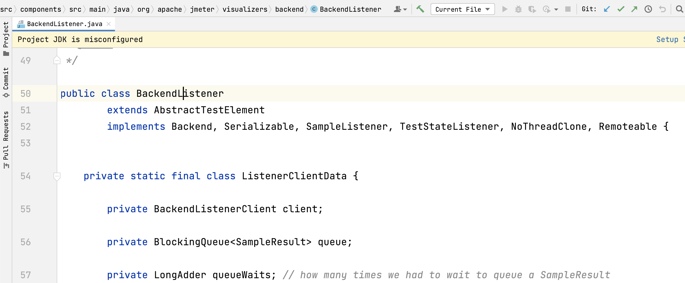

#### 为什么BackendListener能接收SampleResult？

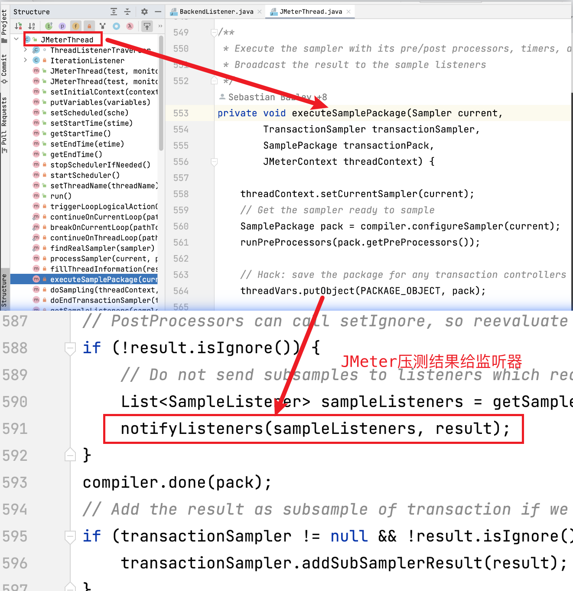


Backend Listener能接收SampleResult是因为在JMeter的设计中，SampleResult对象是用于存储每个请求/响应的详细信息的重要组件。它包含了请求的各种属性（如URL、响应代码、响应时间等）以及相关的统计数据（如响应大小、错误计数等）。

Backend Listener可以访问和处理SampleResult对象，以提取其中的数据，并将其发送到后端系统进行进一步的分析和监控。通过SampleResult对象，Backend Listener能够获取关键的性能指标，如请求的响应时间、吞吐量、错误率等。

在JMeter的测试执行过程中，每个请求/响应都会生成一个SampleResult对象。这些对象会被JMeter收集和维护，并在需要时传递给监听器。Backend Listener作为监听器的一种类型，具有特定的实现逻辑，使其能够接收和处理这些SampleResult对象。

通过访问SampleResult对象，Backend Listener能够对测试结果进行分析、监控和报告生成。它可以提取关键指标，并将其发送到指定的后端系统，以便进行实时监控和性能分析。

因此，Backend Listener能够接收SampleResult是因为SampleResult对象是JMeter中用于存储请求/响应信息和性能指标的重要数据结构，并且JMeter的架构和插件机制允许监听器访问和处理这些对象。


#### BackendListener有什么用？


# InfluxdbBackendListenerClient
InfluxdbBackendListenerClient是JMeter中的一个Java类，用于实现将性能测试结果发送到InfluxDB数据库的后端监听器。

该类是JMeter的后端监听器的一部分，可以在JMeter插件的源代码中找到。它提供了与InfluxDB数据库的交互逻辑，负责将性能测试结果数据发送到InfluxDB，并进行相应的配置和管理。

以下是InfluxdbBackendListenerClient类的一些**主要功能**和**说明**：

**连接和配置InfluxDB**：InfluxdbBackendListenerClient通过使用InfluxDB的Java客户端库，建立与InfluxDB数据库的连接。它需要配置InfluxDB的**主机名**、**端口号**、**数据库名称**、用户名和密码等信息，以便进行连接和身份验证。

```bash
# host_to_change influxdb的IP
# write请求路径的接口写入数据
http://host_to_change:8086/write?db=jmeter
```

**创建和管理InfluxDB的数据点**：InfluxdbBackendListenerClient负责将JMeter的性能测试结果转换为InfluxDB所需的数据点格式，并管理数据点的创建和组织。它将从JMeter的SampleResult对象中提取相关的性能指标，并将其映射到InfluxDB的数据点字段。

**批量写入数据**：为了提高性能和效率，InfluxdbBackendListenerClient会将性能测试结果数据批量写入InfluxDB。它会将多个数据点组合成批量请求，减少与InfluxDB之间的通信次数，提高数据写入的速度和效率。

**处理错误和异常情况**：InfluxdbBackendListenerClient还会处理与InfluxDB连接和数据写入过程中可能出现的错误和异常情况。它会记录错误日志，并在必要时进行重试或报告错误。

InfluxdbBackendListenerClient类是JMeter提供的一个强大工具，用于将性能测试结果数据发送到InfluxDB数据库，并实现实时监控和性能分析。它可以与JMeter的后端监听器组件配合使用，通过将该类配置为后端监听器的实现类，将性能测试结果发送到InfluxDB进行持久化存储和分析。

# 静默压测

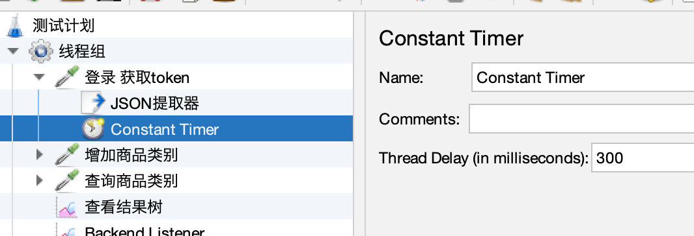

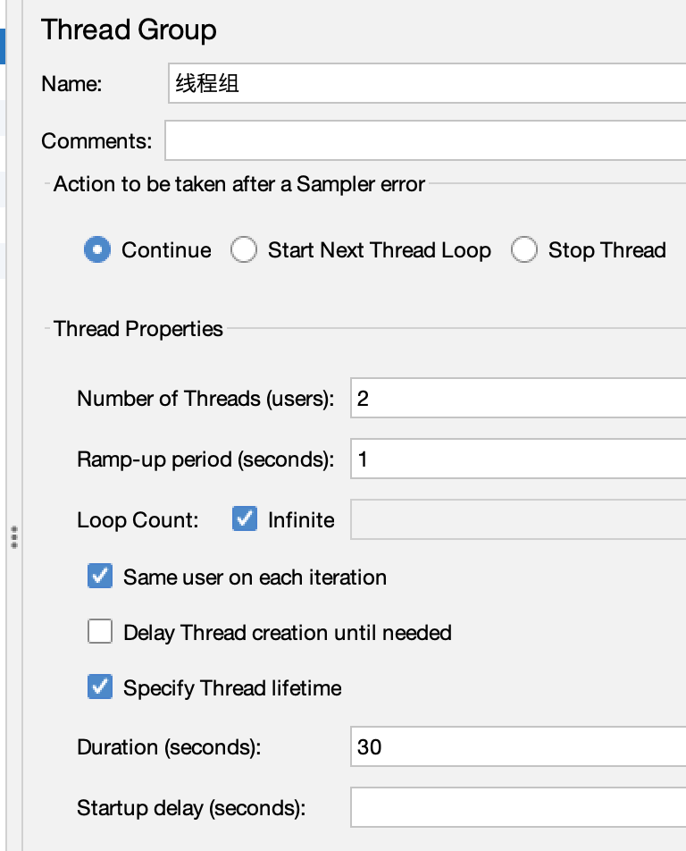

只想通过静默压测运行脚本，不需要生成报告及结果数据。

```bash
jmeter -n -t [jmx file] -l [results file] 
```
- `-n`：`nongui`;非 GUI 模式，在非 GUI 模式下运行 JMeter 压测脚本。
- `-t`：`testfile`;指定JMeter脚本，要运行的 JMeter 测试脚本文件。

```bash
jmeter -n -t GETAPI.jmx
```


## 自动化压测
JMeter压测脚本其实就是一个xml结构的文件，里面根据标签把GUI界面的组件和参数进行拼接。

#### 问题
每次并发线程数更改就需要 使用`JMeter`的`GUI`界面或打开`jmx`文件找到线程组件的标签去更改线程数，造成不必要的时间成本上的浪费。

#### 解决方案
可以在脚本内自定义对应线程变量，引用后通过参数传递对应值给声明的变量即可进行自动化的压测。


想要对线程组件的变量进行自定义，首先要了解对应的压测脚本的结构，下面我们先来看一下对应的JMX脚本的结构的简单介绍：

### jmx脚本解读


jmx脚本按结构自上而下：

#### 测试计划


其中`<jmeterTestPlan version="1.2" properties="5.0" jmeter="5.5">`标签中的`jmeter="5.5"`代表的是：`JMeter`版本是`5.5`,如果你使用的是其他的版本则会显示你使用的版本号。

#### 线程组


- `HTTPSampler`：HTTP取样器


### 方式

自定义线程组相关变量名，传给变量名参数值有两种方式。

方式一：直接**命令行**进行参数值传递；

>使用非`GUI`模式执行`JMeter`压测脚本，若需更改参数，必须编辑`jmx`文件，找到对应的变量进行修改，比较麻烦。<br>
>因此，可以`GUI`界面进行参数化一些常用的变量，直接在`JMeter`命令行对该变量参数值进行设置。


方式二：编写**脚本**进行参数值传递。{`shell`/`python`}


无论是**命令行**进行参数值传递还是**脚本**进行参数值传递，它们的前置条件是都需要在`GUI`界面设置传入参数的变量声明。
### 自定义变量
#### 1. 添加用户自定义变量

导航到 线程组(`Thread Group`) -> 添加(`Add`) -> 配置元件(`Config Element`) -> 用户定义的变量(`User Defined Variables`)


#### 2. 添加自定义变量表达式

定义**3**个变量和变量对应的默认值。

##### 1） 函数表达式生成
1. 点击函数助手
  
1. 使用__P函数生成对应属性，并复制。
  >属性与变量不同。**变量**是**线程的局部变量**；**属性**是**对所有线程都是通用**的，需要使用`__P`或`__property`函数来引用。
  
  

##### 2） 函数添加

添加三个函数，对应分别对应线程组的线程属性。

>`${__P(thread,1)}`，表示变量`thread`的默认值为**1**


#### 3. 线程组引用

线程组的线程属性引用上面自定义的变量。


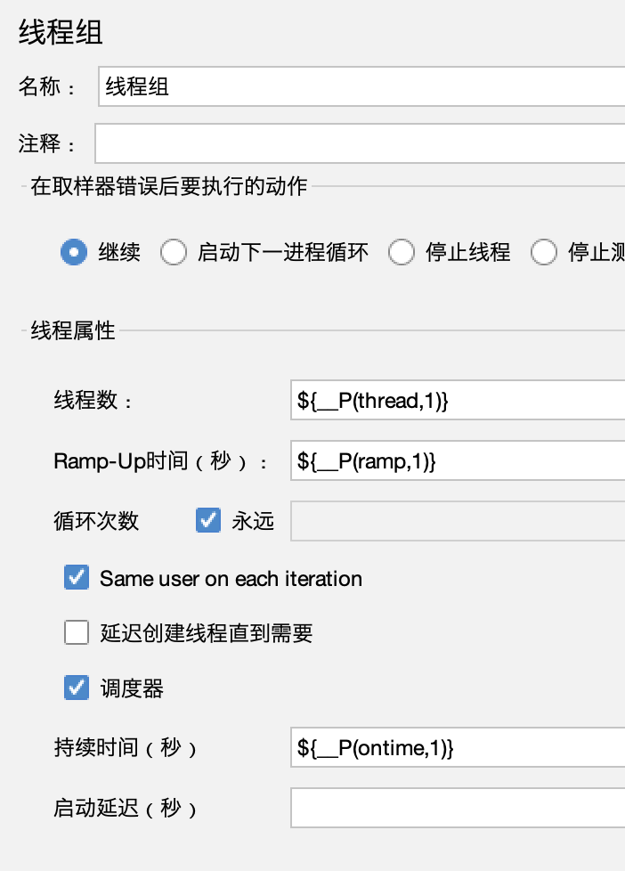
#### 4. 验证

添加聚合报告验证对应的样本请求数，导航到 线程组(`Thread Group`) -> 添加(`Add`) -> 监听器(`Listener`) -> 聚合报告(`Aggregate Report`)


`jmx`文件保存，界面化运行，验证变量是否设置成功。

>样本请求的线程数都为**1**，说明设置成功。因为在用户自定义变量中，**变量**的默认值都为**1**。


### 命令行传参
执行命令：
```bash
jmeter -n -t [jmx file]  -JthreadNum=整数 -JloopNum=整数 -JrampNum=整数


jmeter -n -t 02.jmx -Jthread=2 -Jramp=1 -Jontime=30
```


- `-J`：`jmeterproperty`;定义额外的 `JMeter` 属性


```bash
-J, --jmeterproperty <argument>=<value>
Define additional JMeter properties
```


如果命令行查看不是很明白直观，可以把结果文件导入到GUI界面的聚合报告中进行查看。

在聚合报告中导入结果文件jtl时要注意，首先清空一下结果，不然对应的聚合报告界面样本数是在以前的界面上进行叠加不是直接显示导入的结果文件的样本数。


### 脚本
命令行虽然可以直接更改线程数，但是其实压测时我们每次会是不同的并发数，所以一个压测脚本可能需要在命令行输入多次命令才能完成。


 
#### 并发数规则
压测脚本中压力增量设定的原则为：**在低并发数区域内可以大增量，在高并发数区域内使用小增量**。

>10 50 100 120 140 150 160 170 175

具体的并发数值根据被测服务不同而不同
#### 脚本业务流程图


#### 并发数组
1. 在脚本中设置模版压测脚本的地址
2. 获取当前运行的系统环境并赋值给变量os_type
3. 设置压测并发数
   >thread_num_array = (10 50 100 120 140)
#### 脚本
1. 判断对应模版压测脚本`PATH`是否存在
2. 读取模版压测脚本写入新生成文件
3. 对应字段替换使用$thread
4. 文件名唯一性：使用`sample_并发数`。比如：GETAPI_10.jmx


# 分析

在进行压力测试和性能分析时，通常会分析以下几个方面：

**响应时间**（Response Time）：测量系统处理请求所花费的时间。响应时间是评估系统性能的关键指标之一，较低的响应时间通常意味着更好的性能。

**吞吐量**（Throughput）：指单位时间内系统能够处理的请求数量。吞吐量是衡量系统性能的重要指标之一，高吞吐量表示系统能够有效处理大量请求。

**并发用户数**（Concurrent Users）：指同时发送请求到系统的用户数量。通过增加并发用户数，可以模拟系统在高负载情况下的性能表现。

**CPU利用率**（CPU Utilization）：监测系统的CPU使用情况，包括总体CPU利用率和每个进程/容器的CPU利用率。高CPU利用率可能表明系统存在瓶颈或性能问题。

**内存利用率**（Memory Utilization）：监测系统的内存使用情况，包括总体内存利用率和每个进程/容器的内存利用率。高内存利用率可能导致性能下降或系统崩溃。

**响应代码和错误率**（Response Codes and Error Rate）：分析系统返回的HTTP响应代码，检查是否有错误码（如5xx错误）以及错误率的变化。这有助于发现系统在压力下的稳定性和可靠性。

**网络延迟**（Network Latency）：测量请求从客户端到服务器的传输时间。网络延迟是性能测试中需要考虑的重要因素之一，较低的延迟通常与更好的性能相关。

**数据库性能**（Database Performance）：如果系统使用数据库，可以分析数据库的性能指标，如查询响应时间、并发连接数和缓存命中率，以评估数据库的性能瓶颈和优化机会。

这些分析可以帮助识别系统的性能瓶颈、瓶颈来源以及性能优化的机会。通过收集和分析这些指标，可以得出关于系统性能和可伸缩性的有价值见解，并采取相应的优化措施来改进系统的性能。