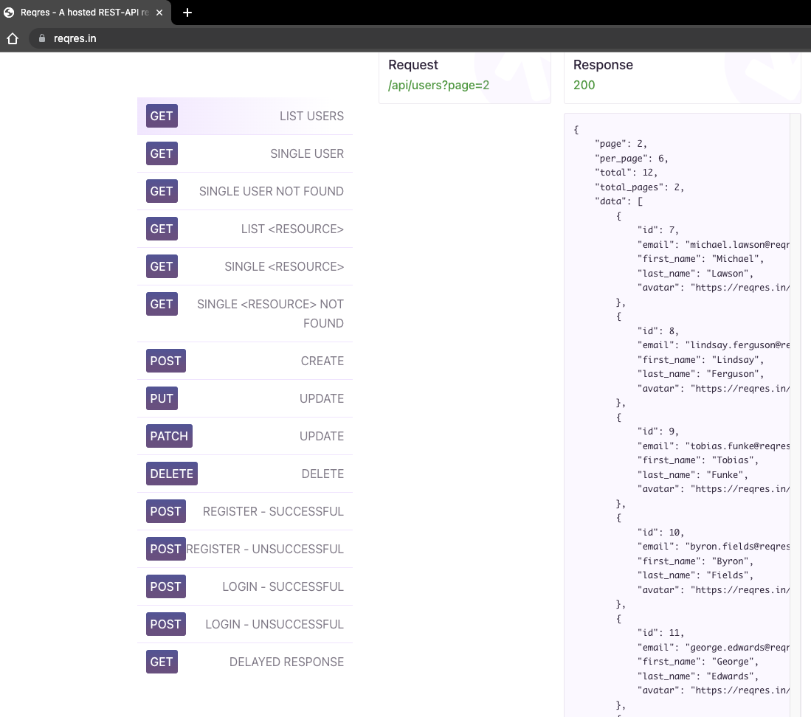
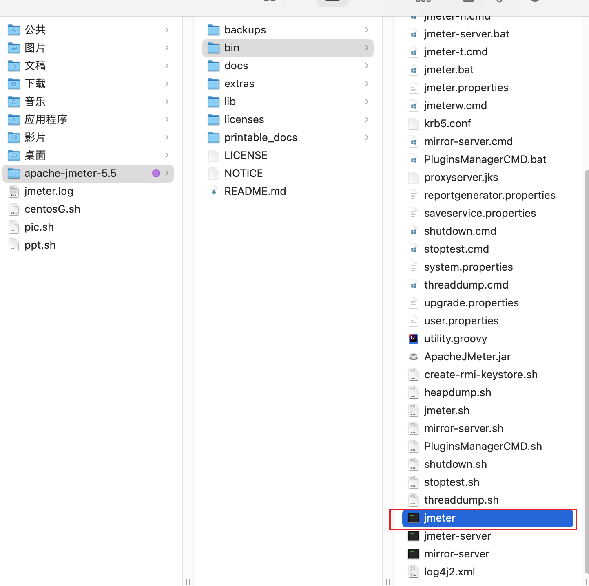
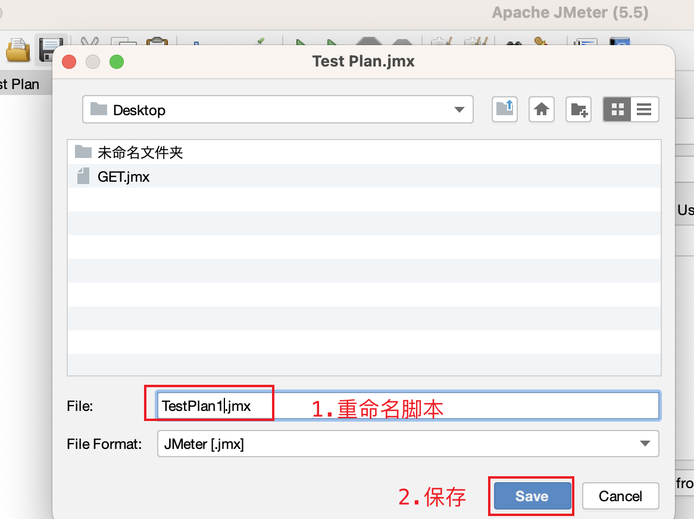
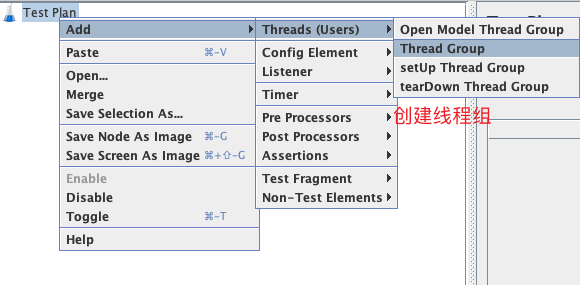
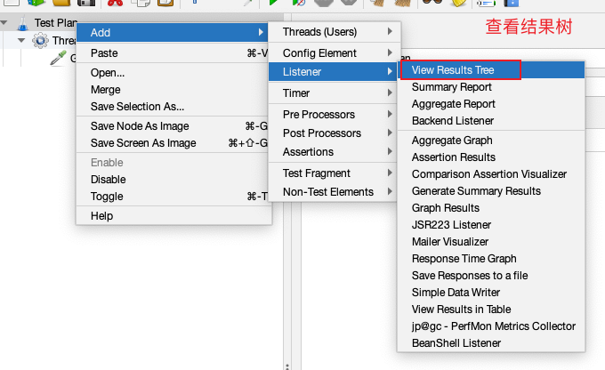
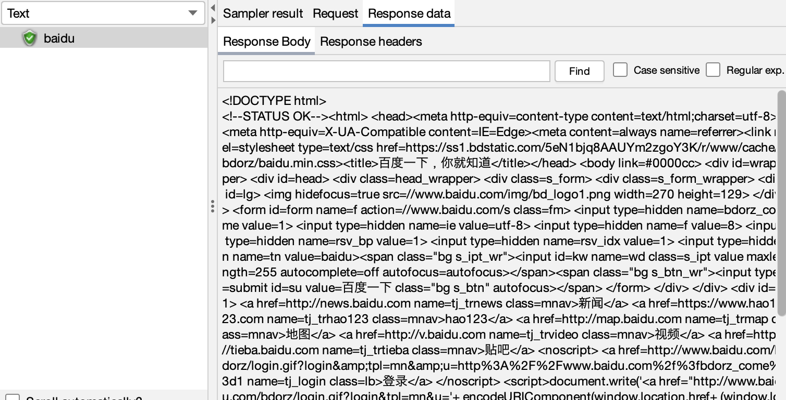
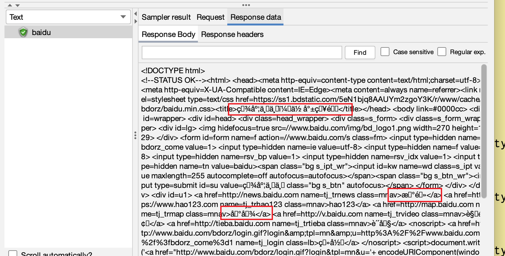
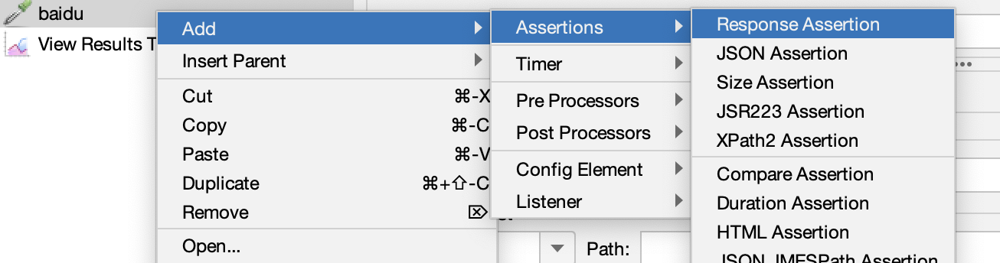
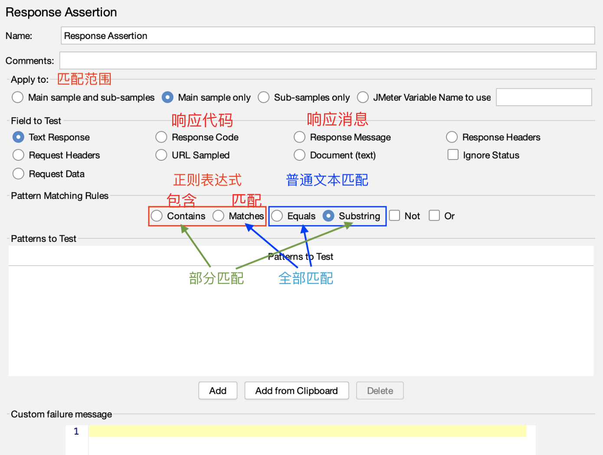

# 压测报告
## JMeter自带报告 VS 实时监控
传统的压测报告与实时监控的压测报告对比：

传统的压测报告和实时监控的压测报告是两种不同的方式来呈现性能测试结果。它们有各自的优缺点，可以根据具体的需求来选择使用。

传统的压测报告通常在性能测试结束后生成，展示的是整个测试过程中的数据和趋势。这种方式的优点是可以提供全面的测试结果，包括整个测试过程的响应时间、吞吐量、错误率等指标，便于测试人员和开发人员对性能问题进行分析和优化。缺点是不能提供实时的性能数据，需要等待测试结束后才能生成报告，无法及时发现性能问题。

实时监控的压测报告可以在测试过程中实时呈现性能数据和趋势。这种方式的优点是可以提供实时的性能数据，便于测试人员和开发人员及时发现性能问题并进行优化。缺点是只能提供测试过程中的性能数据，无法全面展示整个测试过程的数据和趋势，需要根据实时监控的结果进行推断和分析。

综合来看，传统的压测报告和实时监控的压测报告各有优缺点，可以根据具体的测试需求来选择使用。如果需要全面展示整个测试过程的数据和趋势，可以使用传统的压测报告；如果需要实时监控性能数据并及时发现性能问题，可以使用实时监控的压测报告。同时，也可以结合使用两种方式来提高测试效果和测试结果的准确性。

传统的压测报告和实时监控的压测报告都是在压测过程中用于分析性能指标的报告，但是两者有一些不同点。

1. 报告生成时间
传统的压测报告通常在整个压测任务结束后才生成，而实时监控的压测报告则可以在压测任务进行过程中实时生成。

1. 报告内容
传统的压测报告通常包括测试的基本信息、测试结果汇总、测试结果分析等，而实时监控的压测报告可以提供实时的性能指标数据、实时趋势图表等。

1. 报告应用场景
传统的压测报告通常用于分析和评估应用程序在不同负载下的性能，而实时监控的压测报告则可用于实时监控应用程序在压力下的性能表现，及时发现问题并进行调整。

1. 报告生成方式
传统的压测报告通常需要手动整理和生成，而实时监控的压测报告可以通过一些自动化工具来实现自动生成。

总的来说，传统的压测报告和实时监控的压测报告都有各自的优缺点，可以根据具体需求选择使用哪种报告方式。传统的压测报告适合对压力测试任务进行全面、深入的分析和评估，而实时监控的压测报告则适合及时监控应用程序的性能指标和快速发现问题。

JMeter聚合报告和Grafana报告都是用于分析性能测试结果的报告，但是它们之间有一些区别。

1. 报告生成方式
JMeter聚合报告是JMeter自带的一个报告，在测试结束后，JMeter会将测试结果自动汇总生成报告；而Grafana报告需要用户手动搭建并配置相应的数据源和监控指标，然后再进行监控和报告生成。

1. 报告内容
JMeter聚合报告提供了一些基本的性能指标数据，如平均响应时间、吞吐量、错误率等，但是数据展示较为简单；而Grafana报告可以根据用户需求自定义展示的指标、图表等，并且提供了更加灵活的数据可视化方式。

1. 报告应用场景
JMeter聚合报告主要用于简单的性能测试结果分析和报告生成，适合于小规模和简单的测试场景；而Grafana报告则适合于大规模和复杂的测试场景，可以提供更全面、更深入的性能数据分析和监控。

1. 数据存储方式
JMeter聚合报告默认将测试结果存储在JTL文件中，可以通过JMeter提供的工具进行读取和分析；而Grafana报告可以通过多种数据源进行数据存储和读取，如InfluxDB、Prometheus等。

总的来说，JMeter聚合报告和Grafana报告各自有其适用的场景，可以根据具体的测试需求选择使用哪种报告方式。JMeter聚合报告适用于小规模、简单的测试场景，Grafana报告则适合于大规模、复杂的测试场景，并且提供更加灵活、全面的性能数据展示方式。

## JMeter基础知识

## Docker基本用法

## 路线

### 计划和准备阶段

在这个阶段中，需要 **定义压测目标**、**制定压测计划**、**确定压测场景和负载模型**、**选择压测工具**和**测试环境**等。

还需要对测试应用进行配置和准备，包括安装、部署、配置和初始化等。

##### 压测目标

百度首页。

[Reqres API](https://reqres.in/)

#### 压测场景

压测百度网站的首页，查看请求结果是否正确返回。

[Reqres API](https://reqres.in/)

##### 压测URL

https://www.baidu.com/

##### 压测步骤

1. 访问被测页面：百度首页。

1. 校验返回值判断是否正确。

用JMeter生成一个接口的request请求，然后去访问百度的首页，在请求中需要添加**响应校验**，校验一下请求是成功还是失败。

>比如 压测的网站down 或者 当前发送请求的设备断网了 ，那对应的发送请求就没有意义，所以在访问完请求后需要校验一下结果。所以压测步骤里边分两步，一个是请求，一个是校验。

**Question**：JMeter里边最基础最基础的步骤是什么？？

一个是访问，一个是校验。无论是接口测试还是压力测试，既然是测试就一定要加上校验，一定要校验一下这次测试的是对的还是错的。这就是一个最基础的JMeter的一个使用方式。

##### 压测工具选择

JMeter。

##### 压测报告收集

聚合报告。

### 编写测试脚本

建立场景和数据准备阶段：在这个阶段中，需要定义测试用例和测试数据，包括创建场景、定义场景流程、创建用户和数据、定义负载模型、选择协议等。还需要进行场景测试和数据准备，包括模拟用户交互、记录日志、生成测试数据、加载测试数据等。

**编写测试脚本** ：根据测试场景和测试数据，编写测试脚本，模拟用户行为，以便进行性能测试。

编写一个JMeter压测脚本通常包括以下步骤：

#### 创建测试计划

打开JMeter并创建一个新的测试计划，命名并保存它。

1. GUI模式启动JMeter。
  
    

1. 命名保存。

    

#### 添加线程组

在测试计划下添加线程组，并设置线程数、循环次数等参数。

添加线程组：测试计划(Test Plan) -> 添加(Add) -> 线程(Threads) -> 线程组(Thread Group)

#### 添加HTTP请求

在线程组下添加HTTP请求，并设置请求方式、URL、参数等。

1. 添加HTTP请求：线程组(Thread Group) -> 添加(Add) -> 采样器(Sampler) -> HTTP 请求(HTTP Request)

    

1. HTTP请求编写：GET请求的 **服务器名称**、**路径** 和 **参数** 填写。

    

    
    >需要把被测的地址填到Web Server栏下，定义被测的请求类型「GET请求」，请求域名填写在Server Name里，对应的域名后的请求路径填写在Path中。

1. 查看请求结果：测试计划(Test Plan) -> 添加(Add) -> 侦听器(Listener)  -> 查看结果树(View Results Tree)。

    
    
    发送成功后，如下图示例：

    

##### 响应结果乱码

如果发送请求，返回的响应结果内容只要是中文的地方就显示为乱码，如何解决？

解决方案：

1. 发送请求时设置encoding为utf-8。---没有解决

1. 修改JMeter的配置文件，并重新启动JMeter，发送请求验证。

    >jmeter.properties --> sampleresult.default.encoding=ISO-8859-1 修改为sampleresult.default.encoding=UTF-8

#### 添加断言

在HTTP请求下添加断言，以验证请求的响应是否符合预期。

如果用浏览器访问，在浏览器上看到的内容就是需要校验的点，说你能看到什么东西，就能证明说你是真正访问到了当前请求的网页。请求到了网页，不能说兜了一圈什么都没有干就直接回来了。那在JMeter中怎么证明这个请求的网页会返回很多东西呢？就是在脚本中直接添加断言组件。

**断言是一种用于验证响应的测试元素。**

你需要校验一下什么内容呢？
你就需要校验一下你对百度的这个网站请求发出去之后，百度给你的一个响应。通过查看结果树的response可以看到一个title标签为：**百度一下，你就知道**。

1. 响应断言：请求组件(HTTP Request) -> 添加(Add) -> 断言(Assertions)  -> 响应断言(Response Assertion)。

    
    

##### 响应断言组件

可以根据需求对响应进行不同类型的验证。以下是常见的响应断言组件：

响应代码断言：用于验证响应是否包含特定的 HTTP 状态码。如果响应不包含特定的状态码，则断言失败。

响应消息断言：用于验证响应是否包含特定的文本消息。如果响应不包含特定的消息，则断言失败。

包含断言：用于验证响应是否包含指定的文本。如果响应不包含指定的文本，则断言失败。

包含正则表达式断言：用于验证响应是否包含符合特定正则表达式的文本。如果响应不包含符合正则表达式的文本，则断言失败。

XML 验证断言：用于验证 XML 响应是否符合指定的 XSD 模式。如果响应不符合指定的 XSD 模式，则断言失败。

HTML 验证断言：用于验证 HTML 响应是否包含指定的 HTML 标签和属性。如果响应不包含指定的 HTML 标签和属性，则断言失败。

在使用响应断言组件时，请确保选择适当的类型，并对其进行适当的配置，以确保它可以正确地验证您的响应。

就是说你这个响应，如果你要是流用浏览器访问的话，你在浏览器上面能看到东西，
那么你需要校验一下，说你能看到什么东西，就能证明说你是真正访问到了百度，
你的这个请求是，到了百度，而不是说兜了一圈什么都没干完又回来了，就这么一个目的，
那怎么能证明呢，那么百度的那个网页上会返回很多东西，那么在里边其中会有一个，
会有一个文本的那样一个字样，叫做，
所以我们在response里面可以加一个就是text text text response就是文本校验，
就是你这个response里面如果有这段文本，那我就认为说你这个请求是成功的，
那你可以加一个tex response完了在那个pattern to test里面
加一个contains contains就是包含，包含百度一下你就知道，只要包含这个文本，
那么我们的这次请求就算一个成功的正确的请求，就是这么一个意思，

##### 添加监听器

在HTTP请求下添加监听器，以收集请求响应的数据，如响应时间、吞吐量、错误率等。

##### 进行压测

运行测试计划，并收集测试数据。

### 搭建性能监控平台

展示更好看的报告

