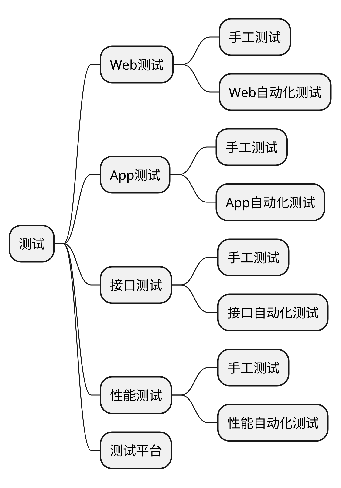

# Web系统的基本概念

从这节课开始我们就要进入正式的测试的课程了。

接下来咱们会从三个大的方向带着大家一起学习怎么去做测试。

首先是 web 测试，然后是 app 测试，最后是接口测试。

咱们是先从 web 测试开始学习。在 web 测试技术这一块，咱们也是从手工测试和自动化测试两个维度来给大家做介绍的。咱们这2天课的内容，就是 web 手工测试。

在开始 web 测试之前，咱们在录播课里也给大家介绍了前端开发语言的基础用法和 web 测试中常见的 bug 都有哪些，web 的一些相关基础知识和常用的开发者工具的简单用法。

所以大家需要把前面这些录播先看一下，先对 web 能有一个直观的认知。

# 企业微信

企业微信是一款由微信团队推出的专门为企业和组织提供沟通和协作服务的企业级应用软件。

它融合了即时通讯、企业通讯录、组织架构管理、移动办公、企业应用和安全控制等功能，旨在帮助企业提高内部沟通效率、协同工作效能以及信息安全性。

### 功能

以下是企业微信的主要特点和功能：

#### 即时通讯和群聊功能

用户可以通过企业微信进行实时的一对一聊天和群组讨论，方便快捷地与团队成员沟通和协作。

#### 企业通讯录

企业微信提供了完善的企业通讯录功能，支持组织架构管理、员工信息管理、部门管理等，方便用户快速查找和联系同事。

#### 移动办公

企业微信支持用户在移动设备上进行办公操作，如查看邮件、日程安排、审批流程、报销等，提供了灵活的移动办公解决方案。

#### 企业应用

企业微信支持集成企业自有的应用和第三方应用，用户可以直接在企业微信中使用各种企业应用，提高工作效率和便捷性。

#### 安全控制

企业微信注重数据安全和权限控制，提供了多层级的安全机制，包括身份验证、数据加密、设备管理等，保障企业信息的安全性。

#### 小程序和开放平台

企业微信支持小程序开发和集成，企业可以开发自己的小程序，满足特定的业务需求，同时还提供了开放平台给第三方开发者集成和扩展功能。

企业微信适用于各类企业和组织，包括中小型企业、跨国企业、政府机构、教育机构等，可以帮助企业提升内部沟通效率、加强团队协作、提高工作效能，并且提供了安全可靠的企业级服务。

以上是对企业微信的简要介绍，希望能给您一个初步的了解。如有更多详细信息需求，建议您访问企业微信官方网站或咨询相关专业人士。

## 本章要点
1. 要点一
1. 要点
1. 要点
1. **要点**

## 正文
## 总结
- 总结一
- 总结二
- 总结三

# 学习反馈

1. SpringBoot项目的父工程为( )。

   - [x] A. `spring-boot-starter-parent`
   - [ ] B.`spring-boot-starter-web`
   - [ ] C. `spring-boot-starter-father`
   - [ ] D. `spring-boot-starter-super`
