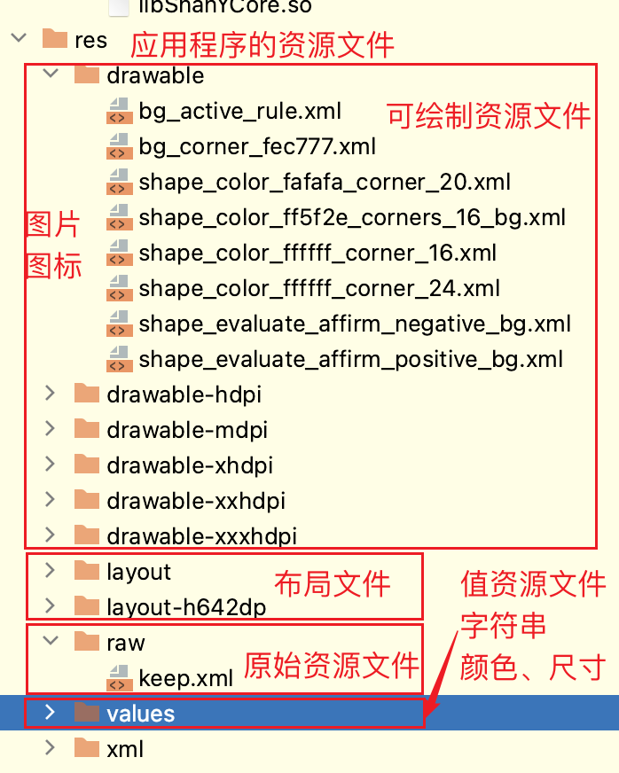
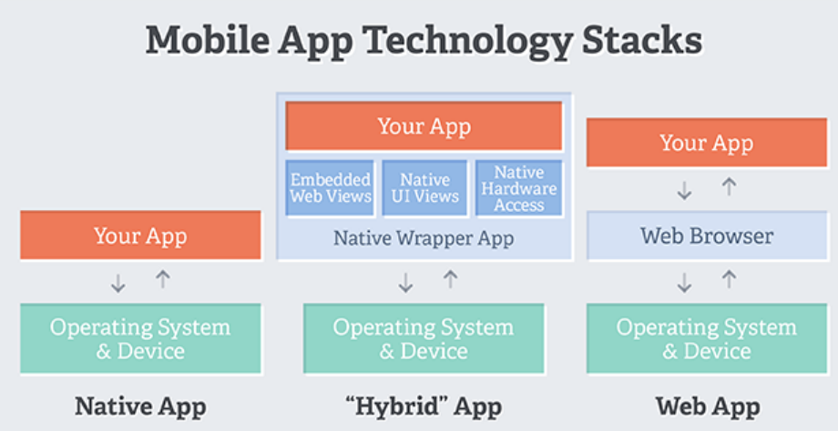
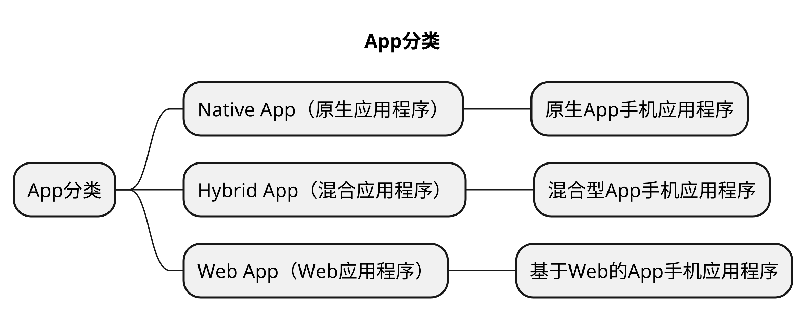

# App基本知识
## 本章要点
1. 要点一
1. 要点
1. 要点
1. **要点**

## APK

APK是Android应用程序的安装包文件的后缀名，全称为**Android Application Package**。

当下载和安装Android应用程序时，通常会获得一个以`.apk`结尾的文件。

### 是什么

APK文件是Android操作系统上的标准应用程序分发格式。

它是一个**压缩文件**，包含**应用程序的代码**、**资源文件**、**图像**、**声音**和**其他必要的文件**。

**APK**文件类似于Windows操作系统上的 **.exe** 文件或iOS操作系统上的 **.ipa** 文件。

>**APK文件** 理解为 一个以 .apk结尾的压缩文件。

在安装Android应用程序时，您可以通过从手机商店下载APK文件，或从其他第三方来源（如应用程序的官方网站或其他应用商店）获得APK文件。

如果电脑有相关APK文件，可以使用adb命令将其传输到Android设备进行安装。

需要注意的是，在下载和安装来自第三方来源的APK文件时，确保文件来源可靠，并注意潜在的安全风险。

默认情况下，Android设备会阻止从未知来源安装的APK文件，以确保用户的安全。

### APK 包结构

APK包结构是指APK文件内部的组织结构和目录层次。下面是APK包的一般结构：

#### META-INF目录

该目录包含了签名和证书信息，用于验证APK文件的完整性和可信性。

#### assets目录

该目录用于存储应用程序需要的原始资源文件，例如文本文件、音频、视频等。

#### res目录

该目录包含了应用程序的资源文件，如图像、布局文件、字符串等。

#### AndroidManifest.xml文件

这是**APK的核心文件**，其中包含了应用程序的**清单信息**，包括应用程序的**包名**、**权限声明**、**组件定义**等。

#### classes.dex文件

这是应用程序的主要执行文件，其中包含了应用程序的Java字节码。

#### lib目录

该目录用于存储应用程序的本地库文件，针对不同的CPU架构和设备类型提供不同的库。

#### res/raw目录

该目录用于存储应用程序的原始资源文件，如未经编译的音频、视频、文本文件等。

#### res/drawable目录

该目录包含应用程序的可绘制资源文件，如图片、图标等。

#### res/layout目录

该目录包含了应用程序的布局文件，用于定义用户界面的结构和组件排列。

#### res/values目录

该目录包含了应用程序的值资源文件，如字符串、颜色、尺寸等。

除了上述主要组成部分，APK文件还可以包含其他辅助文件和目录，根据应用程序的需求和开发人员的选择而定。

总体而言，**APK包结构的组织和内容是为了将应用程序的代码、资源和配置文件打包成一个可分发和安装的文件**，以便于在Android设备上部署和运行应用程序。

## App 分类

App可以根据其**开发方式**和**技术特点**进行分类，其中常见的分类包括：

### Native App（原生应用程序）

Native App是为特定的操作系统和平台（如iOS、Android、Windows等）使用**原生编程语言**（如Objective-C/Swift、Java/Kotlin、C#/C++等）**开发的应用程序**。

这些应用程序**可以直接访问设备功能和操作系统特性**，具有高性能和优化的用户体验。

#### iOS（苹果操作系统）

iOS应用程序使用**Objective-C**或**Swift**编程语言进行开发。

Objective-C是早期iOS开发的主要语言，而Swift是苹果于2014年发布的现代化编程语言，逐渐成为iOS应用程序开发的首选语言。

#### Android（安卓操作系统）

Android应用程序使用**Java**或**Kotlin**编程语言进行开发。

Java是Android开发的主要语言，而Kotlin是一种现代化的编程语言，由JetBrains公司开发，并获得了谷歌的官方支持。

Kotlin逐渐成为Android开发的流行选择。

#### Windows（微软操作系统）

Windows应用程序使用**C#**（C Sharp）编程语言进行开发。

C#是微软开发的现代化、面向对象的编程语言，用于开发各种Windows平台应用程序，包括桌面应用程序、UWP应用程序和移动应用程序。

#### 注意

需要注意的是，尽管原生应用程序使用不同的编程语言进行开发，但可以**使用跨平台开发框架**（如**React Native**、**Xamarin**等）来实现部分代码共享和跨平台开发。

这些框架允许开发人员使用一种语言编写应用程序，并在多个平台上进行部署。

### Hybrid App（混合应用程序）

Hybrid App是**使用Web技术**（HTML、CSS和JavaScript）**开发**的应用程序，然后**通过封装工具**（如Apache Cordova、React Native等）**将其打包为原生应用程序**。

这种应用程序结合了Web技术的跨平台优势和原生应用程序的部分功能访问，可以在多个平台上运行。

### Web App（Web应用程序）

Web App是**使用Web技术**（HTML、CSS和JavaScript）**开发的应用程序**，可以**在Web浏览器中访问和运行**。

Web App通常需要网络连接，通过互联网传输数据，并且可以在多个平台上运行，不需要针对特定操作系统进行开发。

这些应用程序分类在开发方式、技术特点和目标平台上存在一些区别。

选择适当的应用程序类型取决于应用程序的需求、目标用户和开发资源等因素。

## 总结
- 总结一
- 总结二
- 总结三
https://github.com/Wechat-ggGitHub/Awesome-GitHub-Repo

[项目演示地址](https://github.com/testeru-pro/junit5-demo/tree/main/junit5-basic)

# 学习反馈

1. SpringBoot项目的父工程为( )。

   - [x] A. `spring-boot-starter-parent`
   - [ ] B.`spring-boot-starter-web`
   - [ ] C. `spring-boot-starter-father`
   - [ ] D. `spring-boot-starter-super`

