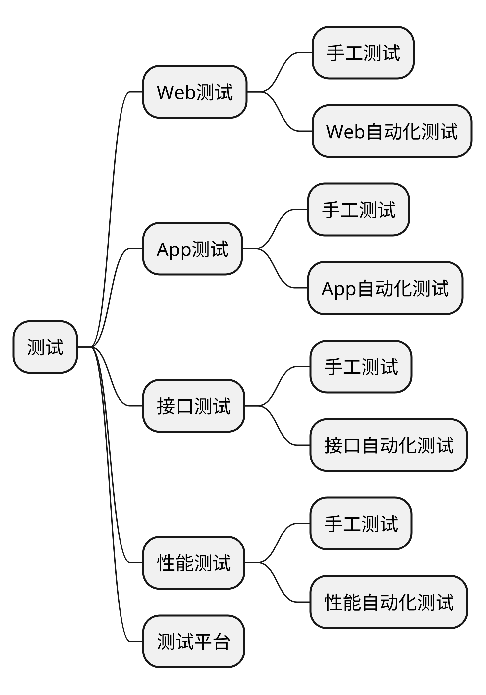
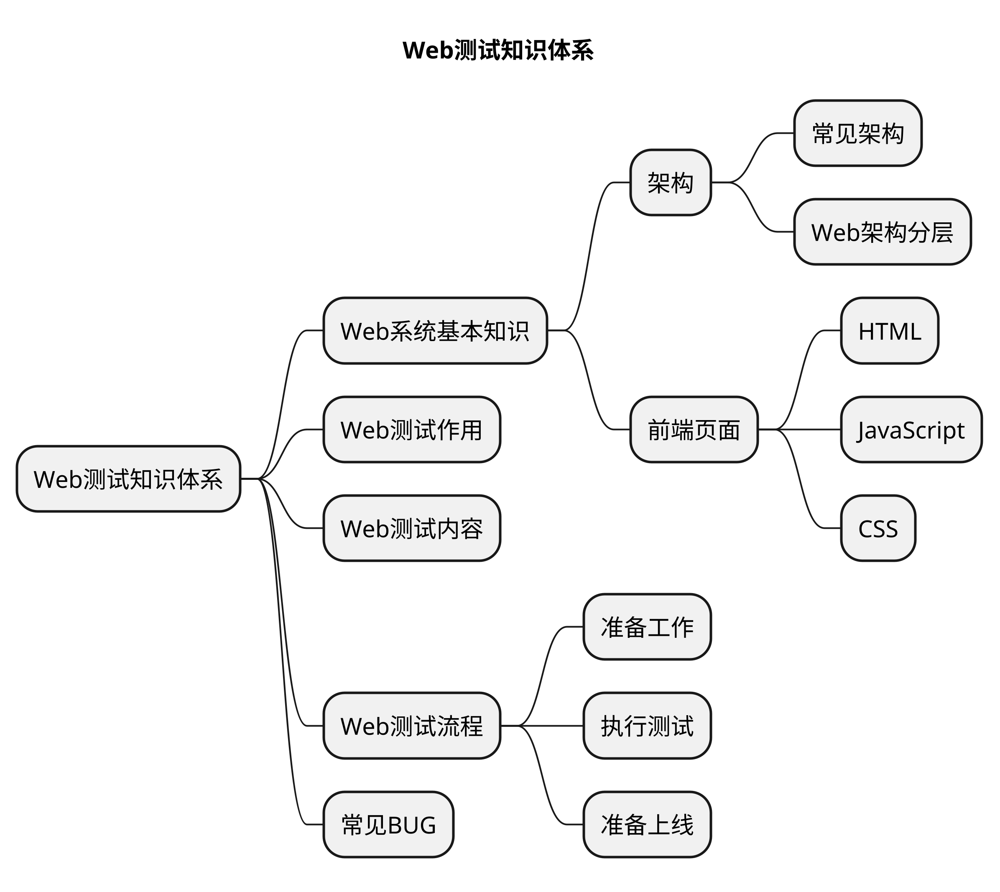

# Web测试的价值与体系

## 本章要点
1. 要点一
1. 要点
1. 要点
1. **要点**

Web测试是指对Web应用程序进行各种测试，以确保其质量和可靠性。

Web测试的**价值**在于**确保Web应用程序的稳定性和性能，提高用户满意度和可靠性**。

以下是 Web 测试的价值和体系：

## 价值

### 确保质量

Web测试可以帮助发现应用程序中的缺陷和错误，从而改善应用程序的质量，提高用户满意度。

### 提高可靠性

Web测试可以确保应用程序的稳定性和可靠性，从而减少应用程序中断和故障的可能性。

### 降低风险

Web测试可以帮助发现应用程序中的安全漏洞和其他潜在的风险，从而减少潜在的风险和安全漏洞。

### 提高应用程序效率

Web 测试可以帮助识别应用程序中的性能问题和瓶颈，从而提高应用程序的效率和响应时间。

## 知识体系

## 总结

Web 测试价值：

- 确保质量。
- 提高可靠性。
- 降低风险。
- 提高应用程序效率。

# 学习反馈

1. 以下属于Web 测试价值( )。

   - [x] A. 确保质量
   - [x] B. 提高可靠性
   - [x] C. 降低风险
   - [x] D. 提高应用程序效率

