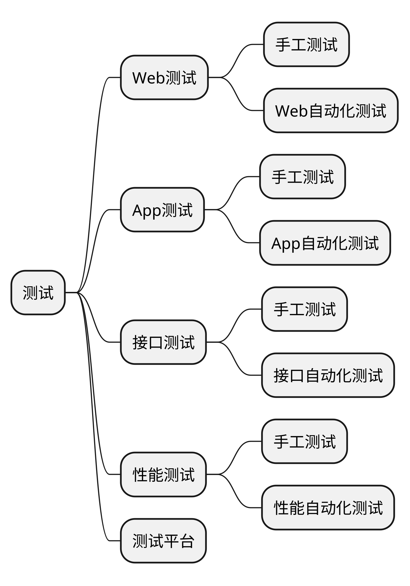

从这节课开始我们就要进入正式的测试的课程了。

接下来咱们会从三个大的方向带着大家一起学习怎么去做测试。

首先是 web 测试，然后是 app 测试，最后是接口测试。



咱们是先从 web 测试开始学习。在 web 测试技术这一块，咱们也是从手工测试和自动化测试两个维度来给大家做介绍的。咱们这2天课的内容，就是 web 手工测试。


在开始 web 测试之前，咱们在录播课里也给大家介绍了前端开发语言的基础用法和 web 测试中常见的 bug 都有哪些，web 的一些相关基础知识和常用的开发者工具的简单用法。

所以大家需要把前面这些录播先看一下，先对 web 能有一个直观的认知。


# 企业微信

企业微信是一款由微信团队推出的专门为企业和组织提供沟通和协作服务的企业级应用软件。

它融合了即时通讯、企业通讯录、组织架构管理、移动办公、企业应用和安全控制等功能，旨在帮助企业提高内部沟通效率、协同工作效能以及信息安全性。

### 功能

以下是企业微信的主要特点和功能：

#### 即时通讯和群聊功能

用户可以通过企业微信进行实时的一对一聊天和群组讨论，方便快捷地与团队成员沟通和协作。

#### 企业通讯录

企业微信提供了完善的企业通讯录功能，支持组织架构管理、员工信息管理、部门管理等，方便用户快速查找和联系同事。

#### 移动办公

企业微信支持用户在移动设备上进行办公操作，如查看邮件、日程安排、审批流程、报销等，提供了灵活的移动办公解决方案。

#### 企业应用

企业微信支持集成企业自有的应用和第三方应用，用户可以直接在企业微信中使用各种企业应用，提高工作效率和便捷性。

#### 安全控制

企业微信注重数据安全和权限控制，提供了多层级的安全机制，包括身份验证、数据加密、设备管理等，保障企业信息的安全性。

#### 小程序和开放平台

企业微信支持小程序开发和集成，企业可以开发自己的小程序，满足特定的业务需求，同时还提供了开放平台给第三方开发者集成和扩展功能。

企业微信适用于各类企业和组织，包括中小型企业、跨国企业、政府机构、教育机构等，可以帮助企业提升内部沟通效率、加强团队协作、提高工作效能，并且提供了安全可靠的企业级服务。

以上是对企业微信的简要介绍，希望能给您一个初步的了解。如有更多详细信息需求，建议您访问企业微信官方网站或咨询相关专业人士。


# Web 系统的概念

**Web由一系列互相链接的超文本文档**（Web页面）组成。


通过**浏览器（Browser）访问网页（Web Page）**，并通过**超链接**在**不同的网页之间进行导航**。

网页通常由**HTML**（Hypertext Markup Language）**编写**，使用**CSS**（Cascading Style Sheets）进行**样式设计**，以及**JavaScript等脚本语言增加交互和动态效果**。

Web系统通过浏览器与用户进行交互。


## 架构

**面试中，可能会问到什么是B/S C/S架构？他们之间的区别是什么？**

```bash
什么是B/S架构和C/S架构？它们有什么区别？

B/S架构和C/S架构分别适用于哪些场景？

请简要描述B/S架构的工作原理。
请简要描述C/S架构的工作原理。
B/S架构中的客户端是什么？服务器是什么？
C/S架构中的客户端是什么？服务器是什么？
B/S架构和C/S架构各有哪些优缺点？
在B/S架构中，客户端与服务器之间是通过什么协议进行通信的？
在C/S架构中，客户端与服务器之间是通过什么协议进行通信的？
B/S架构和C/S架构对于网络带宽和服务器负载有什么影响？
B/S架构中，浏览器的角色是什么？它有哪些功能？
C/S架构中，客户端的角色是什么？它有哪些功能？
B/S架构是否需要在客户端安装特定的软件？C/S架构呢？
在B/S架构中，如何处理用户界面的交互和数据验证？
在C/S架构中，如何处理用户界面的交互和数据验证？
```

B/S架构和C/S架构是两种常见的软件架构模式，具有不同的特点和应用场景。

### B/S架构（Browser/Server架构）

客户端使用浏览器作为用户界面，通过HTTP或HTTPS协议与服务器进行通信。

**应用逻辑主要集中在服务器端，客户端只负责展示和交互，不承担复杂的业务逻辑**。

客户端无需安装额外的软件，可以通过浏览器访问应用，具有**跨平台和跨设备**的优势。

常见的B/S应用包括**网页应用、在线购物平台、电子邮件服务**等。

### C/S架构（Client/Server架构）

客户端和服务器之间通过网络进行通信，**客户端与服务器端的应用分别运行在不同的设备上**。

客户端负责展示和交互，服务器端负责处理业务逻辑、数据存储和管理。

客户端通常需要安装专门的客户端软件，**可以利用客户端的计算能力和资源**。

C/S架构常见的应用包括**桌面应用程序、数据库管理系统、即时通讯工具**等。


### B/S VS C/S 优势

B/S架构相对于C/S架构具有以下优势：

1. 可以通过浏览器访问应用，无需安装客户端软件，提供了更好的跨平台和跨设备的支持。

1. 部署和维护更加简便，服务器端集中管理应用逻辑和数据，减少了客户端的维护工作。

1. 更好的可扩展性和升级性，可以通过增加服务器资源来应对用户量的增长。

### C/S VS B/S 优势

C/S架构相对于B/S架构具有以下优势：

1. 客户端可以利用本地计算能力和资源，提供更快的响应速度和更丰富的交互体验。

1. 对于一些复杂的业务逻辑和数据处理，可以在客户端进行处理，减轻服务器的负担。

1. 可以实现一些离线功能，即使在没有网络连接的情况下，客户端仍然可以运行和处理数据。


选择使用B/S架构还是C/S架构，取决于具体的应用需求、用户体验和系统规模等因素。

一般来说，

对于大部分**简单的Web应用**，**B/S**架构是更为常见和适用的选择，

而对于**需要复杂计算和本地资源的应用**，**C/S**架构可能更合适。


## Web架构分层

Web架构通常被分为以下三个层次：

### 界面层（User Interface Layer）

界面层是**与用户进行交互的部分**。

它**负责接收用户的输入、展示数据和结果**。

它可以包括用户界面设计、前端开发和用户体验设计等方面的工作。

常见的界面层技术包括**HTML、CSS、JavaScript**和前端框架如**React、Angular和Vue.js**等。

### 业务逻辑层（Business Logic Layer）


业务逻辑层**处理应用程序的核心业务逻辑**。

它**负责处理数据的处理、计算和验证，以及执行与业务相关的逻辑**。

该层通常包含了业务规则、算法、验证、工作流程等。

在Web应用程序中，业务逻辑层通常由后端开发人员使用编程语言如 **Java、Python、C#** 等来实现。

### 数据访问层（Data Access Layer）


数据访问层**处理与数据的存取和管理相关的操作**。

它**负责与数据库或其他数据存储系统进行交互，执行数据的读取、写入和更新等操作**。

数据访问层使用特定的数据库访问技术（如SQL、ORM框架等）来处理数据库连接和数据操作。

常见的数据库包括**MySQL、Oracle、MongoDB**等。

这种分层架构的设计有助于实现应用程序的可维护性、可扩展性和可测试性。


每个层次具有不同的职责和关注点，使得开发人员可以将任务分解为独立的模块，并且更容易对每个模块进行开发、测试和修改。

需要注意的是，**这只是一种常见的Web架构设计模式，实际的架构可能会因具体的应用程序需求和技术选型而有所不同**。

## 面试题：1. 什么是B/S架构和C/S架构？它们有什么区别？

B/S架构（Browser/Server Architecture）和C/S架构（Client/Server Architecture）是常见的软件系统架构模式。


### B/S架构

B/S架构是一种基于浏览器和服务器的架构模式。

在B/S架构中，客户端使用浏览器作为用户界面，通过HTTP或HTTPS协议与服务器进行通信。

服务器负责处理业务逻辑、数据存储和处理，并通过浏览器向用户呈现界面和提供功能。

### C/S架构

C/S架构是一种基于客户端和服务器的架构模式。

在C/S架构中，客户端通过安装在本地计算机上的客户端软件与服务器进行通信。

客户端负责呈现用户界面，并处理部分业务逻辑，而服务器负责处理更复杂的业务逻辑、数据存储和处理。

### 区别

主要区别：

#### **客户端类型**

B/S架构中的客户端是浏览器，而C/S架构中的客户端是安装在本地计算机上的客户端软件。

#### **功能分配**

在B/S架构中，服务器负责大部分业务逻辑和数据处理，浏览器主要用于呈现界面和与用户交互。

而在C/S架构中，客户端负责部分业务逻辑和数据处理，服务器负责更复杂的业务逻辑和数据处理。

#### **安装和维护**

B/S架构中，由于使用浏览器作为客户端，无需安装额外的软件，只需保持浏览器更新即可。

而C/S架构需要在客户端上安装专门的软件，需要进行软件的安装、升级和维护。

#### **平台依赖性**

B/S架构是基于Web技术实现的，具有较好的跨平台兼容性，可以在不同的操作系统和设备上使用。

而C/S架构通常是针对特定操作系统或平台开发的，具有较强的平台依赖性。

#### **网络通信方式**

B/S架构使用HTTP或HTTPS协议进行通信，通过浏览器向服务器发送请求和接收响应。

C/S架构可以使用不同的通信协议，如TCP/IP协议。


选择B/S架构还是C/S架构应根据具体的需求和场景来决定。

B/S架构适合简单的应用程序和跨平台需求，

而C/S架构适合复杂的应用程序和对客户端性能要求较高的场景。


## URL

URI是一个抽象的概念，用于唯一标识资源，而URL是URI的一种具体实现形式，用于定位和访问资源。

举个例子来说明：

**URI**可以是一个标识符，如**ISBN号**、**文件路径**等，**用于唯一标识某个资源，但不提供访问该资源的详细信息**。<br>

而**URL**则提供了**完整的资源定位信息**，如网页的URL可以通过协议、域名、路径等来准确地定位和访问网页。

总结：

1. URI是一个更通用的概念，用于标识任何资源的唯一标识符。

1. URL是URI的一种具体实现形式，用于定位和访问互联网上的资源。

1. URL包含了详细的定位信息，而URI可能只是一个简单的标识符。


### 练习

```bash
https://www.example.com:8080/path/to/resource?param1=value1&param2=value2#fragment
```


- 协议：https
- 主机名：www.example.com
- 端口号：8080
- 路径：/path/to/resource
- 查询参数：param1=value1&param2=value2
- 片段标识符：fragment
【锚：从#开始到最后】

```bash
https://en.wikipedia.org/wiki/Java_(programming_language)#History
```

- 协议：https 
- 域名：en.wikipedia.org 
- 端口：无 
- 路径：/wiki/Java_(programming_language) 
- 查询参数/请求参数：无
- 片段标识符：#History 

【锚：从#开始到最后】


## 从输入URL到页面展示经历了以下主要步骤

### 1. 解析URL

浏览器会解析输入的URL，提取出协议（如HTTP或HTTPS）、主机名（如www.example.com）以及其他相关的路径、查询参数等信息。

### 2. DNS解析

浏览器将主机名转换为对应的IP地址。它会查询本地缓存中的DNS记录，如果找不到，则向DNS服务器发送查询请求。

### 3. 建立TCP连接

浏览器通过TCP/IP协议与服务器建立连接。它会使用IP地址和端口号与服务器进行握手，以建立可靠的通信通道。

### 4. 发起HTTP请求

浏览器向服务器发送HTTP请求。

请求中包含请求的方法（如GET或POST）、路径、请求头信息以及其他相关的数据。


>建立TCP连接是因为HTTP协议是基于TCP/IP协议栈的应用层协议，它需要在传输层上建立可靠的通信通道来保证数据的可靠传输。<br>TCP（Transmission Control Protocol）是一种面向连接的协议，它提供了数据的可靠性、有序性和流量控制。建立TCP连接涉及三次握手的过程，即客户端向服务器发送连接请求，服务器回复确认，最后客户端再次回复确认。这样，双方就建立了可靠的连接，并可以进行数据的传输。<br><br>在HTTP请求中，包括请求头、请求方法、路径和其他相关的数据信息。这些数据需要通过可靠的通信通道进行传输，以确保数据的完整性和可靠性。TCP协议提供了分段、重传、校验和等机制，可以有效地处理数据的分包、丢失和错误等情况，保证数据的正确传输。<br><br>因此，为了使用HTTP协议进行数据通信，需要先建立TCP连接，以提供可靠的数据传输通道。TCP连接的建立和断开会增加一定的开销，但它能够保证数据的可靠传输，从而确保了HTTP请求的准确性和完整性。

### 5. 服务器处理请求

服务器接收到浏览器发送的请求后，根据路径和请求方法进行处理。

它可能会读取文件、查询数据库、执行服务器端的逻辑等操作。

### 6. 服务器返回响应

服务器根据请求的处理结果生成HTTP响应。

响应包含HTTP状态码、响应头信息和响应体（通常是HTML文档）。

### 7. 接收响应

浏览器接收到服务器返回的响应。

它会检查状态码以确定请求是否成功，并根据响应头信息处理进一步的操作。

### 8. 解析和渲染

浏览器解析响应的HTML文档，并根据HTML、CSS和JavaScript等资源进行页面的渲染。

它会构建DOM树、CSSOM树和渲染树，并根据样式信息进行布局和绘制。

### 9. 加载其他资源

如果HTML文档中包含其他资源（如CSS、JavaScript、图像等），浏览器会继续发送请求获取这些资源，并进行相应的处理和加载。

### 10.执行JavaScript

浏览器执行页面中的JavaScript代码，实现动态效果和交互。

JavaScript可以修改DOM、发送异步请求、处理用户事件等。

### 11. 页面展示

最后，浏览器将渲染好的页面内容显示在用户的浏览器窗口中，用户可以与页面进行交互，浏览和操作网页内容。

总结起来，从输入URL到页面展示，涉及了**URL解析**、**DNS解析**、**建立TCP连接**、**发起HTTP请求**、**服务器处理请求**、**返回响应**、**解析和渲染HTML**、**加载其他资源**、**执行JavaScript**等一系列步骤，最终呈现出完整的网页内容供用户浏览和使用。

## Web测试的作用


Web测试的作用主要有以下几个方面：


### 验证功能和逻辑正确性

Web测试用于验证Web应用程序的功能和逻辑是否按照设计要求正确工作。通过执行各种测试用例，检查网页、表单、链接、按钮等各个功能组件的行为和交互，确保系统的功能符合用户需求。

### 确保系统的稳定性和可靠性

Web测试有助于发现系统中的错误、异常和故障，以确保系统的稳定性和可靠性。通过压力测试、负载测试和容错测试等手段，评估系统在各种负载和异常情况下的表现，找出潜在的问题并进行修复。

### 提高用户体验

Web测试旨在提供良好的用户体验。通过测试网页加载速度、响应时间、界面布局和设计等方面，确保用户能够顺畅地使用系统，并提供友好的用户界面和操作体验。

### 保护数据安全和隐私

Web测试可以检查系统的安全性和隐私保护机制，防止潜在的安全漏洞和数据泄露。测试包括身份验证、权限控制、数据加密等方面，以确保用户数据的安全和保密。

### 保证系统的兼容性和可访问性

Web测试还包括系统在不同浏览器、操作系统和设备上的兼容性测试，以确保用户可以在各种环境下正常访问和使用系统。同时，测试还应关注系统的可访问性，确保残障人士也能够无障碍地使用系统。

### 验证性能和扩展性

Web测试用于评估系统的性能和扩展性。通过性能测试和负载测试，测试系统在高并发和大数据量情况下的表现，并找出性能瓶颈和优化的空间。

总而言之，Web测试是确保Web应用程序正常运行、性能良好、用户体验优秀并且安全可靠的关键步骤。通过有效的测试策略和方法，可以及时发现和解决问题，提高Web系统的质量和价值。


## Web测试内容
Web测试涵盖了广泛的内容，以下是一些常见的Web测试内容


### 1. 功能测试

Web应用程序的主要目的是提供各种功能和服务，因此**功能测试是Web测试的核心内容**。

功能测试的目的是**验证 Web 应用程序是否符合规格说明书和用户需求**，以及**在不同的场景下是否能够正常工作**。

功能测试包括各种场景的测试，例如：**界面测试**「网页导航测试」、**输入输出测试**、**表单测试**、**按钮测试**、**链接测试**、**数据库测试**等等。

- 用户界面测试：测试Web应用程序的**用户界面**，包括**布局**、**样式**、**交互**和**可用性**等。这涉及验证页面的**正确显示**、导航的**易用性**、表单的**可操作性**等方面。

- 数据库测试：验证**Web应用程序与数据库之间的数据交互**是否正确。这包括数据的插入、更新、删除和查询等操作，以及数据的一致性、完整性和安全性。

### 2. 可用性测试

Web应用程序的**用户体验是非常重要的**，因此可用性测试是Web测试的重要组成部分。

可用性测试的目的是**检查Web应用程序的用户界面、设计和交互是否符合用户需求，以及用户是否能够顺畅地使用系统**。

可用性测试包括**界面设计测试**、**用户交互测试**、**易用性测试**等等。


### 3. 兼容性测试

Web应用程序需要在不同的浏览器、操作系统和设备上正常工作，因此兼容性测试是Web测试的必要内容。

兼容性测试的目的是**检查Web应用程序在各种环境下的兼容性和可访问性，以确保用户可以无障碍地访问和使用系统**。

兼容性测试包括**浏览器兼容性**测试、**操作系统兼容性**测试、**设备兼容性**测试等等。

- 手机端测试：对移动Web应用程序进行测试，验证在移动设备上的兼容性、响应性能和用户体验等。

- 可访问性测试：测试Web应用程序是否符合可访问性标准，以确保残障用户能够无障碍地访问和使用系统。

>验证网页在各种环境下的正确显示、布局和功能的一致性。

### 4. 性能测试

Web应用程序的性能包括许多指标，例如响应时间、吞吐量、并发性、稳定性和可靠性等。

性能测试的目的是评估Web应用程序在正常负载、高负载和异常负载等不同情况下的表现，以及找出性能瓶颈并进行优化。

性能测试包括**负载测试**、**压力测试**、**容量测试**、**稳定性测试**等。

### 5. 安全测试

Web应用程序涉及许多敏感数据和交易，因此安全测试是Web测试的重要组成部分。

安全测试的目的是检查Web应用程序是否存在各种安全漏洞，例如：**身份验证**、**权限控制**、**数据保护**、**SQL注入**、**跨站点脚本攻击**（XSS）、**会话劫持**、**跨站点请求伪造**（CSRF）等等。

安全测试包括**认证**和**授权**测试、**安全控制**测试、**数据保护**测试等等。

安全测试有助于发现潜在的安全漏洞，并采取措施加以修复和保护。


### 6. 容错测试

测试Web应用程序对异常情况的处理能力，如网络中断、服务器故障、异常输入等。

容错测试可以验证系统的健壮性和可靠性。

1. **输入验证**：测试系统对用户输入数据的验证和处理能力，包括检测和拒绝无效、不合法或不安全的输入。

1. **错误处理**：测试系统对错误情况的处理机制，包括错误提示、错误消息的准确性和清晰度，以及用户友好的错误处理流程。

1. **异常场景**：测试系统在处理异常场景时的行为，例如网络断开、服务器崩溃、资源不足等，评估系统的容错性和恢复能力。

1. **数据一致性**：测试系统在出现错误或异常情况下的数据一致性，包括数据写入、更新和回滚等操作的正确性和可靠性。

1. **系统恢复**：测试系统在错误或异常情况下的恢复能力，包括系统重新启动、数据恢复、缓存刷新等方面的测试。

1. **安全性容错**：测试系统在面对安全攻击或威胁时的容错机制，包括防止数据泄露、入侵检测和防御等方面的测试。

1. **并发容错**：测试系统在面对高并发、多用户同时操作时的容错能力，评估系统的性能稳定性和资源管理。

1. **日志和监控**：测试系统的日志记录和监控功能，以便及时发现和排查错误，保障系统的可靠性和稳定性。

容错测试的目标是确保系统在异常情况下能够正常运行，保持数据的一致性和可靠性，以及提供合适的错误处理和用户反馈。

# 需求评审


## 业务场景角度

### 用户故事方法论

站在用户的角度，考虑用户会遇到的各种情况，从各种情况的需求中去匹配查看是否有对应的场景描述及结果展示。

#### 例子

比如，企业微信添加部门这个功能的需求评审，我们不能只考虑对应的部门可以添加成功，还需要考虑以下几点是否有相关说明：
1、在已有的部门下添加子部门，如何展示，对应层级关系/父子关系是否明确
2、对应修改部门的信息，是否子部门的关联相关信息也进行修改
3、删除部门的时候是否校验包含子部门及成员
4、是否有部门查询功能

### 业务流程图
根据用户的使用场景画出简单流程图，查看需求中是否对各种场景对应的路径、执行条件及约束关系 有明确、合理的定义。


## 系统交互角度

### 穷举系统
- 穷举系统，找出相关系统

开发和测试人员共同把控，把目前公司已有的系统都考虑一遍，对比当前需求，找出与其功能实现相关的系统服务。
产品只考虑前端交互，对应涉及后端多少个服务系统并不清楚，需要开发和测试人员找出涉及的系统； 
#### 例子
产品提出的需求对应只涉及当前A、B两个系统交互进行开发，但是测试时发现由于上下游系统未被考虑进需求，导致无法按需求的期望整体业务流转。

### 系统边界
每个系统都有自己侧重实现点，产品只考虑该功能页面实现效果，但是对应是哪个开发组进行该功能开发产品不清楚，这就会导致当前需求的划分系统边界问题。
如果系统边界划分不清晰会最后导致整个技术架构混乱，所以，在需求评审时，测试需要提出让技术架构保持一个内聚的结构。

#### 例子

企业微信增加新需求，获取考勤系统中员工的考勤异常记录并发送给该员工。

但是不同的公司会有不同的考勤系统，对应企业微信如果实现该功能则需要兼容市面上所有主流的考勤系统，对应的难度直接增大。

其实这就是对应系统之间的边界没有划分清晰，定制化的业务逻辑不要放在系统中。

企业微信要实现考勤异常记录发送给员工，应该实现一个开放式接口，去规定好考勤异常记录的消息模版，不同公司的考勤系统导出异常数据，填入企业微信规定好的模版内即可。

系统明确对应功能，比如企业微信主要是进行数据的管理及消息传递的动作


### 侵入性

原有系统有某些数据相关特性约定，由于新业务需求改变了之前的一些数据约定或者需要愿系统做一个范围内的整改，这种情况就需要对该需求对系统原有设计的侵入性进行评估。

如果是非要对数据结构进行更改，则需要在设计的时候尽量与原有模块的数据进行解耦。


### 改动性
在需求评审的时候，需要对产品提出的需求所带来的改动进行必要性及改动量评估，有些需求由于产品经理不熟悉产品直接提出，但是有时对应产品有些公共通用组件就可以实现该需求。
所以，在产品提出需求时，需要对该需求的必要性进行评估。
有些需求，产品认为只是实现一个小的功能点按钮之类的，未考虑到技术实现会涉及到服务端多个模块，导致对该需求改动量评估过低的现象。

## 功能点角度
### 数据
有关需求中的数据内容，对应的约束是否比较全面，约束的条件是否规定的比较合理。
### 流程
需求中存在多种分支的逻辑情况时，对应的描述是否全面，是否覆盖了所有分支路径。
>比如企业微信添加员工，在添加后是否自动邀请该员工使用企业微信，邀请和不邀请对应的分支逻辑具体是什么。

需求中对应功能存在多种状态时，对应功能的状态流转描述是否完整并且合理。
>比如审批流，对应审批中、审批失败、审批驳回、再次审批这些状态的流转是否明确并且合理。

### 权限
需求对应的功能是否有对应权限描述。
>比如审批这个功能，对应是销售权限的人员只能提交审批，经理级别的人员才能进行以及审批等等，对应每个功能的角色权限需要描述清楚。
## 项目角度
### 优先级
不是只要产品提出一个需求，就要进行开发上线，需要对该需求进行一个优先级的评估，是否为当前系统所必须；
如果有多个需求并发的话，需要对这些需求进行一个优先级排序。
### deadline
需求不只是要排出对应的优先级，还需要对需求进行一个排期，对应开发周期及测试周期，还有最终的该需求的上线日期。
### 第三方系统对接确认
如果需求涉及到与第三方系统进行交互，则在需求评审时需要产品明确对接流程。


作为一个测试人员在开需求评审会时，大致需要通过以上几个通用角度来进行考虑。

## 需求分析
需求分析是软件开发过程中的关键步骤，它的目标是理解用户需求并将其转化为可执行的开发任务。以下是对需求分析的几个常见方面的描述


### 明确测试范围

在需求分析阶段，测试团队需要明确测试的范围，即确定哪些功能、模块或业务流程需要进行测试。这有助于测试团队在后续的测试活动中有针对性地执行测试，并确保覆盖所有关键的测试区域。

### 明确功能点

需求分析阶段要明确系统或应用程序的功能点，即确定系统应该具备的各种功能和特性。
这些功能点可以通过需求文档、用户故事或用例等方式进行描述，以便测试团队能够准确理解并制定相应的测试策略和测试用例。

### 明确业务流程

在需求分析中，对业务流程进行详细的分析和描述非常重要。了解系统的业务流程有助于测试团队理解应用程序的整体工作流程，以及各个模块之间的交互和数据流动。测试团队可以基于业务流程设计测试用例，验证系统的功能和业务逻辑。

### 明确输出结果

需求分析阶段要明确系统的输出结果，即确定系统在不同功能和操作后所产生的预期结果。这些结果可以是页面显示、数据处理、报告生成等。测试团队可以根据这些预期结果编写测试用例，验证系统是否按照预期产生正确的输出结果。

### 分析异常流程

在需求分析过程中，测试团队需要分析系统的异常流程，即在不正常情况下系统的行为和处理方式。这包括错误处理、异常情况下的用户提示、系统崩溃等。测试团队应该设计相应的测试用例，验证系统在异常情况下的稳定性和可靠性。

### 预估测试需要的时间和资源

需求分析阶段还包括对测试的时间和资源的预估。测试团队应该根据需求的复杂性、测试范围和功能点数量等因素，合理评估测试所需的时间和资源，以制定合理的测试计划和安排。

通过对以上几个方面的分析，测试团队可以更好地理解用户需求，明确测试目标和策略，并为后续的测试活动做好准备。

# 总结


<style>
  strong {
    color: #ea6010;
    font-weight: bolder;
  }
  .reveal blockquote {
    font-style: unset;
  }
</style>