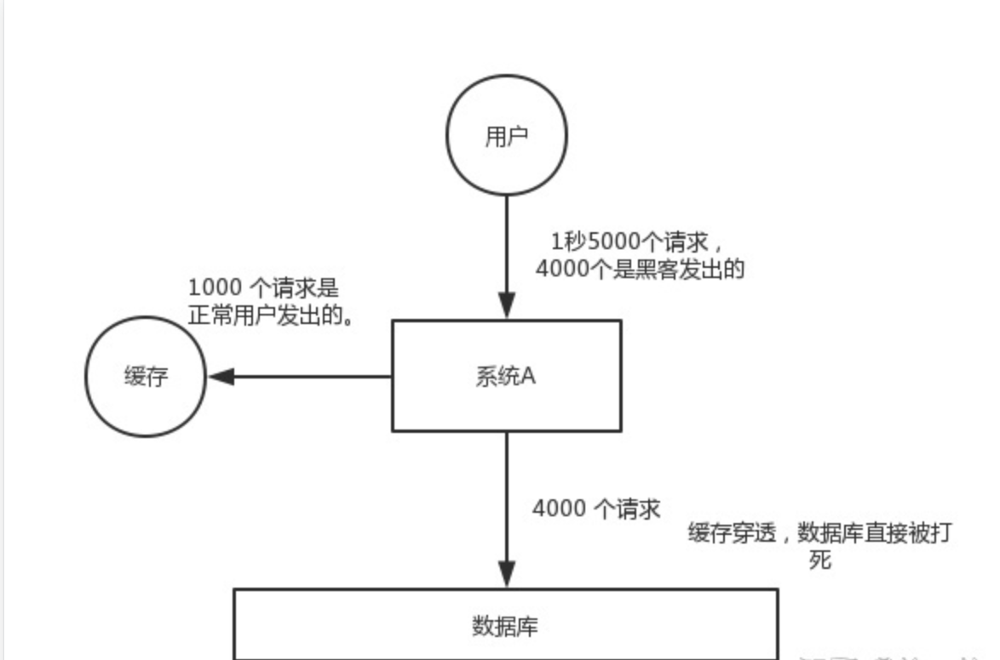
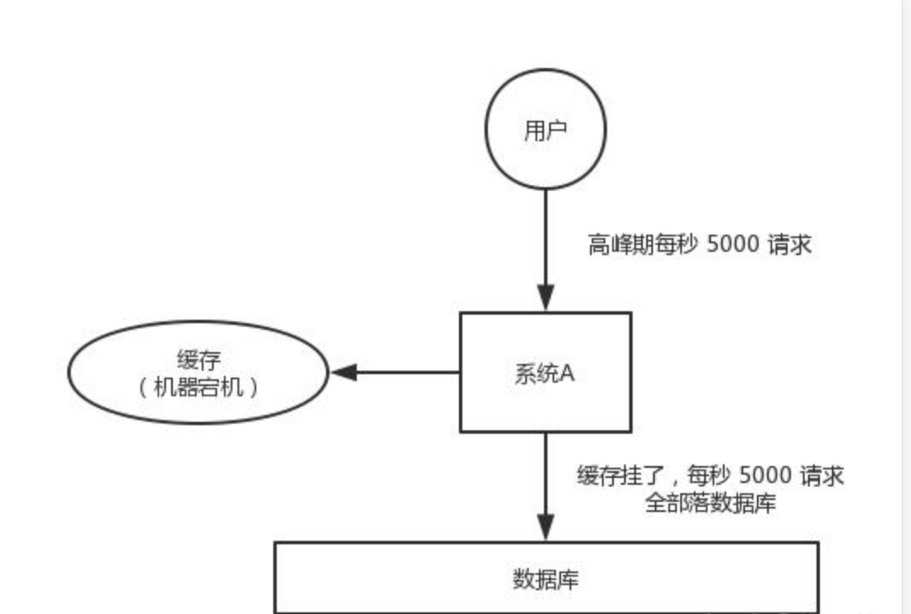

# 问题
redis的穿透、击穿、雪崩有什么不同点？

# 考察点

面试官想了解：

# 技术点
涉及的技术点：

# 回答

作为一种非关系型数据库，Redis也总是免不了有各种各样的问题。Redis的穿透、击穿和雪崩是与缓存相关的三个常见问题，它们在缓存应用中具有不同的表现和影响：

## 1. 缓存穿透

缓存穿透（Cache Penetration）指的是**在缓存中无法找到所请求的数据，导致每次请求都需要访问数据库**。
   
这通常发生在**恶意攻击或频繁请求不存在的数据**时。由于缓存无法命中，每个请求都会直接访问数据库，增加了数据库的负载，并且无效的查询结果不会被缓存，浪费了缓存资源。

### 关键词：穿过 Redis 和数据库

当 Redis 和数据库中都没有我们想要的数据时，就需要考虑缓存穿透的问题了。

下面这段逻辑大家用的会比较多：先去 Redis 中查找某资源，Redis 中查不到就去 DB 中查，DB 中查到后回写一份数据到 Redis 中。

### 场景

对于系统A，假设一秒 5000 个请求，结果其中 4000 个请求是黑客发出的恶意攻击。

黑客发出的那 4000 个攻击，缓存中查不到，每次你去数据库里查，也查不到。

数据库 id 是从 1 开始的，结果黑客发过来的请求 id 全部都是负数。这样的话，缓存中不会有，请求每次都“**视缓存于无物**”，直接查询数据库。

这种恶意攻击场景的缓存穿透就会直接把数据库给打死。

### 解决方案

**解决方案**：为了防止缓存穿透，可以使用以下策略：

#### 1、缓存空结果

- 对于**不存在的数据**，也将其**缓存起来**，但**设置较短的过期时间**，以防止攻击者持续发送相同的请求。

如果系统发现 Redis 及 DB 中都不存在该资源，就缓存空结果一段时间。需要注意哈，这次的失效时间不能设置的太长，否则数据的实效性会产生很大的问题。

#### 2、用户合法性校验

对用户的请求合法性进行校验，拦截恶意重复请求。

#### 3、布隆过滤器

- 在缓存层添加**布隆过滤器**（Bloom Filter）来**快速过滤掉不存在的数据**。

简单来说布隆过滤器的用途就是帮助你判断某个值是否存在。

>举个例子：假设我们现在有一个长度为 9 的 bit 数组，该数组的每个位置上只能保存 1 或者 0，1 标识该位置被占用，0 标识该位置未被使用。  对于 key1，我们借助三个 Hash 函数分别对其哈希运算。再将得到的这三个哈希值对 9 求模。最后将这三个模值落入到 bit 数组上。  key2、key3 按照同样的方式再处理一遍。最后，我们会发现这个 bit 数组里只有位置 3 还是空着的。  如果此时来了一个新的 key4 通过三个Hash算法求出的哈希值为 1、2、3，我们则可以断定 key4 一定不存在。

布隆过滤器的原理还是比较简单的。这里我们需要注意，布隆过滤器可能存在一定误判的可能性，但它依然可以帮助你拦截掉大部分一定不存在的数据。

## 2. 缓存击穿
 
缓存击穿（Cache Miss）：指的是**针对一个热点数据的并发请求，在缓存过期后，同时访问数据库，导致数据库负载增加**。

这通常发生在**热点数据的过期时间点**，当缓存失效后，多个请求同时查询数据库，导致缓存无法起到应有的作用。

### 关键词：定点打击

试想如果所有请求对着一个 key 照死里搞，这是不是就是一种定点打击呢？

### 场景

怎么理解呢？举个极端的例子：比如某某明星爆出一个惊天狠料，海量吃瓜群众同时访问微博去查看该八卦新闻，而微博 Redis 集群中数据在此刻正好过期了，那么无数的请求则直接打到了微博系统的物理 DB 上，DB 瞬间挂了。

### 解决方案

解决方案：为了防止缓存击穿，可以使用以下策略：

#### 1、热点数据永远不过期

- 使用**热点数据永不过期的策略**，或根据实际情况**设置合适的过期时间**，以**减少缓存失效的可能性**。

比如我们可以将某个 key 的缓存时间设置为 25 小时，然后后台有个 job 每隔 24 小时就去批量刷新一下热点数据。就可以解决这个问题了。

#### 2、使用互斥锁

- 使用**互斥锁或分布式锁来保护缓存访问**，确保只有**一个线程可以从数据库中加载数据**，并在加载完成后更新缓存。

容易影响吞吐量，大部分项目设置热点 key 永不过期就妥妥的了。

## 3. 缓存雪崩

缓存雪崩（Cache Avalanche）：指的是**大量缓存同时失效，导致所有请求都直接访问数据库，造成数据库负载激增**。

这通常发生在缓存层故障、网络故障、意外的缓存清理等情况下。

### 关键词：Redis 崩了，没有数据了

这里的 Redis 崩了指的并不是 Redis 集群宕机了。而是说在某个时刻 Redis 集群中的热点 key 都失效了。如果集群中的热点 key 在某一时刻同时失效了的话，试想海量的请求都将直接打到 DB 上，DB 可能在瞬间就被打爆了。

### 场景

对于系统 A，假设每天高峰期每秒 5000 个请求，本来缓存在高峰期可以扛住每秒 4000 个请求，但是缓存机器意外发生了全盘宕机。

缓存挂了，此时 1 秒 5000 个请求全部落数据库，数据库必然扛不住，它会报一下警，然后就挂了。

此时，如果没有采用什么特别的方案来处理这个故障，DBA 很着急，重启数据库，但是数据库立马又被新的流量给打死了。

### 解决方案

解决方案：为了防止缓存雪崩，可以使用以下策略：

- 使用**多级缓存架构**，将缓存分布在不同的层级和服务器上，减少单点故障的风险。

- **设置缓存失效时间的随机性**，避免大量缓存同时失效。

- **监控缓存状态**，及时发现和处理异常情况，例如及时恢复故障的缓存服务器。

#### 1、事前

事前：redis 高可用，主从+哨兵，redis cluster，避免全盘崩溃。

#### 2、事中

事中：本地 ehcache 缓存 + hystrix 限流&降级，避免 MySQL 被打死。

#### 3、事后

事后：redis 持久化，一旦重启，自动从磁盘上加载数据，快速恢复缓存数据。

# 总结

1. **缓存穿透**：是指当一个请求查询一个不存在的数据时，这个请求会穿过缓存层，直接访问数据库，导致数据库压力增大，甚至出现宕机的情况。缓存穿透通常是**由于恶意攻击或错误的业务逻辑导致的**。
   1. 解决方案：使用布隆过滤器、缓存空对象或使用固定的缓存数据等方式来避免查询不存在的数据。

**缓存穿透—穿过（绕过） Redis 和 DB 来搞你**

2. **缓存击穿**：是指当一个热点数据失效时，大量的请求涌入数据库，导致数据库压力增大，甚至出现宕机的情况。缓存击穿通常是由于缓存过期时间设置不合理或业务流量波动导致的。
   1. 解决方案：使用加锁、设置短期的缓存过期时间、使用缓存预热等方式来避免热点数据失效。

**缓存击穿—定点打击来搞你**

1. **缓存雪崩**：是指当大量的缓存数据在同一时间失效，导致大量的请求涌入数据库，导致数据库压力增大，甚至出现宕机的情况。缓存雪崩通常是由于缓存服务器宕机、网络异常或不合理的缓存数据存储策略导致的。
   1. 解决方案：使用多级缓存、缓存数据分布、设置合理的缓存过期时间等方式来避免大量缓存同时失效。

**缓存雪崩—热点 key 在某一个时刻同时失效**

