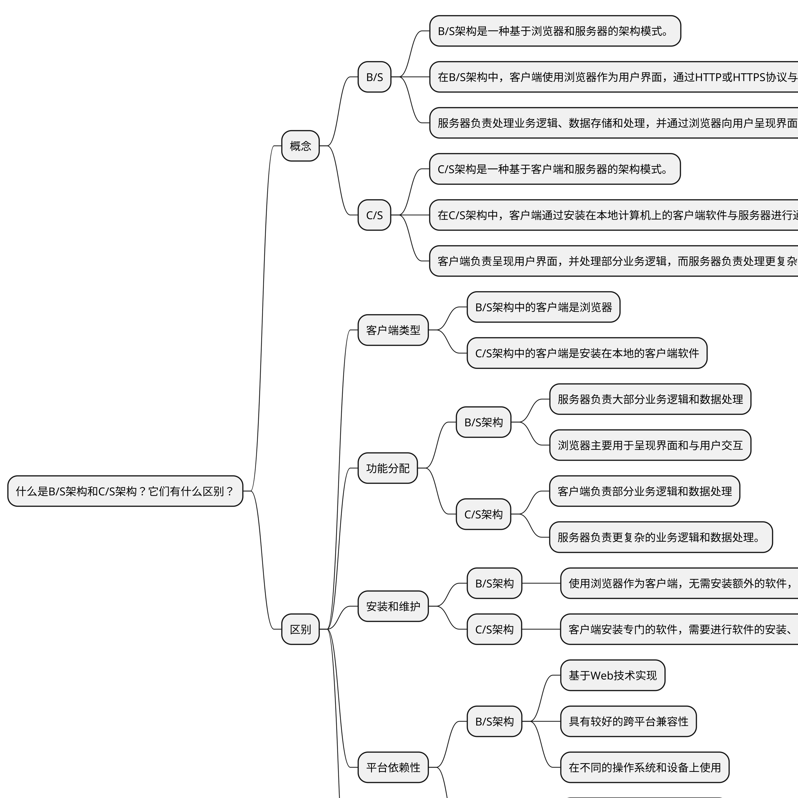

## 问题

1. 什么是B/S架构和C/S架构？它们有什么区别？

1. 常见的软件架构模式有哪些？它们具有不同的特点和应用场景？

1. B/S架构和C/S架构分别适用于哪些场景？

1. B/S架构中的客户端是什么？服务器是什么？

1. C/S架构中的客户端是什么？服务器是什么？

1. B/S架构和C/S架构各有哪些优缺点？

1. B/S架构中，浏览器的角色是什么？它有哪些功能？

1. C/S架构中，客户端的角色是什么？它有哪些功能？

1. B/S架构是否需要在客户端安装特定的软件？C/S架构呢？

## 考察点

面试官想了解：

- 是否了解软件架构模式

- 是否在工作中思考过应用的架构：B/S架构、C/S架构

## 软件架构模式

B/S架构（Browser/Server Architecture）和C/S架构（Client/Server Architecture）是常见的软件系统架构模式。

### B/S架构

B/S架构是一种基于浏览器和服务器的架构模式。

在B/S架构中，客户端使用浏览器作为用户界面，通过HTTP或HTTPS协议与服务器进行通信。

服务器负责处理业务逻辑、数据存储和处理，并通过浏览器向用户呈现界面和提供功能。

### C/S架构

C/S架构是一种基于客户端和服务器的架构模式。

在C/S架构中，客户端通过安装在本地计算机上的客户端软件与服务器进行通信。

客户端负责呈现用户界面，并处理部分业务逻辑，而服务器负责处理更复杂的业务逻辑、数据存储和处理。

### 区别

主要区别：

#### 客户端类型

B/S架构中的客户端是浏览器，而C/S架构中的客户端是安装在本地计算机上的客户端软件。

#### 功能分配

在B/S架构中，服务器负责大部分业务逻辑和数据处理，浏览器主要用于呈现界面和与用户交互。

而在C/S架构中，客户端负责部分业务逻辑和数据处理，服务器负责更复杂的业务逻辑和数据处理。

#### 安装和维护

B/S架构中，由于使用浏览器作为客户端，无需安装额外的软件，只需保持浏览器更新即可。

而C/S架构需要在客户端上安装专门的软件，需要进行软件的安装、升级和维护。

#### 平台依赖性

B/S架构是基于Web技术实现的，具有较好的跨平台兼容性，可以在不同的操作系统和设备上使用。

而C/S架构通常是针对特定操作系统或平台开发的，具有较强的平台依赖性。

#### 网络通信方式

B/S架构使用HTTP或HTTPS协议进行通信，通过浏览器向服务器发送请求和接收响应。

C/S架构可以使用不同的通信协议，如TCP/IP协议。

选择B/S架构还是C/S架构应根据具体的需求和场景来决定。B/S架构适合简单的应用程序和跨平台需求，而C/S架构适合复杂的应用程序和对客户端性能要求较高的场景。

