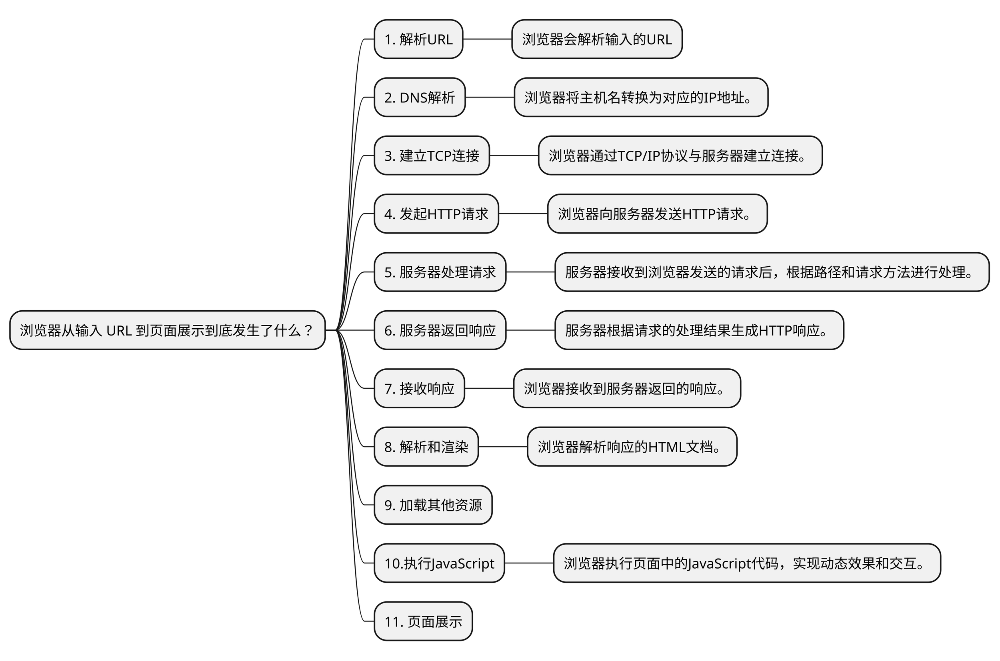
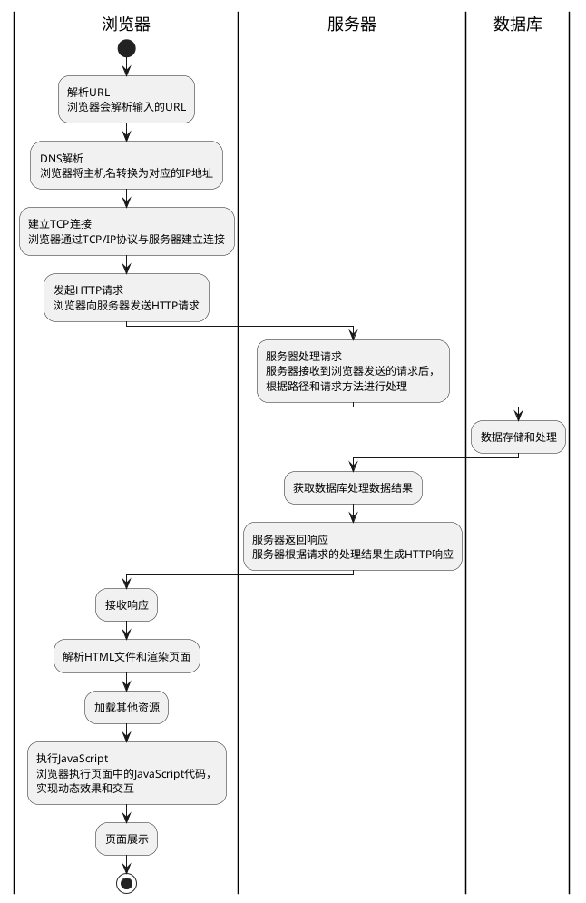

## 问题

1. 从输入 URL 到页面展示到底发生了什么？

1. 浏览器中输入百度首页网址，回车，发生了什么？

## 考察点

面试官想了解：

- 网络请求的过程
- 服务器处理请求
- 数据传输与响应
- 页面渲染
- 前端与后端交互
- 客户端缓存

## 回答

1. 发送HTTP请求。
1. 接收Web服务器响应。
1. 解析成Web页面。

从输入URL到页面展示经历了以下主要步骤：

### 1. 解析URL

**浏览器解析输入的URL**，提取出协议（如HTTP或HTTPS）、主机名（如www.example.com）以及其他相关的路径、查询参数等信息。

### 2. DNS解析

浏览器将**主机名转换为对应的IP地址**。

它会查询本地缓存中的DNS记录，如果找不到，则向DNS服务器发送查询请求。

### 3. 建立TCP连接

浏览器通过TCP/IP协议与服务器建立连接。

它会使用**IP地址**和**端口号**与服务器进行**握手**，以建立可靠的通信通道。

### 4. 发起HTTP请求

浏览器向服务器发送HTTP请求。

请求中包含请求的方法（如GET或POST）、路径、请求头信息以及其他相关的数据。

>建立TCP连接是因为HTTP协议是基于TCP/IP协议栈的应用层协议，它需要在传输层上建立可靠的通信通道来保证数据的可靠传输。 TCP（Transmission Control Protocol）是一种面向连接的协议，它提供了数据的可靠性、有序性和流量控制。建立TCP连接涉及三次握手的过程，即客户端向服务器发送连接请求，服务器回复确认，最后客户端再次回复确认。这样，双方就建立了可靠的连接，并可以进行数据的传输。  在HTTP请求中，包括请求头、请求方法、路径和其他相关的数据信息。这些数据需要通过可靠的通信通道进行传输，以确保数据的完整性和可靠性。TCP协议提供了分段、重传、校验和等机制，可以有效地处理数据的分包、丢失和错误等情况，保证数据的正确传输。  因此，为了使用HTTP协议进行数据通信，需要先建立TCP连接，以提供可靠的数据传输通道。TCP连接的建立和断开会增加一定的开销，但它能够保证数据的可靠传输，从而确保了HTTP请求的准确性和完整性。

### 5. 服务器处理请求

服务器接收到浏览器发送的请求后，根据路径和请求方法进行处理。

它可能会读取文件、查询数据库、执行服务器端的逻辑等操作。

### 6. 服务器返回响应

服务器根据请求的处理结果生成HTTP响应。

响应包含HTTP状态码、响应头信息和响应体（通常是HTML文档）。

### 7. 接收响应

浏览器接收到服务器返回的响应。

它会检查状态码以确定请求是否成功，并根据响应头信息处理进一步的操作。

### 8. 解析和渲染

浏览器解析响应的HTML文档，并根据HTML、CSS和JavaScript等资源进行页面的渲染。

它会构建DOM树、CSSOM树和渲染树，并根据样式信息进行布局和绘制。

### 9. 加载其他资源

如果HTML文档中包含其他资源（如CSS、JavaScript、图像等），浏览器会继续发送请求获取这些资源，并进行相应的处理和加载。

### 10.执行JavaScript

浏览器执行页面中的JavaScript代码，实现动态效果和交互。

JavaScript可以修改DOM、发送异步请求、处理用户事件等。

### 11. 页面展示

最后，浏览器将渲染好的页面内容显示在用户的浏览器窗口中，用户可以与页面进行交互，浏览和操作网页内容。

总结起来，从输入URL到页面展示，涉及了**URL解析**、**DNS解析**、**建立TCP连接**、**发起HTTP请求**、**服务器处理请求**、**返回响应**、**解析和渲染HTML**、**加载其他资源**、**执行JavaScript**等一系列步骤，最终呈现出完整的网页内容供用户浏览和使用。

### 步骤图

### 流程图

### 涉及知识点

网络请求的过程：在建立TCP连接后，浏览器会发送HTTP请求到Web服务器。你可以询问关于HTTP请求的具体步骤、请求头部信息和请求方法等。

服务器处理请求：Web服务器接收到浏览器发送的HTTP请求后，会进行处理。你可以探究服务器处理请求的过程，包括请求的路由、处理逻辑和数据查询等。

数据传输与响应：Web服务器处理完请求后，会生成相应的HTTP响应。你可以了解有关HTTP响应的信息，如状态码、响应头部和响应正文等。

页面渲染：浏览器接收到服务器返回的HTTP响应后，开始对响应进行解析和页面渲染。你可以探讨浏览器解析HTML、CSS和JavaScript，并生成页面的过程。

前端与后端交互：页面渲染完毕后，如果页面中包含与后端交互的操作，比如异步请求或表单提交，你可以了解相关的前端与后端交互过程。

客户端缓存：浏览器可以缓存页面资源，以提高加载速度和节省网络流量。你可以了解有关浏览器缓存机制的知识点，如缓存策略、缓存控制和缓存更新等。

## 
