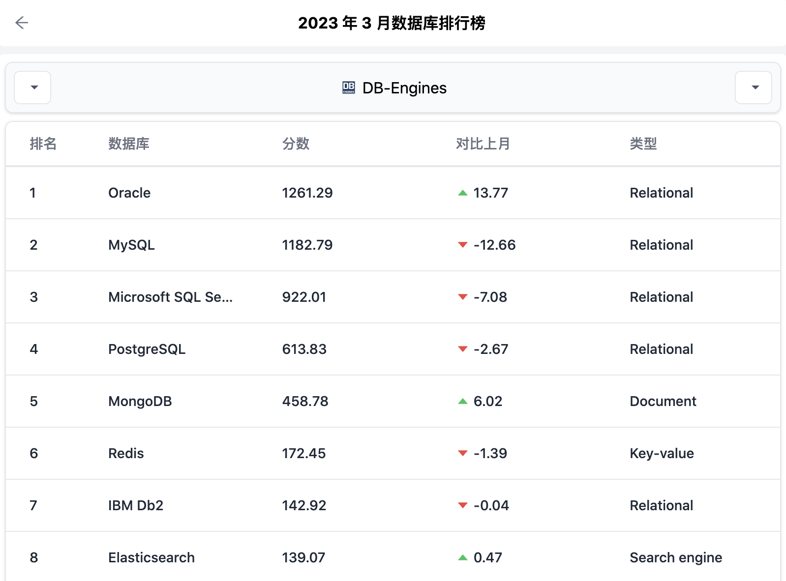
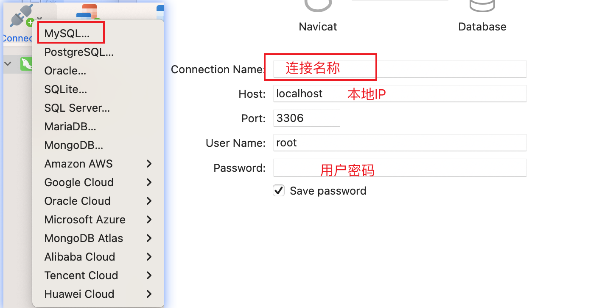
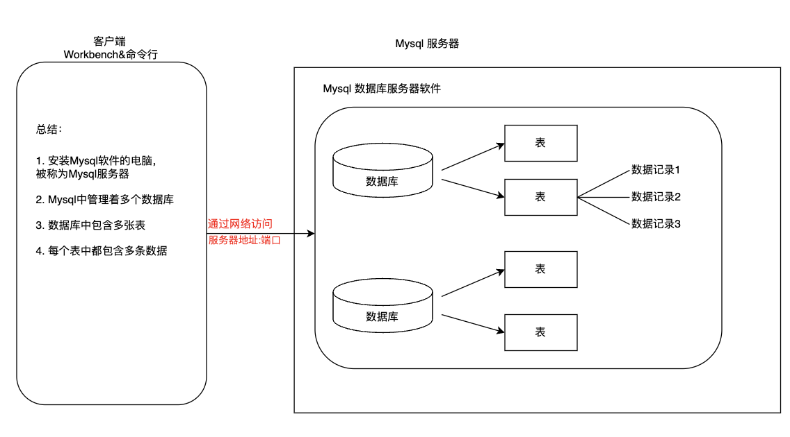
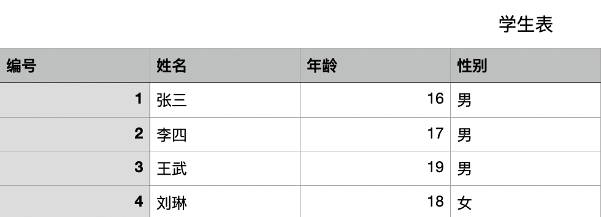

# MySQL

霍格沃兹测试开发学社

ceshiren.com


---


## 目录

- 数据库基本概念
- MySQL安装配置
- MySQL数据库登录
- 数据库管理系统
- SQL
- DDL操作数据库
- DDL操作数据表
 


---

## Question

- user.txt。


```
id    name    age
1     张三     15
2     李四     16
3     王五     17
4     赵六     18
5     孙启     19
```


---


## 数据库基本概念

- 什么是数据库
- 为什么使用数据库
- 常见数据库


---


### 什么是数据库

- 存储和管理数据的仓库。
- 本质是一个文件系统。


---


### 为什么使用数据库

|存储方式|优点|缺点
|---|---|---|
|内存|数据读取速度快|不能够永久保存,数据是临时状态的|
|文件|数据可永久保存|IO流操作文件，获取修改不方便|
|数据库|1.数据可永久保存<br>2.数据的存储和管理方便<br>3.统一的方式对数据进行操作|占资源，有些付费|

---


## 常见数据库



---


## MySQL安装配置


- 方式一：[官方下载](https://dev.mysql.com/downloads/mysql/)
- 方式二：[网盘下载](https://pan.baidu.com/s/1VtEXIogo_GS7iGh3f0nklw)  提取码：gxow

- 安装步骤：https://ceshiren.com/t/topic/16070/4


---


### Mac-MySQL启动与关闭

1. 系统偏好设置
2. 点击 MySQL 图标
3. 点击 Start MySQL Server 启动服务
4. 点击 Stop MySQL Server 关闭服务


---


### Mac-命令行启动与关闭


- 服务启动：
    ```bash
    sudo /usr/local/mysql/support-files/mysql.server start

    # 配置环境变量后
    sudo mysql.server start
    ```

- 服务关闭：
    ```bash
    sudo /usr/local/mysql/support-files/mysql.server stop

    # 配置环境变量后
    sudo mysql.server stop
    ```


---


### Window-DOS命令方式启动
1. 首先以管理员身份 打开命令行窗口：

2. 启动MySql
    ```bash
    net start mysql
    ```
3. 关闭MySql
    ```bash
    net stop mysql
    ```  


---


## MySQL数据库登录


- 命令行登录/退出
- Workbench使用


---


### 命令行登录/退出

- **登录：**
    ```bash
    # 使用指定用户名和密码登录当前计算机中的MySQL数据库
    mysql -u用户名 -p密码

    # -h 指定IP方式，进行登录
    mysql -h主机IP -u用户名 -p密码
    ```

- **退出：**

    ```bash
    exit;
    # 或者
    quit;
    ```


---


### Navicat使用

**安装：** [Navicat](https://navicat.com/en/download/navicat-premium)





---


## 数据库管理系统 

- 什么是数据库管理系统
- 数据库管理系统、数据库和表的关系
- 数据库表

---

### 什么是数据库管理系统

数据库管理系统(`DataBase Management System，DBMS`)：指一种操作和管理维护数据库的大型软件。

---


### 数据库管理系统、数据库和表的关系



---


### 数据库表 





---


## SQL

- 什么是SQL
- SQL通用语法


---


### 什么是SQL

结构化查询语言(Structured Query Language)简称SQL，它是一种特殊目的的编程语言，它的目的就是用来操作关系型数据库。


---


### SQL通用语法

1. SQL语句可以单行 或者 多行书写，以分号 结尾 `;` 。

2. 可以使用空格和缩进来增加语句的可读性。
 
3. MySql中使用SQL不区分大小写。一般关键字大写，数据库名、表名、列名小写。
 


---


### 练习

在Navicat上练习注释并分别运行截图。  

 


---


### SQL的分类

- 数据定义语言：
  - DDL(Data Definition Language)，用来定义数据库对象:数据库，表，列 等。
- 数据操作语言：
  - DML(Data Manipulation Language)，用来对数据库中表的记录进行更新。
- 数据查询语言：
  - DQL(Data Query Language)，用来查询数据库中表的记录。
- 数据控制语言：
  - DCL(Date Control Language)，用来定义数据库的访问权限和安全级别，及创建用户。


---


### SQL的分类


---


## DDL操作数据库

数据库的创建、查看、选择、修改、删除。


---


### DDL创建数据库

- 命令模版：「见右侧🫱」
- 练习：
  - 创建名为jd的数据库。
  - 创建名为wechat的数据库并指定字符集为utf-8。

```sql
-- 创建指定名称的数据库。
create database 数据库名;
-- 创建指定名称的数据库，
-- 并且指定字符集(一般都指定utf-8)
create database 数据库名 character set 字符集;
```


---


### DDL查看/选择数据库


- 命令模版：「见右侧🫱」
- 练习：
  - 查看当前正在使用的数据库。
  - 使用jd数据库。
  - 数据库从jd 切换到 wechat。
  - 查看Mysql中有哪些数据库。


```sql
-- 切换数据库
use 数据库
-- 查看当前正在使用的数据库
select database();
-- 查看Mysql中都有哪些数据库
show databases;
--  查看一个数据库的定义信息
show create database 数据库名;
```


---


### DDL修改数据库


- 命令模版：「见右侧🫱」
- 练习：
  - 将数据库jd 的字符集 修改为 utf8。
  - 查看当前正在使用的数据库。

```sql
-- 数据库的字符集修改操作
alter database 数据库名 character set 字符集; 
```

---


### DDL删除数据库

- 命令模版：「见右侧🫱」
- 练习：
  - 将数据库 wechat 删除。

```sql
-- 从MySql中永久的删除某个数据库
drop database 数据库名
```


---


## DDL 操作数据表

数据表的创建、查看、修改、删除。


---


### MySQL常见的数据类型
|类型|描述|
|---|---|
|int |整型|
|double| 浮点型|
|varchar |字符串型|
|date |日期类型，给是为 yyyy-MM-dd ,只有年月日，没有时分秒


---


### char与varchar区别


- char类型是固定长度的。
  - 适合存储 **固定长度**的字符串，比如：密码 ，性别一类。

- varchar类型是可变长度的。
  - 适合存储 在**一定范围内，有长度变化**的字符串。

 

---


## 创建表


- 命令模版：「见右侧🫱」
    - 最后一列不要加逗号。


```sql
CREATE TABLE 表名(
    字段名称1 字段类型(长度)，
    字段名称2 字段类型 
);
```


---


### 创建商品分类表

- 表名：`category`。
- 表中字段:
    - 分类ID：`cid` ,为整型。
    - 分类名称：`cname`，为字符串类型，指定长度20。


---


### 创建测试表

- 表名：`test1`。
- 表中字段:
  - 测试ID：`tid` ,为整型。
  - 测试时间：`tdate` , 为年月日的日期类型。


 


---


## 复制表结构

- 命令模版：「见右侧🫱」
  - 快速创建一个表结构相同的表。

- 需求：
  - 创建一个表结构与 test1 相同的 test2表。
  - 查看表test2结构。

```sql
create table 新表明 like 旧表名
```


---


## 查看表
- 命令模版：「见右侧🫱」


```sql
-- 查看当前数据库中的所有表名
show tables;
-- 查看数据表的结构
desc 表名; 
```

---


### 查看商品分类表

- 查看当前数据库中的所有表名。
- 显示商品分类表`category`的结构。
- 查看创建表`category`的SQL语句。


---


### 查看测试表

- 查看当前数据库中的所有表名。
- 显示测试表`test1`的结构。
- 查看创建表`test1`的SQL语句。


---


## 删除表

- 命令模版：「见右侧🫱」
- 需求：
  - 直接删除test1表。
  - 先判断test2是否存在，存在的话就删除test2表。
```sql
-- 删除表(从数据库中永久删除某一张表)
drop table 表名;
-- 判断表是否存在， 存在的话就删除,不存在就不执行删除
drop table if exists 表名;
```


---

## 修改表 
- 修改表名 
- 修改表的字符集 
- 向表中添加列
- 修改列名称
- 删除列


---


### 修改表名

- 命令模版：「见右侧🫱」
- 需求：
  - 将 `category` 表名改为 `category2`。
  - 将 `test2` 表名改为 `test01`。


```sql
rename table 旧表名 to 新表名
```


---


### 修改表的字符集 


- 命令模版：「见右侧🫱」
- 需求：
  - 将`category2`表的字符集 修改为`gbk`。


```sql
alter table 表名 character set 字符集
```


---


### 向表中添加列


- 命令模版：「见右侧🫱」
- 需求：为表category添加一个新的字段。
  - 分类描述：cdesc。
  - 分类描述的数据类型：varchar(20)。


```sql
alert table 表名 add 字段名称 字段类型
```


---

### 修改列数据类型或长度


- 命令模版：「见右侧🫱」
  - 关键字：**MODIFY**
- 需求：对表category的描述字段cdesc进行修改。
  - 数据类型改为char(50)。
  - 数据类型长度改为varchar(50)。


```sql
alter table 表名 modify 字段名称 字段类型
```


---

### 修改列名称


- 命令模版：「见右侧🫱」
  - 关键字：**CHANGE**
- 需求：对表category中的 desc字段进行更换。
  - 更换为 description varchar(30)。


```sql
alter table 表名 change 旧列名 新列名 类型(长度);
```


---


### 删除列


- 命令模版：「见右侧🫱」
  - 关键字：**DROP**
- 需求：删除表category中description这列。


```sql
alter table 表名 drop 列名;
```


---
