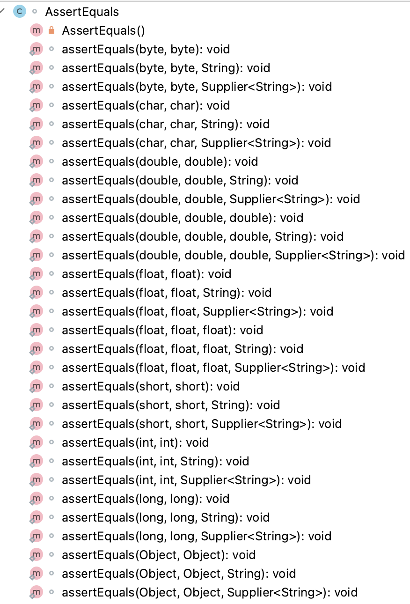
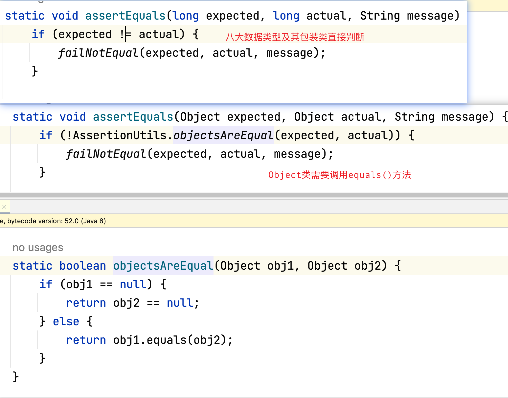
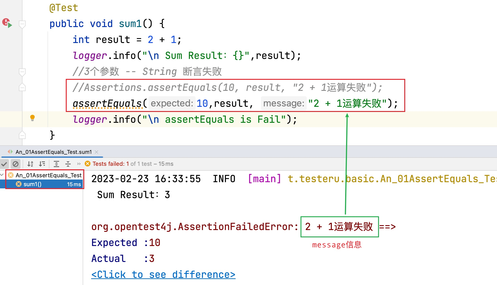
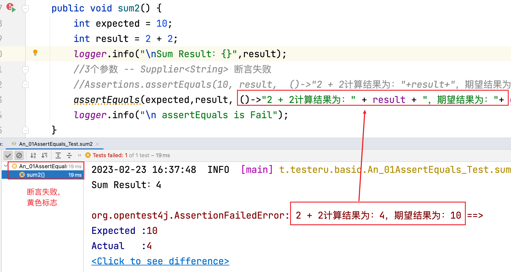

# assertEquals

## 本章要点

1. 测试用例步骤

1. 断言概念

1. assertEquals()

   1. 语法

   1. 原理

   1. 示例代码


## 测试用例基本步骤

在讲断言之前，我们来看一下对应创建一个测试用例的基本步骤，大致分为下面三步：

1. 创建被测类的实例。

2. 编写业务逻辑的代码。

3. 使用断言验证结果是否符合您的预期。

这也就是我们为什么说要学习断言的一个必要性，测试用例不是写流程，还需要对最终的结果进行一个断言校验。

## 断言概念

测试用例通过测试的步骤进行验证后，需要查看执行完测试步骤后的结果即**实际值**和**期望结果**（`Expectation vs Reality`）是否一致。


## 注意

1. 断言没有返回值，返回值类型为`void`。
   
2. 断言通过，说明当前的业务逻辑对应的测试用例通过。
   
3. 断言通过后，测试用例方法中断言后的代码正常运行。

4. 断言失败后，测试用例方法中断言后的代码不会运行。


## assertEquals( )

### 介绍

`assertEquals()`方法为判断两个对象是否相等，如果相等则结果为`true`，否则为`false`。

>类似于字符串比较使用的`equals()`方法，但是断言没有返回值。如下图，无论`assertEquals()`方法内传入的参数类型是什么，最终的方法返回值都是`void`。




### 导包

```java
//错误的导包，该包下的AssertEquals不是一个public的class
//import static org.junit.jupiter.api.AssertEquals.assertEquals;
import static org.junit.jupiter.api.Assertions.assertEquals;
```

### 语法

```java

assertEquals(expected, actual, String message);
```

```java
assertEquals(expected, actual, String messageSupplier);
```

assertEquals 方法会比较 expected、actual 这两个值是否相等。

如果相等，则测试通过，否则测试失败，并输出错误信息。

常用的参数传入有三个，expected、actual、message。

#### expected

期望值。希望当前方法中业务逻辑运行的结果。

#### actual

实际值。当前方法在执行完业务逻辑后的实际结果。

#### message

如果期望值和实际值不相同，即断言失败对应显示的提示内容。


#### messageSupplier

生产者接口。


#### 两个参数

传入2个参数时，只是断言当前方法运行的预期结果和实际结果是否相等，如果不相等不会给出自定义的失败提示信息。

```java
assertEquals(expected, actual)
```

expected、actual 参数类型可以是Java的 **八大基本数据类型**及其**包装类**，还可以是 **Object类**。也就是，expected、actual 参数类型可以是任意对象。

>Object是Java所有类的父类。

#### 三个参数

传入3个参数时，不只是断言当前方法运行的预期结果和实际结果是否相等，还可以在断言失败时提供**自定义的提示消息**。

当 **预期值** 和 **实际值** 是 **八大基本数据类型** 及其 **包装类** ， assertEquals() 会根据值直接判断返回结果，不会调用 equals(Object)方法。

当 **预期值** 和 **实际值** 是 对象 时，assertEquals() 会调用equals(Object)方法判断。

如下图调用链路：




##### String

```java
assertEquals(expected, actual, String message)
```

message 的参数类型只能是 String。


##### Supplier

```java
assertEquals(expected, actual, Supplier<String> messageSupplier)
```

messageSupplier的参数类型是Supplier类。从提供的 messageSupplier 延迟检索失败消息。

Supplier接口定义了一个 T get() 的抽象方法。

其函数描述符为 () -> T。如果不接受入参，直接为我们生产一个指定的结果，那么就可以用`Supplier<T>`。


##### Supplier VS String

String类型的message里面的内容无论断言是否失败，都会运行。

`Supplier<String>`的messageSupplier代码，只有在断言失败的时候才会运行。

### 原理

assertEquals() 方法的比较是基于值的比较，而不是引用的比较。

它会自动调用对象的 equals 方法来比较两个对象的内容是否相等。

对于**基本数据类型**，assertEquals 方法会比较其**数值**是否相等；对于**对象类型**，assertEquals 方法会比较**对象的内容**是否相等。


### 断言通过代码

```java
@Test
public void sum() {
    int result = 2 + 8;
    logger.info("Sum Result：{}",result);
    //2个参数 -- 断言成功
    //Assertions.assertEquals(10,result);
    assertEquals(10,result);
}
```

点击测试方法左侧运行按钮，只运行当前测试方法，输出结果如下：


### 断言失败代码

#### 断言失败String

```java
@Test
public void sum1() {
    int result = 2 + 1;
    logger.info("\n Sum Result：{}",result);
    //3个参数 -- String 断言失败
    //Assertions.assertEquals(10, result, "2 + 1运算失败");
    assertEquals(10,result, "2 + 1运算失败");
    logger.info("\n assertEquals is Fail");
}
```

点击测试方法左侧运行按钮，只运行当前测试方法，**断言后的日志信息**没有被打印，输出结果如下：



#### 断言失败Supplier

```java
@Test
public void sum2() {
    int expected = 10;
    int result = 2 + 2;
    logger.info("\nSum Result：{}",result);
    //3个参数 -- Supplier<String> 断言失败
    //Assertions.assertEquals(10, result,  ()->"2 + 2计算结果为："+result+"，期望结果为："+ expected);
    assertEquals(expected,result, ()->"2 + 2计算结果为：" + result + "，期望结果为："+ expected);
    logger.info("\n assertEquals is Fail");
}
```

点击测试方法左侧运行按钮，只运行当前测试方法，**断言后的日志信息**没有被打印，输出结果如下：



## 总结

1. 测试用例基本步骤。

1. 断言概念。

1. assertEquals()
  
  1. 导包问题。

  2. 参数第一个为期望值，第二个为业务执行的实际值。
  
  3. 第三个参数，可为String也可为流。


[项目演示地址](../../code/junit5-example/src/test/java/top/testeru/basic/AssertEqualsTest.java)