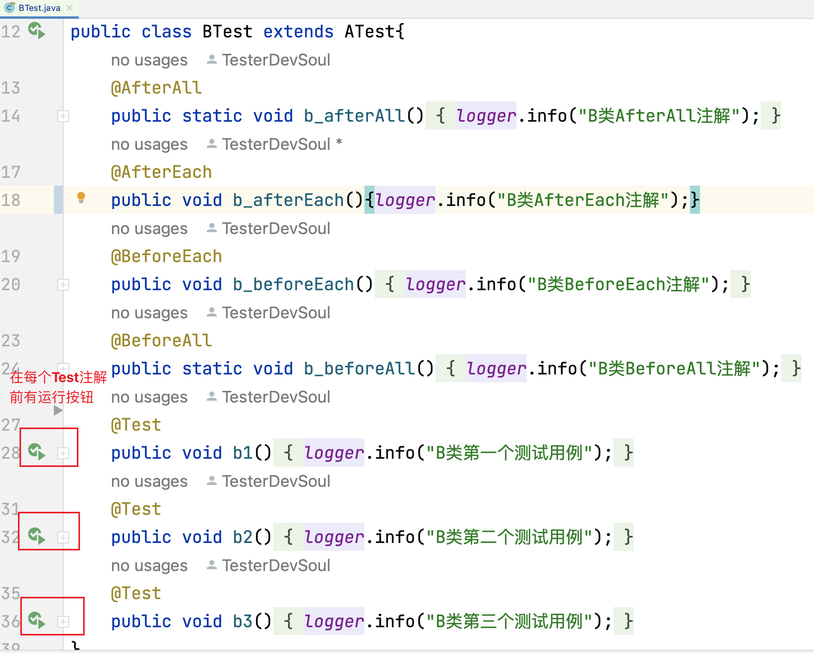
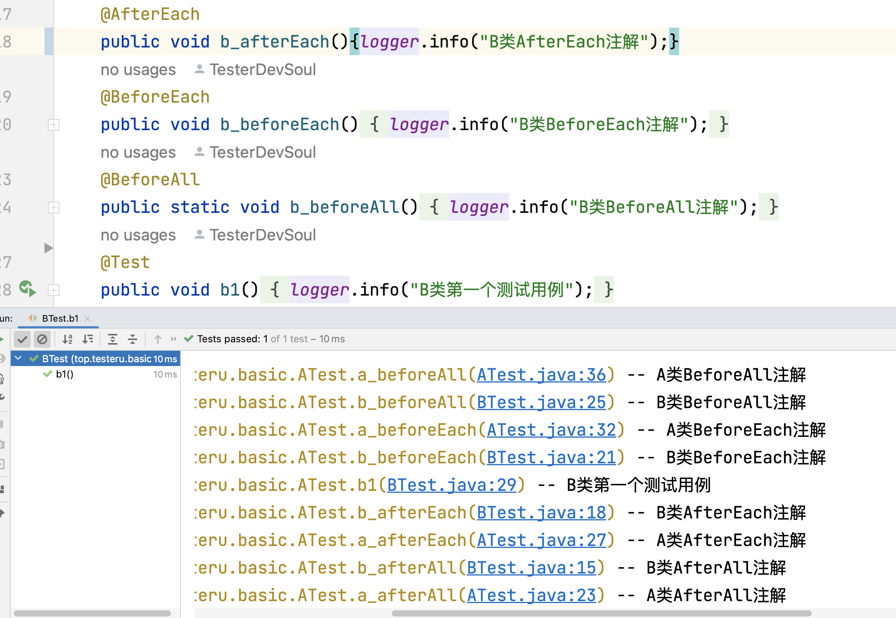
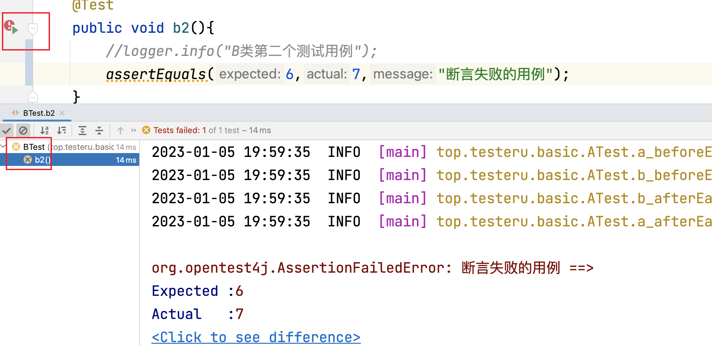
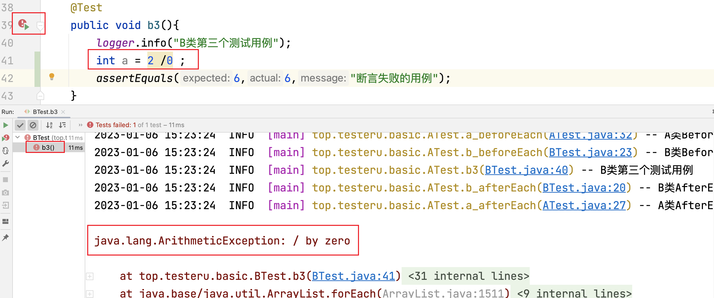
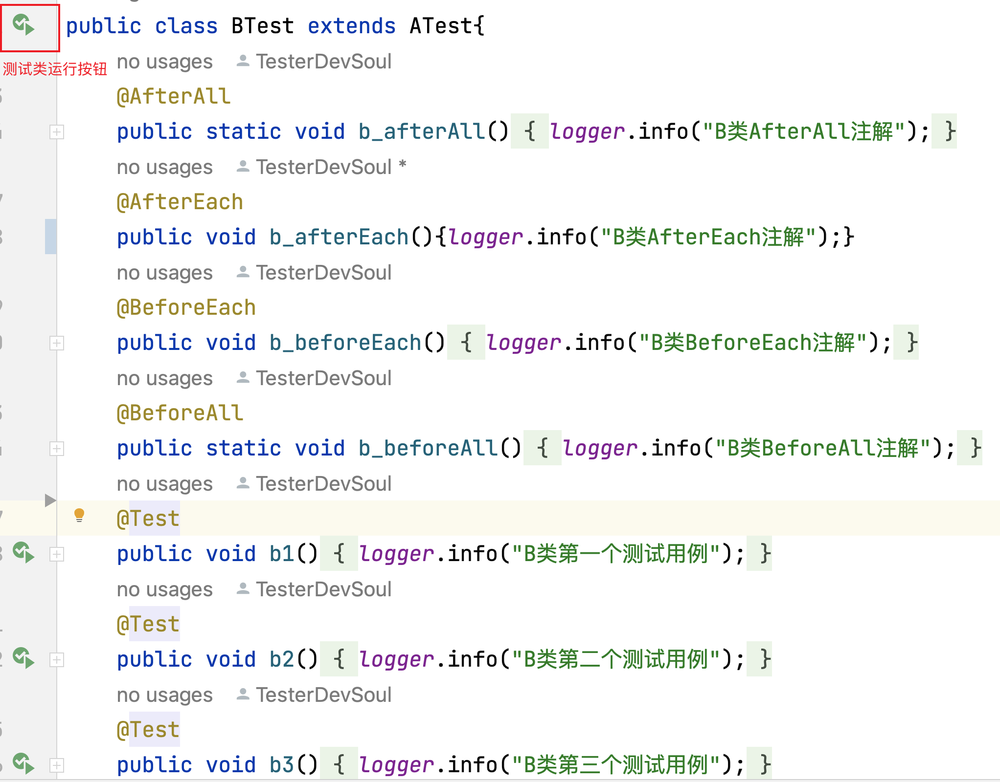
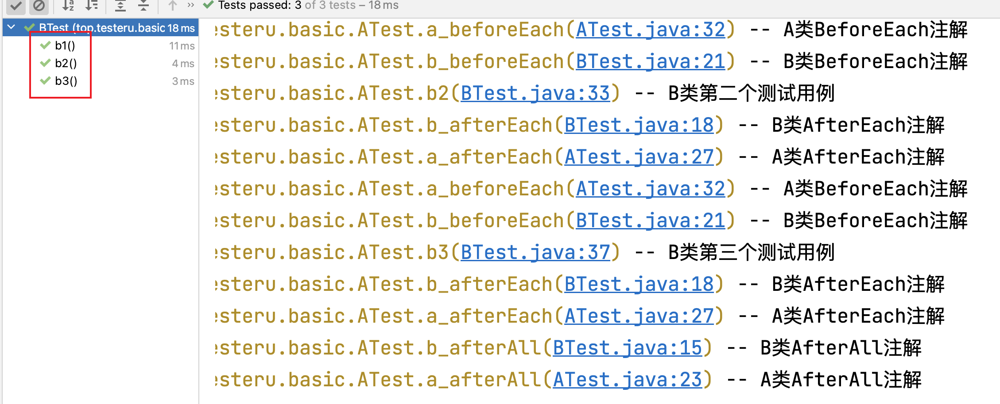
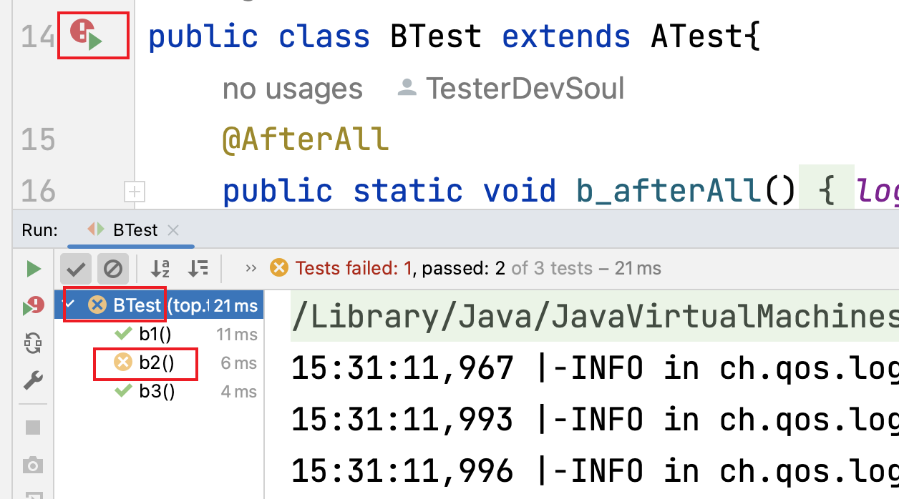
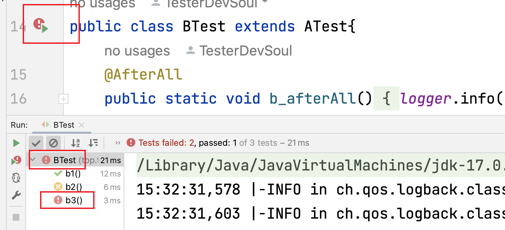

# 界面化运行测试用例

## 本章要点

1. 开发工具的界面化

1. 界面化运行测试方法

1. 界面化运行测试类

## 运行具体测试方法

若需要只运行一个类中的测试方法，则在IDEA中点击该测试方法左侧的绿色按钮即可。
可运行的测试方法必须是`@Test`注解修饰。

无论运行哪个测试方法，对应`@BeforeAll`、`@BeforeEach`、`@AfterEach`、`@AfterAll`都会运行。

### 测试方法运行通过

标识：绿色✅对勾。

运行具体的测试方法通过，运行结果如下：

### 测试方法断言失败

标识：黄色❌错误。

- 运行的代码正常没有报错，但是断言的结果失败。

- 此时Run显示为黄色标识，代表断言没通过，但是代码没出现错误。
  
- 方法左侧的绿色按钮对应新增红点。

### 测试方法运行异常

标识：红色❗️感叹号。

- 运行的@Test注解内的业务逻辑代码抛出异常。

- 此时Run显示为红色感叹号，代表代码异常，@Test方法中异常后的代码不在乎运行，但是@AfterEach、@AfterAll注解内的代码正常运行。

  >哪怕@Test方法内的代码抛出Exception，@AfterEach、@AfterAll注解内的代码不受影响还是正常执行。

## 运行具体测试类

若需要运行测试类，则在IDEA中点击类名左侧的绿色按钮即可。

运行测试类，对应的所有测试方法同时运行。

### 测试类全部运行通过

所有测试方法运行通过，运行结果如下：

### 测试类断言失败

只要测试类中有一个测试方法断言失败，对应的类代表断言失败，运行结果如下：

### 测试类运行异常

当前测试类运行有一个测试方法断言失败，有一个测试方法抛出异常，此时类的运行结果标识为Exception异常的标识，运行结果如下：

## 显示的优先级

异常❗️ > 断言失败❌ > 通过✅

## 总结

- 开发工具的使用。

- 界面化运行测试方法。

- 界面化运行测试类。
