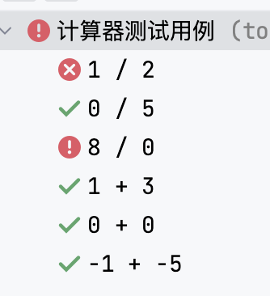
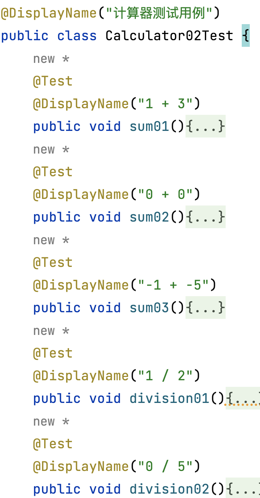
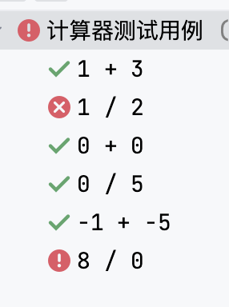
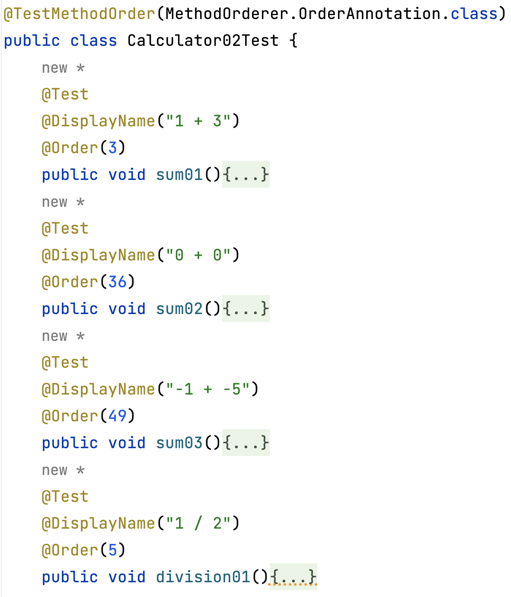
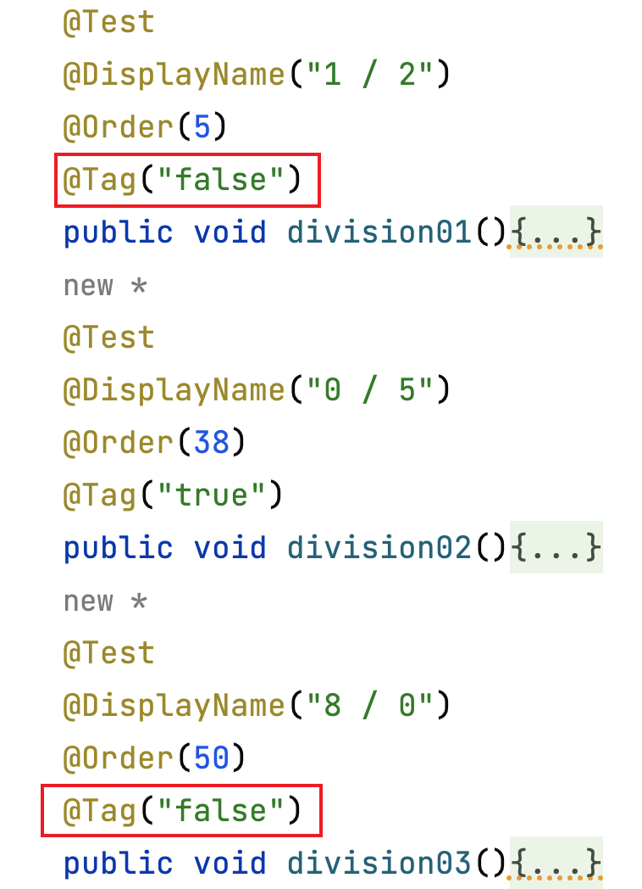
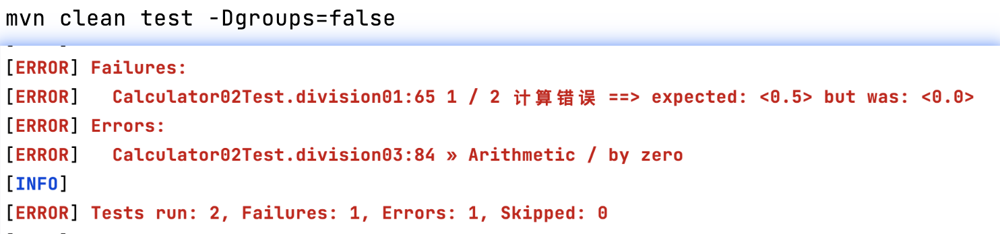

# 计算器加法测试用例基本实现


### 自定义测试用例显示名称

英文命名的测试类及测试方法可读性差，想要增加易读性，可以使用自定义对应测试用例名称实现。



**示例代码**：



### 自定义测试用例执行顺序

前面默认的执行顺序为先进行除法运算，再进行加法运算。

现在需求想要执行一个加法运算，再执行一个除法运算。



则使用Order注解进行排序，2种方式：

1. 配置junit5配置文件junit-platform.properties。

```
#声明测试方法的排序规则
#junit.jupiter.testmethod.order.default=org.junit.jupiter.api.MethodOrderer$OrderAnnotation
#junit.jupiter.testmethod.order.default=包名.类名$内部类
```

2. 测试类直接声明。

```java
@TestMethodOrder(MethodOrderer.OrderAnnotation.class)
```




### 添加自定义标签

运行成功的测试用例添加Tag标签true，运行失败的测试用例「断言失败/业务代码异常」添加Tag标签false。




```bash
mvn clean test -Dgroups=false
```



window电脑参数加双引号。