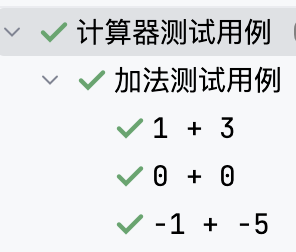
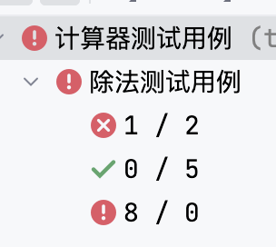

# 计算器参数化实现

## 参数化

相同的方法调用使用不同的测试用例生成，对应的重复代码太冗余，为了降低代码量，使用参数化生成对应测试用例。

参数化测试用例与@Test注解测试用例不同，参数化测试用例是在当前测试方法下执行多次。

@Test注解测试用例是同一层级执行。


### 加法参数化



```java
@ParameterizedTest(name = "{0} + {1}")
@MethodSource("top.testeru.source.SumSource#sumParams")
@Order(3)
@DisplayName("加法测试用例")
public void sumParams(int a, int b, int re){
    int result = calculator.sum(a, b);
    //assertEquals(expected, actual,String message)
    //expected:期望值,  actual:运算的实际值,  message:断言失败的提示信息
    assertEquals(re, result, a + "+" + b + "计算错误");
}
```

#### 数据源

```java
public class SumSource {
    public static Stream<Arguments> sumParams(){
        return Stream.of(
                Arguments.arguments(1, 3, 4),
                Arguments.arguments(0, 0, 0),
                Arguments.arguments(-1, -5, -6));
    }
}
```

### 除法参数化




```java
@ParameterizedTest(name = "{0} / {1}")
@MethodSource("top.testeru.source.DivisionSource#diviParams")
@DisplayName("除法测试用例")
@Order(5)
public void diviParams(int a, int b, double re){
    double result = calculator.division(a, b);
    //assertEquals(expected, actual,String message)
    //expected:期望值,  actual:运算的实际值,  message:断言失败的提示信息
    assertEquals(re , result, a + "/" + b + "计算错误");
}
```

#### 数据源

```java
public class DivisionSource {
    public static Stream<Arguments> diviParams(){
        return Stream.of(
                Arguments.arguments(1, 2, 0.5),
                Arguments.arguments(0, 5, 0),
                Arguments.arguments(8, 0, 0));
    }
}
```

