# 高级计算器测试用例


## 案例需求

针对目前我们的所学测试框架内容，完成一个测试案例：**高级计算器测试**！

高级计算器主要功能如下：

1. **加法**：不限制加数个数，只要传入double或int类型的数即可。

   >传入100时报错，传入[-99,99]范围内的数。

2. **减法**：如果是传入的2个数，则直接第一个数减去第二个数。若传入多个数，则100减去传入的参数。

    >必须传入[-99,99]范围内的数。

3. **字符串拼接**：多个字符串中间根据空格进行拼接。


[高级计算器实现代码](../code/junit5-combat/src/main/java/top/testeru/Calculator.java)

## 测试用例

[高级计算器测试用例](高级计算器测试用例.xlsx)

## 实现步骤

### 1. 项目初始化

#### Maven项目创建

#### 依赖的导包

- JUnit5依赖。

- log日志依赖。

- Allure报告依赖。

```xml
<!--    版本配置-->
<properties>
    <maven.compiler.encoding>UTF-8</maven.compiler.encoding>
    <java.version>11</java.version>
    <junit.jupiter.version>5.9.2</junit.jupiter.version>
    <maven.compiler.version>3.11.0</maven.compiler.version>
    <maven-surefire-plugin.version>3.0.0</maven-surefire-plugin.version>
    <!-- log日志 -->
    <slf4j.version>2.0.7</slf4j.version>
    <logback.version>1.4.6</logback.version>
    <!-- allure报告 -->
    <allure.version>2.21.0</allure.version>
    <aspectj.version>1.9.19</aspectj.version>
    <allure.maven.version>2.12.0</allure.maven.version>
    <allure.cmd.download.url>
        https://repo.maven.apache.org/maven2/io/qameta/allure/allure-commandline
    </allure.cmd.download.url>
</properties>
<dependencyManagement>
    <!--        junit5 版本管理， 找到对应依赖关系的 pom 文件，为了解决依赖冲突问题-->
    <dependencies>
        <dependency>
            <groupId>org.junit</groupId>
            <artifactId>junit-bom</artifactId>
            <version>${junit.jupiter.version}</version>
            <type>pom</type>
            <scope>import</scope>
        </dependency>
    </dependencies>
</dependencyManagement>
<dependencies>
    <!-- junit 相关依赖下载-->
    <!-- junit5 -->
    <dependency>
        <groupId>org.junit.jupiter</groupId>
        <artifactId>junit-jupiter</artifactId>
        <scope>test</scope>
    </dependency>
    <!-- junit5-suite -->
    <dependency>
        <groupId>org.junit.platform</groupId>
        <artifactId>junit-platform-suite</artifactId>
        <scope>test</scope>
    </dependency>
    <!-- 用做兼容老版本 -->
    <dependency>
        <groupId>org.junit.vintage</groupId>
        <artifactId>junit-vintage-engine</artifactId>
        <scope>test</scope>
    </dependency>
    <!-- log日志 -->
    <dependency>
        <groupId>org.slf4j</groupId>
        <artifactId>slf4j-api</artifactId>
        <version>${slf4j.version}</version>
        <scope>compile</scope>
    </dependency>
    <dependency>
        <groupId>ch.qos.logback</groupId>
        <artifactId>logback-classic</artifactId>
        <version>${logback.version}</version>
        <scope>compile</scope>
    </dependency>
    <!-- allure报告-->
    <dependency>
        <groupId>io.qameta.allure</groupId>
        <artifactId>allure-junit5</artifactId>
        <version>${allure.version}</version>
    </dependency>

</dependencies>
<build>
    <plugins>
        <!-- maven 命令行执行插件-->
        <plugin>
            <groupId>org.apache.maven.plugins</groupId>
            <artifactId>maven-surefire-plugin</artifactId>
            <version>${maven-surefire-plugin.version}</version>
            <dependencies>
                <dependency>
                    <groupId>org.junit.jupiter</groupId>
                    <artifactId>junit-jupiter-engine</artifactId>
                    <version>${junit.jupiter.version}</version>
                </dependency>
                <dependency>
                    <groupId>org.junit.vintage</groupId>
                    <artifactId>junit-vintage-engine</artifactId>
                    <version>${junit.jupiter.version}</version>
                </dependency>
            </dependencies>
        </plugin>
        <!--maven 编译使用插件-->
        <plugin>
            <groupId>org.apache.maven.plugins</groupId>
            <artifactId>maven-compiler-plugin</artifactId>
            <version>${maven.compiler.version}</version>
            <configuration>
                <parameters>true</parameters>
                <source>${java.version}</source>
                <target>${java.version}</target>
                <encoding>${maven.compiler.encoding}</encoding>
            </configuration>
        </plugin>

        <plugin>
            <groupId>io.qameta.allure</groupId>
            <artifactId>allure-maven</artifactId>
            <version>${allure.maven.version}</version>
            <configuration>
                <reportVersion>${allure.version}</reportVersion>
                <allureDownloadUrl>${allure.cmd.download.url}/${allure.version}/allure-commandline-${allure.version}.zip</allureDownloadUrl>
            </configuration>
        </plugin>
    </plugins>
</build>
```

#### 日志格式配置

日志 logback.xml 配置：

- 命令行输出格式配置。

- log文件格式配置。

```xml
<?xml version="1.0" encoding="UTF-8"?>
<configuration>
    <!-- name指定<appender>的名称    class指定<appender>的全限定名  ConsoleAppender的作用是将日志输出到控制台-->
    <appender name="STDOUT" class="ch.qos.logback.core.ConsoleAppender">
        <encoder>
            <!--输出时间格式 %-5level：级别从左显示5个字符宽度-->
            <pattern>%d{yyyy-MM-dd HH:mm:ss}  %highlight%-5level %magenta([%thread]) %yellow(%logger{40}.%M\(%class{0}.java:%line\)) -- %msg%throwable%n</pattern>
        </encoder>
    </appender>
    <!-- 通过 "byModel" 将时间格式化成 "yyyyMMdd" 的形式插入到 logger 的上下文中这个值对后续的配置也适用-->
    <timestamp key="byModel" datePattern="yyyyMMdd" />

    <appender name="FILE"  class="ch.qos.logback.core.rolling.RollingFileAppender">

        <file>${byModel}.log</file>

        <!-- 配置日志所生成的目录以及生成文件名的规则-->
        <rollingPolicy class="ch.qos.logback.core.rolling.TimeBasedRollingPolicy">
            <!--日志文件输出的文件名-->
            <FileNamePattern>${log.zip.path}/%d{yyyy-MM-dd}.%i.log.zip</FileNamePattern>
            <!-- 日志总保存量为1GB -->
            <totalSizeCap>1024MB</totalSizeCap>
            <!-- 如果按天来回滚，则最大保存时间为365天，365天之前的都将被清理掉 -->
            <maxHistory>30</maxHistory>
            <timeBasedFileNamingAndTriggeringPolicy
                    class="ch.qos.logback.core.rolling.SizeAndTimeBasedFNATP">
                <!--文件达到 最大128MB时会被压缩和切割 -->
                <maxFileSize>128MB</maxFileSize>
            </timeBasedFileNamingAndTriggeringPolicy>
        </rollingPolicy>

        <encoder>
            <pattern>%d{yyyy-MM-dd HH:mm:ss} %-5level [%thread] %logger{40}.%M\(%class{0}.java:%line\) -- %msg%n</pattern>

        </encoder>

    </appender>

    <logger name="top.testeru" level="INFO" />
    <logger name="ch.qos.logback" level="INFO" />
    <logger name="org" level="WARN" />

    <root level="INFO">
        <appender-ref ref="STDOUT" />
        <appender-ref ref="FILE" />
    </root>
</configuration>
```

##### 报错

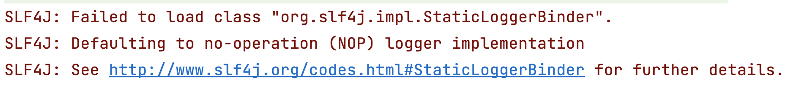

如果当前错误，则查看pom文件是否包没有导入对应log依赖。

#### 高级计算器实现代码

把高级计算器实现的代码放在项目内。

```java
package top.testeru;

import org.slf4j.Logger;

import java.util.Arrays;
import java.util.UUID;
import java.util.stream.DoubleStream;
import java.util.stream.IntStream;

import static java.lang.invoke.MethodHandles.lookup;
import static org.slf4j.LoggerFactory.getLogger;

public class Calculator {
    //获得具有所需名称的记录器
    static final Logger logger = getLogger(lookup().lookupClass());
    //用例名
    String name;
    //唯一ID标识
    String id;

    public Calculator(String name) {
        this.name = name;
        logger.info("创建 {} ", name);
    }


    public void initId(){
        id = UUID.randomUUID().toString();
        logger.info("生成ID：{} 并绑定", id);

    }
    public void destroyId() {
        if (id == null) {
            throw new IllegalArgumentException(name + " 没有初始化对应ID");
        }
        logger.info("ID: {} 释放", id);
        id = null;
    }


    public void close() {
        logger.info("关闭 {} ", name);
    }

    //连续添加
    public int sum(int... numbers) {
        if(Arrays.stream(numbers).anyMatch(u -> u == 100)){
            logger.warn("加数不可以是100！");
            //拦截，重置，发送某些消息给其他服务端
            throw new NumberFormatException("加数不可以是100！");
        }else if(Arrays.stream(numbers).anyMatch(u -> u > 99) | Arrays.stream(numbers).anyMatch(u -> u < -99)){
            logger.warn("请输入[-99,99]范围内的整数");
            throw new IllegalArgumentException("请输入[-99,99]范围内的整数！");
        }else {
            //[-99,99]
            return IntStream.of(numbers).sum();
        }
    }

    //连续添加
    public double sum(double... numbers) {
        if(Arrays.stream(numbers).anyMatch(u -> u == 100)){
            logger.warn("加数不可以是100！");
            //拦截，重置，发送某些消息给其他服务端
            throw new NumberFormatException("加数不可以是100！");
        }else if(Arrays.stream(numbers).anyMatch(u -> u > 99) | Arrays.stream(numbers).anyMatch(u -> u < -99)){
            logger.warn("请输入[-99,99]范围内的数");
            throw new IllegalArgumentException("请输入[-99,99]范围内的数！");
        }else {
            //[-99,99]
            return DoubleStream.of(numbers).sum();
        }
    }

    //从num进行减法
    public double sub(double num, double... numbers) {
        if(Arrays.stream(numbers).allMatch(u -> u > 99) | Arrays.stream(numbers).allMatch(u -> u < -99)){
            logger.warn("请输入[-99,99]范围内的整数");
            throw new IllegalArgumentException("请输入[-99,99]范围内的整数！");
        }else {
            return DoubleStream.of(numbers).reduce(num, (a, b) -> a-b);
        }
    }

    //从100进行减法
    public double subtract(double... numbers) {
       return sub(100,numbers);
    }

    public int subtract(int x, int y) {
        if(x>99 | x<-99 | y>99 | y<-99){
            logger.warn("请输入[-99,99]范围内的整数");
            //100-8
            return 0;
        }else {
            //99-8
            return x-y;
        }
    }

    //平均值 average
    public double average(double... numbers) {
        if(Arrays.stream(numbers).allMatch(u -> u > 99) | Arrays.stream(numbers).allMatch(u -> u < -99)){
            logger.warn("请输入[-99,99]范围内的整数");
            return 0;
        }else {
            return DoubleStream.of(numbers).average().getAsDouble();
        }
    }
    //连续拼接
    public String concatStr(String... words) {
        return String.join(" ", words);
    }
}
```

### 2. 加法P0测试用例

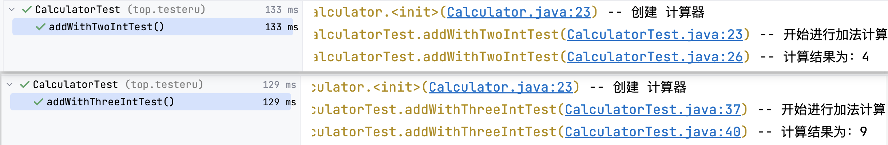


|模块|用例标题|优先级|测试步骤|预期结果|
|---|---|---|---|---|
加法|2个整数相加，结果计算正确|P0|1. 第一个数输入：1<br>2. 第二个数输入：3|计算结果：4|
加法|3个整数相加，结果计算正确|P0|1. 第一个数输入：1<br>2. 第二个数输入：3<br>3. 第三个数输入：5|计算结果：9|

步骤：

1. 创建高级计算器测试类。

2. 创建加法的测试方法。
   1. 创建计算器对象；有参构造，传入参数值为：计算器。
   2. 业务逻辑调用。获取结果值result。
      >2个数相加、3个数相加。
   3. 关闭计算器。
   4. 断言。

```java
//Test注解 是方法上的
//一个测试类中可以有多个测试方法，即多个@Test注解
//Test注解修饰的方法返回值类型是void
//Test注解里面编写的内容是测试用例执行的具体内容及断言结果

//2个数的整数加法计算
@Test
public void addWithTwoIntTest(){
    //1. 创建计算器对象 -- new有参构造，传入参数值为：计算器
    Calculator calculator = new Calculator("计算器");
    //log日志打印：开始进行加法计算
    logger.info("开始进行加法计算");
    //2. 业务逻辑调用 获取结果值  int result
    int result = calculator.sum(1,3);
    logger.info("计算结果为：{}",result);
    //3. 关闭计算器
    calculator.close();
    //4. 断言 -- assertEquals()
    //expected  期望的值；actual 实际值；message 失败原因的解释说明
    assertEquals(4,result,"计算结果失败");
}
//3个数的整数加法计算
@Test
public void addWithThreeIntTest(){
    //1. 创建计算器对象 -- new有参构造，传入参数值为：计算器
    Calculator calculator = new Calculator("计算器");
    //log日志打印：开始进行加法计算
    logger.info("开始进行加法计算");
    //2. 业务逻辑调用 获取结果值  int result
    int result = calculator.sum(1,3,5);
    logger.info("计算结果为：{}",result);
    //3. 关闭计算器
    calculator.close();
    //4. 断言 -- assertEquals()
    //expected  期望的值；actual 实际值；message 失败原因的解释说明
    assertEquals(9,result,"计算结果失败");
}
```


### 3. 加法异常测试用例

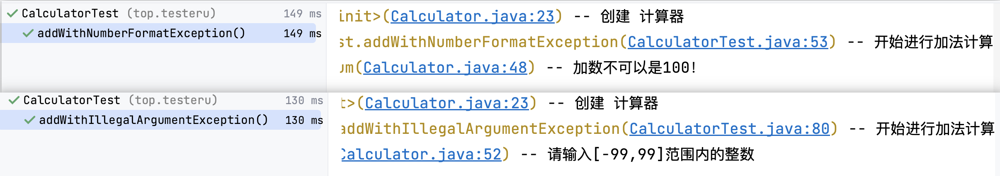

|模块|用例标题|优先级|测试步骤|预期结果|
|---|---|---|---|---|
加法|无效边界值相加，数字格式异常提示信息|P1|1. 第一个数输入：100<br>2. 第二个数输入：0|异常类：NumberFormatException<br>异常提示信息：加数不可以是100！|
加法|无效边界值相加，非法参数异常提示信息|P1|1. 第一个数输入：-100<br>2. 第二个数输入：-1|异常类：IllegalArgumentException<br>异常提示信息：请输入[-99,99]范围内的整数！|


传入参数为100时，异常类为：NumberFormatException。

传入的值不是[-99,99]范围内的数时，异常类为：IllegalArgumentException。

异常断言：`assertThrows`，`assertThrowsExactly`。

需求：**异常类要严格匹配并且验证异常消息**。

#### NumberFormatException

```java
@Test
public void addWithNumberFormatException(){
    //1. 创建计算器对象 -- new有参构造，传入参数值为：计算器
    Calculator calculator = new Calculator("计算器");
    //log日志打印：开始进行加法计算
    logger.info("开始进行加法计算");
    //2. 计算
    /**
     * 异常断言：assertThrows  assertThrowsExactly
     * expectedType  抛出的异常类型
     * executable    异常业务流
     * NumberFormatException extends IllegalArgumentException
     * 需求：异常类要严格匹配并且验证异常消息。
     * */
    //它会在比较异常类型时允许继承关系。
    //如果抛出的异常类型是指定类型的子类或子接口，也会被认为是符合预期的。
    //同时，它不会验证异常消息。
//        Exception nFException = assertThrows(
//                IllegalArgumentException.class,
//                () -> calculator.sum(100, 0));
    //它在比较异常类型时要求严格匹配，不允许继承关系。
    // 只有抛出的异常类型与期望的异常类型完全一致时，才会认为测试通过。
    // 同时，它也会验证异常消息。
    Exception nFException = assertThrowsExactly(NumberFormatException.class,
            () -> calculator.sum(100, 0));
    //3. 关闭计算器
    calculator.close();
    //4. 断言 -- assertTrue()
    assertTrue(nFException.getMessage().contains("加数不可以是100"));
}
```

#### IllegalArgumentException

```java
@Test
public void addWithIllegalArgumentException(){
    //1. 创建计算器对象 -- new有参构造，传入参数值为：计算器
    Calculator calculator = new Calculator("计算器");
    //log日志打印：开始进行加法计算
    logger.info("开始进行加法计算");
    //2. 计算
    Exception nFException = assertThrowsExactly(IllegalArgumentException.class,
            () -> calculator.sum(-100, -1));
    //3. 关闭计算器
    calculator.close();
    //4. 断言 -- assertTrue()
    assertTrue(nFException.getMessage().contains("请输入[-99,99]范围内"));
}
```

### 4. 字符串拼接P0测试用例

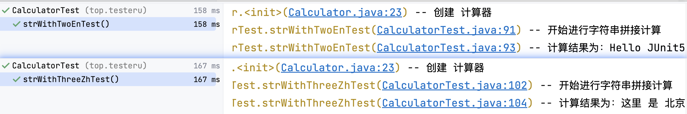

|模块|用例标题|优先级|测试步骤|预期结果|
|---|---|---|---|---|
Str拼接|2个英文字符串拼接，结果拼接正确|P0|1. 第一个字符串输入：Hello<br>2. 第二个字符串输入：JUnit5|拼接结果：Hello JUnit5|
Str拼接|3个中文字符串拼接，结果拼接正确|P0|1. 第一个字符串输入：这里<br>2. 第二个字符串输入：是<br>3. 第三个字符串输入：北京|拼接结果：这里 是 北京|


步骤：

1. 创建高级计算器测试类。

2. 创建字符串拼接的测试方法。
   1. 创建计算器对象；有参构造，传入参数值为：计算器。
   2. 业务逻辑调用。获取结果值strResult。
      >2个字符串拼接、3个字符串拼接。
   3. 关闭计算器。
   4. 断言。

```java
@Test
public void strWithTwoEnTest () {
    //1. 创建计算器对象 -- new有参构造，传入参数值为：计算器
    Calculator calculator = new Calculator("计算器");
    //log日志打印：开始进行字符串拼接计算
    logger.info("开始进行字符串拼接计算");
    //2. 开始字符串拼接
    String strResult = calculator.concatStr("Hello", "JUnit5");
    logger.info("计算结果为：{}",strResult);//Hello JUnit5
    //3. 关闭计算器
    calculator.close();
    //4. 断言 -- assertEquals()
    assertEquals("Hello JUnit5",strResult,"字符串拼接错误");
}

@Test
public void strWithThreeZhTest () {
    //1. 创建计算器对象 -- new有参构造，传入参数值为：计算器
    Calculator calculator = new Calculator("计算器");
    //log日志打印：开始进行字符串拼接计算
    logger.info("开始进行字符串拼接计算");
    //2. 开始字符串拼接
    String strResult = calculator.concatStr("这里", "是", "北京");
    logger.info("计算结果为：{}",strResult);//Hello JUnit5
    //3. 关闭计算器
    calculator.close();
    //4. 断言 -- assertEquals()
    assertEquals("这里 是 北京",strResult,"字符串拼接错误");
}
```

### 5. 混合计算测试用例

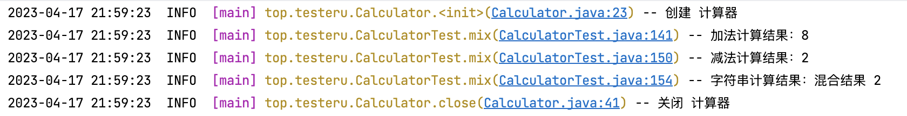


hamcrest断言，最后使用多断言，对应提示信息：

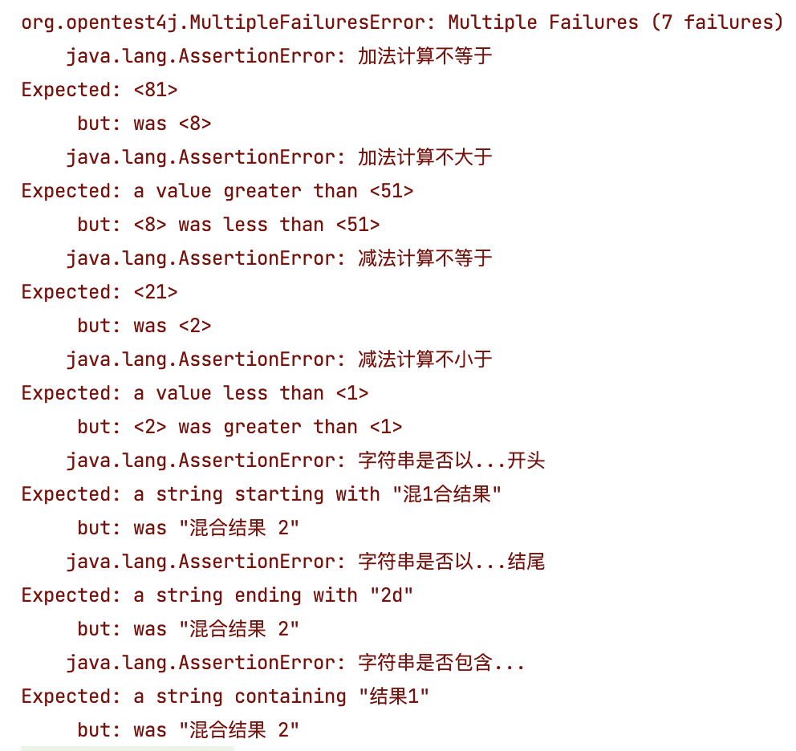


步骤：

1. 创建高级计算器测试类。

2. 创建字符串拼接的测试方法。
   1. 创建计算器对象；有参构造，传入参数值为：计算器。
   2. 调用加法逻辑：result = 3 + 5。
      >hamcrest断言，添加失败提示信息。
   3. 调用减法逻辑：re = result - 6。
      >hamcrest断言，添加失败提示信息。
   4. 调用字符串拼接逻辑：strResult = "混合结果 %s",re 。
   5. 关闭计算器。
   6. 整体断言。

```java
@Test
public void mix(){
    List<Executable> assertList = new ArrayList<>();

    //1. 创建计算器对象；有参构造，传入参数值为：计算器。
    Calculator calculator = new Calculator("计算器");
    //2. 调用加法逻辑：result = 3 + 5。
    int result = calculator.sum(3, 5);
    logger.info("加法计算结果：{}", result);
    assertList.add(() -> assertThat("加法计算不等于",result, equalTo(8)));
    assertList.add(() -> assertThat("加法计算不大于",result, greaterThan(5)));

    //3. 调用减法逻辑：re = result - 6。
    int re = calculator.sub(result, 6);
    assertList.add(() -> assertThat("减法计算不等于",re, equalTo(2)));
    assertList.add(() -> assertThat("减法计算不小于",re, lessThan(result)));
    assertList.add(() -> assertThat("减法计算不接近",(double)re, closeTo(result, 6)));
    logger.info("减法计算结果：{}", re);

    //4. 调用字符串拼接逻辑：str = "混合结果 %s",re 。
    String strResult = calculator.concatStr("混合结果", String.valueOf(re));
    logger.info("字符串计算结果：{}", strResult);
    //字符串是否以...开头
    assertList.add(() -> assertThat("字符串是否以...开头",strResult, startsWith("混合结果")));
    //字符串是否以...结尾
    assertList.add(() -> assertThat("字符串是否以...结尾",strResult, endsWith(String.valueOf(re))));
    //字符串是否包含...
    assertList.add(() -> assertThat("字符串是否包含...",strResult, containsString("结果")));

    //5. 关闭计算器。
    calculator.close();
    //6. 断言。
    assertAll(assertList);
}
```

## 优化

### 1. 提取对象的创建

对象创建可以提取到@BeforeAll注解中。


```java
static Calculator calculator;

//BeforeAll注解  方法上 static修饰的
//在测试类里面运行一次，并且是在所有的方法之前运行一次
//作用：对象的声明 测试数据准备，log日志删除，apk安装，启动的某些参数的配置 AppiumDriver webdriver ChromeDriver

@BeforeAll
public static void beforeAll(){
    //1. 创建计算器对象 -- new有参构造，传入参数值为：计算器
    calculator = new Calculator("计算器");
}
```

### 2. 提取log日志打印

规律：

1. 加法的测试用例第一句都是：开始进行**加法**计算。并且加法的测试用例方法都是以**add**开头。

1. 字符串的测试用例第一句都是：开始进行**字符串拼接**计算。并且字符串的测试用例方法都是以**str**开头。

1. 混合计算的测试用例第一句都是：开始进行**混合**计算。并且混合计算的测试用例方法都是以**mix**开头。

实现思路：

1. 在每个测试方法前，使用BeforeEach。

2. 获取用例方法名称。

3. 根据用例方法名称是以什么开头，来显示log打印日志的中间内容。
  
   1. add：加法。
   
   2. str：字符串拼接。
   
   3. mx：混合。

```java
//void返回值
//BeforeEach注解 在每一个@Test注解修饰的方法之前运行一次；所以，当前测试类有多少个Test注解，BeforeEach注解修饰的方法就运行多少次
//作用：测试用例中，测试方法需要初始化的内容及属性「app/web端进入固定页面，回退到固定页面；重启app；删除某些产生的测试数据」
 
@BeforeEach
public void beforeEach(TestInfo testInfo){
    String strCase;
    //method            strCase
    // sum 支付           加法   数据库连接、注册会员
    // sub 营销           减法   新用户输入数据库
    // str 主业务线     字符串拼接  apk卸载
    Optional<Method> testMethod = testInfo.getTestMethod();
    //获取 Method 类里面的 getName() 方法的返回值  Optional<String>
    Optional<String> s = testMethod.map(Method::getName);
    if (s.filter(str -> str.contains("add")).isPresent()) {
        strCase = "加法";
    }else if (s.filter(str -> str.contains("sub")).isPresent()){
        strCase = "减法";
    } else if (s.filter(str -> str.contains("str")).isPresent()) {
        strCase = "字符串拼接";
    }else {
        strCase = "混合";
    }
    logger.info("开始进行 {} 计算", strCase);
}
```


### 3. 提取对象的退出

每一个测试方法之后都需要进行计算器的关闭，提取到AfterAll注解中。

无论断言失败还是通过，AfterAll注解的代码都会执行，类似try-catch-finally的finally代码块。

```java
//AfterAll注解 static修饰 void返回值   与在代码中的前后顺序无关
//在测试类里面运行一次，并且是在所有的方法之后运行一次
//作用：apk卸载 app退出，测试用例结束，web端关闭浏览器操作。。。
@AfterAll
public static void afterAll(){
    calculator.close();
}
```


### 4. 提取计算结果

规律：

1. 加法的测试用例计算都是int的result。
   
2. 减法的测试用例计算都是int的re。

3. 字符串的测试用例计算结果都是String的strResult。


实现思路：

1. 在每个测试方法之后得到结果，使用AfterEach。
   
2. 获取用例方法名称。

3. 根据用例方法名称是以什么开头，来显示log打印日志的显示计算结果。
  
   1. add：加法，结果为result。

   2. sub：减法，结果为re。
   
   3. str：字符串拼接，结果为strResult。
   
```java
//加法计算结果
int result;
//减法计算结果
int re;
//字符串拼接计算结果
String strResult;


//void返回值
//AfterEach注解 在每一个@Test注解修饰的方法之后运行一次；
// 所以，当前测试类有多少个Test注解，AfterEach注解修饰的方法就运行多少次
//无论@Test注解修饰的测试方法是否断言成功，@AfterEach方法的内容都去运行
//作用：测试用例中，测试方法需要初始化的内容及属性「app/web端进入固定页面，回退到固定页面；重启app；删除某些产生的测试数据」
@AfterEach
public void afterEach(TestInfo testInfo){
    Optional<String> optional = testInfo
            .getTestMethod()
            .map(Method::getName)//获取方法名
            .filter(str -> !str.contains("Exception"));
    if(optional.filter(s -> s.startsWith("add")).isPresent()){
        logger.info("加法计算结果：{}", result);
    } else if (optional.filter(s -> s.startsWith("sub")).isPresent()) {
        logger.info("减法计算结果：{}", re);
    }else if (optional.filter(s -> s.startsWith("str")).isPresent()) {
        logger.info("字符串计算结果：{}", strResult);
    }else{
        logger.info("加法计算结果：{}", result);
        logger.info("减法计算结果：{}", re);
        logger.info("字符串计算结果：{}", strResult);
    }
}
```


## 进阶

### 1. 参数化

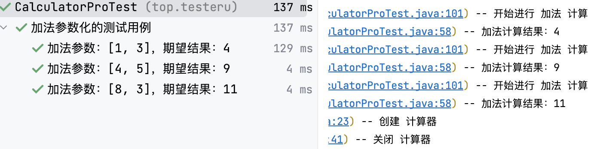

```java
//2个数的整数加法计算
//@Test
//{argumentsWithNames}
//这个代表是参数化  但是不代表提供参数源  Test\ParameterizedTest 注解二选一
@ParameterizedTest(name = "加法参数：[{0}, {1}]，期望结果：{2}")
//代表的是参数的源
@MethodSource("top.testeru.source.AddSource#sumNum")
@DisplayName("加法参数化的测试用例")
@Order(9)
public void addWithTwoIntParamTest(int num1, int num2, int addRe){
    //2. 业务逻辑调用 获取结果值  int result
    result = calculator.sum(num1, num2);
    //4. 断言 -- assertEquals()
    //expected  期望的值；actual 实际值；message 失败原因的解释说明
    assertEquals(addRe,result,"计算结果失败");
}
```

数据源：
```java
public class AddSource {
    public static Stream<Arguments> sumNum(){
        return Stream.of(
                Arguments.arguments(1,3,4),
                Arguments.arguments(4,5,9),
                Arguments.arguments(8,3,11)
        );
    }
}
```

##### 思考

如果传入的参数个数不确定，有可能是2个参数，有可能是3个参数，还有可能是int类型，有可能是double类型，应该如何解决？

```
2, 2
4, 5
4, 3, 7
2, 6, 8, 9
```

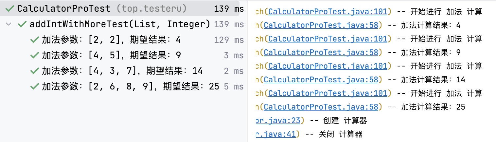

实现代码：

```java
@ParameterizedTest
//代表的是参数的源
@MethodSource("top.testeru.source.AddSource#sumIntWithMore")
@DisplayName("加法参数化的测试用例")
public void addIntWithDoubleTest(List<Integer> num, Integer re){
    IntStream intStream = num.stream().mapToInt(Integer::intValue);
    System.out.println(intStream);
    //2. 业务逻辑调用 获取结果值  int result
    Integer result = calculator.sum(intStream.toArray());
    //4. 断言 -- assertEquals()
    //expected  期望的值；actual 实际值；message 失败原因的解释说明
    assertEquals(re,result,"计算结果失败");
}
```

数据源：

```java
public static Stream<Arguments> sumIntWithMore(){
    return Stream.of(
            Arguments.arguments(Arrays.asList(2, 2), 4),
            Arguments.arguments(Arrays.asList(4, 5), 9),
            Arguments.arguments(Arrays.asList(4, 3, 7), 14),
            Arguments.arguments(Arrays.asList(2, 6, 8, 9), 25)
            );
}
```


### 2. 顺序执行

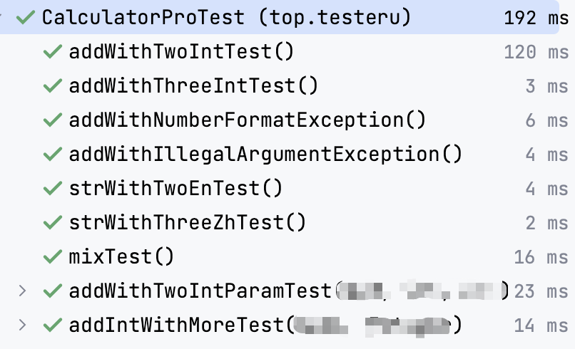


步骤：

1. 声明顺序执行的规则。

   - 方式1：junit配置文件声明。

   - 方式2：测试类上直接声明。

2. 测试方法上使用Order注解。

   >Order注解填写数字，数字进行大小比较。无需是连续的数字。

配置文件 junit-platform.properties 声明：

```
#声明测试方法的排序规则
junit.jupiter.testmethod.order.default=org.junit.jupiter.api.MethodOrderer$OrderAnnotation
#junit.jupiter.testmethod.order.default=包名.类名$内部类
```

测试类上声明：

```java
@TestMethodOrder(MethodOrderer.OrderAnnotation.class)
```


### 3. 自定义类与方法的显示名

英文单词可读性差，显示中文名称。显示效果如下：

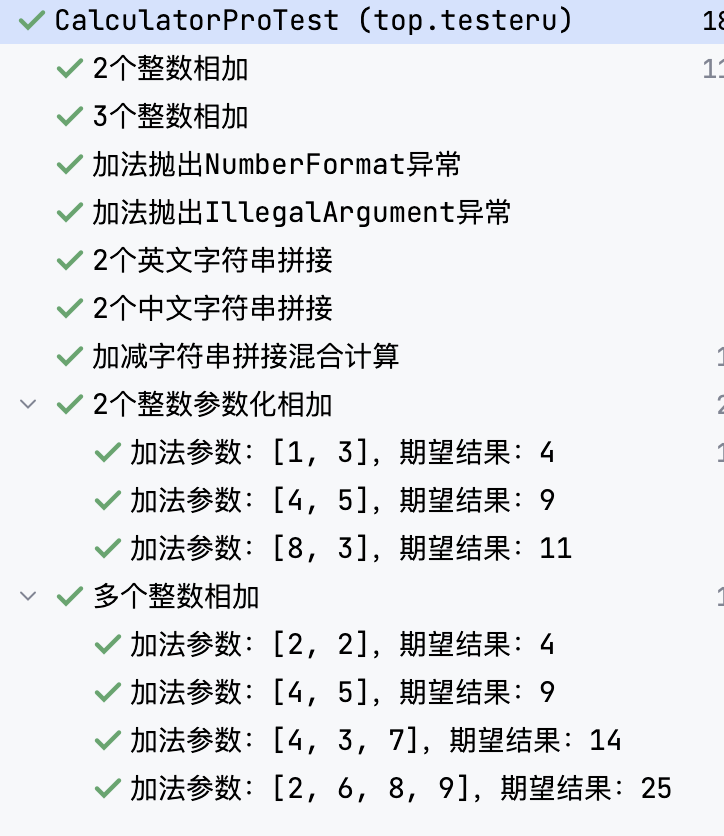


整体代码如下：

```java
@TestMethodOrder(MethodOrderer.OrderAnnotation.class)
public class CalculatorProTest {
    ...

    @Test
    @Order(1)
    @DisplayName("2个整数相加")
    public void addWithTwoIntTest(){...}

    @Test
    @Order(6)
    @DisplayName("3个整数相加")
    public void addWithThreeIntTest(){...}

    @Test
    @Order(9)
    @DisplayName("加法抛出NumberFormat异常")
    public void addWithNumberFormatException(){...}

    @Test
    @Order(16)
    @DisplayName("加法抛出IllegalArgument异常")
    public void addWithIllegalArgumentException(){...}

    @Test
    @Order(26)
    @DisplayName("2个英文字符串拼接")
    public void strWithTwoEnTest () {...}

    @Test
    @Order(36)
    @DisplayName("2个中文字符串拼接")
    public void strWithThreeZhTest () {...}

    @Test
    @Order(46)
    @DisplayName("加减字符串拼接混合计算")
    public void mixTest(){...}

    @ParameterizedTest(name = "加法参数：[{0}, {1}]，期望结果：{2}")
    @MethodSource("top.testeru.source.AddSource#sumNum")
    @Order(100)
    @DisplayName("2个整数参数化相加")
    public void addWithTwoIntParamTest(int num1, int num2, int addRe){...}

    @ParameterizedTest(name = "加法参数：{0}，期望结果：{1}")
    @MethodSource("top.testeru.source.AddSource#sumIntWithMore")
    @Order(110)
    @DisplayName("多个整数相加")
    public void addIntWithMoreTest(List<Integer> num, Integer re){...}
}
```

### 4. 前后置条件与业务分离

#### 提取前后置条件

前后置条件虽然提取出来，但是还在当前测试类中。

想要当前测试类只是业务测试类，不涉及到前后置条件的内容。

实现：创建一个BaseTest类，把成员变量、@BeforeAll、@BeforeEach、@AfterAll、@AfterEach相关代码提取到BaseTest中。

##### BaseTest

```java
package top.testeru;

public class BaseTest {

    public static final Logger logger = getLogger(lookup().lookupClass());

    public static Calculator calculator;
    //加法计算结果
    public int result;
    //减法计算结果
    public int re;
    //字符串拼接计算结果
    public String strResult;

    @AfterAll
    public static void afterAll(){...}

    @AfterEach
    public void afterEach(TestInfo testInfo){...}

    @BeforeAll
    public static void beforeAll(){...}

    @BeforeEach
    public void beforeEach(TestInfo testInfo){...}
        
}
```

#### 业务分离

根据加法测试用例、减法测试用例、字符串拼接用例、混合用例分离成单独的测试类。

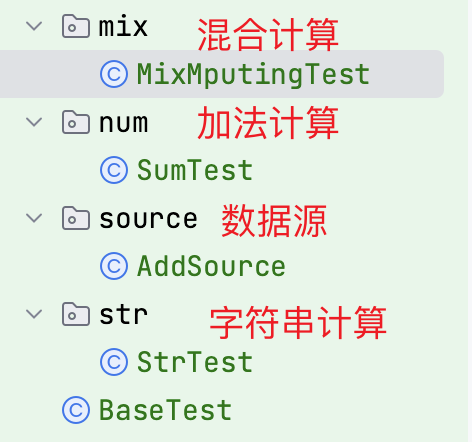

##### 加法

```java
package top.testeru.num;

public class SumTest extends BaseTest {
    @Test
    @Order(1)
    @DisplayName("2个整数相加")
    public void addWithTwoIntTest(){...}

    @Test
    @Order(6)
    @DisplayName("3个整数相加")
    public void addWithThreeIntTest(){...}

    @Test
    @Order(9)
    @DisplayName("加法抛出NumberFormat异常")
    public void addWithNumberFormatException(){...}

    @Test
    @Order(16)
    @DisplayName("加法抛出IllegalArgument异常")
    public void addWithIllegalArgumentException(){...}

    @ParameterizedTest(name = "加法参数：[{0}, {1}]，期望结果：{2}")
    @MethodSource("top.testeru.source.AddSource#sumNum")
    @Order(100)
    @DisplayName("2个整数参数化相加")
    public void addWithTwoIntParamTest(int num1, int num2, int addRe){...}

    @ParameterizedTest(name = "加法参数：{0}，期望结果：{1}")
    @MethodSource("top.testeru.source.AddSource#sumIntWithMore")
    @Order(110)
    @DisplayName("多个整数相加")
    public void addIntWithMoreTest(List<Integer> num, Integer re){...}
}
```

##### 字符串拼接

```java
package top.testeru.str;

public class StrTest extends BaseTest {
    @Test
    @Order(26)
    @DisplayName("2个英文字符串拼接")
    public void strWithTwoEnTest () {...}

    @Test
    @Order(36)
    @DisplayName("2个中文字符串拼接")
    public void strWithThreeZhTest () {...}
}
```

##### 混合计算

```java
package top.testeru.mix;

public class MixMputingTest extends BaseTest {
    @Test
    @Order(46)
    @DisplayName("加减字符串拼接混合计算")
    public void mixTest(){...}
}
```

### 5. 测试套件

#### 运行加法测试用例和混合运算测试用例

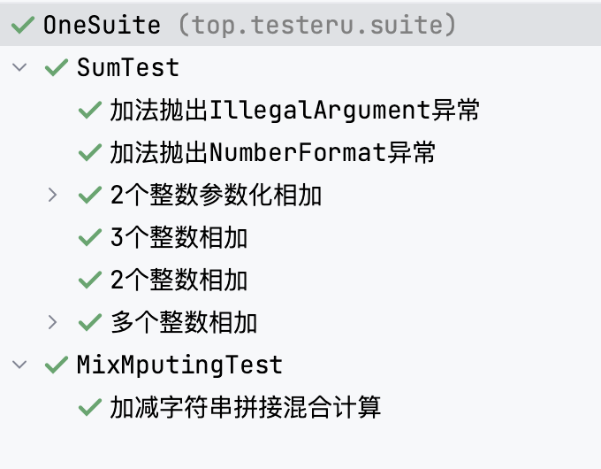

实现代码：

```java
@Suite
@SelectClasses({
        SumTest.class,
        MixMputingTest.class
})
@SuiteDisplayName("加法--》混合")
public class OneSuite {
}
```

#### 选中多个类中的某些具体方法执行

>选中多个类中的某些具体方法，放入测试套件中执行。

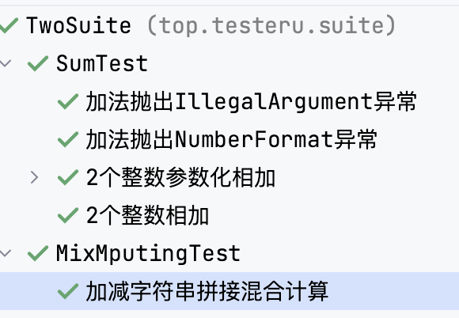

实现代码：

```java
@Suite
@SelectPackages({
        "top.testeru.num"
        ,"top.testeru.mix"})
@IncludeTags({"2个数"})
public class TwoSuite {
}
```

### 6. 生成测试报告

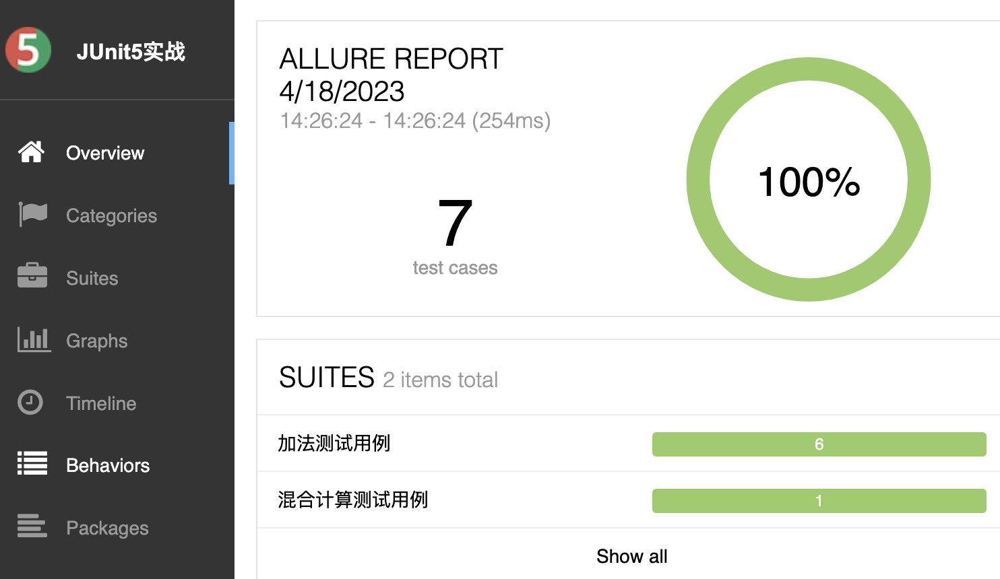


默认生成的allure-results在项目路径下，放在target文件夹下，可以每次运行测试用例自动生成。

配置文件 allure.properties 配置生成路径：

```properties
allure.results.directory=target/allure-results
```

Allure命令行运行：
```bash
allure serve target/allure-results
```

### 7. 命令行执行

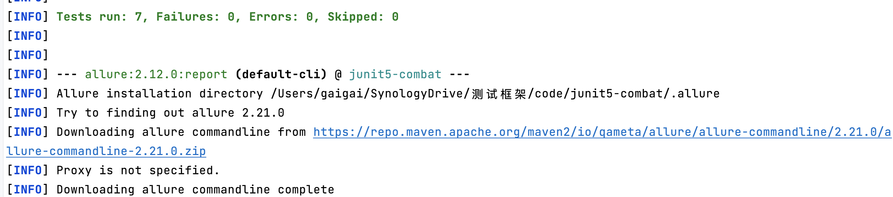

自动下载allure版本，不受全局变量限制。如果下载不成功，可以直接在项目下创建.allure文件夹，把allure解压文件夹移动进去即可。


```bash
# mac linux直接执行 window需要加引号 -Dtest="包名.类名"
mvn clean test -Dtest=top.testeru.suite.TwoSuite allure:report

mvn allure:serve 
```