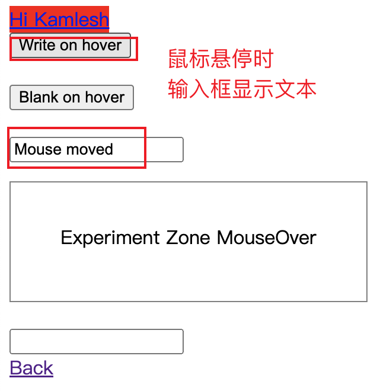
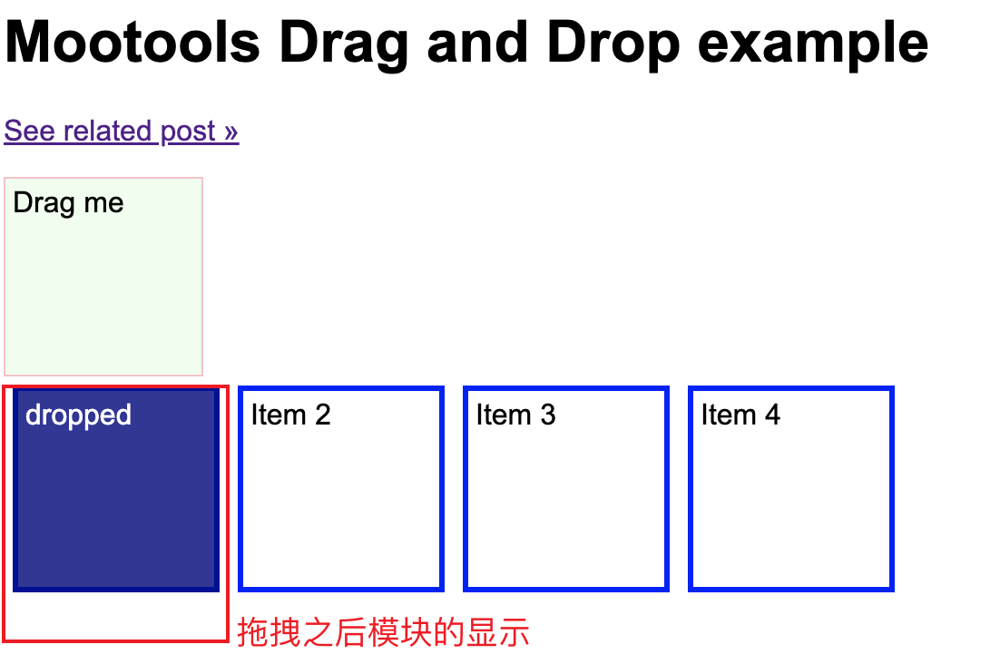
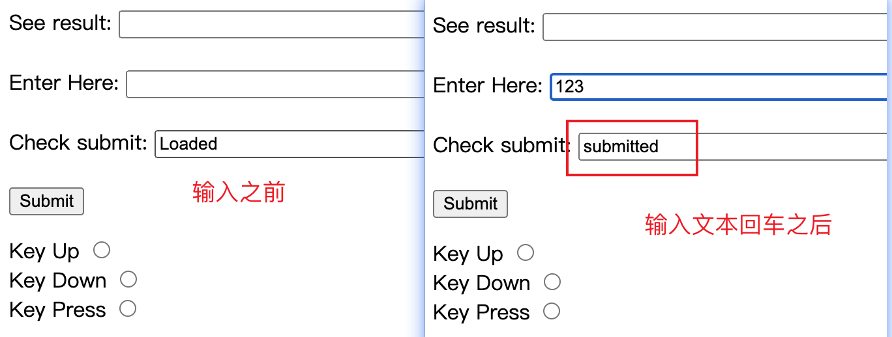
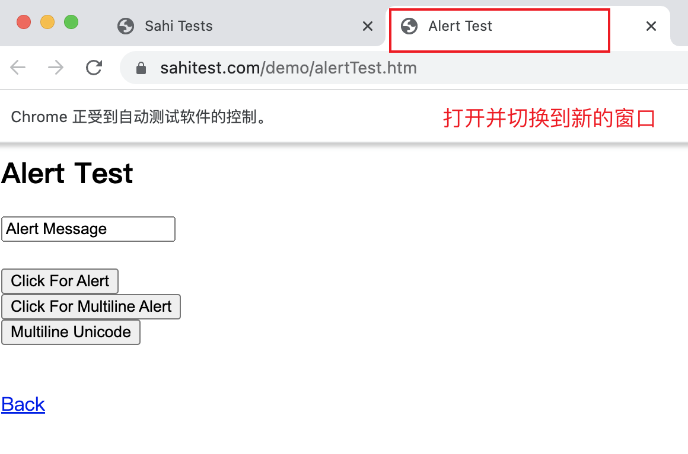

# 交互性动作-Action

Selenium提供了一组丰富的Action类，用于在测试期间执行交互性动作。


### 常用方法

|方法|说明|
|---|---|
|click(ele)|单击元素|
|doubleClick(ele)|双击元素|
|contextClick(ele)|右键点击元素|
|moveToElement(ele)|鼠标悬停|
|dragAndDrop(Aele,Bele)|鼠标拖拽|
|sendKeys(ele,eleText)|键盘输入|
|keyDown()+keyUp()|组合键|


## 鼠标点击

测试页面：https://sahitest.com/demo/clicks.htm


### 单击元素

```java
//开始使用鼠标、键盘的操作
Actions actions = new Actions(webDriver);
//单击
WebElement clickBtn = webDriver.findElement(By.xpath("//*[@value=\"click me\"]"));
actions.click(clickBtn).perform();
sleep(3000);
```

### 双击元素

```java
//开始使用鼠标、键盘的操作
Actions actions = new Actions(webDriver);
//双击
WebElement doubleBtn = webDriver.findElement(By.xpath("//*[@value=\"dbl click me\"]"));
actions.doubleClick(doubleBtn).perform();
sleep(3000);
```

### 右击元素

```java
//开始使用鼠标、键盘的操作
Actions actions = new Actions(webDriver);
//右键点击
WebElement rightClickBtn = webDriver.findElement(By.xpath("//*[@value=\"right click me\"]"));
actions.contextClick(rightClickBtn).perform();
sleep(3000);
```


### 示例代码

```java
@Test
public void mouseClick() throws InterruptedException {

    List<Executable> executableList = new ArrayList<>();
    String url = "https://sahitest.com/demo/clicks.htm";
    webDriver.get(url);


    //开始使用鼠标的操作
    Actions actions = new Actions(webDriver);
    //双击
    WebElement doubleBtn = webDriver.findElement(By.xpath("//*[@value=\"dbl click me\"]"));
    actions.doubleClick(doubleBtn).perform();
    executableList.add(() -> assertThat(
            webDriver.getPageSource(),
            containsString("[DOUBLE_CLICK]")));

    //单击
    WebElement clickBtn = webDriver.findElement(By.xpath("//*[@value=\"click me\"]"));
    actions.click(clickBtn).perform();
    executableList.add(() -> assertThat(
            webDriver.getPageSource(),
            containsString("[CLICK]")));

    //右键点击
    WebElement rightClickBtn = webDriver.findElement(By.xpath("//*[@value=\"right click me\"]"));
    actions.contextClick(rightClickBtn).perform();
    executableList.add(() -> assertThat(
            webDriver.getPageSource(),
            containsString("[RIGHT_CLICK]")));

    assertAll(executableList);
}
```


## 鼠标悬停

测试页面：https://sahitest.com/demo/mouseover.htm



### 悬停显示文本

使用moveToElement()方法在元素上悬停鼠标：

```java
//开始使用鼠标、键盘的操作
Actions actions = new Actions(webDriver);
WebElement WriteEle = webDriver.findElement(By.xpath("//*[@value=\"Write on hover\"]"));
//悬停显示文本
actions.moveToElement(WriteEle).perform();
```

### 示例代码

```java
@Test
public void actionOnHover() throws InterruptedException{
    List<Executable> executableList = new ArrayList<>();
    String url = "https://sahitest.com/demo/mouseover.htm";
    webDriver.get(url);

    //开始使用鼠标、键盘的操作
    Actions actions = new Actions(webDriver);
    WebElement WriteEle = webDriver.findElement(By.xpath("//*[@value=\"Write on hover\"]"));
    //悬停显示文本
    actions.moveToElement(WriteEle).perform();
    sleep(3000);
    //t1
    String value = webDriver.findElement(By.name("t1")).getAttribute("value");
    //sleep(3000);
    executableList.add(() -> assertThat(
            value,
            containsString("Mouse moved")));

    WebElement BlankEle = webDriver.findElement(By.xpath("//*[@value=\"Blank on hover\"]"));
    //悬停不显示文本
    actions.moveToElement(BlankEle).perform();
    //t1
    String valueBlank = webDriver.findElement(By.name("t1")).getAttribute("value");
    executableList.add(() -> assertThat(
            valueBlank,
            containsString("")));
    assertAll(executableList);
}

```


## 鼠标拖拽

测试页面：https://sahitest.com/demo/dragDropMooTools.htm



使用dragAndDrop(Aele,Bele)方法拖动元素，将 Aele 元素拖拽放置到 Bele 元素上。


### 模块拖拽代码

```java
@Test
public void actiondragAndDrop() throws InterruptedException {

    List<Executable> executableList = new ArrayList<>();
    String url = "https://sahitest.com/demo/dragDropMooTools.htm";
    webDriver.get(url);

    //开始使用鼠标、键盘的操作
    Actions actions = new Actions(webDriver);
    //拖拽的元素
    WebElement draggerEle = webDriver.findElement(By.id("dragger"));
    WebElement item1Ele = webDriver.findElement(By.xpath("//*[text()=\"Item 1\"]"));
    //从draggerEle元素拖拽到item1Ele
    actions.dragAndDrop(draggerEle, item1Ele).perform();
    WebElement drop1Ele = webDriver.findElement(By.xpath("//div[2]"));
    executableList.add(() -> assertThat(
            drop1Ele.getText(),
            equalTo("dropped")));
    sleep(3000);
    assertAll(executableList);
}
```


### 登录验证拖拽代码

```java
@Test
public void actiondragAndDropLogin() throws InterruptedException {

    List<Executable> executableList = new ArrayList<>();
    String url = "https://vip.ceshiren.com/#/ui_study/action_chains";
    webDriver.get(url);

    //开始使用鼠标、键盘的操作
    Actions actions = new Actions(webDriver);
    //拖拽的元素
    WebElement draggerEle = webDriver.findElement(By.id("item1"));
    WebElement item1Ele = webDriver.findElement(By.id("item3"));
    //从draggerEle元素拖拽到item1Ele
    actions.dragAndDrop(draggerEle, item1Ele).perform();
    WebElement drop1Ele = webDriver.findElement(By.xpath("//div[2]"));
    executableList.add(() -> assertThat(
            webDriver.getPageSource(),
            containsString("验证通过")));
    sleep(3000);
    assertAll(executableList);
}
```

## 键盘输入

测试页面：https://sahitest.com/demo/keypress.htm





使用sendKeys()方法将文本输入到元素中：

```java
actions
    .sendKeys(sendEle, "Selenium")
    .sendKeys(Keys.ENTER)
    .build()
    .perform();
```

#### 示例代码

```java
@Test
public void actionSendAndEnter() throws InterruptedException {
    List<Executable> executableList = new ArrayList<>();
    String url = "https://sahitest.com/demo/keypress.htm";
    webDriver.get(url);

    //开始使用鼠标、键盘的操作
    Actions actions = new Actions(webDriver);
    String beforeValue = webDriver.findElement(By.name("t3")).getAttribute("value");
    executableList.add(() -> assertThat(
            beforeValue,
            equalTo("Loaded")));
    WebElement sendEle = webDriver.findElement(By.name("t2"));

    actions
            .sendKeys(sendEle, "Selenium")
            .sendKeys(Keys.ENTER)
            .build()
            .perform();
    String afterValue = webDriver.findElement(By.name("t3")).getAttribute("value");
    executableList.add(() -> assertThat(
            afterValue,
            equalTo("submitted")));
    sleep(3000);
    assertAll(executableList);
}

```


## 组合键

测试页面：https://sahitest.com/demo/





模拟了使用 COMMAND键【CTRL键】+单击 来选择元素，打开新的标签页面。

使用keyDown()和keyUp()方法来模拟组合键：

```java
actions
    .keyDown(Keys.COMMAND)
    .click(AlertEle)
    .keyUp(Keys.COMMAND)
    .build()
    .perform();
```

#### 示例代码

```java
@Test
public void actionNewPage() throws InterruptedException {
    List<Executable> executableList = new ArrayList<>();
    String url = "https://sahitest.com/demo/";
    webDriver.get(url);

    WebElement AlertEle = webDriver.findElement(By.xpath("//*[text()=\"Alert Test\"]"));
    executableList.add(() -> assertThat(
            webDriver.getTitle(),
            equalTo("Sahi Tests")));
    // 创建 Actions 实例
    Actions actions = new Actions(webDriver);
    actions.keyDown(Keys.COMMAND)
            .click(AlertEle)
            .keyUp(Keys.COMMAND)
            .build()
            .perform();

    // 切换到新窗口
    String originalWindow = webDriver.getWindowHandle();
    for (String windowHandle : webDriver.getWindowHandles()) {
        if (!windowHandle.equals(originalWindow)) {
            webDriver.switchTo().window(windowHandle);
            break;
        }
    }


    executableList.add(() -> assertThat(
            webDriver.getTitle(),
            equalTo("Alert Test")));
    sleep(3000);
    assertAll(executableList);
}
```


### 键盘事件-复制粘贴

- 多系统兼容
    - mac 的复制按钮为 COMMAND
    - windows 的复制按钮为 CONTROL
- 左箭头：`Keys.ARROW_LEFT`
- 按下COMMAND或者CONTROL: `key_down(cmd_ctrl)`
- 按下剪切与粘贴按钮: `send_keys("xvvvvv")`


