# 接口测试实战
霍格沃兹测试开发学社


---


---


## 接口概念

- 接口：不同的系统之间相互连接的部分，是一个传递数据的通道。

  - 输入 ---> 处理 ---> 输出。

  - 分类：内部接口、外部接口。


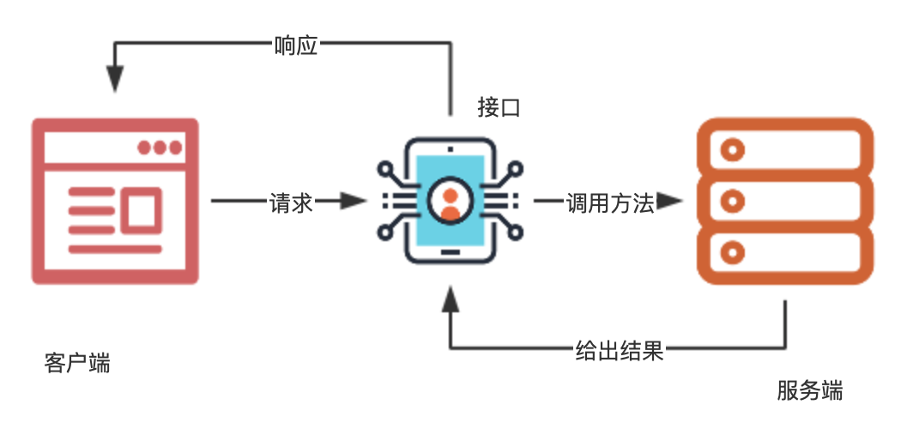


---


## 接口测试概念


- 接口测试：检查数据的交换、传递和控制管理过程。

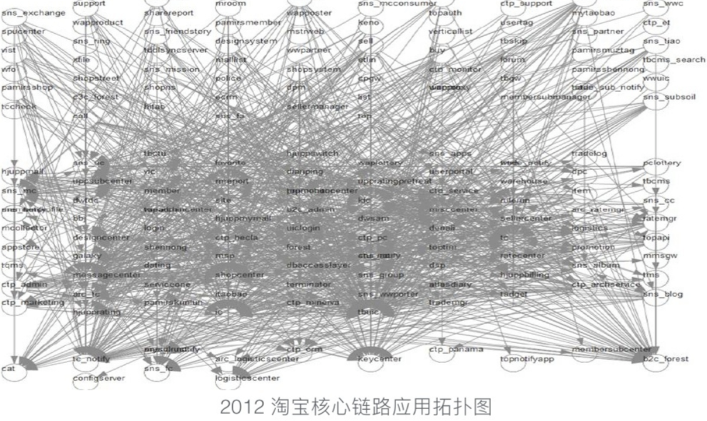


---


## 测试策略

- 金字塔模型
  
- 菱形模型


---


## 金字塔模型

- **重单元测试，API测试次之，轻GUI测试**。

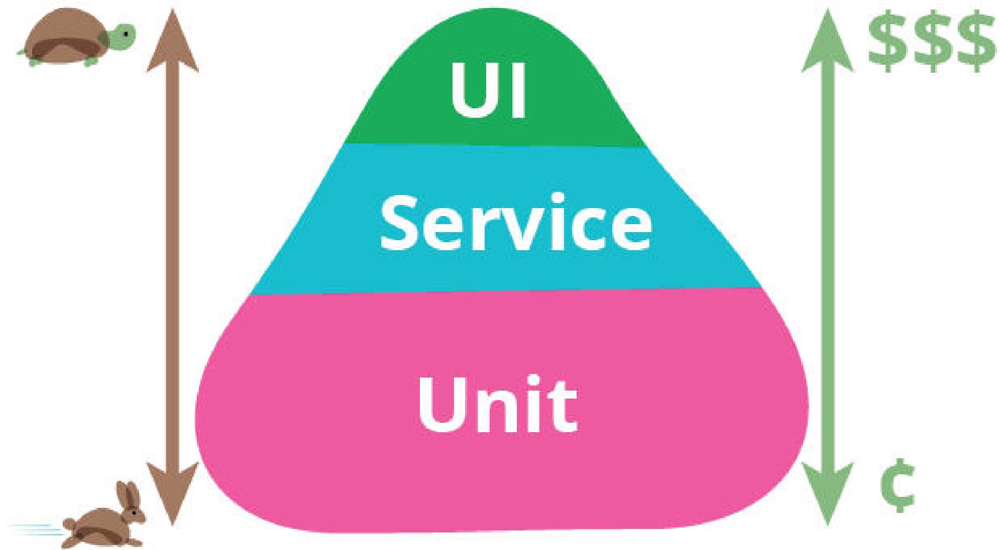


---


## 金字塔模型

- 单元测试：白盒，研发自测。
- API测试：灰盒，利用测试执行的代码覆盖率来指导测试用例的设计。
- UI 测试：端到端，稳定性问题。
  - 优点：实际模拟真实用户的行为。
  - 缺点：执行的代价比较大。


---


## 菱形模型

- **重量级 API 测试，轻量级 GUI 测试，轻量级单元测试**。


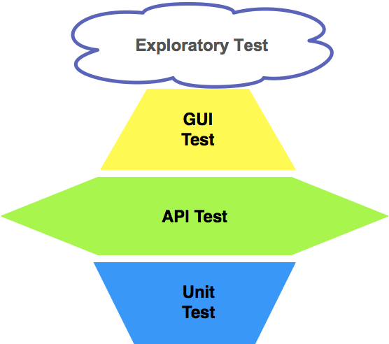


---


## 菱形模型

- UI 测试：手工为主，自动化为辅。
  - UI自动化：相对稳定且核心业务的基本功能。
- API测试：
  - 后向兼容性：保证原本的 API 调用方式维持不变。
- 单元测试：相对稳定和最核心的模块和服务上。


---


## 关键点
- API 测试为重点。
- GUI 测试最核心直接影响主营业务流程的 E2E 场景。
- 单元测试对那些相对稳定并且核心的服务和模块开展全面的单元测试。


---


## URL 结构

`https://www.baidu.com/s?wd=霍格沃兹&rsv_spt=1`

1. 协议：`https`
2. 域名：`www.baidu.com`
3. 端口：域名后面，非必须
   1. [81.70.96.121:10240](http://81.70.96.121:10240/)
4. 路径：`/s`
5. 请求参数：`wd=霍格沃兹&rsv_spt=1`


---


## URL练习

- https://ceshiren.com/c/185-category/186-category/186

- http://81.70.96.121:10240/login?from=%2F

- https://en.wikipedia.org/wiki/Java_(programming_language)#History

- https://www.example.com/search?q=example&sort=price#results


---


## HTTP 请求报文


```bash
> GET /uploads/user/avatar/31438/8216a3.jpg HTTP/1.1
> Host: ceshiren.com
> Accept-Encoding: deflate, gzip
> Connection: keep-alive
> Pragma: no-cache
> Cache-Control: no-cache
> User-Agent: Mozilla/5.0 
(Macintosh; Intel Mac OS X 10_15_0)
 AppleWebKit/537.36 
 (KHTML, like Gecko) 
 Chrome/80.0.3987.116 Safari/537.36
> Accept: image/webp,image/apng,image/*,*/*;q=0.8
> Referer: https://ceshiren.com/
> Accept-Language: en,zh-CN;q=0.9,zh;q=0.8
> Cookie: user_id=xx;

_homeland_session=xx;
>
```

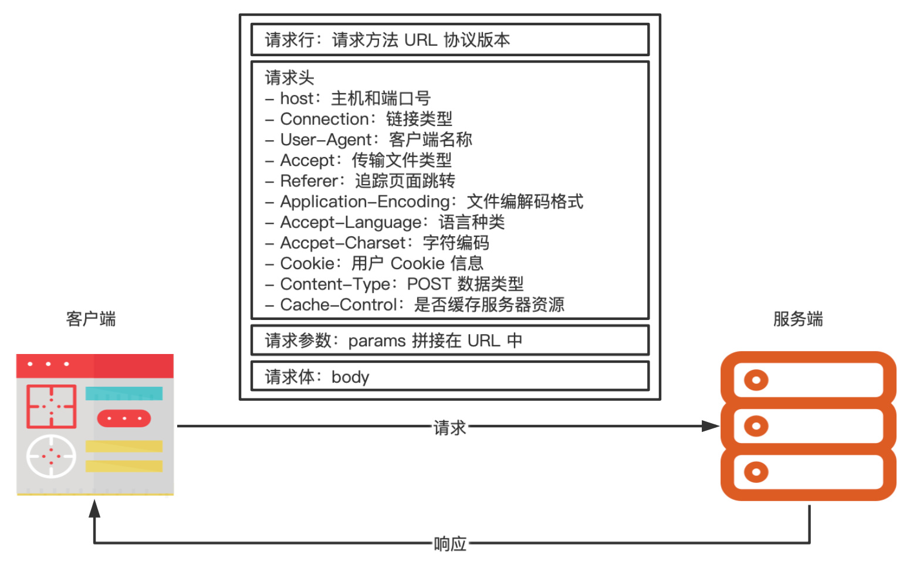


---

## HTTP 响应报文

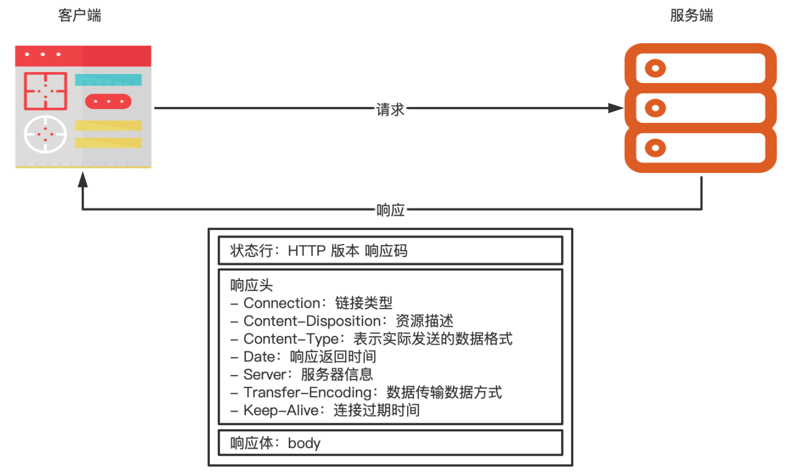

```bash
< HTTP/1.1 200 OK
< Server: nginx/1.10.2
< Date: Thu, 12 Mar 2020 09:13:44 GMT
< Content-Type: image/png
< Content-Length: 11390
< Connection: keep-alive
```

---

## HTTP 响应状态码

- 1xx 临时响应，表示通知信息，请求收到了或正在进行处理
- 2xx 表示成功，接受或知道了
  - 200 成功
- 3xx 表示重定向，要完成请求还必须才去进一步的行动
  - 301 永久移动
  - 302 临时移动
- 4xx 表示客户端请求错误
  - 403 未授权
  - 404 未找到
- 5xx 表示服务端错误
  - 500 服务器内部错误
  - 503 服务不可用

---

## RESTful 


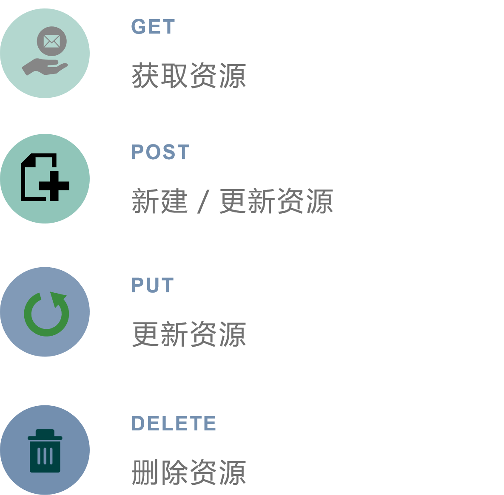


---

## 接口测试流程

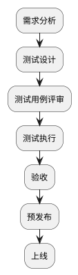

---

## 接口测试用例设计思路

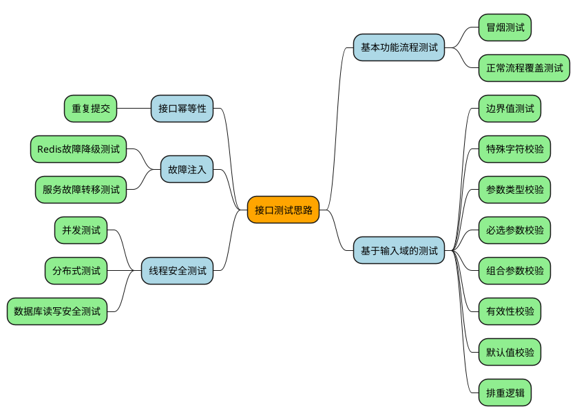

---

## 接口测试用例要素

- 用例名称
- 接口地址
- 请求方式
- 前置条件
- 请求头部
- 请求参数
- 响应状态码
- 预期响应结果


---


## 练习

设计一下[宠物商店](https://petstore.swagger.io/)增删改查的接口的冒烟测试用例。


---


# Postman

- Postman 工具准备
- Postman 使用


---


## Postman 介绍

- 可视化界面
- 提供响应结果的比较功能
- 查看测试结果
- 批量运行
- 设置环境变量


---

## Postman 安装

- 官网下载地址
  - https://www.postman.com/downloads

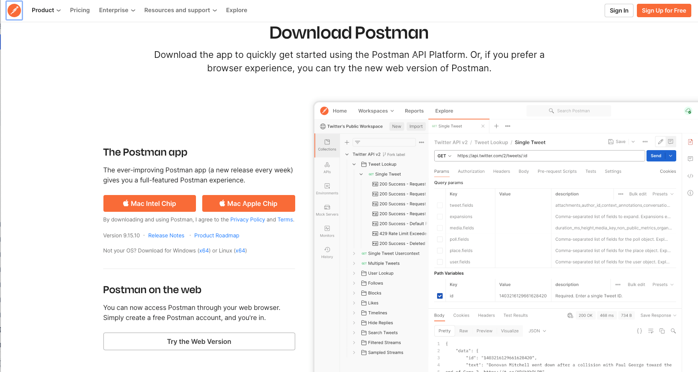

---

## Postman 页面

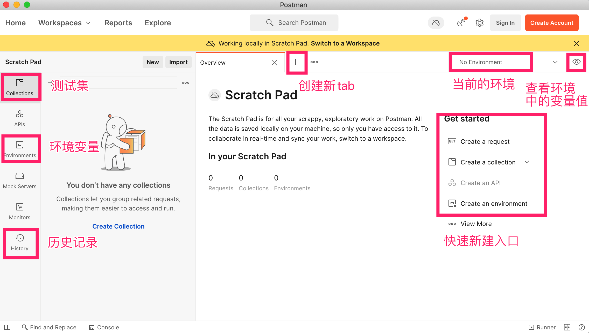

---

## Postman 使用


---

## Postman 完成接口测试

- 创建测试集
- 编写断言
- 运行测试集
- 查看测试结果

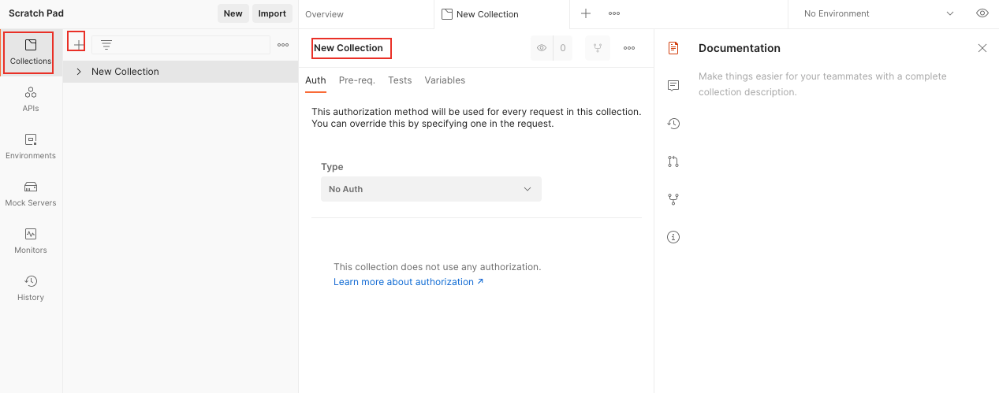


---

### 发送 GET 请求

- 新建请求
- 填写请求方式：GET
- 填写请求 URL：
  - https://ceshiren.com/
  - https://httpbin.ceshiren.com/get
- 填写请求参数： 
  - para_key = para_value


---


### 发送 POST 请求

- 请求方式：POST
- 请求 URL：https://httpbin.ceshiren.com/post
- 请求参数
  - FORM 格式：Body --> form-data
  - JSON 格式：Body --> raw --> JSON
  - 文件格式：Body --> form-data --> File

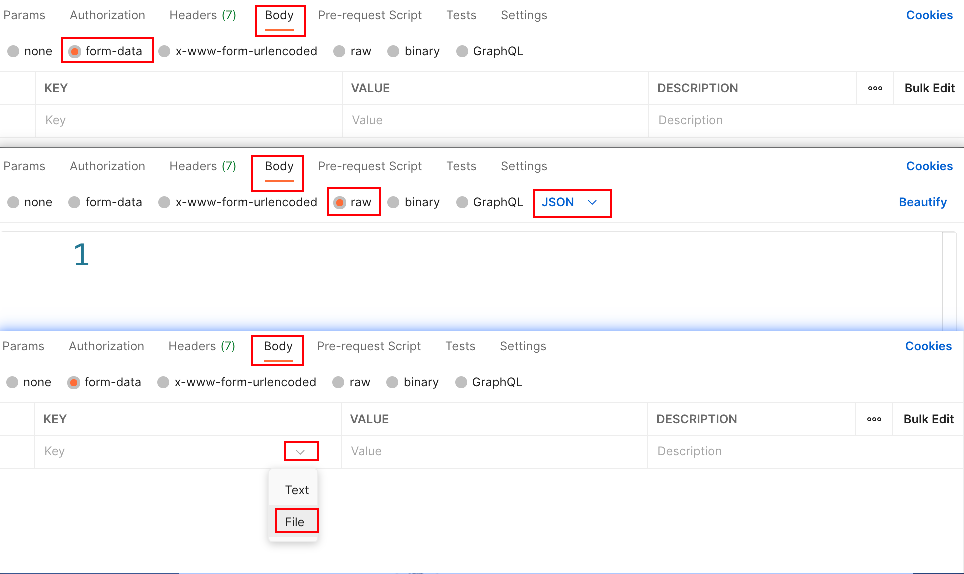


---


## 查看接口响应

- 响应体
- 响应头
- 响应状态


---

## 操作头信息

- 添加请求头
- 修改请求头


---


## 练习

- GET请求带头信息添加内容
  - good:getRequest
- POST请求的头信息修改User-Agent
  - User-Agent:自己姓名


---


## 断言

- 验证响应状态码
- 验证响应体中是否包含某个字符串
- 验证 JSON 中的某个值是否等于预期的值
- 验证响应体是否与某个字符串完全相同
- 验证响应头信息中的 Content-Type 是否存在
- 验证响应时间是否小于某个值

```js
// Status Code：Code is 200
// 验证响应状态码
pm.test("响应状态码为 200", function () {
    pm.response.to.have.status(200);
});

// Response Body：contains string 
// 验证响应体中是否包含某个字符串
pm.test("响应体中包含预期的字符串", function () {
    pm.expect(pm.response.text()).to.include("doggie");
});

// Response Body：JSON value check
// 验证 JSON 中的某个值是否等于预期的值
pm.test("宠物名称为 doggie", function () {
    var jsonData = pm.response.json();
    pm.expect(jsonData[0].name).to.eql("doggie");
});

// Response Body：Is equal to a string
// 验证响应体是否与某个字符串完全相同
pm.test("响应体正确", function () {
    pm.response.to.have.body("response_body_string");
});

// Response Body：Content-Type header check
// 验证响应头信息中的 Content-Type 是否存在
pm.test("Content-Type is present", function () {
    pm.response.to.have.header("Content-Type");
});

// Response time is less than 200ms
// 验证响应时间是否小于某个值
pm.test("Response time is less than 200ms", function () {
    pm.expect(pm.response.responseTime).to.be.below(200);
});
```

---


## 运行测试集

- 测试集页面 -> Run 按钮

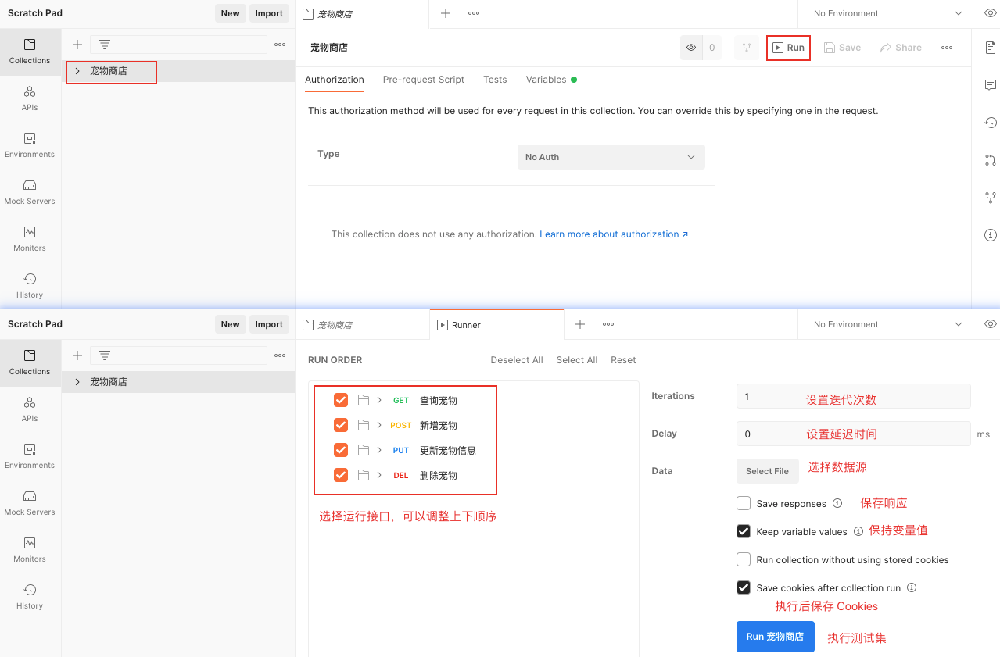

---


## 变量

- Postman 中变量的种类与作用域
  - Data：在测试集中上传的数据
  - Environment：环境范围
  - Collection：集合范围
  - Global：全局范围
  - Local：在脚本中设置的变量

---

## 变量定义

- 全局变量：Environments -> Globals
- 测试集变量：测试集页面 -> Variables
- 环境变量：Environments -> +


---

## 变量的使用

- 请求 URL, Params 参数或 Body 表格或JSON/XML 文本中通过 `{{变量名}}` 使用
- 在 Pre-request Script 和 Tests 脚本中使用封装好的语句获取或者设置对应变量

```js
// 获取全局变量
var status = pm.globals.get("status");
// 输入到控制台
console.log(status)

// 获取测试集变量
var petId = pm.collectionVariables.get("petId");
// 获取环境变量
var url = pm.environment.get("baseURL");

// 设置全局变量
pm.globals.set("status", "sold");
// 设置测试集变量
pm.collectionVariables.set("petId", 0);
// 设置环境变量
pm.environment.set("baseURL", "");
```

---

## 变量的优先级

- 优先级从高至低为：Data -> Enviroment -> Collection -> Global -> Local


---


https://www.json.cn/

