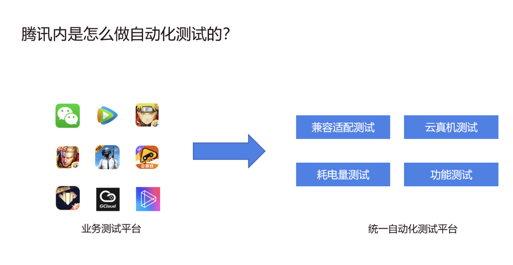

# UI自动化的价值与意义


> [!TIP|style:flat|label:My own heading|iconVisibility:hidden]
> An alert of type 'tip' using alert specific style 'flat' which overrides global style 'callout'.
> In addition, this alert uses an own heading and hides specific icon.

## UI 自动化价值

以下是 UI 自动化测试价值 一些主要方面：

- **提高测试效率**：UI 自动化测试可以替代手动测试过程，大大提高测试效率。通过编写自动化测试脚本，可以自动执行大量的测试用例，覆盖广泛的功能和场景，快速发现潜在的问题。

- **提高测试覆盖率**：自动化测试可以更全面地覆盖应用的用户界面和交互操作。它可以模拟用户的真实操作，测试应用的各个功能和流程。这样可以发现更多的潜在问题，并确保应用在各种情况下的稳定性和一致性。

- **提高测试质量**：自动化测试可以减少人为的错误和遗漏，通过可重复执行的测试流程，保证了一致性和准确性。它可以捕捉到一些细微的问题和边界情况，从而提高应用的质量。比如：**兼容性测试**、**自动化探索测试**等等。

- **节省人力成本**：相对于手动测试，UI 自动化测试可以节省大量的人力资源。一旦编写了自动化测试脚本，就可以重复执行测试，不再需要人工逐个执行测试用例。这样，测试团队可以将更多的精力投入到其他更有价值的任务上。

- **提升开发效率**：UI 自动化测试可以与持续集成和持续交付流程集成，作为开发流程的一部分运行。它可以在每次代码提交后自动执行测试，及早发现问题，减少开发周期，提高开发效率。

- **多平台和多设备支持**：UI 自动化测试可以在不同的操作系统和设备上运行，确保应用在各种平台和设备上的一致性和兼容性。这对于移动应用开发和跨平台应用非常重要。

- **可视化反馈和报告**：UI 自动化测试通常提供可视化的测试结果和报告，可以清晰地展示测试覆盖率、通过的测试用例和失败的测试用例。这样可以更好地跟踪测试进度和问题，便于团队合作和决策。


## 自动化测试的意义

帮助业务以更好的品质更快的占位市场。

- 更高的测试覆盖率。

- 配合DevOps 持续集成，快速响应版本。

- 专项测试融合其中：适配、性能、弱网。


## 如何做自动化测试？

- 第一步，做业务测试平台；
  >比如：腾讯内部先做微信、王者荣耀、腾讯视频等等app产品的业务测试平台。

- 第二步，做统一自动化测试平台。
  >统一自动化测试平台有：兼容适配测试、云真机测试、耗电量测试、功能测试。




**一个好的自动化测试平台需要帮助业务解决哪些问题？**

1. **效率**：业务接入更加方便、快捷，支持多种接入方式。
2. **可用**：测试任务执行更加稳定，支持99.9%。
3. **效果**：问题分析定位方便，更容易回归。


## 测试场景介绍

### 功能测试场景

手工测试是指测试人员通过手动操作应用程序的界面来执行测试用例。

```plantuml
scale 3
autonumber
title 功能测试场景
actor 测试工程师 as tester
participant 被测系统 as sys

tester -> sys: 测试工程师在系统页面做点击输入等操作
sys -> sys: 系统运行产生响应
sys -> tester: 测试工程师拿到系统的响应结果，并与预期结果进行对比
```

以下是功能测试的一些特点：

- **灵活性**：手工测试可以根据测试人员的判断和经验进行灵活的测试，可以快速适应变化的需求和环境。

- **探索性测试**：手工测试允许测试人员发现未知的问题和潜在的缺陷，通过探索性测试来寻找新的测试路径和可能的问题。

- **用户体验评估**：手工测试可以通过直接与应用程序交互来评估用户体验，包括界面友好性、易用性等方面。


### UI自动化测试场景

自动化测试是使用自动化测试工具和脚本执行测试过程的方法。

```plantuml
scale 3
autonumber
title UI 自动化测试场景
actor 测试工程师 as tester
participant 测试框架 as xunit
participant "自动化框架" as ui
participant 被测系统 as sys

note right of xunit
  Python：Pytest、unittest
  Java：JUnit5、TestNG
end note


note right of ui
  Web：Selenium
  App：Appium
end note
tester -> xunit: 编写自动化测试脚本
xunit -> ui: 调用自动化框架的API执行自动化测试脚本
ui -> sys: 模拟点击、输入等操作，并获取自动化运行的响应结果
sys -> sys: 系统运行产生响应
sys -> xunit: 编程语言拿到系统的响应结果，并与预期结果进行对比

```


以下是自动化测试的一些特点：

**重复性测试**：自动化测试适用于需要重复执行的测试场景，如回归测试。它可以节省时间和人力成本。

**大规模项目**：对于大规模项目，自动化测试可以提高测试效率，覆盖更多的测试用例，并减少测试周期。

**数据驱动和性能测试**：自动化测试可以使用数据驱动的方法执行测试，模拟各种不同的输入和情况。同时，它还可以用于性能测试，模拟大量用户并监测系统的性能指标。

**持续集成和持续交付**：自动化测试与持续集成和持续交付（CI/CD）流程结合使用，可以实现快速、可靠的软件交付。


## 企业实践

### 有赞

Web 自动化测试在企业「有赞」中的实践： **有赞**， 很多人会认为，UI 自动化维护成本高、性价比低，但是为什么在有赞的前端质量保证体系中放在了最前面呢？

**UI 自动化更接近用户端真实操作。**


### 美团

> 美团 App 的页面特点
> 对于不同的用户，美团 App 页面的呈现方式其实多种多样，这就是所谓的“千人千面”。以美团首页的“猜你喜欢”模块为例，针对于不同的用户有单列、Tab、双列等多种不同形式。这么多不同的页面样式需求，如果要在 1 天时间内完成开发、测试、上线流程，研发团队也面临着很大的挑战。所以测试工程师就需要重度依赖自动化测试来形成快速的验收机制。


### 放在最前面的原因

在前端质量保证体系中，UI自动化测试通常放在最前面的原因有以下几点：

#### 覆盖广泛的功能测试

UI自动化测试可以对前端应用程序进行广泛的功能测试，涵盖用户界面的各个方面，包括页面导航、用户交互、表单验证等。通过自动化测试，可以确保前端应用程序的核心功能正常工作，并验证与用户交互相关的各种操作。

#### 提前发现问题

将UI自动化测试放在前端质量保证体系的最前面可以尽早地发现潜在的问题和错误。在开发周期的早期阶段，通过自动化测试可以快速验证前端功能的正确性，并及早捕捉到可能的缺陷。这有助于提前修复问题，减少后续阶段的开发和测试工作量。

#### 快速反馈和持续集成

UI自动化测试可以与持续集成工具集成，实现快速反馈和自动化测试流程。通过在每次代码提交或构建过程中运行自动化测试，可以快速发现潜在问题，并及时通知开发团队。这种快速反馈有助于提高开发效率和团队的整体工作流程。

#### 确保用户体验和一致性

前端应用程序的用户界面是用户与应用程序进行交互的主要途径。通过UI自动化测试，可以确保用户界面在不同浏览器和平台上的一致性，以提供良好的用户体验。这对于前端应用程序的质量保证至关重要，因为用户体验是用户对应用程序的首要印象。


## 测试策略

[测试策略](../1001B_测试策略.md)


## 自动化的应用场景


- 需要频繁回归的场景
- 稳定的用户界面
- 多平台兼容性
- 多浏览器兼容性「`Web自动化`」
- 复杂的用户交互

在以下情况下，可以考虑使用UI自动化测试来执行Web端测试用例：

### 频繁的回归测试

当你需要进行频繁的回归测试时，UI自动化测试可以节省大量的时间和人力资源。通过自动运行测试脚本，你可以快速执行大量的测试用例，发现潜在的问题和回归错误。


### 稳定的用户界面

如果Web应用程序的用户界面相对稳定，不经常发生变化，那么编写UI自动化测试用例是有意义的。这样，测试用例编写的成本可以得到充分的回报，因为它们可以在多个测试运行中重复使用。

### 复杂的用户交互

如果你的Web应用程序具有复杂的用户交互，包括各种用户输入、按钮点击、下拉菜单选择等操作，那么UI自动化测试可以帮助你模拟这些交互并验证其正确性。

**大规模数据输入测试**：对于需要输入大量数据的应用程序，手动测试可能会变得耗时且容易出错。通过UI自动化测试，可以模拟大规模数据输入并验证应用程序的响应。


**可视化元素测试**：如果应用程序中包含大量可视化元素（如图表、图形等），手动测试这些元素的正确性和交互可能会很困难。使用UI自动化测试可以自动化执行这些测试，并验证可视化元素的正确性。


### 多平台兼容性


Web自动化：如果应用程序需要在不同的 浏览器（如Chrome、Firefox、Safari等） 和 操作系统（如Windows、Mac、Linux等）上运行相同的测试用例，以确保应用程序在各种环境中的一致性。手动执行这些测试会非常繁琐。

使用Web端UI自动化测试工具可以轻松地在多个浏览器和平台上运行测试用例。


Web自动化：如果应用程序需要在不同的 手机端（iOS、Android） 和 操作系统（如鸿蒙、小米、vivo、OPPO等）上运行相同的测试用例，以确保应用程序在各种环境中的一致性。手动执行这些测试会非常繁琐。


# 参考链接

[活动沙龙 《腾讯智能自动化测试探索和建议》-- 胡继
](https://testerhome.com/topics/30789)


<style>
  strong {
    color: #ea6010;
    font-weight: bolder;
  }
  .reveal blockquote {
    font-style: unset;
  }
</style>
