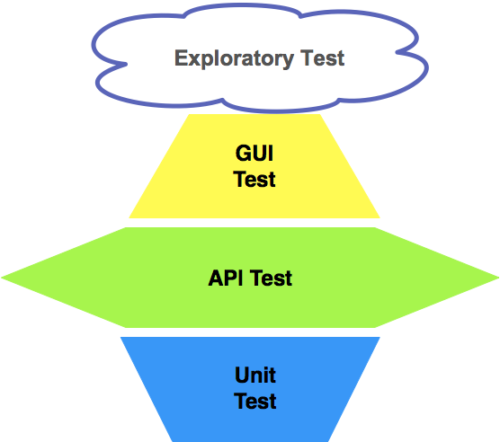

## 测试策略

### 金字塔模型

> [!tip|style:callout]
> 传统软件产品的测试策略设计。

推崇的是迈克的 **金字塔模型** ，**重单元测试，API测试次之，轻GUI测试**。

<!--  -->

### 菱形模型

> [!tip|style:callout]
> 互联网产品的测试策略设计。

互联网产品的研发流程就一个字：“**快**”，发布周期的巨大差异决定了，传统软件产品的测试策略必然不适用于互联网产品的测试，二者的测试策略必然在测试执行时间和测试执行环境上有巨大差异。

互联网产品采用 **菱形模型** ，遵循 **重量级 API 测试，轻量级 GUI 测试，轻量级单元测试** 的原则。

<!--  -->

互联网产品的上线周期，决定了`GUI`测试不可能大范围开展。

1.  互联网**产品的迭代周期**，决定了留给开发`GUI`自动化测试用例的时间非常有限
2.  互联网**产品客户端界面的频繁变化**，决定了开展`GUI`自动化测试的效率会非常低

互联网的产品 以**中间层**的`API`测试为重点做全面的测试；

最上层的`GUI`测试，首先只覆盖 *最核心直接影响主营业务流程* 的`E2E`『`EndToEnd`』场景 「P0级别的回归测试」；

>UI测试可能执行的时间比较长，对应的维护成本比较高，只要前端页面有变化，我们就需要进行对应的脚本维护。 所以，我们只选其中的一部分重要的测试用例，P0级别的测试用例来进行。

>有些app在不同的时间段对应的页面布局都会不同，所以，UI自动化就要兼容这个布局的更改，去判断当前页面有哪个模块，就进行哪个模块的UI自动化，如果当前页面没有对应模块则不进行UI自动化测试，但是在服务端并不代表该服务停止。

**单元测试**采用「**分而治之**」的思想，只对那些**相对稳定并且核心的服务和模块**开展全面的单元测试，而应用层或者上层业务只会做少量的单元测试。

