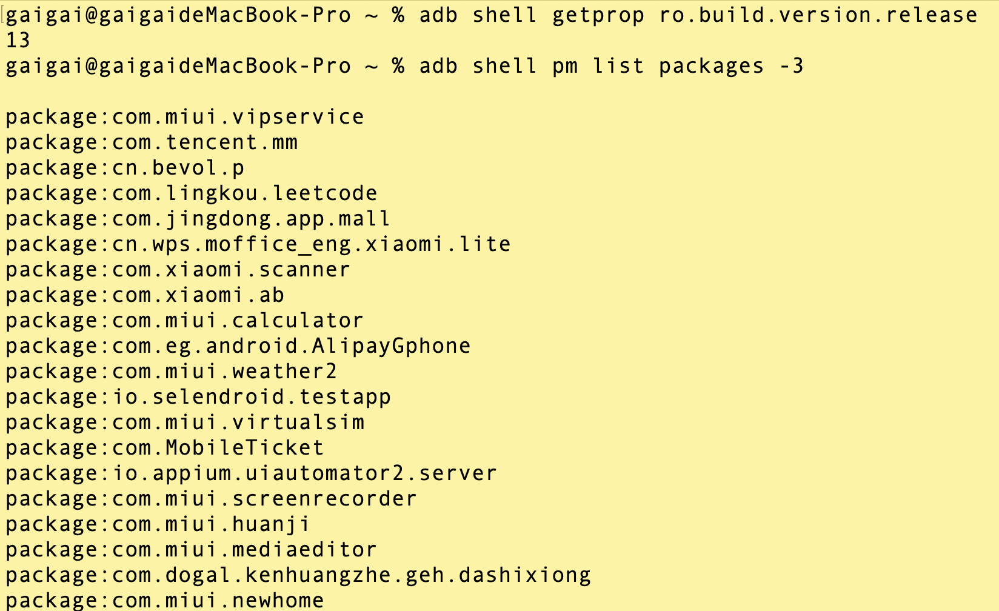
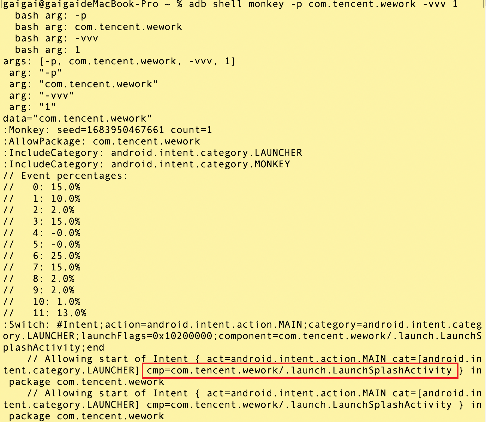
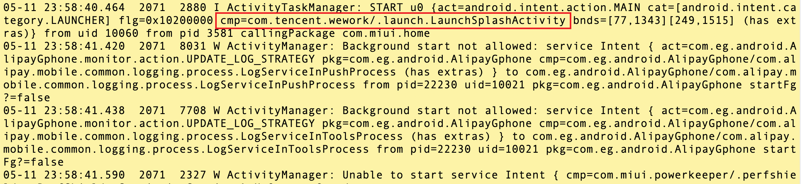
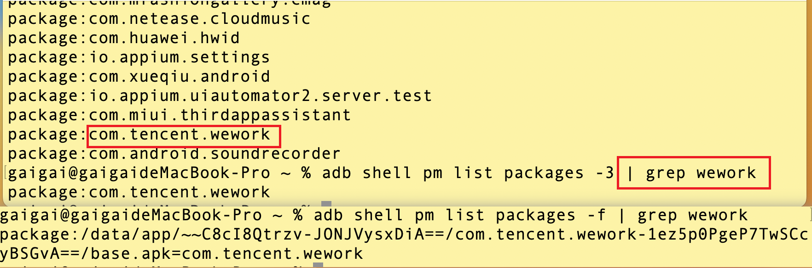
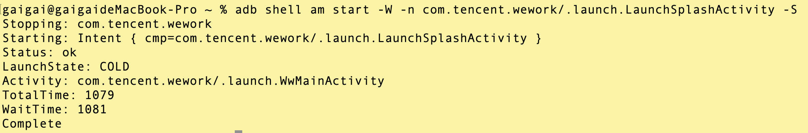

# Appium


## Appium 介绍

Appium是一款**开源**的自动化测试框架，专门用于移动应用程序的自动化测试。它可以**跨平台**测试iOS和Android应用程序，支持**多种编程语言**和测试框架。

它使用 **WebDriver** 协议驱动 iOS、Android 和 Windows 应用程序。


## Appium 特点和功能

>推荐 Appium 原因。


以下是Appium的主要特点和功能：

#### 跨平台支持

Appium可以同时测试iOS和Android应用程序，无需修改测试脚本或重新编译应用程序。这使得测试团队能够使用统一的工具和流程来测试不同平台的应用程序。

#### 多种编程语言支持

Appium支持多种编程语言，包括Java、Python、JavaScript、Ruby和C#等。

这使得测试人员可以使用他们熟悉的编程语言编写测试脚本，降低了学习成本。

#### 支持多种测试框架

Appium可以与各种测试框架集成，如JUnit、TestNG、RSpec和NUnit等。

这使得测试团队可以根据自己的需求选择适合的测试框架进行测试。

#### 支持真机和模拟器

Appium可以同时测试真机和模拟器上的应用程序。

测试人员可以在真实设备上进行测试以验证应用程序的真实性能和兼容性，也可以在模拟器上进行快速测试。

#### 基于WebDriver协议

Appium使用WebDriver协议来与设备进行通信。

这意味着测试人员可以使用标准的WebDriver API来编写测试脚本，与Web应用程序测试相似，易于使用和学习。

#### 对原生和混合应用的支持

Appium支持测试原生应用和混合应用。

无论应用程序是完全原生的还是包含Web视图，测试人员都可以使用Appium来自动化测试各种类型的应用程序。

#### 灵活的定位策略

Appium提供了多种元素定位策略，包括ID、类名、XPath和CSS选择器等。

这使得测试人员可以根据需要选择适合的定位策略来查找和操作应用程序中的元素。

#### 底层多引擎切换

#### 生态丰富，开源和活跃的社区

[Appium](http://appium.io/docs/en/2.0/)是开源的，具有庞大而活跃的社区支持，可以获取广泛的文档、教程和问题[issue](https://github.com/appium/appium/issues)解答，同时可以参与贡献和改进框架。


#### 并行执行

Appium支持并行执行测试，可以同时在多个设备上或多个模拟器上运行测试，提高测试效率。

#### 可扩展性

Appium可以与其他测试框架和工具集成，如JUnit、TestNG和Cucumber等，方便测试团队根据自己的需求扩展测试功能。


总的来说，Appium具有跨平台支持、多语言支持、基于WebDriver协议、支持原生和混合应用、真实设备和模拟器支持、并行执行、可扩展性和活跃的社区等主要特点。这些特点使得Appium成为广受欢迎的移动应用自动化测试框架。


## Appium 组件图


## 环境准备


- **Android Studio**：SDK、Emulator
- **模拟器**： 网易 mumu、Android Emulator、真机「建议」
- **被测 App**：企业微信
- **Appium Server**：GUI 版本、CMD 版本
- **Appium Inspector**：界面分析 测试用例生成


## 获取 App 信息

### App 入口

App 入口，三种方式获取：

#### 1. 通过 monkey 获取

```bash
# 设备的系统版本 安卓手机的系统版本，非小米、华为系统版本号 

adb shell getprop ro.build.version.release

#第三方app的包名   mm wework
adb shell pm list packages -3 

# 启动的app的页面
adb shell monkey -p <app包名> -vvv 1

```





#### 2. 通过 logcat 日志获取

```bash
# Mac/Linux
adb logcat ActivityManager:I | grep "cmp"

# Windows 
adb logcat ActivityManager:I | findstr "cmp"
```



`cmp`：指组件（Component）部分，用于指定要启动的活动（Activity）或服务（Service）的包名和类名。

#### 3. 通过 dumpsys 获取

```bash
# Mac/Linux 
adb shell dumpsys activity | grep Activity | grep <app包名>

# Windows 
adb shell dumpsys activity | findstr Activity | findstr <app包名>
```


#### 3. 通过 aapt 获取

必须有手机root用户。

- **环境变量**：

```bash
export ANDROID_HOME=/Users/gaigai/sdk

export PATH=$PATH:${ANDROID_HOME}/emulator:${ANDROID_HOME}/platform-tools:${ANDROID_HOME}/tools:${ANDROID_HOME}/tools/bin:${ANDROID_HOME}/build-tools/31.0.0/
```

```bash
# 安装，配置环境变量{ANDROID_HOME}/build-tools/{version}/
sdkmanager build-tools

#获取第三方app的包名
adb shell pm list packages -3 

# 查看设备上安装的所有应用程序的包名及其对应的 APK 文件路径
adb shell pm list packages -f

```




```bash
# Mac/Linux 
aapt dump badging wework.apk | grep launchable-activity

# Windows 
aapt dump badging wework.apk | findstr launchable-activity
```

用于获取 Android 应用程序信息的命令，它可以解析 APK 文件并提取应用程序的各种信息。

在使用 aapt dump badging 命令时，需要提供要分析的 APK 文件的路径。


### 启动应用验证

```bash
adb shell am start -W -n <package-name>/<activity-name> -S
```

- **am**： Android 中的 Activity Manager（活动管理器）的缩写，启动一个应用程序的活动（Activity）。

- **-W**：在启动应用程序后，等待应用程序完全启动并返回启动信息。

- **-n \<package-name> \<activity-name>**：指定要启动的应用程序的包名和活动名。

- **-S**：输出启动的时间和状态信息。

执行该命令后，adb 将启动应用程序，并输出应用程序启动时间和状态信息。


```bash
adb shell am start -W -n com.tencent.wework/.launch.LaunchSplashActivity -S
```




## 配置待测应用

- `platformName`：平台，Android/iOS
- `deviceName`：设备名
- `appPackage`：应用的包名
- `appActivity`：应用的页面名 Activity
- `noReset`: 防止清空缓存信息


---

## Appium inspector 页面结构


# 参考链接
https://testerhome.com/topics/30789


<style>
  strong {
    color: #ea6010;
    font-weight: bolder;
  }
  .reveal blockquote {
    font-style: unset;
  }
</style>

