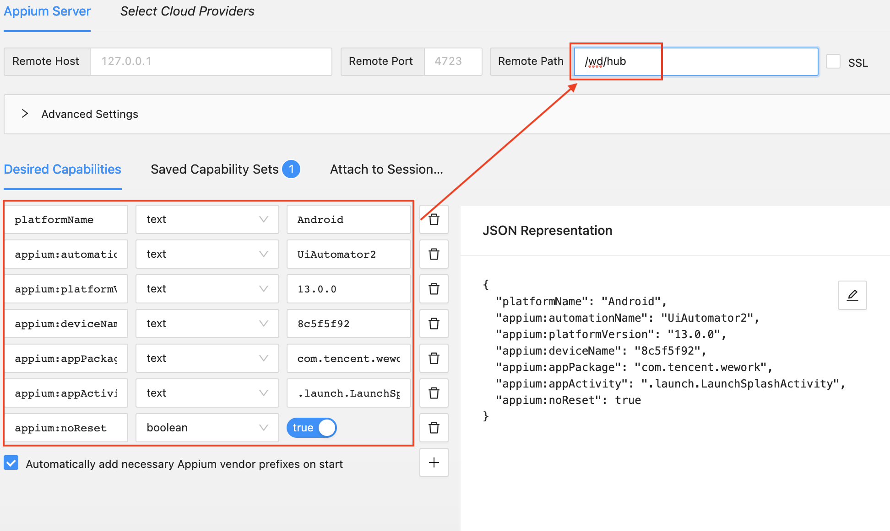
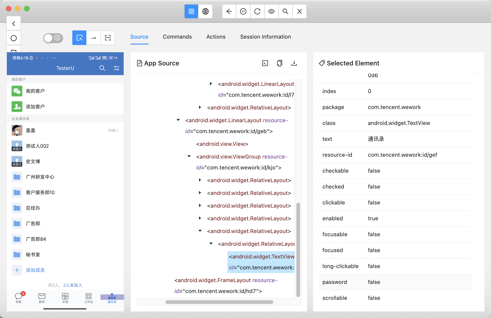

<style>
  strong {
    color: #ea6010;
    font-weight: bolder;
  }
  .reveal blockquote {
    font-style: unset;
  }
</style>

# Appium Inspector


## 配置待测应用

[Capabilities](https://appium.io/docs/en/2.0/guides/caps/) 启动 Appium 会话的参数集。




```bash
{
  "platformName": "Android",
  "appium:automationName": "UiAutomator2",
  "appium:platformVersion": "13.0.0",
  "appium:deviceName": "8c5f5f92",
  "appium:appPackage": "com.tencent.wework",
  "appium:appActivity": ".launch.LaunchSplashActivity",
  "appium:noReset": true
}
```

- **platformName**：平台，Android / iOS。
- **appium:automationName**： Appium 驱动程序的名称。
- **appium:platformVersion**：手机系统版本。
- **appium:deviceName**：设备名。
- **appium:appPackage**：应用的包名。
- **appium:appActivity**：应用的启动页面 Activity。
- **noReset**: 防止清空缓存信息。


## Appium inspector 页面





## 6. 常见控件定位方法

### EN

| Strategy              | Description     |
| --------------------------------------- | --------------------------------------------------------------------------------------------------------------------------------------------------------------------------------------------------------------------------------------------------------------------------------------------------------------------------------- |
| Accessibility ID      | Read a unique identifier for a UI element. For XCUITest it is the element's `accessibility-id` attribute. For Android it is the element's `content-desc` attribute.               |
| Class name            | For IOS it is the full name of the XCUI element and begins with XCUIElementType. For Android it is the full name of the UIAutomator2 class (e.g.: android.widget.TextView)        |
| ID  | Native element identifier. `resource-id` for android; `name` for iOS. |
| Name| Name of element |
| XPath                 | Search the App XML source using xpath (not recommended, has performance issues)         |
| Image                 | Locate an element by matching it with a base 64 encoded image file    |
| Android UiAutomator (UiAutomator2 only) | Use the UI Automator API, in particular the [UiSelector](https://developer.android.com/reference/android/support/test/uiautomator/UiSelector.html) class to locate elements. In Appium you send the Java code, as a string, to the server, which executes it in the application’s environment, returning the element or elements. |
| Android View Tag (Espresso only)        | Locate an element by its [view tag](<https://developer.android.com/reference/android/support/test/espresso/matcher/ViewMatchers.html#withTagValue(org.hamcrest.Matcher%3Cjava.lang.Object%3E)>)     |
| Android Data Matcher (Espresso only)    | Locate an element using [Espresso DataMatcher](https://developer.android.com/reference/android/support/test/espresso/Espresso#ondata)         |
| IOS UIAutomation      | When automating an iOS application, Apple’s [Instruments](/docs/en/drivers/ios-uiautomation.md) framework can be used to find elements        |

### 中文

| Strategy | Description |
| --- | ---|
| Accessibility ID | 读取 UI 元素的唯一标识符。<br>对于 iOS - XCUITest，它是元素的 "**accessibility-id**" 属性。<br>对于 Android，它是元素的 "**content-desc**" 属性。|
| Class name  | 对于 iOS，它是 XCUI 元素的全名，以 **XCUIElementType** 开头。<br>对于 Android，它是 UIAutomator2 类的全名（例如：**android.widget.TextView**）|
| ID  | 本机元素标识符。<br> Android的 **resource-id**； iOS的 **name** |
| Name| 元素名称 |
| XPath | 使用 xpath 表达式 |
| Image | 元素与 base 64 编码的图像文件进行匹配来定位元素|
| Android UiAutomator (UiAutomator2 only) | 使用 UI Automator API的 [UiSelector](https://developer.android.com/reference/android/support/test/uiautomator/UiSelector.html) 类来定位元素。 |
| IOS UIAutomation |iOS 中 Apple 的 [Instruments](/docs/en/drivers/ios-uiautomation.md) 框架用于查找元素 |


