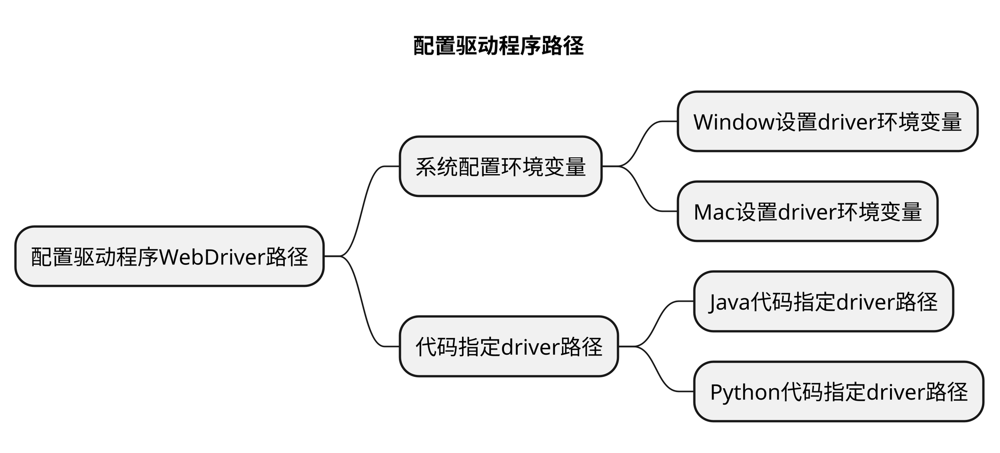
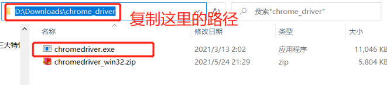
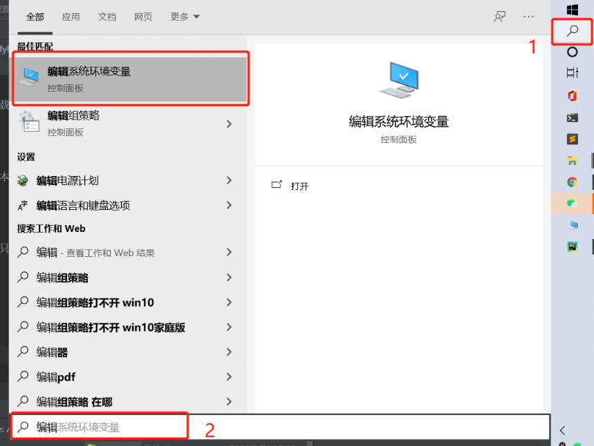
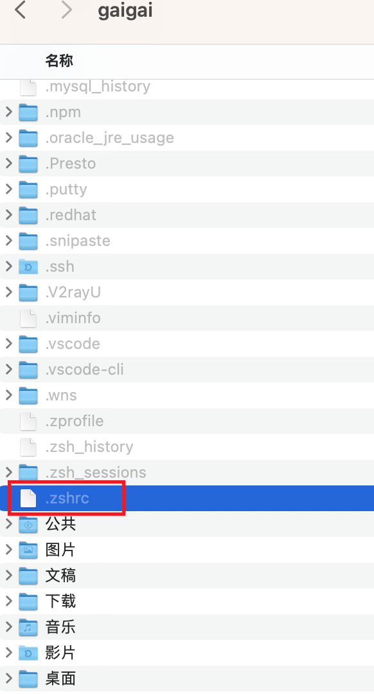

# Selenium 环境安装


## 本章要点
1. 要点一
1. 要点
1. 要点
1. **要点**


## 1. 下载浏览器驱动程序

根据你要自动化测试的浏览器类型，下载相应的浏览器驱动程序。

Selenium使用这些驱动程序来与浏览器进行通信和控制，[Slenium提供了相关的下载页面](https://www.selenium.dev/downloads/)。


常见的浏览器驱动程序包括`ChromeDriver`（用于Chrome浏览器）、`GeckoDriver`（用于Firefox浏览器）和 `IEDriver`（用于Internet Explorer浏览器）。


下载适用于你的浏览器版本和操作系统的驱动程序，并将其保存到一个可访问的位置。

### ChromeDriver下载

1. 打开下载页面。

   - [chromedriver官网](https://chromedriver.chromium.org/downloads)


   - [海外版地址](https://chromedriver.storage.googleapis.com/index.html)

   - [淘宝CDN](https://registry.npmmirror.com/binary.html?path=chromedriver/)

    - [Selenium下载](https://www.selenium.dev/zh-cn/documentation/webdriver/troubleshooting/errors/driver_location/)


2. Chrome 浏览器版本查看。

    

    >如果 Chrome 的版本是**113.0.5672.126**。在下载 ChromeDriver 的时候就需要下载对应的版本，如果找不到完全对应的版本，则需要保持大版本一致。

3. chromedriver下载。
   
    
    
    >根据自己的系统选择chromedriver，windows 只有32位的，因为Windows 64为也支持运行32为的。点击下载保存并进行解压，记下chromedriver 的路径


### GeckoDriver下载

[GeckoDriver](https://github.com/mozilla/geckodriver/releases)

### IEDriver下载

[IEDriver](http://selenium-release.storage.googleapis.com/index.html)


## 2. 配置驱动程序路径

将下载的浏览器驱动程序的路径配置到系统的环境变量中，或者在代码中指定驱动程序的路径。

这样，Selenium才能找到并与浏览器驱动程序进行通信。




### Window设置driver环境变量

1. 查看driver路径。
    

1. 环境变量配置。
    
    

1. 命令行验证。

    >在 cmd 里面输入 `chromedriver --version`。


### Mac设置driver环境变量


1. 按 **command + 空格** 键 输入 ter，选择终端打开。

1. 终端确认电脑的bash环境。

    ```bash
    echo $SHELL
    ```
    

1. 打开环境变量配置文件。
   - 输出为 **/bin/bash**， 则创建` ~/.bash_profile` 配置文件。

   - 输出为 **/bin/zsh**，则创建 `~/.zshrc` 配置文件。

    

    <!--  -->

2. 在配置文件中添加 CHROMEDRIVER_HOME，PATH的变量追加DRIVER配置：
    ```bash
    CHROMEDRIVER_HOME=/Users/gaigai/.cache/selenium/chromedriver/mac64/113.0.5672.63

    PATH=$PATH:${CHROMEDRIVER_HOME}/chromedriver
    #设置指令别名
    alias chromedriver=${CHROMEDRIVER_HOME}/chromedriver
    ```

3. 终端输入 **source 配置文件名** 使环境变量生效。

    ```bash
    source ～/.zshrc 
    ```
    
    

4. 重启命令行工具，输入 chromedriver --version。
   


### Java代码指定driver路径


### Python代码指定driver路径

在Python代码中，你可以使用以下方式来指定驱动程序的路径（以`ChromeDriver`为例）：

```python
from selenium import webdriver

# 指定ChromeDriver的路径
driver = webdriver.Chrome(executable_path='path/to/chromedriver')
```

## 3. 安装 Selenium 库


### 3.1 Java 安装 Selenium 库


### 3.2 Python 安装 Selenium 库

使用pip命令来安装Selenium库。在终端或命令提示符中运行以下命令：

```bash
pip install selenium
```


**路经验证：**

```bash
# 安装的路径
/usr/local/Cellar/python@3.10/3.10.11/Frameworks/Python.framework/Versions/3.10/lib/python3.10/site-packages/selenium
```
## 4. 代码验证

### Java 打开浏览器

### Python 打开浏览器

```python
import time
# 导入selenium 包
from selenium import webdriver

# 创建一个 Chromdriver 的实例。Chrome()会从环境变量中寻找浏览器驱动
driver = webdriver.Chrome()
# 打开网址
driver.get("https://www.baidu.com/")
# 强等10s 秒
time.sleep(10)
```

## 总结
- 总结一
- 总结二
- 总结三

https://github.com/Wechat-ggGitHub/Awesome-GitHub-Repo

[项目演示地址](https://github.com/testeru-pro/junit5-demo/tree/main/junit5-basic)


# 学习反馈

1. SpringBoot项目的父工程为( )。

   - [x] A. `spring-boot-starter-parent`
   - [ ] B.`spring-boot-starter-web`
   - [ ] C. `spring-boot-starter-father`
   - [ ] D. `spring-boot-starter-super`
<style>
  strong {
    color: #ea6010;
    font-weight: bolder;
  }
  .reveal blockquote {
    font-style: unset;
  }
</style>