# Selenium IDE

## 本章要点
1. 要点一
1. 要点
1. 要点
1. **要点**

## 介绍

Selenium IDE（集成开发环境）是一个易于使用的浏览器扩展，主要为Chrome和Firefox而设计，它允许自动化Web应用测试。

Selenium IDE为那些不具备编程知识的初学者提供了一种快速创建和运行自动化测试的方法。

### 主要功能

Selenium IDE具有以下主要功能：

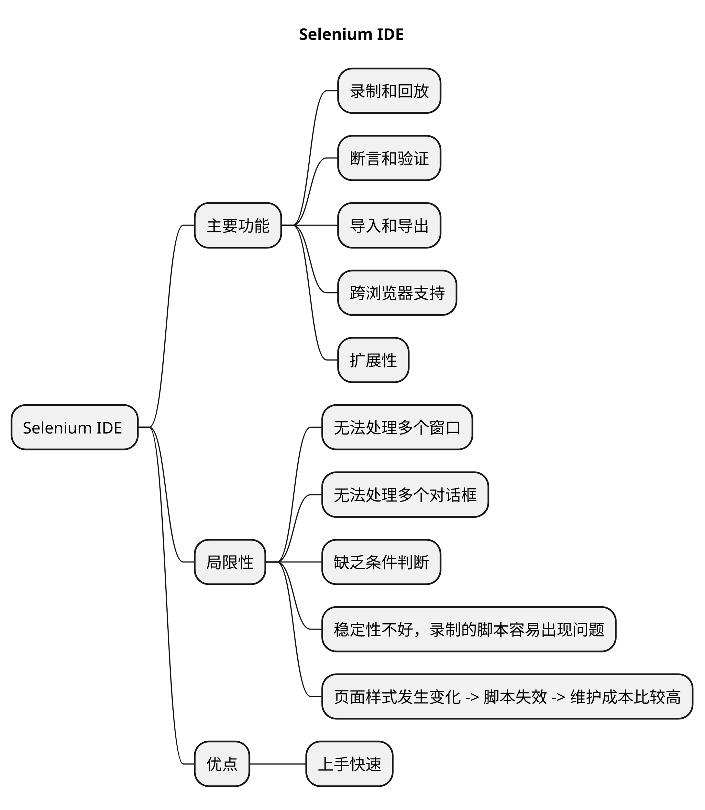

#### 1. 录制和回放

您可以通过在浏览器上执行操作来录制测试脚本，然后将录制的脚本回放以验证预期。

#### 2. 断言和验证

你可以在脚本中添加断言和验证，以检查页面上的某些特定属性，如元素是否存在，文本值等。

#### 3. 导入和导出

Selenium IDE支持多不同的脚本格式，这意味着您可以将已有的脚本导入或将编辑好的脚本导出，以便在其他框架中。

#### 4. 扩展性

Selenium IDE支持插件，这意味着你可以轻松地添加新的功能，以提高你的测试能力。

#### 5. 跨浏览器支持

尽管Selenium IDE最初只为Chrome和Firefox设计，但可以通过WebDriver播放实现对其他浏览器的支。

然而，Selenium IDE也有其**局限性**，例如，它**无法处理多个窗口**或者**对话框**、**缺乏条件判断**等等。

对更复杂的测试场景，您可能需要使用其他Selenium组件，如Selenium WebDriver。

## 安装

要在您的浏览器中安装Selenium IDE，请按照以下步骤操作：

### Chrome浏览器

#### 方式一：应用商店安装

1. 打开Google Chrome浏览器。

1. 转到 [Chrome 网上应用店](https://chrome.google.com/webstore/category/extensions) 。

1. 在搜索框中键入 "Selenium IDE" 并按Enter。
  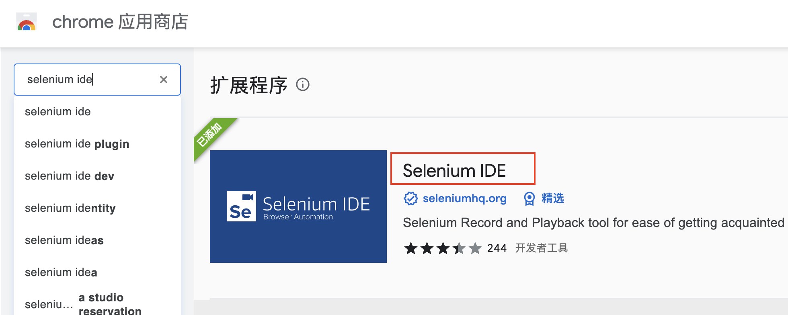

1. 找到 "Selenium IDE" 扩展并点击 "添加到Chrome"。
  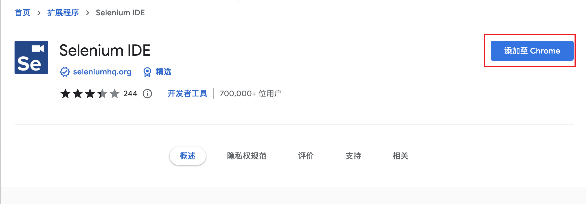

1. 弹出的确认对话框中，点击 "添加扩展" 按钮。
  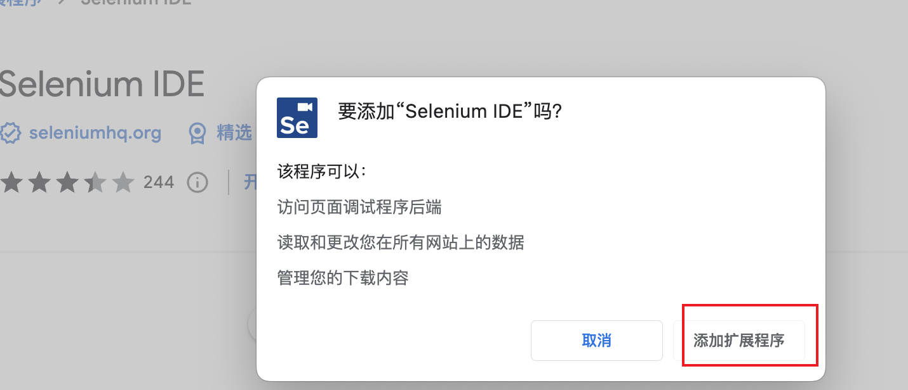

1. 等待安装完毕，新扩展将显示在浏览器工具栏中。
  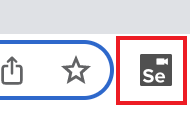

#### 方式二：CRX文件安装

若要通过CRX文件安装Chrome扩展，请遵循以下步骤。可以尝试以下方法或使用**开发者模式**安装CRX扩展：

1. 打开 **Google Chrome** 浏览器。

1. 导航至 [扩展程序](chrome://extensions/) ，或从菜单中选择 “**更多工具**” -->  “**扩展程序**”。

1. 请确保右上角的“**开发者模式**”选项已启用。

##### 方法1：将CRX扩展拖放到Chrome中

1. 将CRX文件从文件管理器中拖放到扩展程序页面。

1. Google Chrome将询问您是否此扩展程序。点击 “**添加扩展**” 以确认并安装。

##### 方法2：使用Chrome开发者模式

1. 下载**Selenium IDE CRX文件**保存在熟悉的位置。

2. 单击页面左上角的“**加载已解压的扩展程序**”按钮。

3. 浏览到您保存CRX文件的文件夹并选择该文件夹。然后点击 “**选择文件夹**” 来安装。

4. 完成安装后，Selenium IDE图标将出现在Chrome的工具栏上。

建议确保下载扩展文件的来源可靠，因为来自未知来源的扩展程序可能具有安全风险。

但请注意，这些方法可能不再适用于新版本的Chrome。

在这种情况下，建议使用官方的Chrome Web商店来安装您的扩展。

### Firefox浏览器

1. 打开Mozilla Firefox浏览器。

1. 转到 Firefox 附加组件页面 https://addons.mozilla.org/en-US/firefox/

1. 在搜索框中键入 "Selenium IDE" 并按Enter。

1. 找到 "Selenium IDE" 附加组件并点击 "添加到Firefox"。

1. 在弹出的确认对话框中，点击 "添加" 按钮。

1. 等待安装完毕，新附加组件将显示在浏览器工具栏中。

安装完成后，您可以单击浏览器工具栏中的 Selenium IDE 图标来启动 IDE，并开始录制、编辑和运行自动化测试脚本。

## 常用功能介绍

## 需求

## 录制

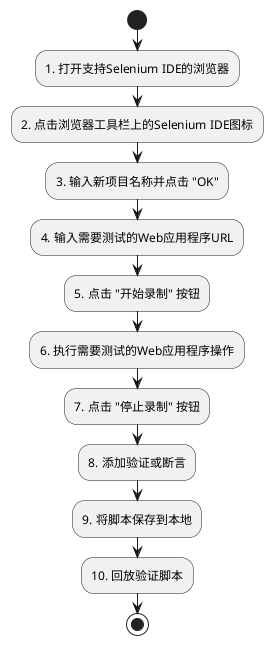

### 场景

1. 打开百度首页。

2. 输入搜索关键字：Selenium。
3. 找到[Selenium官网](https://www.selenium.dev/)打开。
4. 标题文本断言。

5. 录制脚本导出。

### 操作步骤

要使用Selenium IDE录制Web应用程序的操作步骤，请按照以下指南进行操作：

1. 打开支持Selenium IDE的浏览器（如 Chrome 或 Firefox）。

2. 点击浏览器工具栏上的Selenium IDE图标。
  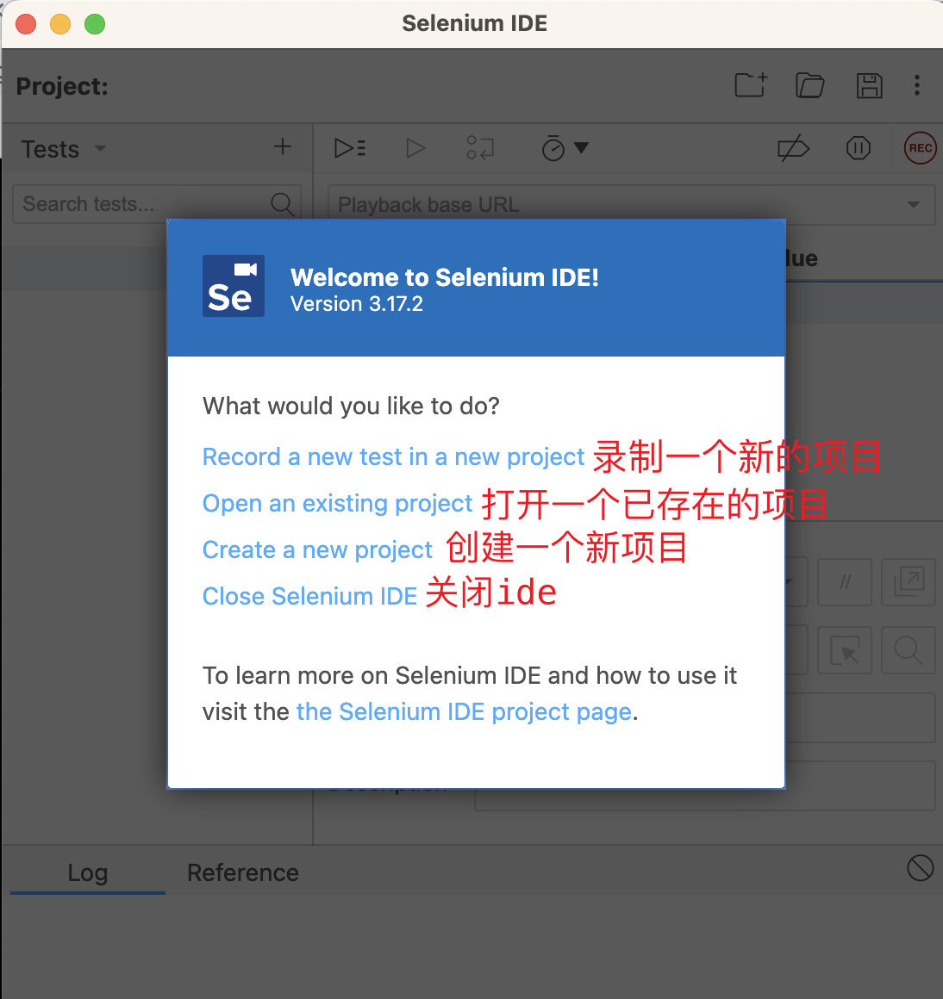

3. 这将打开Selenium IDE面板。在项目名称区域输入新项目的名称，然后点击 "**OK**"。
  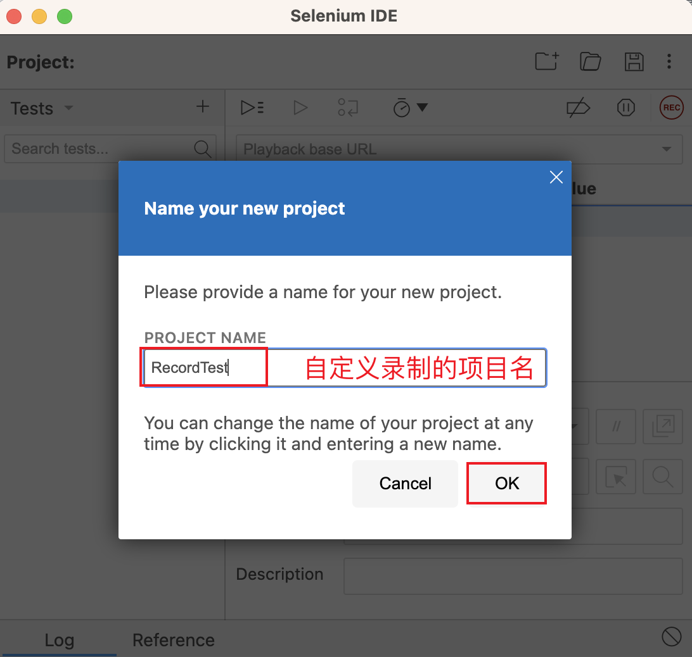

4. 输入您打算测试的Web应用程序的URL，然后单击 "**开始录制**" 按钮。这将打开一个新的浏览器窗口并导航到输入的URL，IDE开始录制在网站上执行的操作。
  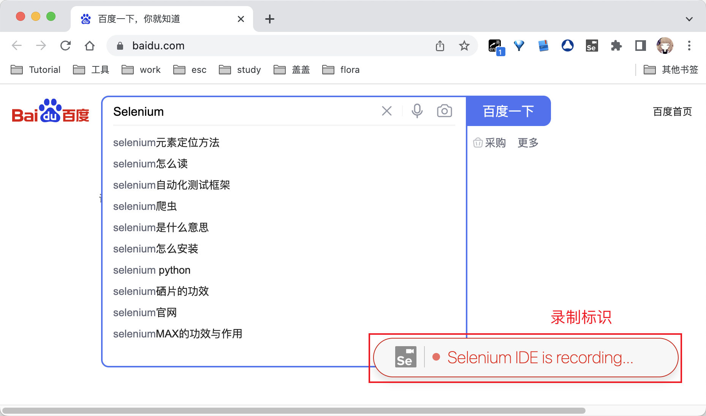

5. 在Web应用程序上执行您需要测试的操作。
   >例如，导航到不同的页面，输入表单数据，单击按钮等。可以看到Selenium IDE面板实时记录这些操作，并将它们添加到脚本中。
  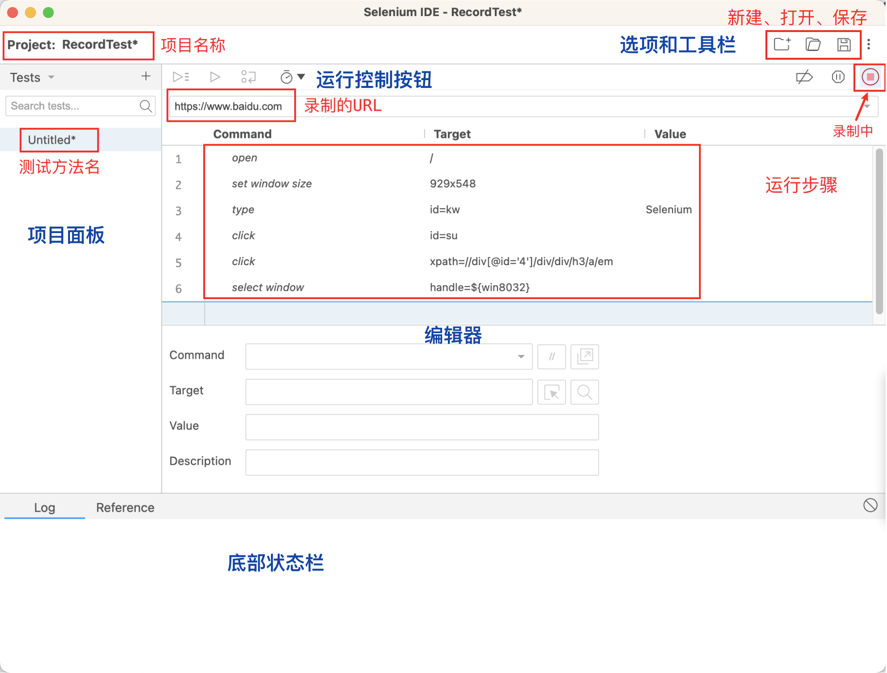

6. 完成所有测试操作后，单击Selenium IDE面板上的 "**停止录制**" 按钮。

7. **添加验证或断言**，右键单击页面中的目标元素，选择 "Selenium IDE" 菜单，然后选择相应的命令。这些命令将触发Selenium IDE检查页面上的特定属性，如元素是否存在，文本值等。
  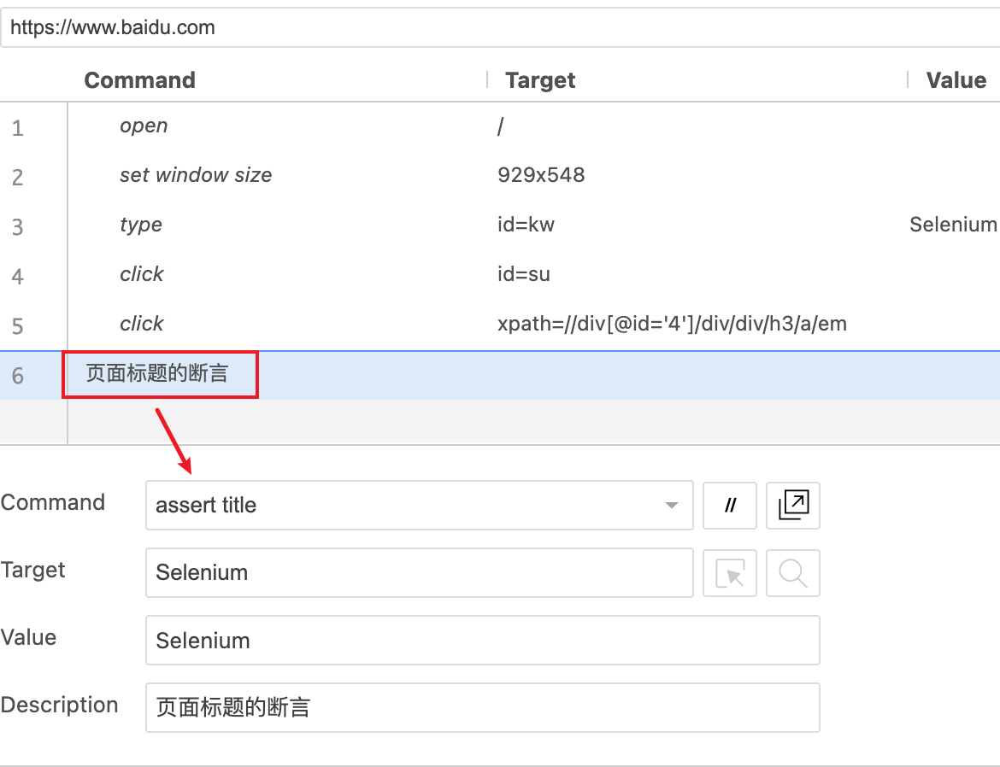

8. 脚本保存本地
   >脚本以 **.side** 结尾的文件。
  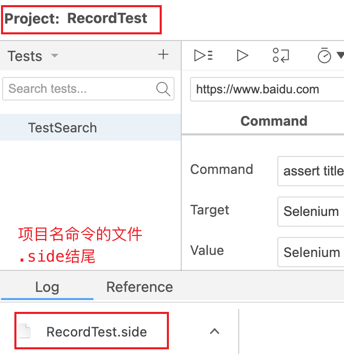

使用Selenium IDE录制的功能可以快速轻松地创建自动化测试脚本。但是，请注意，一些操作或功能可能不会被完美地自动录制。在这种情况下，编辑脚本以进行优化和改进是很重要的。

## 回放

在Selenium IDE中回放自动化测试脚本指的是将录制或手动创建的脚本在浏览器中执行以验证测试用例。回放功能可以让你检查脚本的准确性并查找可能的错误。

以下是在Selenium IDE中回放测试脚本的步骤：

打开已安装Selenium IDE扩展的浏览器（例如Chrome或Firefox）。

单击浏览器工具栏上的Selenium IDE图标，打开Selenium IDE。

使用Selenium IDE打开已存在的项目或之前录制的脚本。点击左上角的文件选项，然后选择"打开项目"，找到已保存的项目文件（扩展名为 .side）并打开。

如果你已有一个打开的项目，确保选择你要执行回放的脚本。

要回放整个测试套件中的所有脚本，请单击IDE面板下方的 "运行所有" 按钮。这将依次执行测试套件中的所有脚本。你也可以在左侧的脚本列表中使用"运行当前"按纽针对特定脚本执行回放操作。

Selenium IDE会根据脚本中的命令执行回放操作。同时，面板中的 "Log" 选项卡会显示每个操作的执行状态。

当回放完成后，板上的执行状态会显示通过或失败的测试数量。若要获取更多详细信息，你可以查看 "Log" 选项卡或查看各个步骤的执行结果。

请注意，有时可能会出现回放错误，这可能是由于网站本身的更改或者脚本中的错误。在这种情况下，需要编辑脚本并修复问题，然后重新进行回放以确保测试用例通过。

## 录制脚本导出

1. 测试方法选中三点，点击Export。
  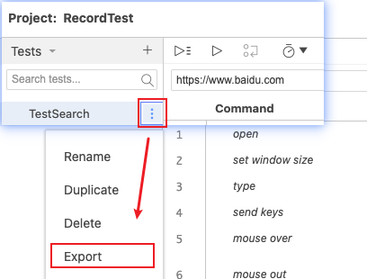

2. 可以选择导出为多种编程语言的脚本，例如Java、Python、C#、Ruby等。
  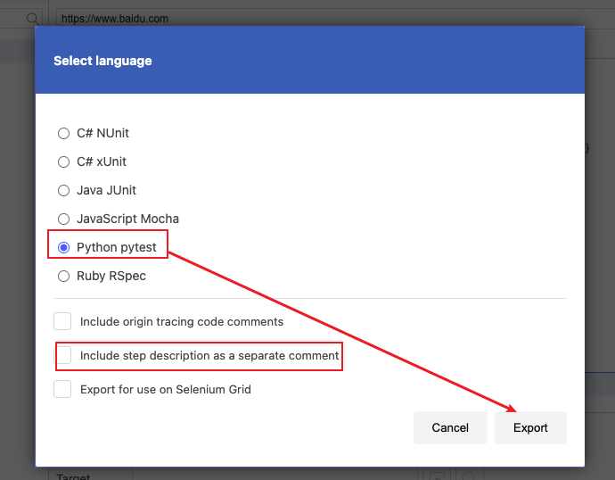

在选择导出格式后，您需要选择导出文件的保存路径和文件名，并确认导出。

  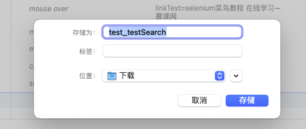

## 总结

- 总结一
- 总结二
- 总结三
https://github.com/Wechat-ggGitHub/Awesome-GitHub-Repo

[项目演示地址](https://github.com/testeru-pro/junit5-demo/tree/main/junit5-basic)

# 学习反馈

1. SpringBoot项目的父工程为( )。

   - [x] A. `spring-boot-starter-parent`
   - [ ] B.`spring-boot-starter-web`
   - [ ] C. `spring-boot-starter-father`
   - [ ] D. `spring-boot-starter-super`
