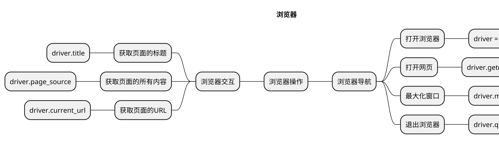
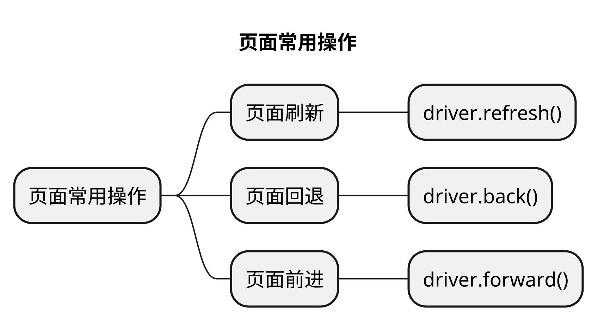

# 浏览器复用
## 本章要点
1. 要点一
1. 要点
1. 要点
1. **要点**

要实现Web自动化并复用浏览器，你可以使用一些流行的自动化测试工具和技术，如Selenium和WebDriver。

在Selenium中，可以使用WebDriver来管理浏览器的实例。通过创建一个WebDriver对象，你可以控制一个特定浏览器的行为，如打开网页、填写表单、点击按钮等。同时，你可以在同一个会话中复用WebDriver对象，以便在多个测试步骤中保持对同一个浏览器实例的控制。

## 总结
- 总结一
- 总结二
- 总结三
https://github.com/Wechat-ggGitHub/Awesome-GitHub-Repo

[项目演示地址](https://github.com/testeru-pro/junit5-demo/tree/main/junit5-basic)

# 学习反馈

1. SpringBoot项目的父工程为( )。

   - [x] A. `spring-boot-starter-parent`
   - [ ] B.`spring-boot-starter-web`
   - [ ] C. `spring-boot-starter-father`
   - [ ] D. `spring-boot-starter-super`

---

## 页面常用操作

