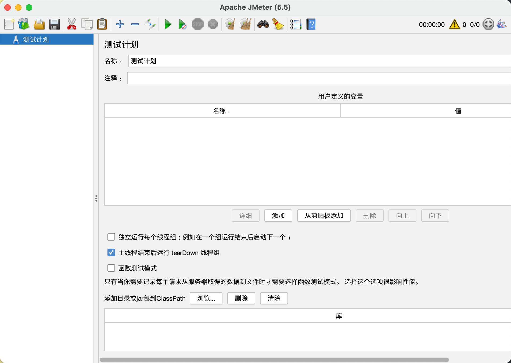

# JMeter介绍

## 本章要点

1. JMeter介绍

## 学习目标

1. JMeter工具特性。

## 思考

> 想要进行压测脚本编写，为什么选择JMeter作为压测脚本的工具？JMeter都有哪些特点？

## JMeter介绍

JMeter 是一款用于压力测试、性能测试和负载测试的开源工具，支持多种协议和技术，如 HTTP、HTTPS、FTP、SOAP、REST 等。它最初是为 Web 应用程序设计的，但也可以用于测试其他类型的应用程序。

## 主要特性

以下是 JMeter 的主要特性：

### 开源免费

JMeter 是一款开源免费的软件，任何人都可以下载和使用它。

### 支持多种协议

JMeter 支持多种协议和技术，如 HTTP、HTTPS、FTP、SOAP、REST 等，可以满足不同类型应用程序的测试需求。

### 支持多种数据格式

JMeter 支持多种数据格式，如文本、XML、JSON、CSV 等，可以方便地生成测试数据和结果。

### GUI 和命令行两种操作方式

JMeter 提供了 GUI 和命令行两种操作方式，用户可以根据需要选择合适的方式进行测试。

### 内置组件丰富

JMeter 提供了多种内置组件，如线程组、请求、断言、逻辑控制器等，可以轻松地构建测试计划。

### 支持插件和扩展

JMeter 支持多种插件和扩展，可以扩展其功能和支持的协议。

### 多种输出格式

JMeter 支持多种输出格式，如 HTML 报告、CSV 文件等，方便用户查看和分析测试结果。

### 跨平台支持

JMeter 支持多种操作系统，如 Windows、Linux、Mac 等。

### 支持分布式测试

JMeter 支持分布式测试，可以将测试负载分配到多个机器上执行，以模拟更真实的场景。

>压测时，要把server端的瓶颈点测试出来。但是如果想要测出瓶颈点，就需要产生巨大的压力。但是运行JMeter的计算机「负载机」，严格意义上来说，并不是很好。当JMeter运行的计算机配置不高时，有可能server端的瓶颈没有压出来，对应的JMeter运行的机器直接就挂掉了。分布式部署，人多力量大。

总之，JMeter 是一款功能丰富、易用、灵活的测试工具，可以帮助用户快速构建测试计划，模拟真实的场景，并收集、分析测试结果，从而评估应用程序的性能和稳定性。

## 总结

