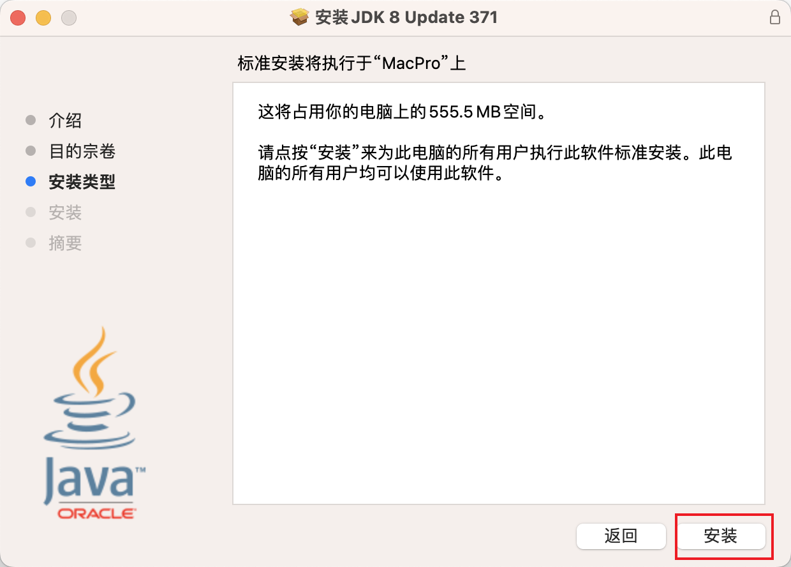
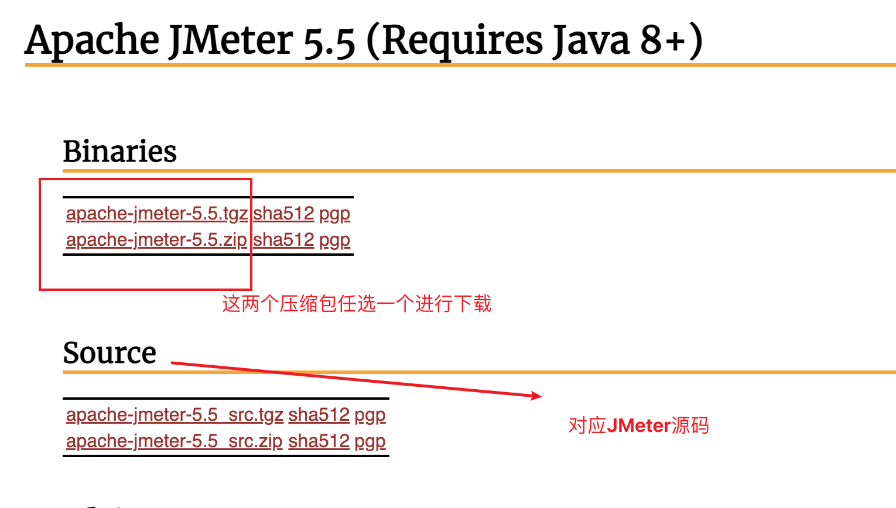

# JMeter安装 - Mac系统


## 目录

- Java安装、配置
- JMeter安装、配置


## 学习目标

1. Mac系统安装并打开JMeter工具。


## 思考

> 想要使用JMeter进行压测脚本编写，如何安装并打开JMeter软件？


## JMeter安装

- 环境准备
- JMeter压缩包安装


### 环境准备

1. jdk下载。
1. jdk安装。
1. Java环境变量配置。


#### jdk下载

1. 下载合适自己系统的[jdk](https://drive.weixin.qq.com/s?k=ANUAJQeKAAk0t0A01a)。

注意：jdk版本需要1.8+。


#### jdk安装

1. 打开下载的dmg文件，选择**pkg**。
    
1. 点击 继续 。 
    
1. 点击 安装 。
   

1. 点击 使用密码，输入电脑开机密码。

    

1. 等待软件安装完成，点击关闭。

    


#### Java环境变量配置

1. 按 command + 空格 键 输入 ter，选择终端打开。

1. 终端确认电脑的bash环境。

    ```bash
    echo $SHELL
    ```
    

1. 打开环境变量配置文件。
   - 输出为/bin/bash， 则创建 ~/.bash_profile 配置文件。

   - 输出为/bin/zsh ，则创建 ~/.zshrc 配置文件。

    


1. 添加 JAVA_HOME 、CLASSPATH 变量。

1. PATH的变量追加Java配置。

    ```bash
    #------------------JAVA------------------
    JAVA_HOME=/Library/Java/JavaVirtualMachines/jdk-1.8.jdk/Contents/Home

    CLASSPATH=$JAVA_HOME/lib/tools.jar:$JAVA_HOME/lib/dt.jar:.

    PATH=$JAVA_HOME/bin:$PATH:.

    export JAVA_HOME
    export PATH
    export CLASSPATH
    ```

1. 按 command + 空格 键 输入 ter，选择终端打开。

1. 终端输入 **source 配置文件名** 使环境变量生效。

    ```bash
    source ～/.zshrc 
    ```
    

#### Java环境验证

1. 打开一个新的命令行窗口。

1. 输入 java -version 得到版本号相关信息则表示java安装配置成功。
    ```bash
    java -version 

    javac
    ```
    


### JMeter压缩包安装

1. 下载Apache JMeter压缩包：[官网](https://jmeter.apache.org/download_jmeter.cgi)。
   
    

2. 解压到当前电脑上指定路径。
   
    

### JMeter环境变量配置

1. 按 command + 空格 键 输入 ter，选择终端打开。

2. 终端确认电脑的bash环境。

    ```bash
    echo $SHELL
    ```
    

1. 打开环境变量配置文件。
   - 输出为/bin/bash， 则创建 ~/.bash_profile 配置文件。

   - 输出为/bin/zsh ，则创建 ~/.zshrc 配置文件。

    

1. 添加 JMETER_HOME 变量。

2. PATH的变量追加JMeter配置。

    ```bash
    #-------- jmeter ----------
    JMETER_HOME=/解压路径/apache-jmeter-5.5

    export JMETER_HOME
    export PATH=$PATH:$JMETER_HOME/bin
    ```


1. 按 command + 空格 键 输入 ter，选择终端打开。

2. 终端输入 **source 配置文件名** 使环境变量生效。

    ```bash
    source ～/.zshrc 
    ```

    


### JMeter环境验证

1.按 command + 空格 键 输入 ter，选择终端打开。

2. 输入 jmeter -v 得到版本号相关信息则表示JMeter安装配置成功。
    ```bash
    jmeter -v
    ```


## 界面化启动

1. 按 command + 空格 键 输入 ter，选择终端打开。

2. 输入 jmeter ，命令行启动JMeter的GUI界面。


