# JMeter安装 - Window系统


## 本章要点

1. Java安装、配置
1. JMeter安装、配置


## 学习目标

1. Window系统安装并打开JMeter工具。


## 思考

> 想要使用JMeter进行压测脚本编写，如何安装并打开JMeter软件？

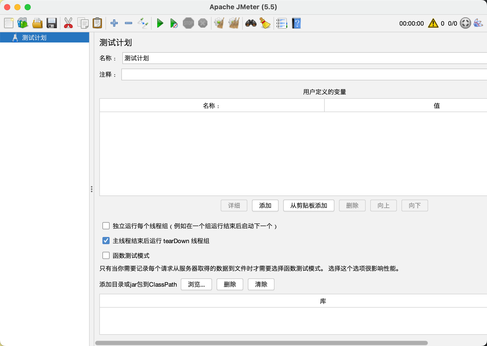


## JMeter安装

- 环境准备
- JMeter压缩包安装


### 环境准备

1. jdk下载。
1. jdk安装。
1. Java环境变量配置。

#### jdk下载

1. 查看windows的系统。

2. 下载合适自己系统的jdk，jdk版本需要1.8+。
   - 64位请选择[X64](https://drive.weixin.qq.com/s?k=ANUAJQeKAAk88WYJIK)；
   - 32位系统请选择[X86](https://drive.weixin.qq.com/s?k=ANUAJQeKAAkO07rfEy)。


jdk版本


    window系统查看


#### jdk安装

1. 打开下载的exe文件，选择**是**。

    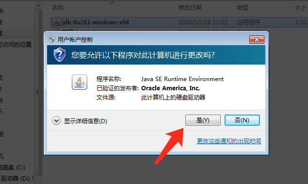


1. 点击下一步。
   
    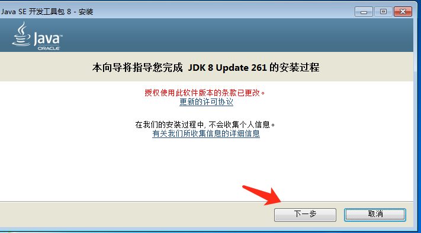


1. 更改jdk安装路径：点击 **安装到:** 的右侧 **更改** 按钮，可选择jdk安装的路径。 如默认则直接点击下一步，直到完成。

    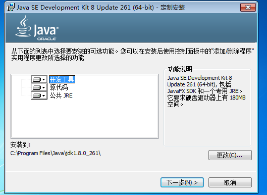


#### Java环境变量配置

1. 打开系统属性中的环境变量。

    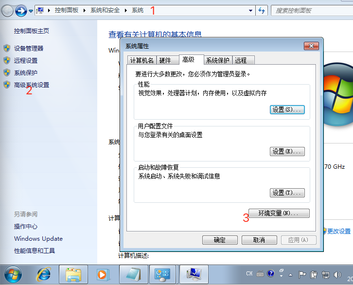

1. 系统环境变量中添加JAVA_HOME系统变量。
   - 注意：变量值为自己安装JDK的路径。
    ```bash
    变量名： JAVA_HOME
    变量值： C:\Program Files\Java\jdk-1.8
    ```
    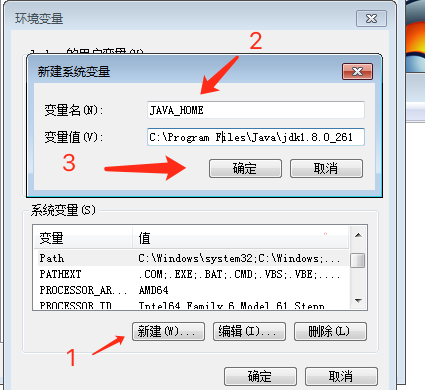


1. 系统环境变量中添加CLASSPATH系统变量。
   - 注意：最前面有个点。

    ```bash
    变量名： CLASSPATH
    变量值： .;%JAVA_HOME%\lib;%JAVA_HOME%\lib\tools.jar
    ```
    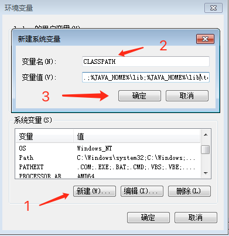

1. 系统环境变量的PATH的变量值最后末尾，追加配置。
   - 注意：PATH中不能有java的其他版本配置。
    ```bash
    变量名： PATH
    变量值： %JAVA_HOME%\bin;%JAVA_HOME%\jre\bin;
    ```
    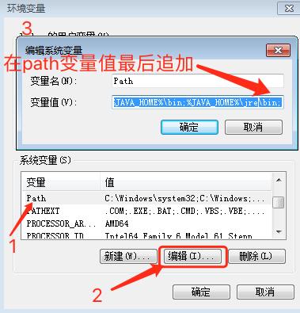

#### Java环境验证

1. 按 win + R 键 输入 cmd 回车，弹出命令行窗口。

1. 输入 java -version 得到版本号相关信息则表示java安装配置成功。
    ```bash
    java -version 

    javac
    ```

    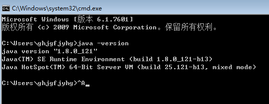


### JMeter压缩包安装

1. 下载Apache JMeter压缩包：[官网](https://jmeter.apache.org/download_jmeter.cgi)。
    
    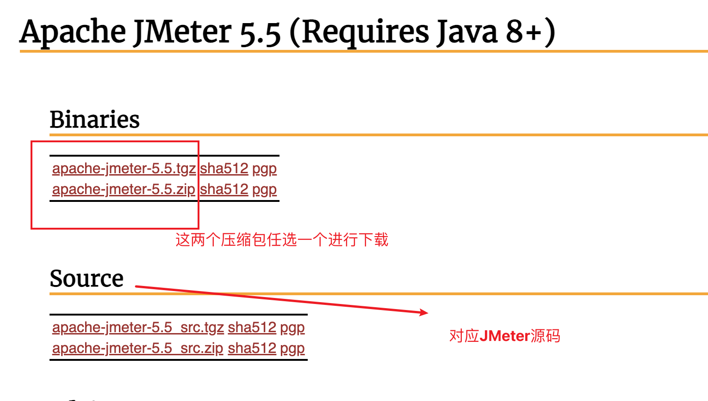

1. 解压到当前电脑上指定路径。
    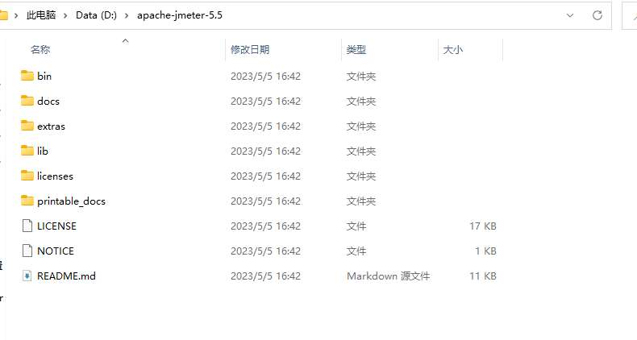

### JMeter环境变量配置

1. 打开系统属性中的环境变量。

    

2. 系统环境变量中添加JMETER_HOME系统变量。
   - 注意：变量值为自己解压JMeter的路径。
    ```bash
    变量名： JMETER_HOME
    变量值： D:\apache-jmeter-5.5
    ```
    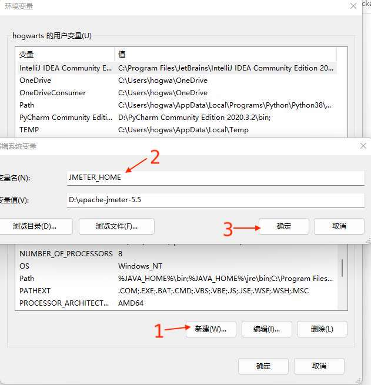

3. 系统环境变量的PATH的变量值最后末尾，追加配置。
    ```bash
    变量名： PATH
    变量值： %JMETER_HOME%\bin;
    ```
    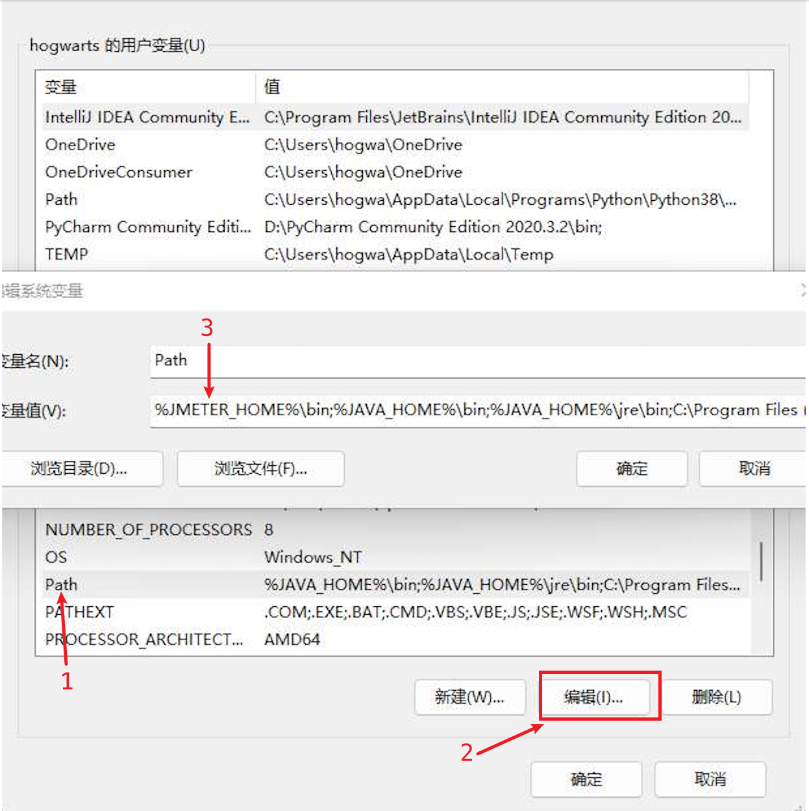


### JMeter环境验证

1. 按 win + R 键 输入 cmd 回车，弹出命令行窗口。

2. 输入 jmeter -- 得到版本号相关信息则表示JMeter安装配置成功。
    ```bash
    jmeter -v
    ```
    


## 界面化启动

1. 按 win + R 键 输入 cmd 回车，弹出命令行窗口。

2. 输入 jmeter ，命令行启动JMeter的GUI界面。


## 总结


<style>
  strong {
    color: #ea6010;
    font-weight: bolder;
  }
  .reveal blockquote {
    font-style: unset;
  }
</style>

