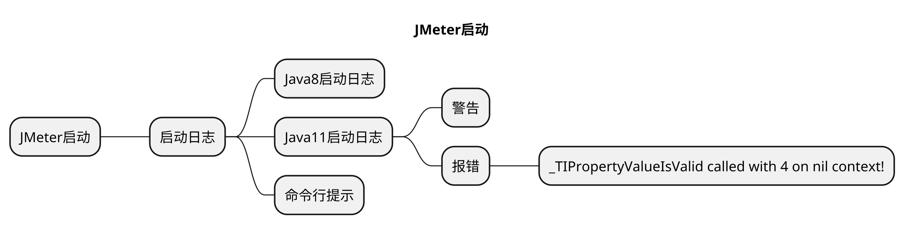
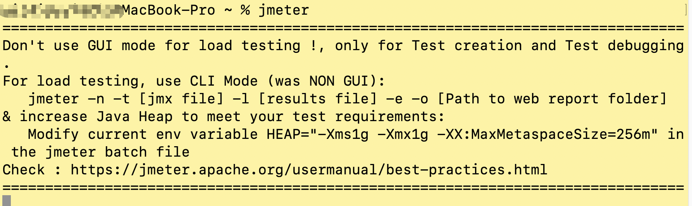
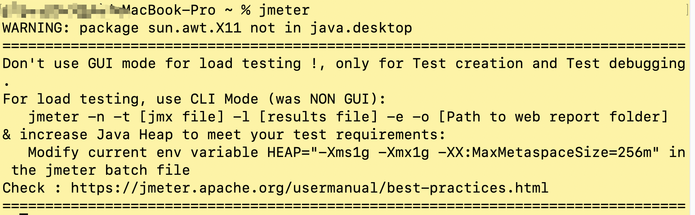
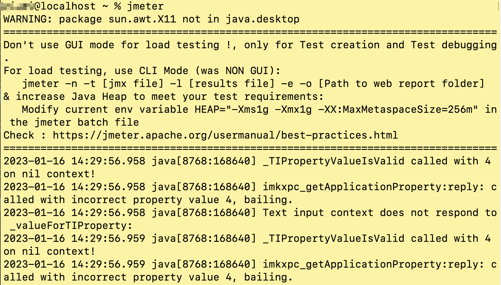

# JMeter启动日志及界面工作区介绍





## 本章要点

1. 不同Java版本下JMeter的启动日志


## 学习目标

1. Window系统安装并打开JMeter工具。


## 思考

## JMeter启动日志

### Java8启动JMeter

`Java`版本为**8**的`JMeter`启动日志：




### Java11启动JMeter

`Java`版本为**11**的`JMeter`启动日志：




#### 警告

```bash
WARNING: package sun.awt.X11 not in java.desktop
```
注意⚠️：这个`WARNING`警告不需要管。如果想要消除警告，则可以直接使用`Java8`的版本启动`JMeter`即可。


#### 报错：_TIPropertyValueIsValid called with 4 on nil context!
如下图所示报错内容：



如果遇到`_TIPropertyValueIsValid called with 4 on nil context!`的报错信息，可以参考官网的[issue](https://github.com/apache/jmeter/issues/5533)提供的解决方案。


##### 解决方案

方案一：**修改对应`Java`版本号**；

方案二：**重新命令行启动**`JMeter`。

以上两种解决方案选择其中一个即可。


### JMeter命令行启动提示

```bash
# 不要使用GUI模式进行负载测试 GUI模式只是压测脚本的创建和调试
Dont use GUI mode for load testing !, only for Test creation and Test debugging.
# 如果想要进行负载测试 使用CLI模式 即非GUI模式 -- 静默压测会详细介绍
For load testing, use CLI Mode (was NON GUI):
   jmeter -n -t [jmx file] -l [results file] -e -o [Path to web report folder]
# 可以增加Java的堆来满足压测需求
& increase Java Heap to meet your test requirements:
# 修改JMeter文件的Java堆变量
   Modify current env variable HEAP="-Xms1g -Xmx1g -XX:MaxMetaspaceSize=256m" in the jmeter batch file
```

## 总结

- JMeter启动日志
  - Java8正常启动，Java11有告警可忽略。


<style>
  strong {
    color: #ea6010;
    font-weight: bolder;
  }
  .reveal blockquote {
    font-style: unset;
  }
</style>

