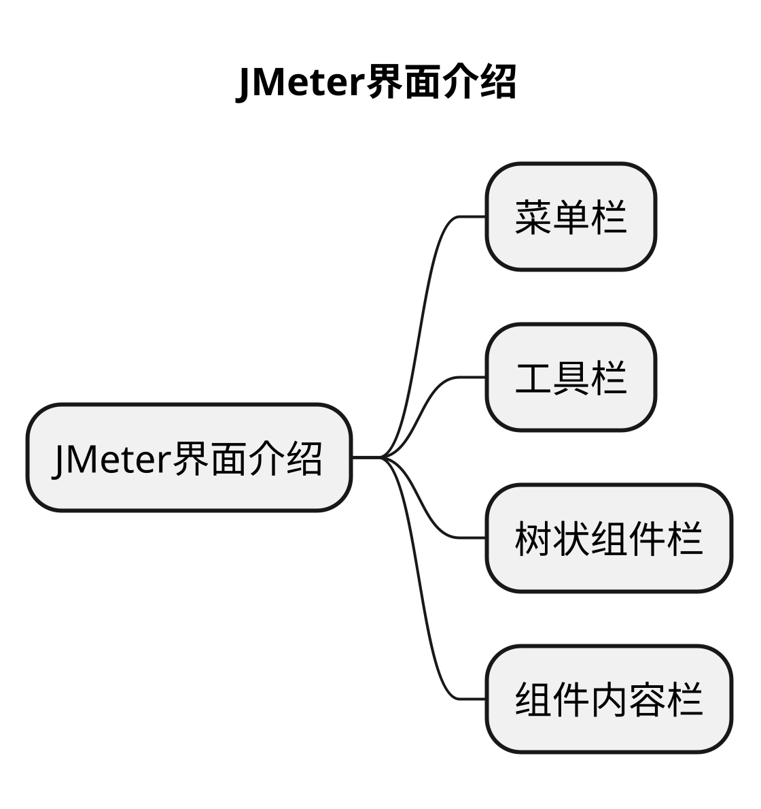
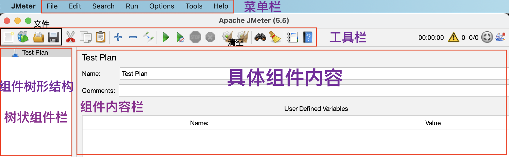

# JMeter界面工作区介绍

## 本章要点

1. JMeter界面介绍

## 学习目标

## 思考

## JMeter界面工作区介绍

`JMeter`的主界面工作区主要分为**4**部分，如下：**菜单栏**、**工具栏**、**树状组件栏**和**组件内容栏**。

下面👇具体介绍下每一部分的具体功能。

首先第一个是最上面的一层**菜单栏**。
### 菜单栏

`JMeter`全部的功能的都包含在菜单栏中。

### 工具栏

工具栏中的按钮在菜单栏内都可以找到，工具栏就相当于**菜单栏常用功能的快捷按钮**。

### 树状组件栏

用来显示 **测试用例**（计划）及其子组件。

>因为JMeter启动界面化会自动创建一个测试计划，压测脚本中所有的组件都是在测试计划下进行添加。

树状组件栏就是一个目录树，里面存放的是脚本设计过程中使用到的元件。
在JMeter执行脚本的过程中，默认从根节点开始按顺序遍历树状组件栏上的元件。

#### 元件

比如向百度服务器发送一个HTTP协议的GET请求，这个请求是由一个HTTP请求取样器来完成，这个HTTP请求取样器就是元件。

在树状组件栏中添加进来的都是元件。

### 组件内容栏

组件内容栏显示选中组件的具体内容及配置。

**组件内容栏**主要是配合**树状组件栏**来进行使用。在左侧**树状组件栏**中点击具体的某个组件，在右侧**组件内容栏**中就显示该组件的具体内容和配置。

## 总结

- JMeter启动日志
  - Java8正常启动，Java11有告警可忽略。
- JMeter界面工作区分为四部分：**菜单栏**、**工具栏**、**树状组件栏**和**组件内容栏**。

