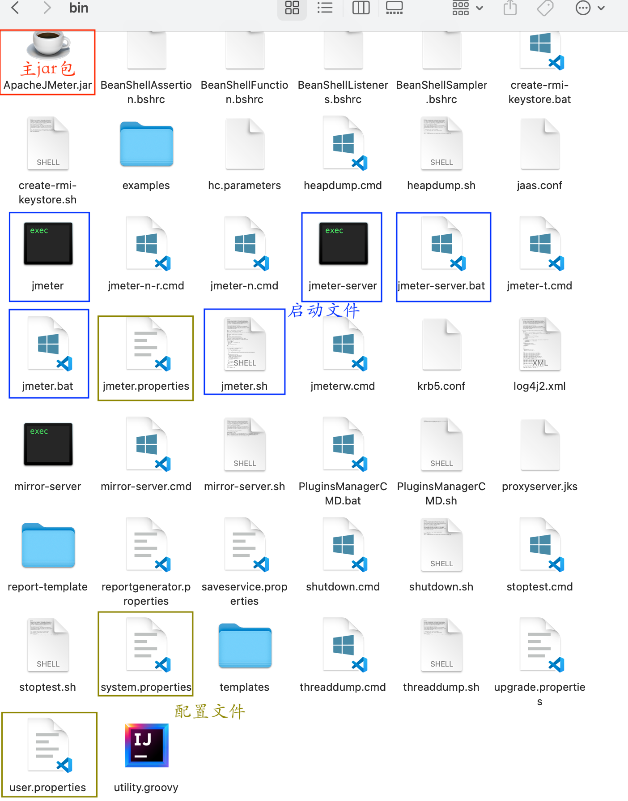
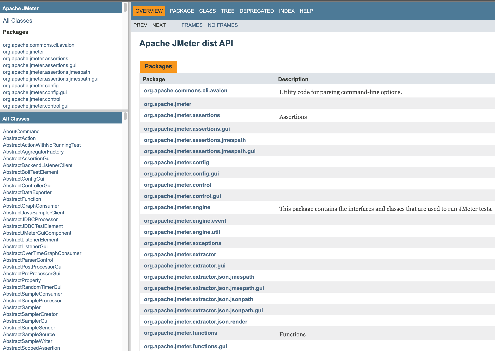
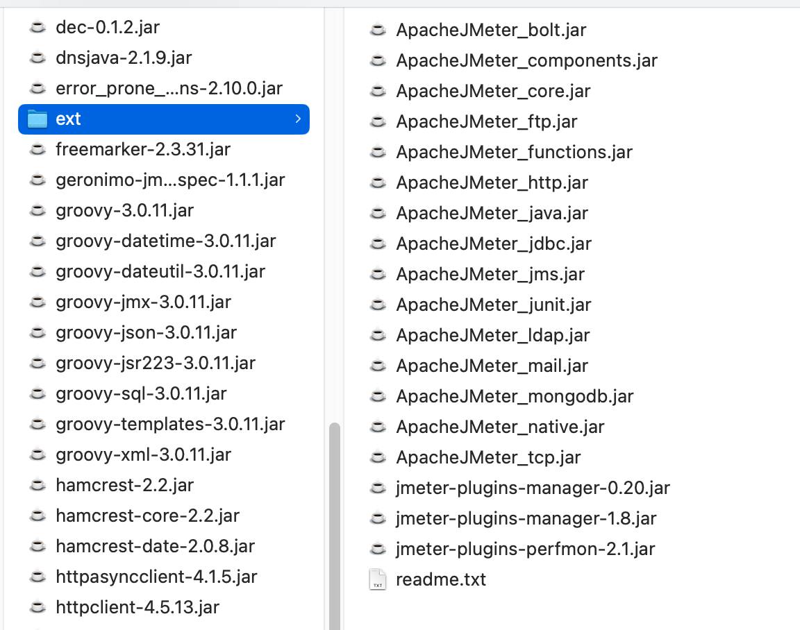
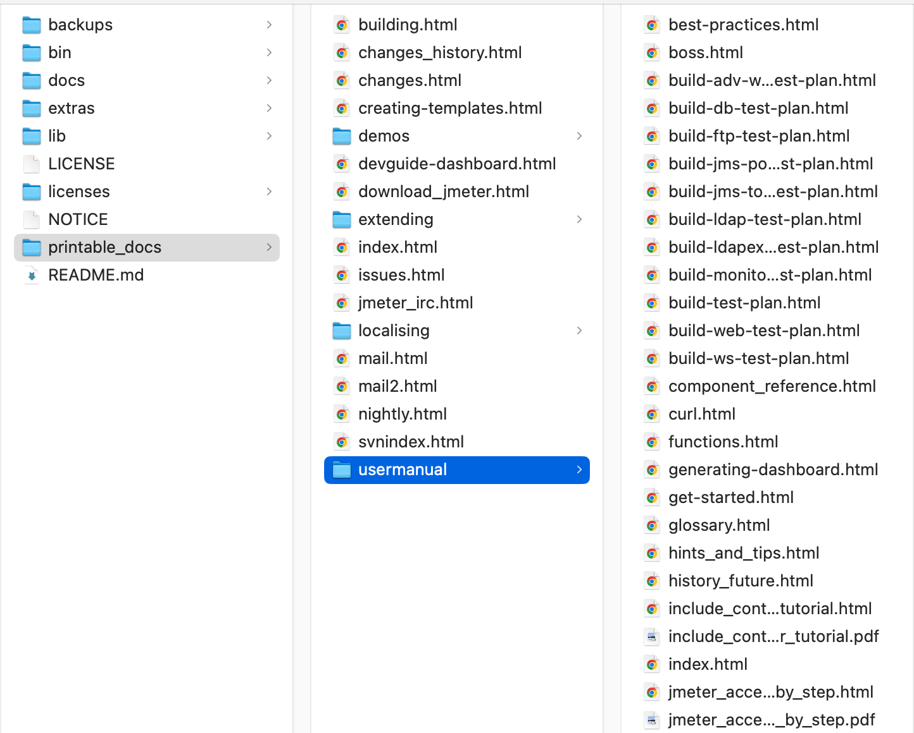

# JMeter目录结构

```plantuml
@startmindmap
scale 10
title JMeter目录结构
* JMeter目录结构
** bin文件夹
*** 主jar包
**** ApacheJMeter.jar
*** 启动脚本
**** jmeter：Mac系统
**** jmeter.sh：Linux系统
**** jmeter.bat：Window系统
*** 分布式运行脚本
**** jmeter-server：Mac系统
**** jmeter-server.bat：Window系统
*** 配置文件
**** jmeter.properties：主配置文件，utf-8编码格式、中文...
**** user.properties：用户的配置文件
**** system.properties：系统属性配置文件


@endmindmap
```


	
		
left side

** 支持分布式测试
** 内置组件丰富
** 支持插件和扩展
** 多种输出格式
** 跨平台支持，Widow、Mac、Centos...

docs文件夹
	JMeter的API文档
extras文件夹
	扩展插件目录
lib文件夹
	默认的classpath路径
	jar包发生改变，则需要重启JMeter才会生效
	ext文件夹
		JMeter的组件、第三方的组件和插件的
printable_docs文件夹
	JMeter的官方帮助文档


## 本章要点


1. JMeter的bin文件夹：主jar包、启动脚本、配置文件。
2. JMeter的lib文件夹。


## 学习目标

1. Window系统安装并打开JMeter工具。


## 思考


本篇文章主要来学习一下对应JMeter应用的目录结构，首先打开JMeter的文件夹，可以看到在下面又多个目录。下面根据常用顺序来说明。

## bin文件夹

第一个就是bin文件夹，打开目录发现里面存放了JMeter的**主jar包**、**启动脚本**及**properties配置文件**等。



### JMeter的主jar包

**ApacheJMeter.jar**是JMeter应用的主要jar包。

为什么说是主要jar包而不是其他依赖的jar包呢？

因为，JMeter应用的启动及运行都是依赖于该jar包完成。

### JMeter的启动脚本

#### 脚本启动文件

jmeter、jmeter.sh、jmeter.bat都是JMeter的启动脚本。其中，Mac系统启动脚本为`jmeter`，Linux系统启动脚本为`jmeter.sh`，Window系统的启动脚本为`jmeter.bat`。

配置环境变量后，在命令行输入`jmeter`其实就是根据不同的系统判断对应的启动脚本为哪个文件。也可以不配置环境变量，直接点击脚本进行JMeter的启动。

#### JVM参数修改

如果想要修改JMeter启动时的JVM参数，可以直接编辑启动脚本来进行修改。

```bash
# This is the base heap size -- you may increase or decrease it to fit your
# system's memory availability:
: "${HEAP:="-Xms1g -Xmx1g -XX:MaxMetaspaceSize=256m"}"
# 修改为2g
# : "${HEAP:="-Xms2g -Xmx2g -XX:MaxMetaspaceSize=256m"}"
```
修改前的log启动日志：


修改后的log启动日志：


其中，各个参数对应的含义如下：

- `XX:MaxMetaspaceSize`：元空间的最大增加值，该值不建议修改。

- `Xms`：JVM堆内存的最**小**值。

- `Xmx`：JVM堆内存的最**大**值。

注意⚠️：建议`Xms`和`Xmx`保持一致，一般不超过物理内存最大值的**50%**。

#### 分布式运行脚本

可以看到还有jmeter-server相关的文件「jmeter-server.bat/jmeter-server」，这些都与JMeter的分布式运行有关，这些启动脚本时在slave「负载机」上的启动脚本。

###  配置文件

配置文件都是以`properties`结尾，编程语言中约定俗成的一个文件名结尾，主要介绍在bin文件夹下的3个配置文件。


注意⚠️：

- `#`：表示对应行的内容为注释，相关配置信息不生效。

- 若想要对JMeter中某些配置进行更改，建议不要在原有的基础上修改，而是要复制一行进行修改。
  
- 一旦配置文件修改，则需要重启`JMeter`才会生效。


#### jmeter.properties

是JMeter的默认配置文件也叫主配置文件，里面为JMeter的一些默认配置信息，其中超过80%的可配置内容都是在该文件中实现。

注意⚠️：

- `jmeter.properties`中被注释掉的原有的配置项，表示是JMeter配置项的默认值。告诉用户对应配置的默认值，并不表示生效。

- 建议`jmeter.properties`修改的选项：
	```bash
	language=zh_CN
	sampleresult.default.encoding=utf-8
	```
```bash
#Preferred GUI language. Comment out to use the JVM default locale's language.
#language=en
language=zh_CN

# Additional locale(s) to add to the displayed list.
# The current default list is: en, fr, de, no, es, tr, ja, zh_CN, zh_TW, pl, pt_BR
# [see JMeterMenuBar#makeLanguageMenu()]
# The entries are a comma-separated list of language names
# 中文简体又在最后添加了一遍
#locales.add=zu 
locales.add=zh_CN

# The encoding to be used if none is provided (default ISO-8859-1)
#sampleresult.default.encoding=ISO-8859-1
sampleresult.default.encoding=utf-8
```


#### user.properties

用户的配置文件。

#### system.properties

Java 应用程序使用的系统属性配置文件。由于JMeter是一个纯Java应用程序，它继承了所有默认属性并具有访问和覆盖它们的能力。 

## docs文件夹

存放的是JMeter的API文档。



## extras文件夹

扩展插件文件夹，JMeter和第三方工具集成所需的一些文件和模板，比如：JMeter+ant，JMeter+influxdb+grafana等。


提供了对Ant的支持，可以使用Ant来实现自动化测试，例如批量脚本执行，产生html格式的探索，测试运行时，可以把测试数据记录下来，Jmeter会自动生成一个.jtl文件，将该文件放到extras目录下，运行“ant-Dtest=文件名report"，就可以生成测试统计报表


## lib文件夹

JMeter启动时的默认的classpath路径。


>在使用JMeter的过程中，所有需要引用（import）类都必须以`jar`包的方式存在于该目录。

注意⚠️：一旦lib文件夹下的jar包发生改变，则需要重启JMeter才会生效。

### ext文件夹

存放JMeter的组件、第三方的组件和插件的。组件、插件都是指继承了JMeter的GUI框架，在GUI模式下可见的类。



>自定义的一些加解密业务逻辑也可以写在特定java类中，生成jar包放在ext文件内引用。

## printable_docs文件夹

JMeter的官方的帮助文档。




## 总结

- JMeter启动jar包路径为：bin/ApacheJMeter.jar。

- 修改JVM参数可直接在启动脚本中修改。

- JMeter主配置文件为：bin/jmeter.properties。

- 自定义插件jar包所在目录为：lib/ext。


<style>
  strong {
    color: #ea6010;
    font-weight: bolder;
  }
  .reveal blockquote {
    font-style: unset;
  }
</style>


