# JMeter体系结构

## 本章要点
1. JMeter体系结构图
1. 八大组件

## JMeter基本组件

### 八大组件

1. Sampler「**采样器/取样器**」
2. Logic Controller「**控制器**」
3. Config Elements「**配置元件**」
4. Timer「**定时器**」
5. Assertions「**断言**」
6. Listener「**监听器**」
7. Pre/Post-processors 「**前置/后置处理器**」
8. Thread Group「**线程组**」

#### 元件

元件代表JMeter工具菜单中一个子菜单/功能，比如：HTTP请求、JDBC 请求、事务控制器、响应断言等，就是一个元件。

>向百度服务器发送一个HTTP协议的GET请求，这个请求是由一个HTTP请求取样器来完成，这个HTTP请求取样器就是元件。

**在树状组件栏中添加进来的都是元件**。

#### 组件

一组元件的集合（一个/多个），比如逻辑控制器中有事务控制器、仅一次控制器、循环控制器等，这些都是元件。但是它们被归类到逻辑控制器中，**逻辑控制器**就是组件。

#### 元件VS组件 
**易错点！！！**

- 多个元件叫组件。

- 元件是JMeter中最小的添加的内容。

- 组件是一个元件的集合。

**不同的元件作用范围不同。**
>`Header Manager`可以影响全局所有的`Http Sampler`，也可以只影响某一个`Http Sampler`，看`Header Manager`所处位置的作用范围而决定。

**不同元件对应执行时序点也不同。**

>断言组件Assertions中查看结果树元件，就是为了校验请求是否通过。所以，Assertions元件一定是运行在Sample之后，如果上来就先运行断言组件对应的压测脚本是没有任何意义的。   

### JMeter结构图

下图描述了JMeter的体系结构，本篇文章根据体系结构来了解JMeter的组成。

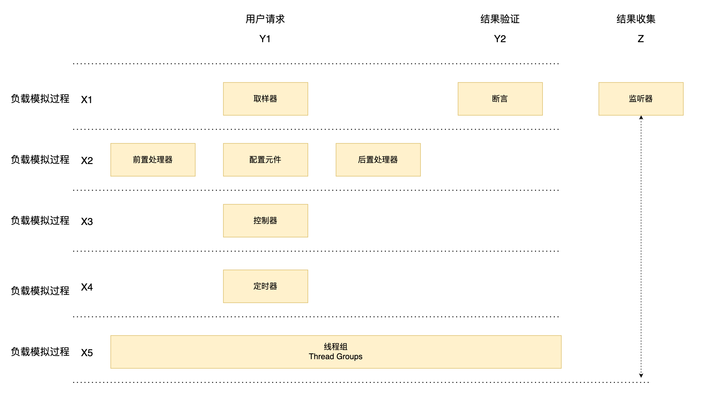

上图是把八大组件拆成放在了一个三维空间中。其中X空间分为5个维度，Y空间分为2个维度，Z空间分为1个维度。

#### X1～X5

X1～X5这5个维度是负载模拟的一个过程。
>使用的就是X空间上这5个维度的组件来完成负载的模拟。

#### Y1

Y1维度是负载模拟的**部分**，主要负责的是模拟用户的请求。

#### Y2

Y2维度是对结果的一个验证，主要是负责验证负载的结果的正确性。

>测试用例的一个结果验证。

#### Z

Z维度是负载结果的收集，实际上只有一个组件**监听器**。

监听器不仅可以放在线程组组件内，也可以放在线程组组件外，所以在图中，线程组和监听器是相交的。

大家通过JMeter源码会发现，其实JMeter就是创建了一个大池子（线程池），然后使用**多线程**运行压测脚本的**取样器**，以此来对**被测服务器**产生大量负载。

在压测脚本运行过程中，发送请求后收到的响应会根据**Y2**维度的**断言**组件来验证结果的正确性，并通过**Z**维度的**监听器**来记录对应请求的测试结果。

如果**取样器**有**参数化**需求，则可通过**X2**维度中**配置元件**或者**前置处理器**来完成。

如果**取样器**有**关联**需求，则可通过**X2**维度中**后置处理器**来完成。

如果想要设置**运行场景**，比如**模拟多少用户**，**运行多长时间**，则直接设置**X5**维度中的**线程组**。

如果想要**模拟并发场景**，可以利用**X4**维度中的**定时器**。

如果想要**控制业务的执行逻辑**，比如登录的业务只运行一次，可以利用**X3**维度中的**控制器**。

### X1 取样器/采样器

`Sampler`也叫**采样器**或**取样器**，JMeter 可以使用采样器将特定类型的请求发送到服务器。

取样器主要是用来**模拟用户的操作请求**，比如向服务器发送HTTP请求、JDBC请求、Java请求等等。不只是**向服务器发送请求**还会**接收服务器的响应数据**。

>可以把HTTP请求元件看作一个没有界面的浏览器，它可以直接向服务器发送HTTP请求并接收服务器响应的数据。

JMeter中所有的组件都是为取样器进行服务的。

#### 作用

- 向服务器发送请求
- 记录响应信息
- 记录响应时间

**取样器**是压测脚本中向服务器发送请求、记录响应信息、记录响应时间的**最小单元**。

#### 常用Sampler

- HTTP 请求
- JDBC 请求
- Java 请求
- FTP请求
    
    ...

#### 访问路径

取样器是线程组内部的元件，即取样器只能在线程组下添加。

【测试计划】 -> 【线程组】 -> 【添加】-> 【取样器】

注意⚠️：取样器必须在线程组下才能添加。

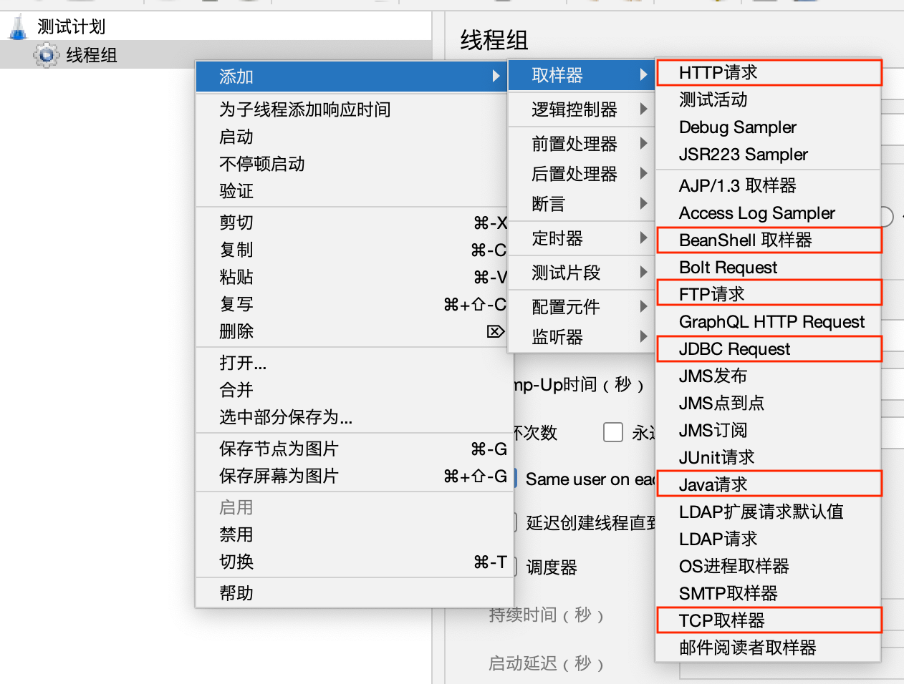

#### 执行顺序

按照测试计划树的顺序从上到下执行。

取样器配合控制器，可以修改取样器的执行顺序和次数。

### X1 断言

在 JMeter 中，断言主要是用来验证发送到服务器的请求的响应，就是用一个预期结果「值、表达式、时间长短等条件」与请求的实际结果进行匹配的过程。如果匹配上则成功，反之就失败。

>写过自动化用例的同学应该对断言这个含义不陌生，对应的每一个测试用例在运行完获取结果后都需要进行断言才能判断当前的用例是通过还是失败。

如果断言需要应用于特定的取样器（请求），则断言应放在采样器子级路径下。

#### 原理

JMeter中断言的原理：
在请求的返回中增加一层判断机制。因为哪怕请求成功了，并不代表当前的返回结果是我们的预期结果。
>比如：HTTP请求成功了，只是说这个请求路径及协议成功，并不代表当前请求的业务逻辑正确。

一个取样器中可以添加多个断言，根据请求需要检查的结果来添加相应的断言，多个断言的添加是并的关系，不是或的关系。
当取样器下所有的断言都通过，该取样器才算请求成功。

#### 常用断言

- 响应断言
- Json断言
- BeanShell断言
- Xpath断言

    ...

#### 访问路径

【测试计划】 -> 【断言】

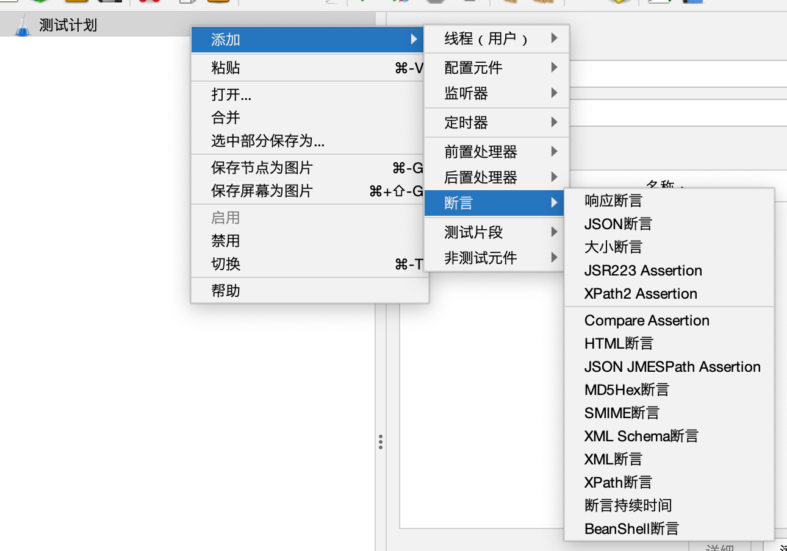

### X1 监听器
监听器是对测试结果进行处理和可视化展示的一系列组件。监听器可以显示取样器的请求和响应细节及请求结果，包括：请求头、响应头、请求的数据、响应的数据。

JMeter中运行的测试结果需要添加监听器来验证，监听器有2个任务：

1. 添加结果的监听，并可以保存测试结果到文件，这样结果数据可供再次分析使用。

2. 展示结果，监听器可以以不同的格式显示结果，例如树、表格、图形或日志文件；方便测试人员分析测试结果。

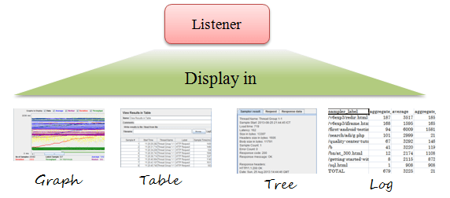

>开发脚本时，不可避免的就是调试，监听器也提供了辅助，比如：查看结果树，可以看到请求与响应数据。

监听器可以添加到测试计划列表下的任何地方。它会从其范围内定义的元件中收集结果数据。

#### 访问路径

【测试计划】 -> 【监听器】

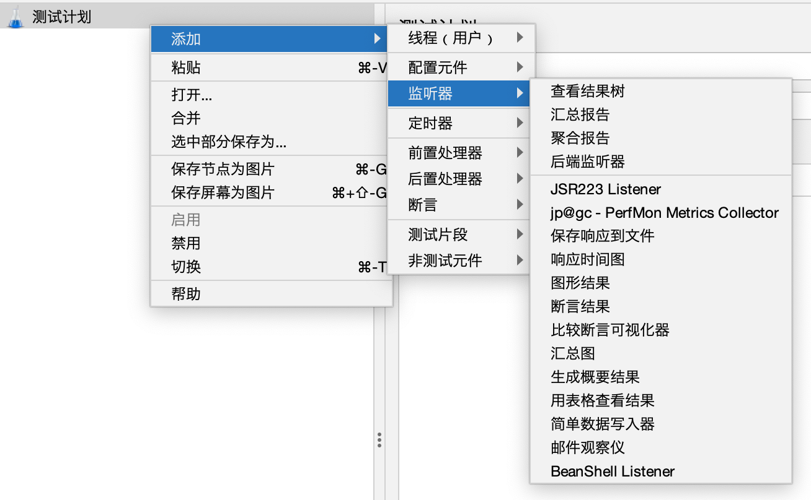

#### 注意

1. 监听器位置不同对应查看的结果不同。
	>监听器在具体线程组下，只查看该线程组下所有请求的结果； 监听器放在具体取样器元件下，只查看该取样器的请求结果； 监听器放在某控制节点下，则只查看此控制器下节点所有取样器执行的结果。

2. 监听器是压测脚本调试用，实际压测时禁用。
   >压测时大量请求，启用监听器时打印日志比较多，会造成大IO消耗，影响压力机/负载机的性能。

3. 不通监听器通过不通方式展示服务器的响应信息。但是原始的结果数据都一样。

4. JMeter监听器有2种方式存储记录：
   1. 默认csv格式。占磁盘空间少，推荐。
   2. xml格式保存，数据保存最全面但占内存大。

### X1总结

【取样器】、【断言】、【监听器】组合在一起就可以帮助我们完成发送请求、验证结果及记录结果三项基本工作。

到此就可以使用以上组件来构建一个简单的压测脚本。

### X2 前置处理器 

前置处理器（Pre-processors）是在取样器执行之**前**运行的一类组件。

一般用来完成一些前置性的工作，所以经常用于在样本请求执行之前去修改样本请求的设置。

测试脚本开发过程中，在请求发送前可能会有一些环境或者参数的准备工作，那就可以用前置处理器来完成这些工作。

>比如 JDBC请求对数据库进行操作前需要建立一个数据库的连接，那前置处理器就可以完成这个数据库建立连接的功能。

#### 作用

前置处理器用来处理请求在实际发送之前的一些准备工作，比如：**取样器参数设置**、**环境变量设置**、**脚本预处理**等。

>URL中有sessionID一类的session信息时，可以通过前置处理器填发出请求实际的sessionID。

#### 常用前置处理器

- 用户参数

- BeanShell 预处理程序

- JDBC 预处理程序

    ...

#### 访问路径
【测试计划】 -> 【前置处理器】

【测试计划】 -> 【线程组】-> 【前置处理器】

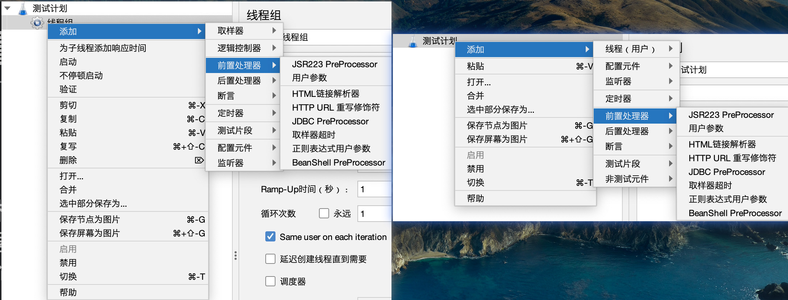

### X2 配置元件

提供对静态数据的配置支持，可以为取样器设置默认值和变量。

>JMeter压测脚本中模拟大量用户操作、根据订单号出库等等，都需要做参数化。使用**CSV 数据文件设置**进行JMeter参数化，可以从文件中读取测试数据，将本地数据文件形成JMeter的数据池。 配置原件也可以记录请求返回的数据，使用`HTTP Cookie Manager`，自动记录服务端返回的`Cookie`信息。 使用`User Defined Variables`，预置一些初始化变量。如果需要生成动态数据可以使用JMeter的函数助手里面的函数表达式。

#### 作用

配置元件为取样器提供**预备数据**，然后由取样器发出请求。

提供预备数据有：JMeter参数化、函数助手生成动态数据、记录服务器返回数据。

配置元件的功能: 读取文件数据、设置公共请求参数、赋予变量值等等，方便取样器使用。
>类似项目中的配置文件，如：数据库链接、公用URL等进行配置。

#### 常用配置元件

- CSV Data Set Config

- HTTP信息头管理器

- 用户定义的变量

- JDBC Connection Configuration

    ...

#### 访问路径

可以通过 测试计划 --> 配置元件 添加Config Element，线程组也可以添加配置元件。

【测试计划】 -> 【配置元件】

【测试计划】 -> 【线程组】-> 【配置元件】

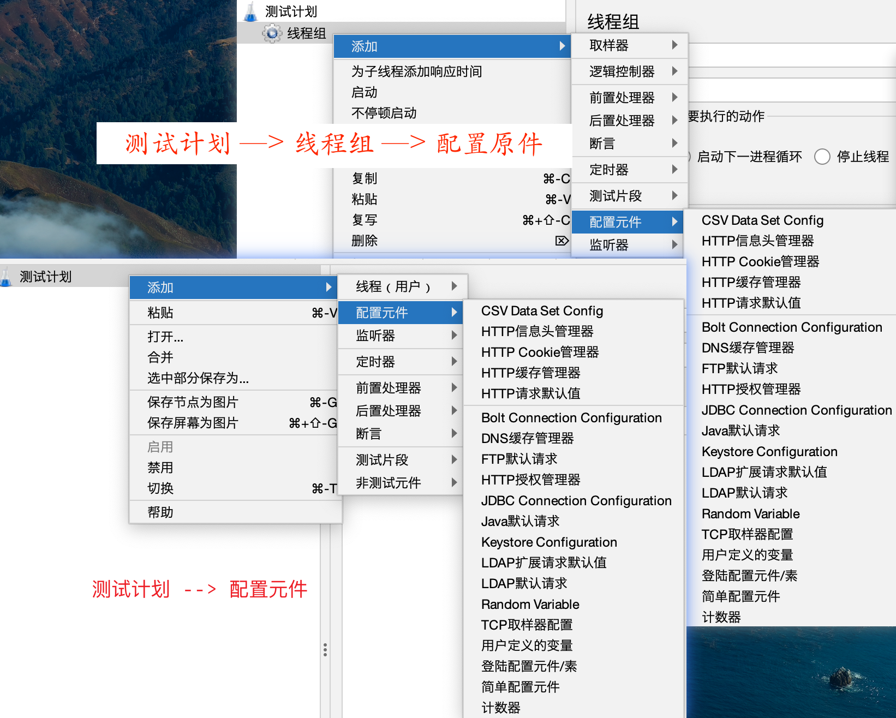

### X2 后置处理器

后置处理器（Post-processors）是在取样器执行之**后**运行的一类组件。用来对取样器发出请求后得到的服务器响应进行处理。一般用来提取响应中的特定数据「LoadRunner中的关联」。

后置处理器专门用来对响应数据进行处理的组件。关联，JMeter的关联就是通过后置处理器来完成的。

#### 作用

它的作用是**处理响应数据**提取某个值。比如正则表达式提取器（Regular Expression Extractor），使用正则表达式来匹配响应结果，提取部分数据。

>压测脚本中，不同的接口之间难免会遇到一个接口的请求参数是另一个接口的响应结果，这时就需要用后置处理器来处理请求参数。 如系统登录成功后要获取登录的sesesion ID，在后面请求中服务端会验证这个session ID，那JMeter获取session ID这个过程就需要后置处理器中的正则表达式提取器来完成。

#### 访问路径

【测试计划】 -> 【后置处理器】

【测试计划】 -> 【线程组】-> 【后置处理器】

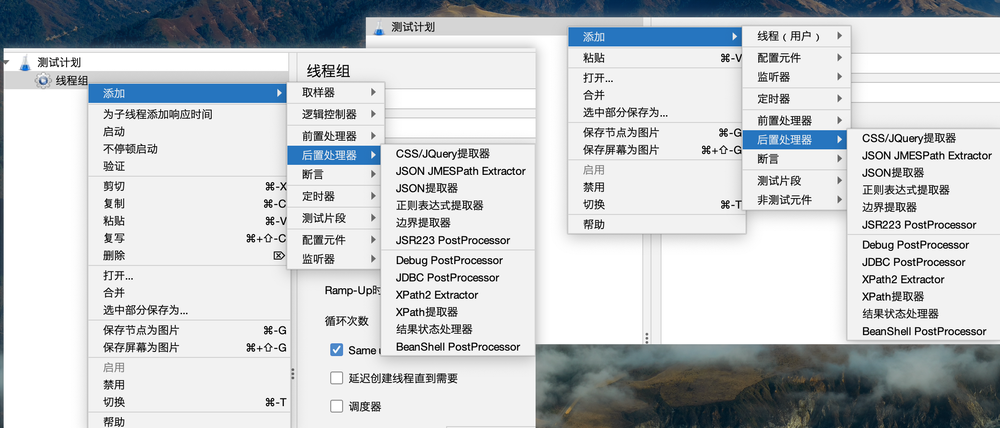

### X2总结

【前置处理器】、【配置元件】、【后置处理器】都是为了X1中的取样器**提供数据支持**，取样器关注的是对应的业务逻辑。

>就比如家人是我们的后盾，帮助我们解决工作以外的一切麻烦，让我们全身心的投入到自己的工作中。

### X3 控制器

>逻辑，主要就是条件和循环。

控制器默认为**逻辑控制器**，主要对取样器组件起作用，用于控制脚本的执行流程。它用来控制线程中取样器的处理顺序，还可以更改来自其子元素的请求的顺序。

作用域：逻辑控制器只对其子组件有效。

#### 作用

控制取样器的执行顺序。

控制器与取样器一起使用，否则控制器就不发挥作用。在控制器下的所有取样器会当做一个整体，执行时会一起被执行。

#### 常用逻辑控制器

- 仅一次控制器
- 简单控制器
- 循环控制器
- 事务控制器
- foreach控制器
- if控制器

想要脚本中某一组请求比其他请求执行更多次，可以使用控制器来解决此目的。对应场景：接收邮件时，只需要登录一次邮箱就可以查看到多封邮件。app购物时，只需要登录一次就可以多次进行订单的付款。

上述场景如果想要在JMeter中实现，就需要对登录的次数进行控制。在JMeter中使用逻辑控制器中的**仅一次控制器**就可完成。

**简单控制器**是根据您的需要存储类似请求的唯一容器。除此之外，它们不提供任何逻辑。

与其他请求相比，**循环控制器**用于使您的请求组运行更多或更少的迭代。添加一个循环控制器并指定循环次数，此元件下的所有请求将执行指定的迭代次数。

#### 访问路径

可以通过 测试计划 --> 线程组 --> 逻辑控制器 添加。

【测试计划】 -> 【线程组】-> 【逻辑控制器】

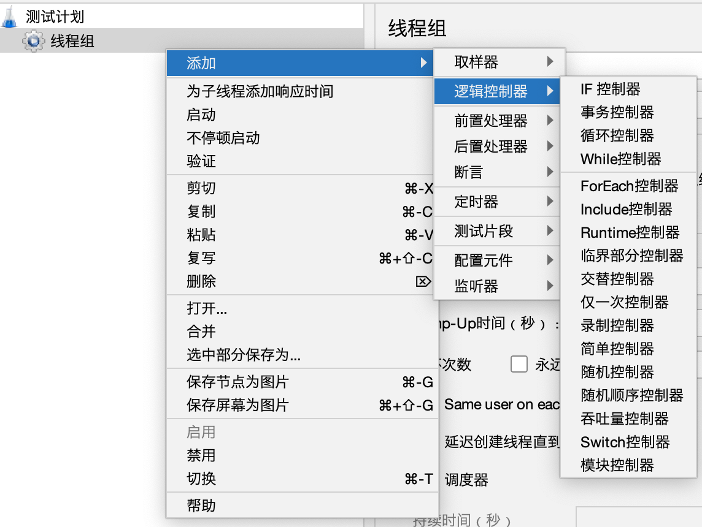

#### 分类

逻辑控制器大概分为2类：

- 一类为控制测试计划中的**取样器**发送请求的**逻辑顺序**的控制器，如：If控制器、switch控制器、Runtime控制器、Loop Controller（循环控制器）等。
- 一类为组织可控制的取样器节点，**对测试计划中的取样器进行分组**，方便JMeter统计执行结果、及脚本运行时控制操作等。如：事务控制器、吞吐量控制器等。

### X4 定时器

用来设定等待时间，可以定义每个请求之间的等待时间。

用户实际操作压测场景时，并不是连续的点击，而是会存在很多停顿的情况。想一下当在网站或应用程序上执行任何操作时，自然会有停顿和延迟，这些都可以用定时器模拟。

>比如：用户需要有一定时间阅读文字、填表、查找需要点击的位置链接等等。这个操作至少等待5秒后会再发送请求； 让多个请求等待到同一时刻发送。

JMeter 发送请求时不会在每个取样器/请求之间有任何的延迟。如果所有取样器的请求都立即发送给服务器，此时将会超载，这不是我们模拟压测时想要的。

为了模拟真正的用户实际情况，在压测脚本中需要考虑用户的操作时间。如果不考虑操作时间很可能导致压测结果的失真，即最终压测报告估计的并发数可能会偏小。

取样器/请求之间的停顿时间称为思考时间。如何模拟思考时间？

可以借助JMeter定时器组件实现，不同定时器有不同功能。可以添加一个**计时器**元件，它**定义每个请求之间的等待时间**。

#### 作用

定时器其实就是为了足够真实的模拟用户负载。

定时器常用于控制客户端QPS的手段。
 
#### 常用定时器

- 固定定时器
- BeanShell 定时器
- 高斯随机定时器
- 统一随机定时器

#### 访问路径

可以通过 测试计划 --> 线程组 --> 定时器 添加。

【测试计划】 -> 【线程组】-> 【定时器】

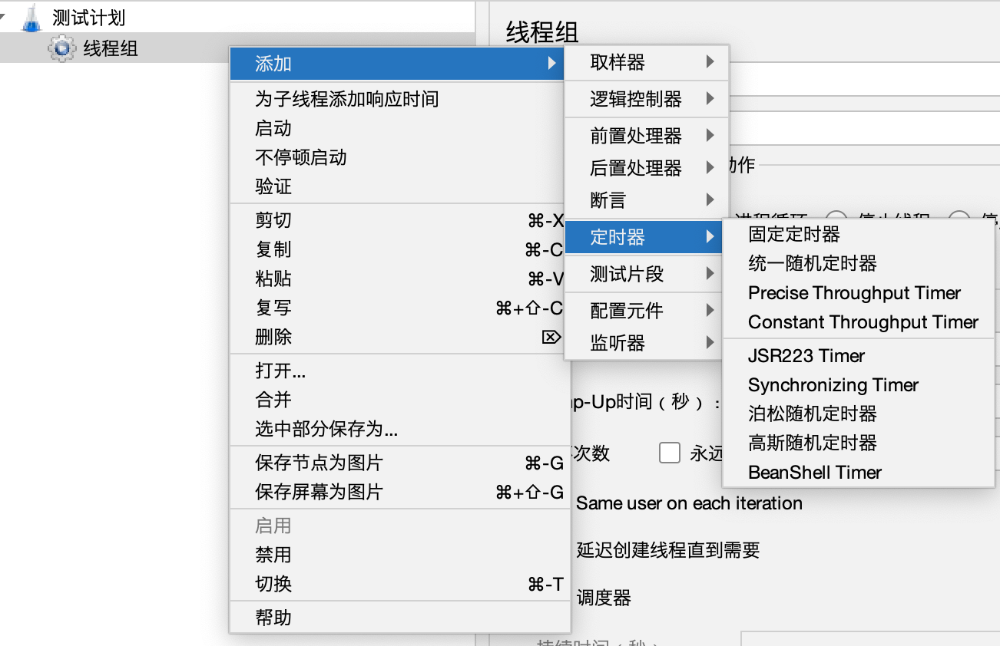

#### 执行顺序

JMeter中的定时器一般用来设置延迟与同步「请求操作之间的等待之间」。

定时器的执行优先级 > 取样器。

如果在同一作用域下（同一个控制器下）有多个定时器存在时，每一个定时器都会执行。

如果想让某一个定时器只对某一个取样器有效，则需要把定时器放在这个取样器节点下。

### X5 线程组

性能测试就是通过模拟大量用户负载的情况，来验证服务器端的性能。那线程组就是用来完成这个工作的，在线程组原件中我们可以设置运行的线程数即模拟用户数，一个线程就相当于一个用户。

线程组元件出了可以设置线程数以外，还可以设置对应的运行的时长及定时运行等。JMeter添加线程组里面虽然选项不同，名字不同但是创建后界面是完成一样的，只不过是不同的选项对应运行的规则不同。

具体的元件使用讲解会在后面给大家详细介绍。

- 线程组是一个测试流程的起点。
- 线程组中可以有多个线程。
  >线程组是一个线程池，即虚拟用户池。线程组中每个线程「取样器」可理解为一个虚拟用户。

- 线程组中一个取样器代表一个请求链接，一个请求等于一个线程。
- 每个线程之间互不干扰，多个线程模仿对服务器的并发访问。
- 线程组元件可设置 线程数、执行次数、持续时间等操作。

#### 访问路径
【测试计划】 -> 【线程组】

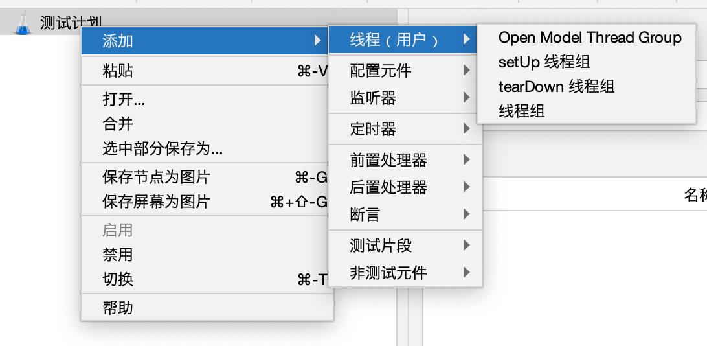

## 总结

- JMeter基本组件：取样器、断言、监听器、前置处理器、配置元件、后置处理器、控制器、定时器、线程组。
- 组件和元件的区别。「易错点！！！」
- 基本组件的常用元件。
- 基本组件的访问路径。

