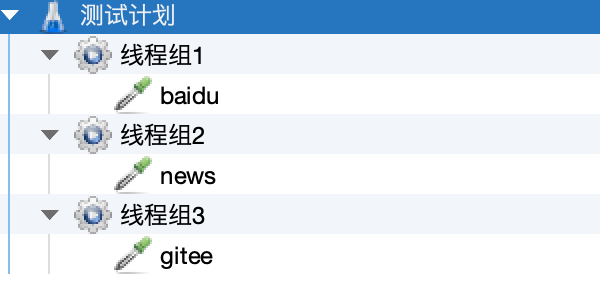
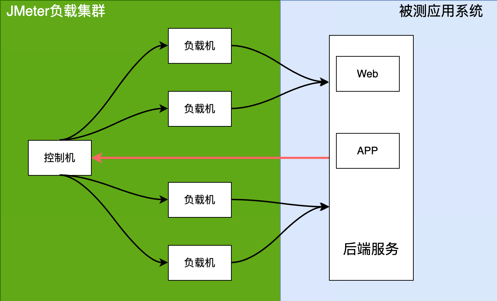

# JMeter运行原理及压测脚本要素

## 本章要点
1. JMeter运行原理
1. 压测脚本要素
1. 组件执行顺序

## 学习目标

1. 

## 思考

## JMeter运行原理

在上一篇文章我们了JMeter的组成部分，下面来了解一下对应的JMeter的运行原理。

用过LoadRunner的同学应该知道，对应的LoadRunner运行方式是可以选择的，可以选择时进程也可以选择是线程来运行脚本。JMeter选择的是线程方式来运行。

**为什么JMeter选择线程的方式来运行脚本？**

JMeter是Java语言开发的软件，所以它的压测脚本都是在JVM虚拟机上运行的，那对应的每个进程的开销就要比LoadRunner的进程开销大。

如果用进程的方式来运行的话，那每台负载机的进程数量就不允许有太多，所以JMeter选择以线程的方式来运行。

JMeter通过线程池「也就是线程组」来驱动多个线程，以此来运行测试脚本对被测服务发起负载。每一个负载机都可以运行多个线程组，如下图测试计划下可以有多个线程组。

JMeter编写的压测脚本运行不仅可以在GUI中运行，还可以使用JMeter的命令行运行，并且命令行运行对于负载机来说资源消耗会更小一些。

JMeter的运行原理是**通过线程组模拟虚拟用户，并通过控制器、操作和处理器等构建测试逻辑**。

在执行测试期间，JMeter会发送请求至目标系统，并将服务器返回的响应与预期结果进行对比。最后，通过**监听器**来展现**测试结果和性能数据**。

### 分布式

JMeter也支持远程运行，运行架构如下：

- **控制机**：多台JMeter负载机进行压测时，其中一个被选为管理的那台机器。控制机也可参与脚本运行，并且管理远程负载机（远程指挥负载机运行的任务并收集远程负载机的测试结果）。

- **负载机**：向被测服务器发起负载的机器。（控制机同时也是一台负载机）控制机会把要运行的压测脚本发给远程负载机，但是压测脚本中所需的参数文件及依赖的第三方jar包，控制机是不会发给远程负载机，需要自己用工具实现自动拷贝。

#### 运行逻辑

在多台电脑上，启动JMeter的Romote Testing模式，然后其中某一台负载机作为Master端「控制机」通过RMI控制Slave端来执行我们的测试脚本。当JMeter Slave端执行完测试脚本后，会将执行结果发送回Master控制端进行汇总，得出整体的测试报表。

JMeter的分布式的好处就是可以用一台终端、一个测试计划在多台服务器端同时对目标服务器进行测试，并且将测试的结果回报给统一的控制终端进行汇总，方便高并发的测试需求。

## 总结

- JMeter组件执行顺序： 先执行根节点，再执行子节点； 同一层次中，各个组件执行顺序逻辑： 【配置元件】 -->  【前置处理器】 --> 【定时器】 --> 【取样器】 --> 【后置处理器】 --> 【断言】 --> 【监听器】。

