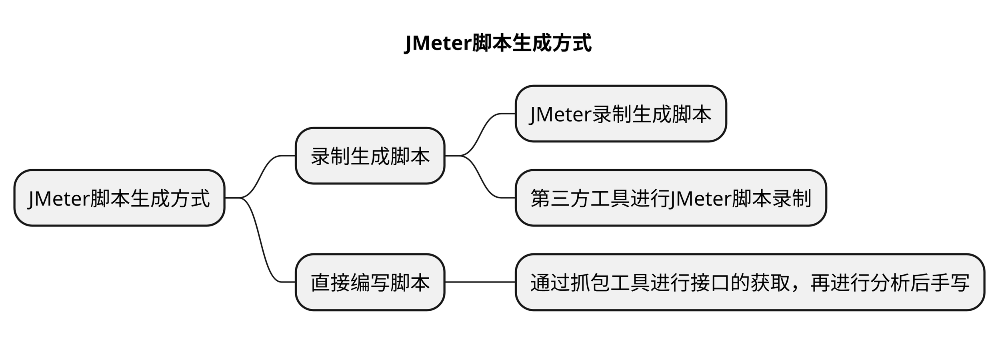

# JMeter脚本基本规则

## 本章要点
1. 压测脚本要素
2. 组件执行顺序

## 学习目标

1. 

## 思考

## 压测脚本要素

## JMeter组件执行顺序

JMeter压测脚本中的组件是呈树形结构排列，测试计划下的组件之间的执行顺序是：
1. 先执行根节点，再执行子节点。
   >同一个作用范围内有多个同一类型组件，则这些组件按照测试计划中的顺序自上而下依次执行。
2. 在同一作用域范围内（同一层次），各个组件执行顺序逻辑：
	1. **配置元件**：影响作用范围内的所有组件。
	2. **前置处理器**：在作用范围内的**每个取样器**组件前执行。
	3. **定时器**：对作用范围内**每个取样器**有效。
	4. **取样器**
	5. **后置处理器**：在作用范围内**每个取样器**组件后执行。
	6. **断言**：对作用范围内**每个取样器**组件执行后的结果进行校验。
	7. **监听器**：收集作用范围内的**每个取样器**组件的相关信息并呈现出来。     

>以上很多组件都是跟取样器有关联，如果在作用范围内没有取样器，那对应组件则不会被执行，就没有意义。

## 总结

- 测试计划四要素。

- JMeter组件执行顺序： 先执行根节点，再执行子节点； 同一层次中，各个组件执行顺序逻辑： 【配置元件】 -->  【前置处理器】 --> 【定时器】 --> 【取样器】 --> 【后置处理器】 --> 【断言】 --> 【监听器】。

