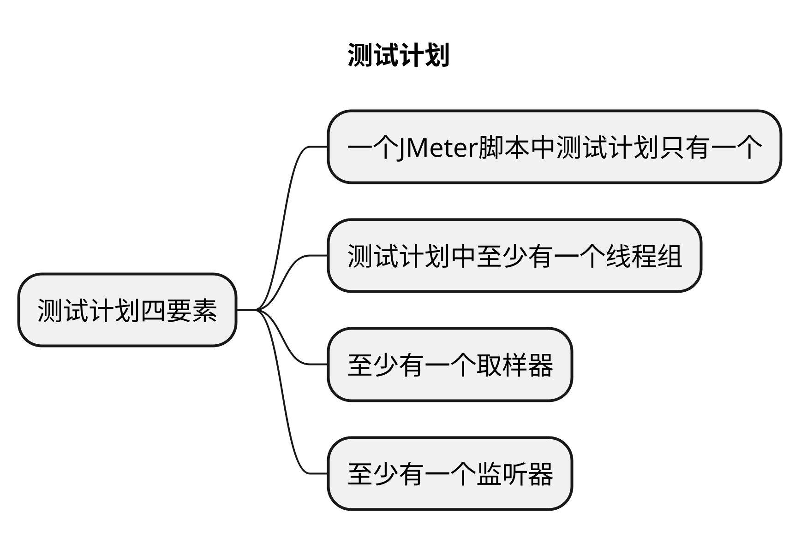
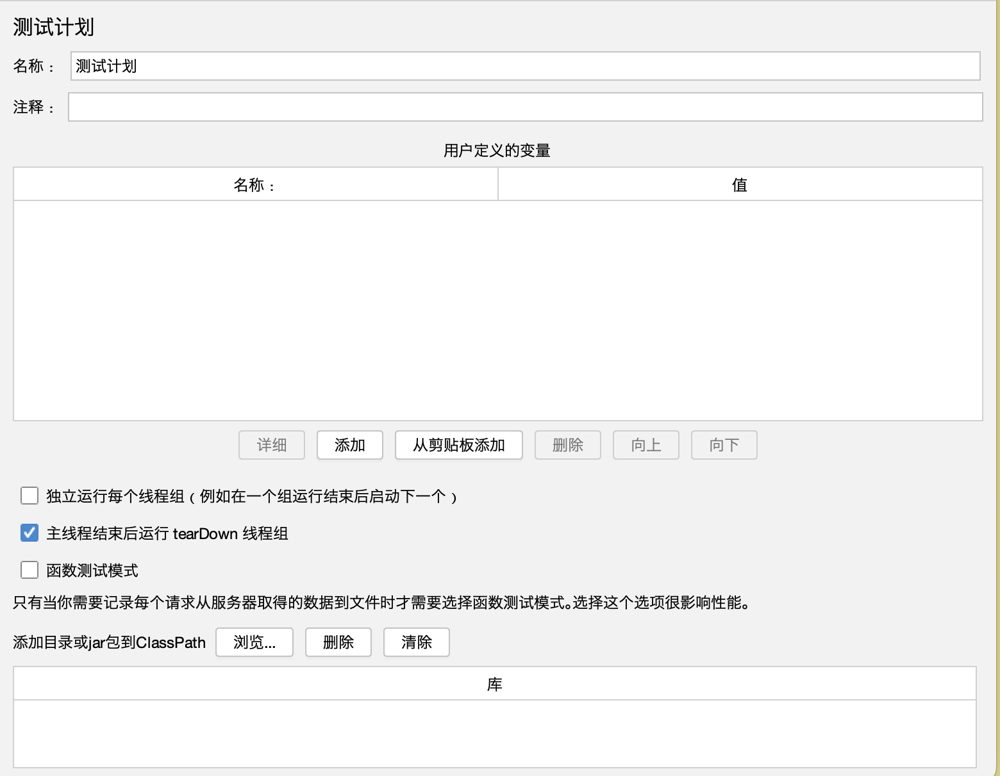
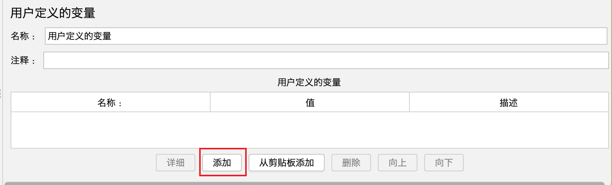
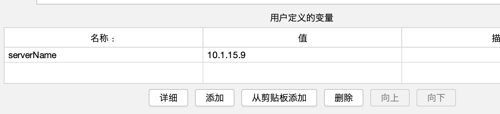
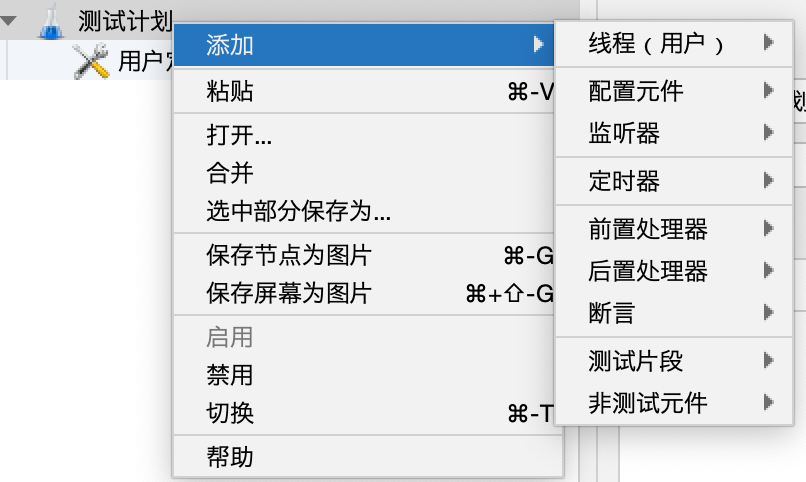

# 文章名
## 本章要点
1. 要点一
1. 要点
1. 要点
1. **要点**

## 学习目标

1. Window系统安装并打开JMeter工具。

## 思考

## 介绍

测试计划（Test Plan）是JMeter中的 **顶层组件**，用于定义和组织你的性能测试场景。

测试计划（Test Plan）用来描述一个压力/性能测试脚本和场景设计的基本运行单元， 使用JMeter进行测试的所有内容都是基于一个测试计划。

>JMeter中一个脚本就是一个测试计划，也是一个管理单元。

测试计划包含所有要执行的线程组、控制器、监听器、断言、配置元素等，以描述一个完整的性能测试过程。

1. 一个脚本只能有一个测试计划。

2. 测试计划中至少有一个线程组，没有关联的业务分布在线程组中。

3. 至少一个取样器，一个监听器。

描述一个性能/接口测试脚本和对应的场景设计，包含该测试项目的所有相关功能。即，JMeter进行测试的所有内容都在一个测试计划中。

在JMeter中，一个脚本只能编辑一个测试计划。如果需要创建新的测试计划，则需要重新创建一个JMeter脚本。

### 一个JMeter脚本中测试计划只有一个

JMeter中 GUI显示的是树形结构，测试计划是根节点，根节点只能有一个。一棵树只能有一个根。

### 至少有一个线程组

JMeter负载是线程组驱动的，所以测试计划中至少要出现一个线程组，JMeter的测试计划支持有多个线程组。

### 至少有一个取样器

压测脚本的目的就是要模拟用户请求，如果压测脚本中没有取样器则脚本就没有意义，都没有意义了也无需谈论对错。

### 至少有一个监听器

测试结果是用来衡量服务端性能的，需要从压测的结果中分析性能。

至于其他的组件，都是为以上要素进行服务的。至于哪些元件下能添加哪些元件，不需要担心，JMeter做了严格的控制。

## 界面

### 名称

整个测试脚本保存的名称

### 注释

备注信息，对整个脚本的一个简短的解释说明，含义等同代码中写的注释。

### 用户定义的变量

**用户定义的变量**（User Defined Variables，简称UDV），相当于是**全局变量**，所有的线程都可以使用。

**用户定义的变量**是JMeter中的一个配置元素，它可以帮助你在整个测试计划中存储和传递变量值。在应对**复杂测试场景**或**要管理多个变量值**时非常有用。UDV可以**让你重复使用不同取样器和控制器中的常量或动态值**。

#### 添加方式

1. 在测试计划上可以直接添加。

2. 在测试计划界面中，右键点击测试计划或线程组，然后选择 "**添加**" (Add) -> "**配置元素**" (Config Element) -> "**用户定义的变量**" (User Defined Variables)。

#### 注意

如果测试过程中想切换环境，切换配置，一般**不建议在测试计划上添加变量**，因为**不方便启用和禁用**，一般是**直接添加用户自定义变量组件**。

#### 变量声明及引用

1. 在 "**用户定义的变量"** 界面，点击 "**添加**" 按钮来添加一个新的变量。

    

2. 为新变量定义 "**名称**" (Name) 和 "**值**" (Value)。名称应尽量有意义，以帮助你快速识别变量的用途。

    

1. 变量引用。为了引用用户定义的变量，使用语法 `${变量名}`。
    >创建变量后，可以在测试计划中的其他元素（例如取样器断言、控制器等）使用这些变量。 例如，如果你有名为 "serverName" 的变量，可以在 HTTP请求取样器的 "服务器名称或IP" (Server Name or IP) 栏中使用 `${serverName}` 作为值。

#### 应用场景

使用用户定义的变量的一些典型应用场景包括：

1. **设置公共参数**：例如，为所有HTTP请求设置共同的名或IP地址。

1. **动态生成数据**：例如，为每次迭代生成不同的用户名进行登录测试。

1. **参数化测试数据**：例如，使用CSV文件中的不同数据集测试应用程序。

使用用户定义的变量可以提高测试计划的可重用性、灵活性和可维护性。合理使用UDV帮助你轻松管理复杂的测试计划。

### 独立运行每个线程组

用于控制测试计划中的多个线程组的执行顺序。

**不勾选**时，默认各线程组**并行**、**随机执行**。当有多个线程组时，线程组1和线程组2的线程是并行执行的，执行过程线程的执行顺序是不可预料的。

**勾选**了独立运行每个线程组，可以保证线程组1的执行一定在线程组2之前，线程组1执行完毕，才会执行线程组2，即 **顺序执行各线程组**。

>线程组中的**取样器**的执行顺序：默认是**从上到下执行**。可以通过交替控制器、随机控制器、随机顺序控制器和循环控制器等可以改变取样器的执行顺序。

### 主线程结束后运行tearDown线程组

主线程关闭后，可以通过运行tearDown线程组，来关闭某些错误异常的线程。

如：主线程因为错误导致测试停止时，如果**勾选☑**️，会执行tearDown线程组。**不勾选**，就不会执行tearDown线程组。

### 函数测试模式

函数测试模式（Functional Testing）：如果选中了此选项，同时监听组件如“**查看结果树**”配置了保存到一个文件中，那么jmeter会将每次的请求结果保存到文件中。
　
>比较消耗资源，一般不建议勾选。

### 添加目录或jar包到ClassPath

`Add directory or jar to classpath`：添加文件或jar包，此功能最常用于调用外部jar包。

当脚本需要调用外部的java文件或jar包时，可以把jar包路径添加到这里，然后在beanshell中直接import进来，并调用jar包中的方法。

## 组件

以下是一个典型的测试计划所包的组件：

### 线程组（Thread Group）

线程组描述了要模拟的虚拟用户数量以及它们的行为。你可以创建多个线程组来测试不同的场景和并发用户配置。

### 配置元件（Configuration Element）

配置元素用于设置默认值、服务器认证、用户变量等，这些参数会影响到取样器和控制器的行为。

### 监听器（Listener）

监听器负责显示、记录和输出性能测试结果以及统计信息。可以将结果以多种形式展示，如图形报表、聚合报告等。

### 前置处理器（Pre-Processor）

前置处理器在取样器发送请求之前执行。它们可以执行一些预处理任务，如设置请求参数、读取文件数据等。

### 后置处理器（Post-Processor）

后置处理器在取样器完成请求之后执行。它们可以提取服务器响应中的有用信息、设置变量以供后续操作使用。

### 断言（Assertion）

断言用于验证服务器响应是否符合预期条件。例如，包含指定文本、具有预期状态码等。

创建一个有效的测试计划，请确保针对目标应用程序选择合适的组件，并正确配置它们。

一旦设置好测试计划，就执行性能测试并通过监听器查看测试结果。

务必根据测试场景的变化对测试计划进行调整，以确保获得准确的性能指标。

## 总结
- 总结一
- 总结二
- 总结三
https://github.com/Wechat-ggGitHub/Awesome-GitHub-Repo

[项目演示地址](https://github.com/testeru-pro/junit5-demo/tree/main/junit5-basic)

# 学习反馈

1. SpringBoot项目的父工程为( )。

   - [x] A. `spring-boot-starter-parent`
   - [ ] B.`spring-boot-starter-web`
   - [ ] C. `spring-boot-starter-father`
   - [ ] D. `spring-boot-starter-super`

